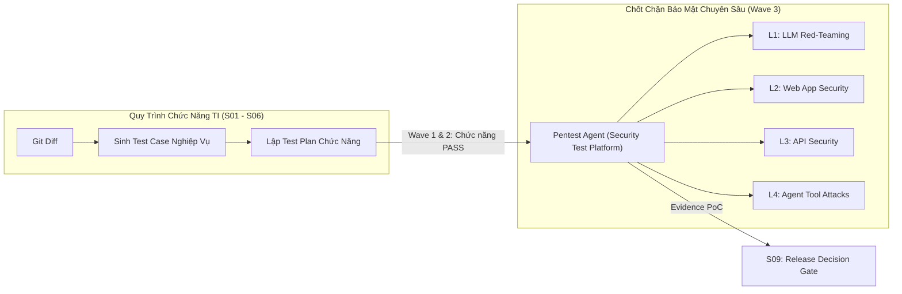

# Tổng Quan Về Nền Tảng Pentest Agent (Security Test Platform)

> **Mục tiêu tài liệu**: Giới thiệu định vị, kiến trúc 4 lớp bảo mật độc lập, triết lý "Zero False-Positive qua PoC Validation" và nguyên tắc an toàn của **Pentest Agent (Security Test Platform)**.  
> **Sơ đồ kiến trúc liên kết**: [`Pentest_AWS_Detail.drawio`](file:///D:/Doc/diagram/Pentest_AWS_Detail.drawio) & [`TechX_Master_Architecture.drawio`](file:///D:/Doc/diagram/TechX_Master_Architecture.drawio).

---

## 1. Định Vị & Tại Sao Cần Pentest Agent Khi Đã Có TI (S05 / S06)?

Nhiều người thắc mắc: *"Nếu nền tảng Test Intelligent (TI) tại bước S05 và S06 đã sinh ra test case và test plan rồi, tại sao lại cần thêm Pentest Agent?"*

Câu trả lời nằm ở sự khác biệt bản chất giữa **Kiểm Thử Chức Năng (Functional Testing)** và **Kiểm Thử Xâm Nhập (Adversarial Penetration Testing)**:

| Tiêu Chí | Test do TI sinh ra tại S05 & S06 | Pentest Agent (Security Test Platform) |
| :--- | :--- | :--- |
| **Bản chất** | Functional, Regression & Contract Tests | Adversarial Attack & Security Vulnerability Assessment |
| **Góc nhìn kiểm thử** | Đi theo nghiệp vụ của tính năng (Happy path, Edge case đã biết) | Tư duy kẻ tấn công (Hacker mindset), cố ý phá vỡ rào cản hệ thống |
| **Mục tiêu** | Đảm bảo phần mềm chạy đúng yêu cầu nghiệp vụ (Specs / PR Diff) | Tìm kiếm lỗ hổng bảo mật, leo thang đặc quyền, rò rỉ dữ liệu |
| **Kỹ thuật áp dụng** | Unit test, API contract assertion, E2E UI flow | Fuzzing, Payload Injection, Jailbreak, PoC Exploitation, Tool Poisoning |

Do đó, **Pentest Agent không thay thế mà là chốt chặn bảo mật chuyên sâu**, được kích hoạt tại **Wave 3** của tiến trình kiểm thử TI để thẩm định toàn diện mức độ an toàn trước khi phần mềm được phép phát hành.

---

## 2. Kiến Trúc 4 Lớp Bảo Mật Chuyên Sâu (Four Security Layers)

Hệ thống Pentest Agent được thiết kế theo mô hình **4 lớp độc lập (Independent Execution Layers)**, cho phép kiểm thử từng lớp riêng lẻ hoặc đồng thời tùy thuộc vào phạm vi được cấp phép:

### Lớp 1 (L1): LLM Red-Teaming (QA-28)
- Sử dụng mô hình đối kháng (Adversarial Prompter - Bedrock Claude Opus) để tự động tấn công các mô hình AI/LLM.
- Đánh giá trên **8 nhóm hiểm họa trọng yếu**:
  1. *Prompt Injection*: Chèn câu lệnh độc hại để ghi đè chỉ dẫn gốc.
  2. *Jailbreak*: Vượt qua các bộ lọc an toàn và đạo đức của mô hình.
  3. *System Prompt Disclosure*: Ép mô hình tiết lộ prompt hệ thống ẩn hoặc thông tin nội bộ.
  4. *Insecure Output Handling*: Buộc LLM sinh payload XSS, SQLi hoặc code độc hại.
  5. *Toxicity & Harmful Content*: Kích động ngôn từ thù địch, bạo lực hoặc bất hợp pháp.
  6. *Excessive Agency*: Lợi dụng quyền hạn quá mức của mô hình để thực thi hành động trái phép.
  7. *Misinformation / Hallucination*: Ép mô hình bịa đặt thông tin sai lệch nghiêm trọng.
  8. *Unbounded Consumption*: Tấn công từ chối dịch vụ (DDoS) làm cạn kiệt tài nguyên token và tính toán.

### Lớp 2 (L2): Web Security Testing (Strix Engine)
- Tự động rà quét các lỗ hổng ứng dụng web theo tiêu chuẩn **OWASP Top 10 (2021)**:
  - SQL Injection, Cross-Site Scripting (XSS), Server-Side Request Forgery (SSRF).
  - Broken Access Control, Insecure Direct Object References (IDOR), Security Misconfiguration.

### Lớp 3 (L3): API Security Testing (Strix Engine)
- Kiểm thử bảo mật chuyên sâu cho tầng dịch vụ REST / GraphQL theo chuẩn **OWASP API Security Top 10 (2023)**:
  - Broken Object Level Authorization (BOLA), Broken Object Property Level Authorization (BOPLA).
  - Unrestricted Resource Consumption, Unrestricted Access to Sensitive Business Flows.

### Lớp 4 (L4): Agentic Tool-Call Attacks (QA-29)
- Đánh giá bảo mật các hệ thống AI Agent có khả năng gọi công cụ (Tool-using Agents) theo chuẩn **OWASP Agentic AI Top 10 (ASI01 – ASI10)**:
  - **Track A (Canary Red-team)**: Chèn các chuỗi nhận diện ẩn (Canary tokens) vào dữ liệu đầu vào để phát hiện rò rỉ dữ liệu hoặc rò rỉ tham số gọi Tool.
  - **Track B (Microsoft PyRIT Cross-check)**: Tích hợp thư viện Python Risk Identification Tool for GenAI (PyRIT) của Microsoft để rà quét tự động các vector tấn công đối kháng.
  - **Track C (ASI01 - ASI10 Standard)**: Kiểm tra các lỗ hổng phân quyền công cụ, thực thi mã từ xa qua tool, và tool parameter poisoning.

---

## 3. Triết Lý "Zero False-Positive Qua PoC Validation"

Khác biệt hoàn toàn với các công cụ quét mã tĩnh (SAST) hay quét bảo mật truyền thống thường gây quá tải cho kỹ sư bằng hàng trăm cảnh báo giả (False-Positives), Pentest Agent tuân thủ triết lý nghiêm ngặt:
- **Chỉ ghi nhận Lỗ hổng (Vulnerability Finding) khi và chỉ khi TÁI HIỆN ĐƯỢC MÃ KHAI THÁC THỰC TẾ (Proof of Concept - PoC)**.
- Khi engine phát hiện một dấu hiệu nghi vấn (candidate), nó sẽ tự động sinh mã khai thác PoC và gửi lại mục tiêu.
  - Nếu PoC thực thi thành công $\rightarrow$ Xác nhận lỗ hổng, lưu lại đầy đủ request/response thô (Raw HTTP Transcript) làm bằng chứng kiểm toán.
  - Nếu PoC không khai thác được $\rightarrow$ Phân loại là *Unverified Candidate*, **tuyệt đối không đưa vào báo cáo làm phiền đội ngũ phát triển**.

---

## 4. Cơ Chế An Toàn: Safety Gate `--live` & Giới Hạn Ngân Sách

Để ngăn chặn việc vô tình gây gián đoạn hoặc phá hoại dịch vụ đang chạy:
1. **Safety Gate `--live`**:
   - Mặc định, mọi tác vụ kiểm thử L4 Agent đều ở trạng thái **SKIPPED (Không gửi request thực tế)**.
   - Chỉ khi cờ cấu hình `--live` được bật rõ ràng bởi người dùng có thẩm quyền, hệ thống mới gửi payload ra target.
2. **Ngân sách tấn công giới hạn (Attack Budgeting)**:
   - Cưỡng chế tham số `limits.max_attempts_per_vuln` (giới hạn tối đa số lần thử cho mỗi loại lỗ hổng).
   - Khi cạn ngân sách hoặc phát hiện hệ thống mục tiêu có dấu hiệu quá tải, engine lập tức dừng tấn công và kết xuất báo cáo hiện thời.

---

## 5. Ngăn Xếp Công Nghệ (Tech Stack)

- **Frontend**: React 18, Vite, TailwindCSS (Bảng điều khiển trạng thái bảo mật theo 3 mức màu: Đỏ - Vulnerable, Vàng - Needs Review, Xanh - Safe; hỗ trợ phím tắt ⌘K).
- **Backend API**: Python 3.11, FastAPI (Điều phối phiên test, kiểm soát scope, thiết lập ngân sách tấn công).
- **Security Engine**: Strix Security Scanner Engine, Microsoft PyRIT Framework.
- **LLM Reasoning**: AWS Bedrock Converse (Claude 3.7 / Opus) phục vụ sinh kịch bản tấn công đối kháng và phân tích kết quả.
- **Tài liệu luồng chạy chi tiết**: Đọc tiếp [`02_Luong_Chay_Chi_Tiet_Pentest.md`](file:///D:/Doc/Pentest-Agent/02_Luong_Chay_Chi_Tiet_Pentest.md).
