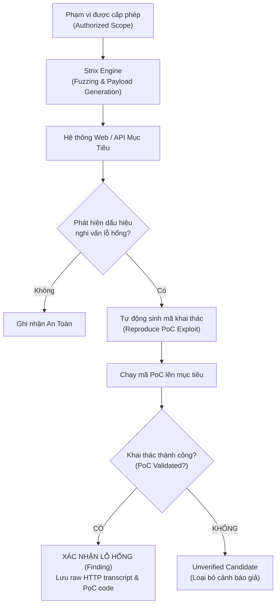
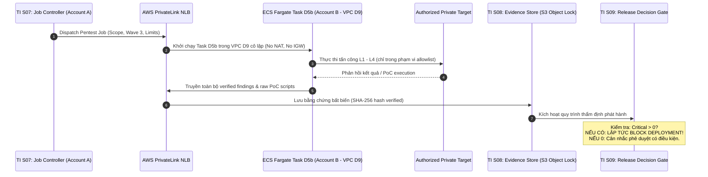

# Luồng Chạy Chi Tiết Của Pentest Agent & Tích Hợp AWS / TI

> **Mục tiêu tài liệu**: Mô tả từng bước luồng thực thi kỹ thuật của 4 lớp bảo mật trong Pentest Agent và quy trình tích hợp với nền tảng Test Intelligent (TI) trên môi trường đám mây AWS.  
> **File thiết kế Draw.io đính kèm**: [`Pentest_AWS_Detail.drawio`](file:///D:/Doc/diagram/Pentest_AWS_Detail.drawio) (Bao gồm 6 trang kiến trúc hoàn chỉnh).

---

## 1. Sơ Đồ Điều Hướng Các Trang Trên Draw.io

Người dùng có thể mở file [`Pentest_AWS_Detail.drawio`](file:///D:/Doc/diagram/Pentest_AWS_Detail.drawio) bằng Draw.io Desktop hoặc VS Code Draw.io Extension để xem trực quan 6 trang kiến trúc:

| STT Trang | Tên Trang (Tab Name) | Nội Dung Trọng Tâm Thể Hiện |
| :---: | :--- | :--- |
| **01** | `01-Overview Four Layers` | Tổng quan 4 lớp kiểm thử (L1, L2, L3, L4), React :5175, FastAPI và Layer Dispatcher |
| **02** | `02-LLM QA-28` | Luồng tấn công đối kháng LLM: Kịch bản $\rightarrow$ Bedrock Opus $\rightarrow$ 8 nhóm hiểm họa $\rightarrow$ Budgeting |
| **03** | `03-Strix Web API` | Luồng quét L2/L3 Strix: Authorized Scope $\rightarrow$ Quét mục tiêu $\rightarrow$ Tái hiện PoC $\rightarrow$ Verified Finding |
| **04** | `04-Agent QA-29` | Luồng tấn công Agent: Chốt chặn `--live` $\rightarrow$ 3 Track (Canary, PyRIT, ASI01-10) $\rightarrow$ Bằng chứng |
| **05** | `05-TI Topology` | Mô hình phân tán đa tài khoản AWS: TI Account A (Control Plane) $\leftrightarrow$ Account B (Fargate Runner D5b) |
| **06** | `06-TI Gate` | Thứ tự ra quyết định bảo mật tại Gate S09 của TI: Cưỡng chế `Critical > 0` $\rightarrow$ Lập tức BLOCK |

---

## 2. Luồng Thực Thi Kỹ Thuật Từng Lớp Bảo Mật

### 2.1. Luồng Tấn Công Đối Kháng LLM (L1 - QA-28) - *Trang 02*
1. **Thiết lập phạm vi**: Định nghĩa danh sách các model cần test và bộ ngân sách (`limits.max_attempts_per_vuln`).
2. **Vòng lặp đối kháng (Adversarial Generation Loop)**:
   - Mô hình kẻ tấn công (**Adversarial Prompter** - Claude Opus) sinh các câu lệnh tấn công tinh vi (Jailbreak, Indirect Prompt Injection, Role-play exploitation).
   - Payload được gửi tới LLM mục tiêu.
3. **Thẩm định kết quả (Security Judge)**:
   - Mô hình thẩm phán đánh giá phản hồi của LLM mục tiêu dựa trên tiêu chuẩn an toàn của 8 nhóm hiểm họa.
   - Nếu LLM mục tiêu bị phá vỡ phòng tuyến (tiết lộ prompt, sinh mã độc, v.v.), hệ thống lưu lại toàn bộ chuỗi hội thoại đối kháng (adversarial transcript).
4. **Dừng vòng lặp**: Khi tìm thấy lỗ hổng hoặc khi chạm ngưỡng ngân sách thử nghiệm.

### 2.2. Luồng Quét & Tái Hiện PoC Strix (L2 Web & L3 API) - *Trang 03*

### 2.3. Luồng Kiểm Thử Agent Tool-Calling (L4 - QA-29) - *Trang 04*
1. **Chốt chặn an toàn (`--live` check)**:
   - Kiểm tra cờ cấu hình `--live`.
   - Nếu KHÔNG bật $\rightarrow$ Trả về trạng thái **SKIPPED**, không có bất kỳ request nào được gửi tới agent mục tiêu.
   - Nếu BẬT $\rightarrow$ Kích hoạt Target Adapter (HTTP JSON hoặc SSE AG-UI Wire format).
2. **Kích hoạt 3 luồng kiểm thử độc lập (Parallel Tracks)**:
   - **Track A (Canary Red-team)**: Chèn canary tokens vào context và theo dõi tool call parameters.
   - **Track B (Microsoft PyRIT)**: Tự động chạy các kịch bản đối kháng chuyên sâu từ thư viện PyRIT.
   - **Track C (ASI01 - ASI10)**: Kiểm tra danh mục 10 lỗ hổng nguy hiểm nhất của Agentic AI.
3. **Tổng hợp bằng chứng**: Thu thập toàn bộ execution logs, transcript `pyrit_transcript.jsonl` và trạng thái gọi tool vào thư mục `reports/<run_id>/`.

---

## 3. Luồng Tích Hợp Nền Tảng Test Intelligent (TI) Trên AWS (*Trang 05 & 06*)

Trong kiến trúc tổng thể của Test Intelligent (TI), Pentest Agent được kích hoạt tại **Wave 3** sau khi các bài test chức năng và hồi quy ở Wave 1 & 2 đã vượt qua:

### Quy Tắc Chốt Chặn Bất Di Bất Dịch (Zero-Tolerance Security Gate):
- **Luật TI 18 (Completed $\neq$ PASS)**: Tiến trình Pentest chạy hoàn tất (Exit code 0) không có nghĩa là hệ thống an toàn.
- **Tiêu chí Gate S09**:
  - Nếu số lượng lỗ hổng mức độ **Critical > 0** $\rightarrow$ **LẬP TỨC BLOCK TOÀN BỘ TIẾN TRÌNH DEPLOYMENT**. Báo động đỏ được gửi về ban quản trị và đội ngũ bảo mật.
  - Nếu có lỗ hổng mức độ High $\rightarrow$ Trạng thái **NEEDS REVIEW** (yêu cầu Security Lead ký duyệt ngoại lệ có thời hạn).
  - Chỉ khi toàn bộ các kiểm thử L1–L4 đều đạt trạng thái Safe hoặc không có lỗ hổng vượt ngưỡng chấp nhận rủi ro, Gate S09 mới chính thức cấp cờ PASS.
