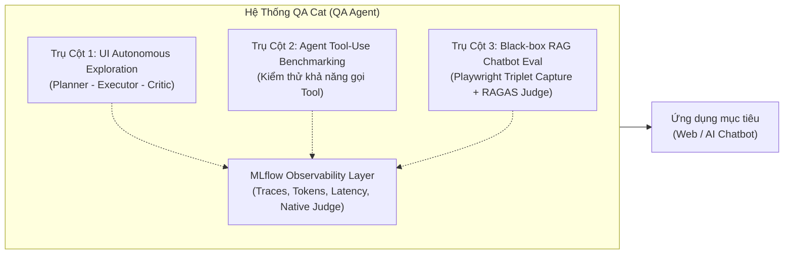

# Tổng Quan Về QA Agent (QA Cat)

> **Mục tiêu tài liệu**: Giới thiệu định vị, kiến trúc tổng thể, ba trụ cột kiểm thử cốt lõi và vai trò của lớp quan sát MLflow trong hệ thống **QA Agent (QA Cat)**.  
> **Sơ đồ kiến trúc liên kết**: [`QA_Cat_AWS_Detail.drawio`](file:///D:/Doc/diagram/QA_Cat_AWS_Detail.drawio) & [`TechX_Master_Architecture.drawio`](file:///D:/Doc/diagram/TechX_Master_Architecture.drawio).

---

## 1. Định Vị & Mục Tiêu Của QA Cat

Trong quy trình phát triển phần mềm hiện đại kết hợp AI (Generative AI & Agentic Systems), các công cụ kiểm thử truyền thống (như Selenium, Cypress, Playwright viết tay) gặp phải 3 rào cản lớn:
1. **Chi phí bảo trì test script khổng lồ**: Giao diện người dùng (UI) thay đổi liên tục khiến các selector bị vỡ (flaky tests).
2. **Không có khả năng tự động khám phá (Autonomous Exploration)**: Script tĩnh chỉ đi theo các kịch bản định trước (happy path), bỏ sót các hành vi biên bất thường mà người dùng thực tế có thể thực hiện.
3. **Thiếu khả năng đánh giá chất lượng mô hình AI (GenAI / RAG Evaluation)**: Các hệ thống AI Chatbot sinh câu trả lời theo xác suất (non-deterministic), không thể kiểm thử bằng phép so sánh chuỗi chính xác (`assert response == expected`).

**QA Cat** được phát triển nhằm giải quyết triệt để 3 vấn đề trên bằng cách kết hợp **Autonomous AI Agents**, **Playwright Automation Engine** và **LLM-as-a-Judge Evaluation Framework**.

---

## 2. Ba Trụ Cột Kiểm Thử Cốt Lõi (Core Pillars)

### Trụ Cột 1: Tự Động Khám Phá Giao Diện (Autonomous UI Exploration)
- **Mô hình hoạt động**: Vận hành theo vòng lặp nhận thức tự trị gồm 3 tác tử:
  - **Planner Agent (Claude 3.7 / Opus)**: Phân tích cây DOM, ảnh chụp màn hình (screenshot) và mục tiêu kiểm thử để lập kế hoạch các hành động tiếp theo (Click, Type, Scroll, Navigate).
  - **Executor Agent (Claude Sonnet 4)**: Điều khiển trực tiếp trình duyệt qua giao thức Chrome DevTools Protocol (CDP) / Playwright để tương tác vật lý với UI.
  - **Critic Agent (Claude 3.7)**: Soi xét kết quả sau hành động, kiểm tra lỗi JavaScript console, lỗi HTTP 4xx/5xx và đối chiếu mục tiêu xem đã hoàn thành hay gặp bế tắc (dead-end).
- **Giá trị mang lại**: Tìm kiếm các luồng người dùng dị biệt (edge cases), phát hiện layout bị vỡ hoặc crash mà không cần viết trước bất kỳ dòng script kiểm thử nào.

### Trụ Cột 2: Kiểm Thử Khả Năng Gọi Tool Của Agent Khác (Agent Tool-Use Benchmarking)
- Đánh giá khả năng hoạt động của các AI Agent của bên thứ ba hoặc hệ thống nội bộ.
- Kiểm tra xem Agent có chọn đúng Tool dựa trên prompt hay không, kiểm tra định dạng tham số gọi (Schema validation), xử lý lỗi timeout và xử lý phản hồi khi Tool gặp sự cố.

### Trụ Cột 3: Đánh Giá Chất Lượng AI Chatbot RAG (Black-box RAG Evaluation)
- **Cơ chế thu thập tất định (Deterministic Capture)**:
  - Sử dụng Playwright tương tác trực tiếp với giao diện chat của ứng dụng mục tiêu (Chatbot Web UI).
  - Nhập câu hỏi từ bộ dataset kiểm thử vào ô input, bắt câu trả lời trả về trên DOM.
  - Ghi nhận bộ dữ liệu chuẩn (Triplet): `(question, system_answer, latency_ms)`.
- **Cơ chế chấm điểm tự động (LLM-as-a-Judge)**:
  - Sử dụng **AWS Bedrock Opus** để chấm điểm theo chuẩn RAGAS:
    - **Answer Relevancy**: Câu trả lời có đúng trọng tâm câu hỏi không (chấm độc lập, luôn khả dụng).
    - **Answer Correctness**: Câu trả lời có đúng sự thật không (khi dataset cung cấp `expected_answer`).
    - **Faithfulness**: Câu trả lời có trung thực với tài liệu ngữ cảnh (Knowledge Base) không, có bị ảo giác (hallucination) không.
  - Mỗi điểm số đi kèm mức độ tin cậy (Confidence score) và đoạn lập luận giải thích (Reasoning trail).

---

## 3. Vị Trí Của MLflow Observability Trong QA Cat

Theo đề xuất nâng cấp hệ thống (nhánh `feat/mlflow-spike-phase-00`), **MLflow** đóng vai trò là **lớp quan sát chuyên sâu (Observability & Tracing Layer)** cho toàn bộ hoạt động kiểm thử AI:

1. **Bedrock Autologging**:
   - Tự động ghi lại toàn bộ request/response tới AWS Bedrock qua `mlflow.bedrock.autolog()`.
   - Thu thập chi tiết số lượng token tiêu thụ (input tokens, output tokens), độ trễ từng bước suy luận (latency ms) và chi phí ước tính ($).
2. **Cây Trace (Trace Tree & Spans)**:
   - Hiển thị trực quan từng bước tư duy của Planner, Executor và Critic trong tab giao diện **"Lab"**.
3. **MLflow Native Judges Adapter**:
   - Thông qua [`bedrock_judge_adapter.py`](file:///D:/Doc/diagram/redraw_qa_pentest.py#L148), tích hợp mô hình Bedrock Converse để chạy các tiêu chuẩn đánh giá của MLflow.
4. **Cơ chế suy thoái mềm (Graceful Degradation / No-op)**:
   - Nếu biến môi trường `MLFLOW_TRACKING_URI` không được cấu hình hoặc server MLflow gặp sự cố, hệ thống tự động fallback về chế độ No-op, **tuyệt đối không làm gián đoạn hay crash tiến trình test đang chạy**.

---

## 4. Ngăn Xếp Công Nghệ (Tech Stack)

| Tầng (Layer) | Công Nghệ Sử Dụng | Vai Trò Chi Tiết |
| :--- | :--- | :--- |
| **Giao Diện (Frontend)** | React 18, Vite, TailwindCSS | Bảng điều khiển quản lý Test Run, live screenshot stream, Lab view |
| **Backend API** | Python 3.11, FastAPI, Uvicorn | Quản lý phiên test, điều phối kịch bản, endpoint chấm điểm RAGAS |
| **Trình Duyệt & Tự Động Hóa** | Playwright, Chrome DevTools Protocol | Điều khiển trình duyệt không đầu (Headless Browser), capture DOM |
| **Suy Luận & Chấm Điểm AI** | AWS Bedrock (Claude 3.7, Sonnet 4, Opus) | Phục vụ Planner, Executor, Critic và LLM-as-a-Judge |
| **Quản Lý Quan Sát (Observability)** | MLflow Tracking Server, SQLite Store | Lưu vết execution spans, token usage, latency distribution (p50/p90/p99) |
| **Lưu Trữ Dữ Liệu Nội Bộ** | SQLite (`qa-agent-data/mlflow.db`), JSON Lines | Lưu trữ tạm thời trạng thái run và kết quả tại node runner |

---

## 5. Tài Liệu Cùng Thư Mục & Liên Kết Sơ Đồ

- **Luồng chạy chi tiết & Tích hợp AWS/TI**: Đọc tiếp tài liệu [`02_Luong_Chay_Chi_Tiet_QA_Agent.md`](file:///D:/Doc/QA-Agent/02_Luong_Chay_Chi_Tiet_QA_Agent.md).
- **Phân tích điểm nghẽn Trụ Cột 3**: Đọc tài liệu trong thư mục chuyên sâu [`painpoints/Pillar3_Blackbox_AI_Testing_Painpoints.md`](file:///D:/Doc/QA-Agent/painpoints/Pillar3_Blackbox_AI_Testing_Painpoints.md).
- **Sơ đồ trực quan trên Draw.io**: Mở file [`QA_Cat_AWS_Detail.drawio`](file:///D:/Doc/diagram/QA_Cat_AWS_Detail.drawio) để xem toàn bộ 6 trang kiến trúc chi tiết.
