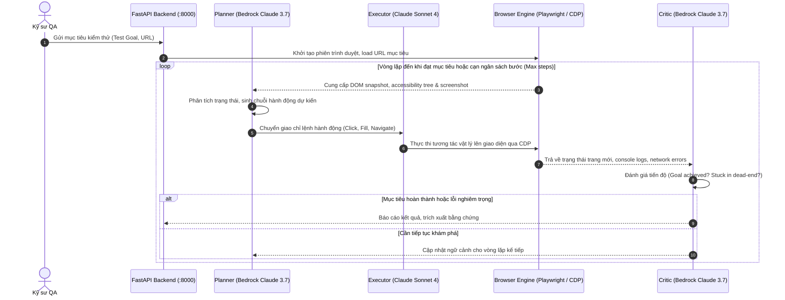
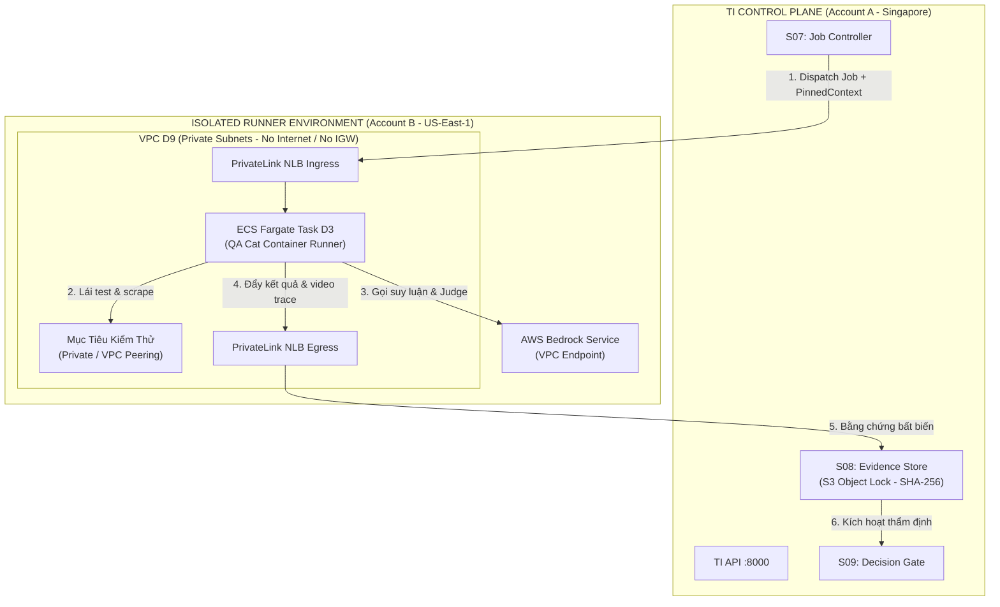

# Luồng Chạy Chi Tiết Của QA Agent (QA Cat) & Tích Hợp AWS / TI

> **Mục tiêu tài liệu**: Mô tả từng bước luồng thực thi kỹ thuật (runtime execution flow) của QA Cat từ chế độ độc lập (Standalone) đến tích hợp phân tán với nền tảng Test Intelligent (TI) trên AWS.  
> **File thiết kế Draw.io đính kèm**: [`QA_Cat_AWS_Detail.drawio`](file:///D:/Doc/diagram/QA_Cat_AWS_Detail.drawio) (Bao gồm 6 trang kiến trúc hoàn chỉnh).

---

## 1. Sơ Đồ Điều Hướng Các Trang Trên Draw.io

Để có cái nhìn trực quan, người dùng có thể mở file [`QA_Cat_AWS_Detail.drawio`](file:///D:/Doc/diagram/QA_Cat_AWS_Detail.drawio) bằng Draw.io Desktop hoặc extension Draw.io Integration trong VS Code. File gồm 6 tab (trang):

| STT Trang | Tên Trang (Tab Name) | Nội Dung Trọng Tâm Thể Hiện |
| :---: | :--- | :--- |
| **01** | `01-Network EC2` | Kiến trúc mạng vật lý standalone trên EC2 (Vite :5173, FastAPI :8000, CDP, Playwright, Bedrock) |
| **02** | `02-Agent Loop` | Vòng lặp nhận thức tự trị: **Planner** $\rightarrow$ **Executor** $\rightarrow$ **Critic** $\rightarrow$ Trạng thái dừng |
| **03** | `03-RAGAS Evaluation` | Luồng kiểm thử RAG tất định qua Playwright: Dataset $\rightarrow$ Capture Triplet $\rightarrow$ Bedrock Opus Judge |
| **04** | `04-MLflow Observability` | Luồng thu thập telemetry (Bedrock Autolog, SQLite store, Trace tree, fallback No-op) |
| **05** | `05-TI Topology` | Mô hình phân tán đa tài khoản AWS: TI Account A (Control Plane) $\leftrightarrow$ Account B (Fargate Runner D3) |
| **06** | `06-TI Gate` | Thứ tự ra quyết định tại Release Gate S09 của TI: Lọc Critical $\rightarrow$ Đánh giá Faithfulness $\rightarrow$ Pass/Block |

---

## 2. Chi Tiết Các Luồng Thực Thi Nội Bộ (Internal Flow)

### 2.1. Luồng Vòng Lặp Tác Tử Tự Trị (Autonomous Agent Loop) - *Trang 02*

### 2.2. Luồng Kiểm Thử RAGAS Tất Định (Deterministic RAG Evaluation) - *Trang 03*

Khác với vòng lặp khám phá UI bằng LLM, luồng đánh giá RAGAS được thiết kế **tất định (deterministic)** nhằm tối ưu tốc độ và tránh độ trễ của agent:
1. **Lái trình duyệt trực tiếp bằng Playwright**: Đọc danh sách câu hỏi từ bộ dataset, inject trực tiếp giá trị vào ô input của Chatbot Web UI và kích hoạt sự kiện gửi.
2. **Thu thập kết quả từ DOM**: Chờ Chatbot stream xong toàn bộ text, trích xuất nội dung câu trả lời và đo đạc độ trễ mạng (`latency_ms`).
3. **Persist bộ ba dữ liệu (Triplet)**: Ghi lại cấu trúc `(question, system_answer, latency_ms)`.
4. **Chấm điểm bằng Bedrock Opus Judge**:
   - Gửi Triplet và ngữ cảnh tài liệu tới AWS Bedrock Converse.
   - Chấm điểm **Relevancy** (luôn thực hiện), **Correctness** (khi có `expected_answer`), và **Faithfulness** (khi có `context`).
   - Kết quả trả về gồm điểm số $[0.0 - 1.0]$, Confidence score và đoạn giải thích (Reasoning trail).

---

## 3. Luồng Tích Hợp Nền Tảng Test Intelligent (TI) Trên AWS (*Trang 05 & 06*)

Khi đưa QA Cat vào dây chuyền CI/CD của doanh nghiệp qua Test Intelligent (TI), hệ thống vận hành theo **Mô hình kiến trúc phân tán đa tài khoản (Cross-Account Isolation)**:

### Các nguyên tắc vận hành cốt lõi (TI Architectural Laws):
1. **Cô lập vùng chạy tuyệt đối (Law 23 - Isolated Runner)**:
   - QA Cat container chạy dưới dạng ECS Fargate Task nằm trọn vẹn trong **VPC D9** (private subnets, không cấp Public IP, không có NAT Gateway hay Internet Gateway).
   - Mọi kết nối ra ngoài đều bị từ chối mặc định (`deny-all egress`), chỉ cho phép giao tiếp với Target App qua đường mạng nội bộ và gọi AWS Bedrock qua AWS Private VPC Endpoint (`com.amazonaws.us-east-1.bedrock-runtime`).
2. **Dispatch & Bơm ngữ cảnh (Law 4.3 - Pinned Context Injection)**:
   - TI S07 dispatch tác vụ kiểm thử qua AWS PrivateLink NLB, đính kèm `PinnedContext` (các đoạn tài liệu Knowledge Base đã được chốt hash SHA-256) sang cho QA Cat.
3. **Lưu trữ bằng chứng bất biến (Law 16 - Verifiable Evidence)**:
   - Thư mục chạy nội bộ trên runner chỉ là tạm thời (staging). Toàn bộ video Playwright, network log và kết quả chấm điểm RAGAS phải được gửi về TI Account A để lưu vào **S3 Object Lock** có kiểm tra mã băm SHA-256.
4. **Quyết định tại Gate S09 (Law 18 - Completed $\neq$ PASS)**:
   - Tiến trình test chạy xong (Exit Code 0) không đồng nghĩa với bản build phần mềm được duyệt PASS.
   - S09 thực hiện đánh giá theo thứ tự:
     - Nếu có lỗi giao diện nghiêm trọng hoặc crash $\rightarrow$ **BLOCK**.
     - Nếu điểm `Faithfulness < 0.85` (nguy cơ ảo giác nghiêm trọng) $\rightarrow$ **HOLD**.
     - Thiếu ngữ cảnh hoặc không chấm được điểm $\rightarrow$ Không được tính là đạt.
