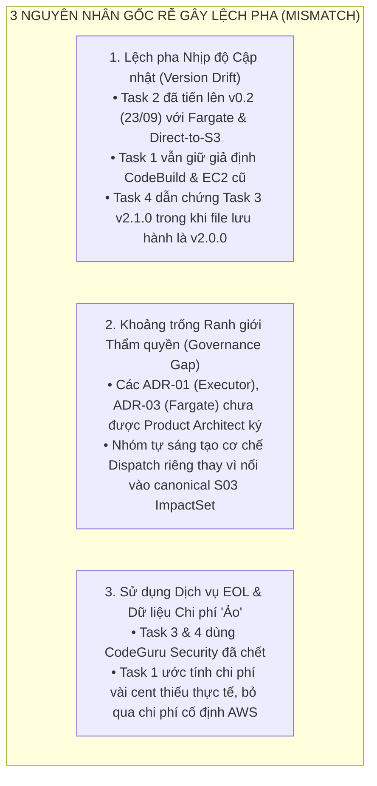
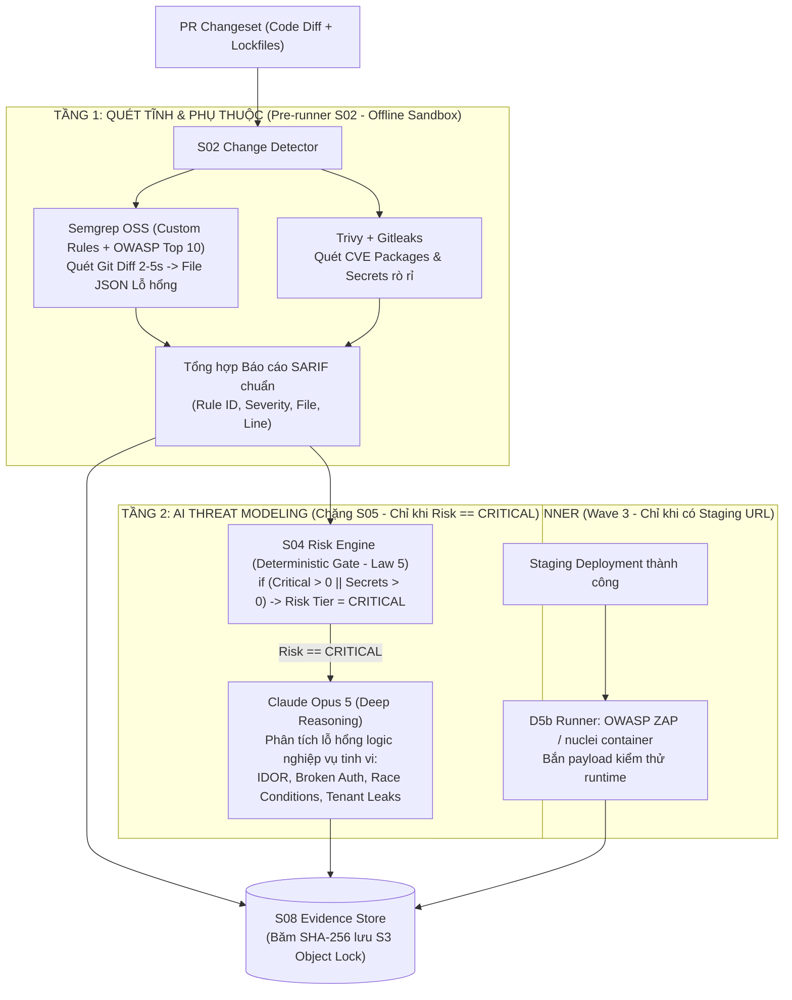
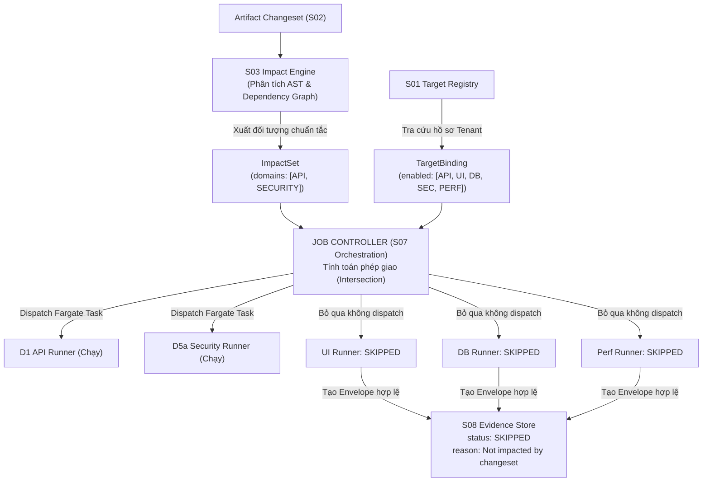

# BÁO CÁO ĐỐI SOÁT MISMATCH & KẾ HOẠCH ĐỒNG BỘ HÓA DỰ ÁN TESTING INTELLIGENCE (TI)
## BẢN HIỆU CHỈNH & HOÀN THIỆN TOÀN DIỆN (PHIÊN BẢN V2.0 — CẬP NHẬT THEO FEEDBACK ĐỐI CHIẾU CHÉO)
### Rà soát Biên bản Cuộc họp (23/09/2026), 04 Bản Nghiên cứu Kỹ thuật (Task 1–4) & Báo cáo Thẩm định Độc lập

---

| Thuộc tính | Chi tiết |
| :--- | :--- |
| **Phiên bản tài liệu** | **v2.0.0 (Comprehensive Revision & Gap-Fill)** |
| **Ngày hiệu chỉnh** | **25/09/2026** |
| **Căn cứ đối soát 1** | [PDF/Biên bản cuộc họp TI - 23_09_2026.pdf](file:///D:/Doc/PDF/Biên%20bản%20cuộc%20họp%20TI%20-%2023_09_2026.pdf) (Cuộc họp nội bộ ngày 23/09/2026) |
| **Căn cứ đối soát 2** | [Task_1_Research_Tool_and_Framework_for_Testing.md](file:///D:/Doc/Research/Task_1_Research_Tool_and_Framework_for_Testing.md) (Trang — Tool & Framework) |
| **Căn cứ đối soát 3** | [Task_2-Architecture-Report.md](file:///D:/Doc/Research/Task_2-Architecture-Report.md) (Hoàng — Architecture Report v0.2) |
| **Căn cứ đối soát 4** | [Task_3_AI-Prompt_Research.md](file:///D:/Doc/Research/Task_3_AI-Prompt_Research.md) (Nghĩa — AI Model & Prompting v2.0.0) |
| **Căn cứ đối soát 5** | [Task_4_Test_Plan_Strategy_Evaluation.md](file:///D:/Doc/Research/Task_4_Test_Plan_Strategy_Evaluation.md) (Hùng — Testing Strategy v1.2.0) |
| **Căn cứ đối soát 6** | [Claude_FEEDBACK_Danh_Gia_Bao_Cao_Doi_Soat_Gemini_va_Khuyen_Nghi_TI.md](file:///D:/Doc/Research/Claude_FEEDBACK_Danh_Gia_Bao_Cao_Doi_Soat_Gemini_va_Khuyen_Nghi_TI.md) |
| **Kỷ luật Nhãn Sự thật** | Tuân thủ Law 11.2: `OBSERVED` (Đo thực tế) · `INFERRED` (Suy luận có căn cứ) · `CANDIDATE` (Đề xuất chờ Spike) |
| **Trạng thái phê duyệt** | 🟡 **DRAFT HOÀN THIỆN ĐỀ XUẤT** — Chờ Product Architect (Tan.Thai) ký duyệt tại buổi họp Connect |

---

## 0. LỜI MỞ ĐẦU & CÁC ĐIỂM ĐÃ ĐƯỢC HIỆU CHỈNH TRỌNG YẾU TẠI BẢN V2.0

Tiếp thu toàn diện đánh giá phản biện chéo, bản báo cáo này đã được tái cấu trúc và sửa đổi triệt để nhằm đảm bảo tính **trung thực dữ liệu**, **kỷ luật kiến trúc** và **khả thi triển khai**:

1. **Khắc phục lỗi "Giao việc đã xong" cho Task 2 (Hoàng)**: Ghi nhận chính thức rằng Hoàng trong bản **Task 2 v0.2** đã chủ động xử lý 3/4 điểm mentor yêu cầu (bỏ AWS Network Firewall $288/tháng $\rightarrow$ VPC Endpoints $22/tháng; bổ sung domain Database D2.b; vẽ lại sơ đồ dispatch ngang hàng và luồng Direct-to-S3). Báo cáo không giao lại các việc này cho Hoàng, mà tập trung yêu cầu **Trang (Task 1)** và **Hùng (Task 4)** cập nhật theo bản vẽ mới nhất của Hoàng.
2. **Kích hoạt Báo động Đỏ (🔴 P0) cho Lỗ hổng Kiến trúc Bảo mật**: Đưa vấn đề **Amazon CodeGuru Security đã bị AWS khai tử (EOL từ 20/11/2025, chưa từng rời bản Preview)** lên mức nghiêm trọng cao nhất. Bóc tách rõ việc Task 3 và Task 4 đang xây dựng Tầng 0 (Pre-runner S02 $\rightarrow$ S04) dựa trên một dịch vụ không còn tồn tại, đồng thời cung cấp phương án thay thế khả thi ngay lập tức.
3. **Làm rõ bản chất của "Smart Dispatching Matrix"**: Khẳng định đây không phải là một thuật toán mới tự sáng tạo, mà là việc **hiện thực hóa năng lực canonical `S03 Impact Engine` (sinh `ImpactSet`) kết hợp `S01 Target Registry` (`TargetBinding`)** đã có sẵn trong tài liệu thiết kế gốc của TI.
4. **Bổ sung Action Item tham vấn Team Data**: Ghi nhận nguyên văn yêu cầu từ Mục 2 Biên bản họp ngày 23/09/2026: *"cần tham khảo thêm ý kiến của team Data đối với việc dùng Aurora Serverless v2 Clone"*, thiết lập thành đầu việc quản trị riêng biệt.
5. **Thiết lập Kỷ luật Nhãn Sự thật (Truth Labeling) cho Bảng Chi phí**: Gắn nhãn `CANDIDATE` cho toàn bộ số liệu chi phí ước tính, trích dẫn rõ công thức tính toán và ngày tra giá, chỉ định rõ **Spike P4** của Hoàng là căn cứ duy nhất để chuyển số liệu sang `OBSERVED`.
6. **Phân định rạch ròi giữa "Đề xuất Kỹ thuật" và "Thẩm quyền Ký duyệt"**: Tách biệt rõ sự đồng thuận kỹ thuật của nhóm nghiên cứu với các quyết định kiến trúc cốt lõi (one-way door) đang ⏳ **chờ chữ ký phê duyệt của Product Architect (Tan.Thai)** theo Architecture Governance.

---

## 1. TỔNG QUAN HIỆN TRẠNG 4 BẢN NGHIÊN CỨU & NGUYÊN NHÂN LỆCH PHA

Biên bản cuộc họp ngày **23/09/2026** đã kết luận: *"Hiện tại cả team đang bị mismatch thông tin, cần tổ chức connect lại ngay để thống nhất hướng đi"*.

Qua rà soát thực tế, sự lệch pha không xuất phát từ việc thiếu năng lực kỹ thuật của các cá nhân, mà bắt nguồn từ **3 nguyên nhân gốc rễ (Root Causes)**:



* **Về phía Trang (Task 1 — Tool & Framework)**: Nghiên cứu công cụ rất rộng, có phát hiện đúng về việc CodeGuru bị EOL (dòng 320–321), nhưng chưa kịp cập nhật theo bản vẽ kiến trúc mới của Hoàng (vẫn giữ CodeBuild, CloudWatch Synthetics và lưu trữ EBS EC2), tính toán chi phí mang tính lý thuyết, thiếu chi phí tối thiểu.
* **Về phía Hoàng (Task 2 — Architecture)**: Đạt kỷ luật kiến trúc cao nhất trong 4 người (dùng nhãn `OBSERVED/INFERRED/CANDIDATE`, có ADR, falsifiability). Đã tự sửa 3/4 điểm theo feedback mentor ngày 22/09. Tuy nhiên, các quyết định lớn vẫn là `CANDIDATE` đang chờ chạy **Spike P4** và chờ chữ ký chính thức từ Product Architect Tan.Thai.
* **Về phía Nghĩa (Task 3 — AI Model & Prompting)**: Thiết kế Prompt và Model Tiering 3 cấp rất xuất sắc. Tuy nhiên, tài liệu đang gặp vấn đề **Version Drift** (tiêu đề ghi v2.0.0 nhưng Task 4 changelog lại ghi nhận v2.1.0) và vẫn đưa `Amazon CodeGuru Security` (dịch vụ đã bị AWS khai tử) vào phụ lục công cụ.
* **Về phía Hùng (Task 4 — Testing Strategy & Evaluation)**: Vận dụng 3 tầng ISTQB rất bài bản, theo dõi sát Task 2 (đã cập nhật Private Subnet thay Network Firewall). Tuy nhiên, Task 4 đang xây dựng Tầng 0 của Hybrid Defense phụ thuộc vào CodeGuru Security, chưa đưa DAST (ZAP/nuclei) vào scope, điều kiện `HOLD` bị thiếu tiêu chí Faithfulness, và quy định dispatch `CRITICAL` kích hoạt toàn bộ 6 runners là quá cứng nhắc.

---

## 2. MA TRẬN ĐỐI SOÁT KỸ THUẬT TOÀN DIỆN (10 ĐIỂM TRỌNG YẾU)

*Chú thích nhãn đánh giá:*
- 🔴 **P0 (Lỗ hổng Chết / Mâu thuẫn Kiến trúc Cốt lõi)**: Bắt buộc giải quyết ngay trước khi viết code.
- 🟠 **P1 (Lệch pha Thực thi / Khoảng trống Kỹ thuật Cần đóng)**: Ảnh hưởng trực tiếp tới pipeline.
- 🟡 **P2 (Hoàn thiện / Chuẩn hóa Tài liệu & Đồng bộ Nhãn)**: Tinh chỉnh thống nhất số liệu.
- 🟢 **P3 (Quản trị & Phê duyệt Phụ trợ)**: Hành động quản trị và xác minh trước triển khai.

| # | Vấn đề / Yêu cầu từ Cuộc họp 23/09/2026 | Hiện trạng Task 1 (Trang) | Hiện trạng Task 2 (Hoàng, v0.2) | Hiện trạng Task 3 (Nghĩa) | Hiện trạng Task 4 (Hùng, v1.2.0) | Mức độ | Bản chất Mismatch & Giải pháp Chốt |
| :-: | :--- | :--- | :--- | :--- | :--- | :-: | :--- |
| **1** | **🔴 Lỗ hổng Dịch vụ EOL: Amazon CodeGuru Security** | Đã phát hiện CodeGuru EOL từ 20/11/2025; thay bằng Semgrep/Trivy ở §2.3.3. | Không chọn CodeGuru; chọn Semgrep + Trivy container cho D5a (W1). | **Vẫn đưa CodeGuru Security vào Phụ lục (dòng 1039) & sơ đồ (dòng 163).** | **Coi CodeGuru Security là TẦNG 0 của Hybrid Defense (§4.2.5).** | 🔴 **P0** | **Dịch vụ đã ngừng hoạt động từ 20/11/2025.** Không thể triển khai Tầng 0. Giải pháp: Gỡ bỏ hoàn toàn CodeGuru; gộp Tầng 0 vào Tầng 1 (Semgrep + Trivy + Gitleaks tại S02) hoặc dùng Amazon Inspector. |
| **2** | **Version Drift: Task 3 (v2.0.0 vs v2.1.0)** | Không trực tiếp tham chiếu version của Task 3. | Tham chiếu Task 3 ở mức khái niệm adapter. | File trên đĩa tự ghi tiêu đề là **v2.0.0**. | Changelog (dòng 668, 688) khẳng định: **"Task 3 đã hoàn thành v2.1.0"**. | 🔴 **P0** | Cả nhóm đang review trên 2 trạng thái "sự thật" khác nhau. Cần xác nhận: xuất bản v2.1.0 chính thức hoặc Hùng sửa lại Task 4 về v2.0.0. |
| **3** | **Execution Platform: CodeBuild/Synthetics vs Fargate** | Chọn **CodeBuild** (API/Sec) & **CloudWatch Synthetics** (UI). | Chọn **ECS Fargate task-per-job** cho toàn bộ runner (D2 Sandbox). | Từng đề xuất container local; v2.0.0 kết hợp Fargate & Serverless. | Ghi Fargate/Lambda cho API/UI/DB; chưa chốt runtime runner thống nhất. | 🟠 **P1** | CodeBuild cold start 45–90s và tải Chromium mỗi lần là lãng phí. **Chốt Fargate task-per-job** với 4 image ECR pre-baked; Trang cập nhật Task 1. |
| **4** | **Quản lý Bằng chứng: Nguy cơ ngộp Storage EC2** | Đẩy về S08 không rõ network path; giả định backend EC2 + gp3. | **ĐÃ GIẢI QUYẾT TRƯỚC:** Sơ đồ §8 vẽ Fargate đẩy **trực tiếp lên S3 Object Lock**. | Đề cập S08 và S3; còn ý tưởng trả raw data về Harness. | Đã có schema `raw_result_s3_uri`, chưa mô tả luồng network offload. | 🟠 **P1** | Hoàng đã giải quyết xong trong v0.2. **Trang cần cập nhật Task 1**: xóa giả định lưu bằng chứng trên EC2, xác nhận luồng Direct-to-S3 qua VPC Endpoint. |
| **5** | **Khoảng trống NoSQL Database Testing** | Chỉ đề xuất **Aurora Serverless v2 Clone** cho SQL. | Bổ sung **D2.b Aurora Clone + Flyway**. Bỏ trống NoSQL. | Chỉ có SQL schema (`DATABASE_CANDIDATE_V1`). Bỏ trống NoSQL. | Chỉ có SQL migration rollback. Bỏ trống NoSQL. | 🟠 **P1** | **Khoảng trống 100% trên cả 4 Task.** Bổ sung giải pháp DynamoDB Local/Ephemeral Table có TTL tự hủy 1h và hook cleanup `DeleteTable`. |
| **6** | **Tham vấn Team Data cho Aurora Clone** | Đề xuất giải pháp kỹ thuật, chưa có action item với Data team. | Đề xuất kỹ thuật, ghi nhận "chờ xác nhận lại". | Đề xuất kỹ thuật theo Task 1. | Kế thừa giải pháp kỹ thuật từ Task 1 & 2. | 🟢 **P3** | Biên bản họp yêu cầu tham vấn Team Data. Cần bổ sung 1 Action Item riêng cho PM/Hoàng làm việc với Data Team về quota snapshot. |
| **7** | **Điều phối S07: Smart Dispatching vs S03 ImpactSet** | Sơ đồ S07 kích hoạt đồng loạt cả 4–6 runners không phân nhánh. | Vẽ dispatch ngang hàng, nhưng sơ đồ vẽ cả 5 tasks song song. | Chưa có ma trận mapping từ Changeset sang Runner. | Mục 4.1 quy định: `CRITICAL` kích hoạt TẤT CẢ 6 runners (quá cứng). | 🔴 **P0** | **Hiện thực hóa capability canonical S03 Impact Engine (sinh `ImpactSet`) ∩ `TargetBinding` (S01)**. Tan.Thai duyệt mapping; Hùng và Trang sửa tài liệu. |
| **8** | **Ngăn xếp DAST (ZAP / nuclei) chưa thống nhất** | **Chủ động loại ZAP** ("Không chọn làm lõi", §3.5). | **Đưa ZAP/nuclei vào D5b** (Wave 3, chỉ khi có Staging URL sống). | **Đưa ZAP/nuclei vào Wave 3** trong Phụ lục (dòng 1040). | **Hoàn toàn không nhắc đến DAST** trong bảng In-Scope/Out-of-Scope. | 🟡 **P2** | Tồn tại 3 trạng thái khác nhau trên 4 task. Thống nhất theo Task 2 & 3: ZAP/nuclei là **D5b (Wave 3 - DAST)**, chỉ kích hoạt khi có Staging URL sống. |
| **9** | **GenAI Non-determinism & Thiếu Faithfulness** | Đề xuất Bedrock Evaluations (`TIRunnerGroundness`) chung. | Giao phó cho AgentCore Account B, chưa xử lý điểm dao động. | Phân tầng model Haiku/Sonnet/Opus; chưa khai báo temp/top_p. | Exit Criteria Mục 6.2 có Groundedness, **thiếu hoàn toàn Faithfulness**. | 🟠 **P1** | Siết `temperature: 0.0` (giảm mạnh dao động, không triệt tiêu 100%), bổ sung Tolerance Band $\pm 0.03$; thêm `FaithfulnessScore < 0.85` vào HOLD. |
| **10** | **Tính toán Chi phí: Bỏ nhãn kỷ luật & "Cost ảo"** | Ước tính $0.0008/build, $0.0012/canary (quá thấp, phi thực tế). | Tự tính lại bằng đơn giá Fargate chính thức; có nhãn `CANDIDATE/INFERRED`. | Tính token 1 turn; chưa tính loop multi-turn (Harness lặp 3–5 turns). | Trích dẫn số Task 2 nhưng dùng số cũ ("<$15/tháng" thay vì "$22/tháng"). | 🟡 **P2** | Trang cập nhật lại Bảng 3.7 theo Fargate. Áp dụng kỷ luật nhãn `CANDIDATE` cho toàn bộ chi phí ước tính; chuyển `OBSERVED` sau Spike P4. |

---

## 3. PHÂN TÍCH CHI TIẾT & GIẢI PHÁP ĐỒNG BỘ KỸ THUẬT

### 3.1. 🔴 Điểm P0: Khai tử Triệt để Amazon CodeGuru Security & Tái thiết kế Kiến trúc Bảo mật

#### 1. Hiện trạng Xác minh Thực tế (Tháng 09/2026)
Qua tra cứu tài liệu phát hành chính thức của AWS:
* **Amazon CodeGuru Security (Preview)**: Đã **chính thức ngừng hoạt động hoàn toàn từ ngày 20/11/2025**, chưa từng đạt trạng thái General Availability (GA). AWS không duy trì dịch vụ này dưới bất kỳ hình thức nào.
* **Amazon CodeGuru Reviewer**: Đã chuyển sang **Maintenance Mode từ ngày 07/11/2025**. Khách hàng mới không thể tạo repository association mới. AWS khuyến nghị chuyển đổi sang Amazon Q Developer và Amazon Inspector.
* **Amazon CodeGuru Profiler**: **Vẫn hoạt động bình thường** và tiếp tục tính phí theo tài liệu AWS (Task 1 dòng 321 đã ghi nhầm Profiler bị EOL).

#### 2. Mâu thuẫn Nghiêm trọng giữa các Task
* **Task 1 (Trang)**: Đã nhận biết CodeGuru EOL và chủ động thay thế bằng **Semgrep & Trivy** tại Mục 2.3.3.
* **Task 2 (Hoàng, v0.2)**: Đã đưa Semgrep + Trivy vào **D5a SAST Runner** tại Wave 1.
* **Task 3 (Nghĩa)**: Vẫn liệt kê `Amazon CodeGuru Security + Inspector` tại dòng 1039 của Phụ lục và dòng 163 trong sơ đồ Mermaid.
* **Task 4 (Hùng, v1.2.0)**: Tại Mục 4.2.5 (Chiến lược Security), Hùng thiết lập mô hình Hybrid Defense 4 tầng trong đó **Tầng 0 (Pre-runner S02 $\rightarrow$ S04)** bắt buộc dùng:
  > *"Tầng 0 (AWS Native ML): Amazon CodeGuru Security (phân tích diff PR) + Amazon Inspector (quét CVE) chạy tự động ngay khi PR mở để gán Risk Tier thô cho S04."*

> [!CAUTION]
> **Hệ quả Kỹ thuật**: Tầng 0 của Task 4 là **một node kiến trúc không thể thực thi được trên thực tế** vì API CodeGuru Security không còn tồn tại. Nếu tiến hành lập trình backend theo Task 4, pipeline tại chặng S02 $\rightarrow$ S04 sẽ crash ngay lập tức do lỗi `UnknownServiceException / 404 Endpoint Not Found`.

#### 3. Giải pháp Tái cấu trúc Kiến trúc Bảo mật Thống nhất
Loại bỏ hoàn toàn khái niệm "Tầng 0 CodeGuru". Tái cấu trúc mô hình Bảo mật 3 Tầng tinh gọn:



* **Hành động cụ thể**:
  - **Nghĩa (Task 3)**: Xóa bỏ hoàn toàn dòng `Amazon CodeGuru Security` khỏi Phụ lục dòng 1039 và sơ đồ dòng 163.
  - **Hùng (Task 4)**: Viết lại Mục 4.2.5, xóa bỏ Tầng 0 CodeGuru; xác nhận Semgrep + Trivy + Gitleaks là công cụ phân tích diff chính thức tại S02 để cung cấp số liệu cho S04.

---

### 3.2. 🔴 Điểm P0: Đồng bộ Version Task 3 (v2.0.0 vs v2.1.0) & Kiểm soát Tài liệu

* **Vấn đề**:
  - Tệp [Task_3_AI-Prompt_Research.md](file:///D:/Doc/Research/Task_3_AI-Prompt_Research.md) hiện hành tự ghi ở bảng metadata (dòng 9): `Version: v2.0.0 (22 September 2026)`.
  - Trong khi đó, [Task_4_Test_Plan_Strategy_Evaluation.md](file:///D:/Doc/Research/Task_4_Test_Plan_Strategy_Evaluation.md) tại Mục 8.3 (dòng 668) và Changelog (dòng 688) lại ghi nhận: *"Task 3 (Nghĩa) đã hoàn thành đồng bộ v2.1.0 — loại bỏ Hurl, Testcontainers, Pixelmatch"*.
* **Nguy cơ**: Toàn bộ nhóm đang làm việc dựa trên các giả định lệch pha về trạng thái tài liệu.
* **Giải pháp chốt**:
  1. **Nghĩa (Task 3)**: Tiến hành cập nhật các điểm sửa đổi (xóa CodeGuru, bổ sung non-determinism parameters, bổ sung NoSQL) và **chính thức nâng version của Task 3 lên v2.1.0**.
  2. Bổ sung bảng kiểm soát phiên bản chéo (Cross-Document Version Matrix) tại đầu mỗi tài liệu.

---

### 3.3. 🟠 Điểm P1: Nền tảng Thực thi (D2 Sandbox) & ECR Pre-baked Containers

* **Vấn đề từ cuộc họp**:
  > *"Đặt câu hỏi về tính khả thi và chi phí khi dùng CodeBuild/Lambda. Với đặc thù chạy xong rồi xóa, việc mỗi lần chạy phải setup lại Playwright có gây lãng phí không? Cần làm rõ lý do tại sao chọn CodeBuild thay vì các dịch vụ khác."*
* **Hiện trạng**:
  - Task 1 (Trang) vẫn đang giữ đề xuất CodeBuild cho API/Security và CloudWatch Synthetics cho UI.
  - Task 2 (Hoàng, v0.2) đã chọn **D2 Sandbox = ECS Fargate task-per-job** qua interface `IsolatedRunner`.
* **Phân tích chi phí & độ trễ thực tế**:
  - *CodeBuild*: Mỗi lần chạy phải khởi tạo VM container, nếu cài đặt Playwright + Chromium dependencies sẽ mất thêm 60–120s và tốn tối thiểu 1 phút build ($0.005/phút).
  - *CloudWatch Synthetics*: Thiết kế cho synthetic monitoring định kỳ, khó tích hợp luồng ToolIntent phức tạp và phân quyền IAM role linh hoạt per-tenant.
  - *ECS Fargate task-per-job*: Cho phép sử dụng container image dựng sẵn lưu trên **Amazon ECR** nội bộ (`ap-southeast-1`). Thời gian khởi động (cold start) chỉ mất **15–30 giây**. Chi phí tính theo giây thực tế: $0.000011244/vCPU-giây + $0.000001235/GB-giây. Một task 2 vCPU + 4GB chạy 3 phút chỉ tốn **~$0.007 compute**.
* **Giải pháp chốt**:
  - **Thống nhất toàn bộ runtime thực thi về ECS Fargate task-per-job**.
  - Đóng gói 4 Container Images chuẩn hóa trên Amazon ECR:
    1. `ti-runner-api`: Schemathesis + Playwright API (`request.newContext()`) + httpx.
    2. `ti-runner-ui`: Playwright (Chromium Headless) + axe-core.
    3. `ti-runner-perf`: k6 binary runner.
    4. `ti-runner-sec`: Semgrep OSS + Trivy + Gitleaks.
  - **Trang (Task 1)**: Cập nhật Mục 2.2, 2.3 và Bảng 3.7 theo kiến trúc Fargate của Task 2.

---

### 3.4. 🟠 Điểm P1: Lưu trữ Bằng chứng & Cơ chế Direct-to-S3 Offloading

* **Vấn đề từ cuộc họp**:
  > *"Dung lượng EC2 hiện tại đang thấp, nếu mỗi lần chạy đều xuất file bằng chứng sẽ rất dễ dẫn đến tình trạng quá tải (ngộp storage)."*
* **Làm rõ hiện trạng**:
  - **Hoàng (Task 2, v0.2)**: Đã thể hiện chính xác luồng này tại sơ đồ Mục 8 (`SCNA & BRF & LOD & SCNB & DBT -->|"raw result, normalize + hash - law 16"| OBJ (S3 + Object Lock)`).
  - **Trang (Task 1)**: Vẫn ghi nhận backend TI chạy trên EC2 kèm EBS gp3 lưu trạng thái và chưa cập nhật cơ chế offload S3.
* **Quy trình luân chuyển Bằng chứng Chuẩn mực (Direct-to-S3 Architecture)**:
  1. Runner Fargate thực thi test, thu thập raw artifacts (PNG screenshot, Playwright trace zip, video webm, k6 metrics JSON, SARIF).
  2. Runner băm SHA-256 raw result, ghi trực tiếp lên **Amazon S3 + Object Lock** thông qua **VPC Gateway Endpoint (S3)** (băng thông nội bộ AWS, miễn phí $0 data transfer).
  3. Runner chỉ gửi về Job Controller một **JSON Metadata Envelope (~2 KB)** theo đúng chuẩn `Evidence Envelope Schema` (Task 4 §5.4):
     ```json
     {
       "envelope_id": "EVD-UI-20260925103000-X7K2A1",
       "job_id": "JOB-TI-99214",
       "domain": "UI",
       "truth_class": "OBSERVED",
       "raw_result_s3_uri": "s3://ti-evidence-ap-southeast-1/jobs/JOB-99214/ui_trace.zip",
       "raw_result_sha256": "e3b0c44298fc1c149afbf4c8996fb92427ae41e4649b934ca495991b7852b855",
       "deterministic_assertions": [{"assertion_id": "CONSOLE_ERROR", "result": "PASS", "actual_value": 0}],
       "gate_eligible": true
     }
     ```
  4. Ổ đĩa EBS của EC2 Backend **tuyệt đối không lưu trữ bất kỳ file nhị phân nào**, loại trừ 100% rủi ro ngộp ổ đĩa. Trang (Task 1) cần cập nhật nội dung này vào tài liệu.

---

### 3.5. 🟠 Điểm P1: Khoảng trống NoSQL Database Testing & Tham vấn Team Data

* **Vấn đề từ cuộc họp**:
  > *"Đang dùng Amazon Aurora Serverless v2 để clone database cho SQL (cần tham khảo thêm ý kiến của team Data). Tuy nhiên, cần phương án xử lý đối với NoSQL (quy trình rollback/xử lý khi test pass hoặc fail)."*
* **Hiện trạng**: Cả 4 tài liệu đều bỏ trống hoàn toàn mảng NoSQL (0 lần xuất hiện DynamoDB/DocumentDB trong phần giải pháp TI).
* **Giải pháp Kỹ thuật cho NoSQL Testing**:

| Loại NoSQL | Môi trường Thực thi Sandbox | Cơ chế Dọn dẹp & Rollback (Pass / Fail) | Bằng chứng Thu thập cho S08 |
| :--- | :--- | :--- | :--- |
| **Amazon DynamoDB** | **DynamoDB Local Container** chạy ngay trong Fargate task (cho unit/integration); hoặc bảng tạm `ti_temp_<job_id>_*` trên AWS. | Bật tính năng **TTL (Time to Live)** trên bảng tạm (tự hủy sau 1 giờ); Hook `finally` của runner tự động gọi `DeleteTable` bất kể test pass hay fail. | Schema definition diff, read/write latency metrics, SHA-256 item hash. |
| **Amazon DocumentDB / MongoDB** | Fargate task kết nối vào database scoped riêng theo job: `test_db_<job_id>`. | Runner thực hiện seed data mẫu $\rightarrow$ Chạy migration/test $\rightarrow$ Hook `finally` thực thi lệnh `db.dropDatabase()` giải phóng hoàn toàn storage. | Log áp dụng change streams, danh sách indexes, result-set SHA-256 digest. |

* **Bổ sung Action Item Quản trị (Tham vấn Team Data)**:
  - Bổ sung công việc cho PM / Hoàng: Tổ chức phiên làm việc kỹ thuật với Data Team trước ngày ký chính thức để chốt:
    1. Quota giới hạn số lượng Aurora Serverless v2 Clone đồng thời (mặc định tối đa 15 clones/cluster).
    2. Dung lượng database staging cần nạp mẫu (đảm bảo copy-on-write clone hoàn tất trong < 60 giây).

---

### 3.6. 🔴 Điểm P0: Điều phối S07 dựa trên Canonical S03 ImpactSet & S01 TargetBinding

* **Vấn đề từ cuộc họp**:
  > *"Thằng Orchestrator hiện không điều phối được luồng chạy tối ưu; Tenant Binding mới là nơi quyết định sẽ chạy phần nào (Ví dụ: Code Frontend không nhất thiết phải chạy tất cả các loại test). Nếu PR chỉ sửa API, việc kích hoạt toàn bộ 6 domain runner là vô lý. Cần xác định rõ input của các runner còn lại lấy từ đâu."*
* **Bản chất Kiến trúc**:
  - Không cần "phát minh" ra một component điều phối mới. Trong tài liệu kiến trúc nền tảng của TI (`Testing_Intelligence_Architecture_Overview...md`, §7.1 & §4.3), hệ thống đã định nghĩa sẵn:
    - **`S01 Target Registry`**: Quản lý `TargetBinding` (chứa cấu hình tenant: domain nào được kích hoạt, URL thật, Secrets).
    - **`S03 Impact Engine`**: Phân tích Changeset từ S02 và xuất ra đối tượng chuẩn tắc **`ImpactSet`** (chỉ rõ module và domain bị tác động).
  - Vấn đề hiện tại là: **Nhóm triển khai chưa nối output của S03 và S01 vào lệnh dispatch của Job Controller tại S07**.
* **Quy tắc Dispatching Chuẩn tắc (Job Controller Matrix)**:
  $$\text{Target Runners} = \mathbf{ImpactSet} \ (\text{từ S03}) \ \cap \ \mathbf{TargetBinding.EnabledDomains} \ (\text{từ S01}) \ \cap \ \mathbf{PolicyRules}$$



* **Xử lý Input của các Runner bị bỏ qua**:
  - Khi một domain không nằm trong `ImpactSet`, runner đó **không được cấp phát tài nguyên compute Fargate**.
  - Job Controller tự động ghi nhận vào S08 một bản ghi `Evidence Envelope` với trạng thái `SKIPPED (NOT_APPLICABLE)` kèm lý do minh bạch (ví dụ: *"Changeset only contains backend controllers; UI domain skipped"*).
  - Gate S09 công nhận bản ghi `SKIPPED` này là hợp lệ (`gate_eligible: true`), không làm nghẽn pipeline ra quyết định.
  - **Hành động**: Hùng sửa lại Mục 4.1 của Task 4, bỏ quy định cứng "CRITICAL chạy cả 6 runners"; Product Architect Tan.Thai ký xác nhận quy tắc mapping này.

---

### 3.7. 🟡 Điểm P2: Thống nhất Ngăn xếp DAST (ZAP / nuclei) trên 4 Tài liệu

* **Hiện trạng Mâu thuẫn 3 Trạng thái**:
  1. **Task 1 (Trang, §3.5)**: Chủ động loại bỏ OWASP ZAP ("Không chọn làm lõi").
  2. **Task 2 (Hoàng, v0.2, §6.0, ADR-09)**: Tách D5 thành **D5a SAST (W1)** và **D5b DAST Runner: ZAP/nuclei container (Wave 3)** — chỉ kích hoạt khi có Staging URL sống.
  3. **Task 3 (Nghĩa, Phụ lục dòng 1040)**: Đưa OWASP ZAP / nuclei vào danh mục Wave 3.
  4. **Task 4 (Hùng)**: Hoàn toàn không đề cập đến DAST hoặc ZAP/nuclei trong bảng In-Scope / Out-of-Scope (§3.1).
* **Giải pháp Thống nhất**:
  - Chấp thuận thiết kế phân tầng của **Task 2 và Task 3**:
    - **Wave 1 (PR-time)**: Chỉ chạy SAST, SCA, Secret scanning (Semgrep + Trivy + Gitleaks) trên mã nguồn tĩnh.
    - **Wave 3 (Post-Deployment)**: Kích hoạt **D5b DAST Runner (OWASP ZAP / nuclei container)** trong sandbox, chỉ chạy khi PR đã được merge lên môi trường Staging có URL sống.
  - **Trang (Task 1)**: Đổi trạng thái ZAP từ "Loại bỏ hoàn toàn" thành "Chọn có điều kiện cho Wave 3 (DAST)".
  - **Hùng (Task 4)**: Bổ sung D5b DAST vào bảng Test Scope tại Mục 3.1.

---

### 3.8. 🟠 Điểm P1: Kiểm soát Tính Bất định của GenAI & Bổ sung Faithfulness

#### 1. Kiểm soát Hiện tượng Dao động Điểm số (Non-determinism)
* **Thực tế Kỹ thuật**:
  - Việc thiết lập `temperature = 0.0` và `top_p = 0.01` là bắt buộc để model chuyển sang chế độ suy luận xác định (Greedy Decoding).
  - Tuy nhiên, trên hạ tầng cụm GPU suy luận quy mô lớn của AWS Bedrock (với kỹ thuật dynamic batching và Mixture-of-Experts routing), **`temperature = 0.0` không đảm bảo tính tất định 100%** giữa các lần gọi khác nhau.
* **Chiến lược Phòng ngự Đa lớp (Defense-in-Depth for GenAI)**:
  1. *Lớp 1: Greedy Decoding*: Cấu hình cố định `temperature: 0.0` trong mọi Capability Manifest của Task 3.
  2. *Lớp 2: Prompt & Response Cache*: Nếu commit SHA và `PinnedContext` giữ nguyên, trả kết quả từ cache thay vì gọi lại Bedrock.
  3. *Lớp 3: Dải Dung sai Đo lường (Tolerance Band)*: Cho phép biên độ dao động $\pm 0.03$. Nếu điểm rơi vào vùng biên nhạy cảm (ví dụ $0.78 - 0.82$), kích hoạt cơ chế đánh giá 3 lần lấy trung vị (`Median of 3 runs`).
  4. *Lớp 4: Deterministic Code Barrier (Law 5 & 7)*: Mọi quyết định Gate tại S09 đều do code logic cứng quyết định dựa trên số đo của tool thật (`OBSERVED`), model không có quyền phán đoán định tính.

#### 2. Bổ sung Chỉ số Faithfulness vào Điều kiện HOLD của Task 4
* **Vấn đề**: Mục 6.2 của Task 4 chỉ quy định: `GroundednessScore < 0.80 cho ≥ 30% candidate`. Hoàn toàn thiếu tiêu chí Faithfulness theo yêu cầu của cuộc họp.
* **Định nghĩa Tách bạch**:
  - **Groundedness**: Test candidate có căn cứ dựa trên artifact đặc tả hay không (không bịa đặt API, field).
  - **Faithfulness**: Logic assertion và dữ liệu kiểm thử có phản ánh trung thực ý đồ nghiệp vụ của thay đổi hay không (không làm sai lệch mục tiêu kiểm thử).
* **Cập nhật Điều kiện HOLD tại Mục 6.2 của Task 4**:
  - Kích hoạt trạng thái **`HOLD`** khi:
    $$\mathbf{GroundednessScore < 0.80} \quad \text{HOẶC} \quad \mathbf{FaithfulnessScore < 0.85} \quad \text{cho bất kỳ candidate nào.}$$

#### 3. Bảng Gộp Thống nhất: 6 Trục Công nghệ (Trang) $\times$ 6 Đặc tính Chất lượng AI (Hùng)

| Trục Công nghệ của Trang (Task 1) | Engine Thực thi trên Fargate | Đặc tính Chất lượng CT-AI của Hùng (Task 4) | Thước đo Định lượng Cụ thể | Ngưỡng Tiêu chuẩn Đạt |
| :--- | :--- | :--- | :--- | :---: |
| **1. API Testing** | Schemathesis + Playwright API | **Correctness (Tính đúng đắn)** | Tỷ lệ tuân thủ Schema, HTTP Status 500 = 0. | PASS nếu Schema Conformance 100% |
| **2. UI Testing** | Playwright + axe-core | **Usability & Explainability (Trợ năng & Giải trình)** | `axe_violations == 0` (WCAG 2.1 AA), full trace zip & video từng bước. | HOLD nếu còn vi phạm a11y |
| **3. Security Testing** | Semgrep + Trivy + Gitleaks | **Robustness & Safety (Độ bền vững & An toàn)** | `CRITICAL_COUNT == 0`, `SECRETS_LEAKED == 0`, triệt tiêu Prompt Injection qua code. | **DO_NOT_PASS** nếu có Critical/Secret |
| **4. Database Testing** | Aurora Clone & DynamoDB Local | **Safety & Recoverability (An toàn & Hồi phục)** | Migration thành công 100%, Rollback down-migration sạch, zero data leak. | **DO_NOT_PASS** nếu Rollback fail |
| **5. Performance Testing**| k6 Engine (Internal ALB) | **Performance Efficiency (Hiệu năng)** | P95 Latency $\le$ SLO Pack, Zero memory leaks, kiểm soát trần VUs tránh DoS. | HOLD nếu P99 vượt ngưỡng |
| **6. AI Model Evaluation**| Amazon Bedrock Evaluations | **Faithfulness & Fairness (Trung thực & Công bằng)** | `Groundedness >= 0.80`, `Faithfulness >= 0.85`, cách ly ngữ cảnh multi-tenant. | HOLD nếu điểm số < ngưỡng |

---

### 3.9. 🟡 Điểm P2: Mô hình Chi phí Thực tế & Kỷ luật Nhãn Sự thật (Truth Labeling)

* **Vấn đề**:
  - Task 1 ước tính chi phí CodeBuild $0.0008/lượt, Synthetics $0.0012/lượt là quá thấp do bỏ qua block tính cước tối thiểu 1 phút và các chi phí cố định.
  - Bảng tính chi phí cần phải tuân thủ nghiêm ngặt **kỷ luật nhãn của Task 2** (`CANDIDATE / INFERRED`), có công thức, ngày tra giá và chờ **Spike P4** nghiệm thu bằng hóa đơn thật để chuyển sang `OBSERVED`.
* **Đối soát số liệu Mạng D9**: Task 2 v0.2 đã tính toán chuẩn xác chi phí 3 VPC Interface Endpoints là **~$22/tháng** ($7.30/endpoint/tháng/AZ $\times$ 3). Con số "<$15/tháng" mà Task 4 dẫn lại từ feedback mentor là quá thấp. Task 4 cần cập nhật thành $22/tháng.

#### Bảng Mô hình Chi phí Thực tế (Ước tính Thận trọng — Nhãn CANDIDATE)
*(Đơn giá AWS niêm yết tại Region `ap-southeast-1` & `us-east-1`, tra cứu ngày 23/09/2026; chờ xác nhận bằng hóa đơn Spike P4)*

| Hạng mục Chi phí | Chi phí Cố định (Fixed/tháng) | Chi phí Biến đổi / Job (Variable/Job) | Nhãn Sự thật | Công thức Tính toán & Căn cứ Kỹ thuật |
| :--- | :---: | :---: | :---: | :--- |
| **Hạ tầng Mạng D9 (Đã tối ưu)** | **~$22.00** | $0.00 | `INFERRED` | 3 VPC Interface Endpoints (ECR, CloudWatch Logs, STS): 3 $\times$ $0.01/giờ $\times$ 730h $\approx$ $21.90/tháng. S3 dùng Gateway Endpoint miễn phí ($0). Bỏ AWS Network Firewall ($288). |
| **Job Store Database (RDS)** | **~$15.00** | $0.00 | `INFERRED` | Amazon RDS PostgreSQL `db.t4g.micro` (Single-AZ cho DEV/STAGING) thay thế SQLite theo NFR §23. |
| **Fargate Sandbox Compute** | $0.00 | **~$0.015 – $0.035** | `CANDIDATE` | 1 job (2 vCPU + 4GB RAM chạy 3–5 phút gồm cold start 30s): (2 $\times$ $0.000011244 + 4 $\times$ $0.000001235) $\times$ 240s $\approx$ $0.0066 – $0.012 compute thuần + transfer dự phòng. |
| **Amazon S3 & Object Lock** | ~$2.00 | ~$0.001 | `INFERRED` | Lưu trữ Evidence nén 90 ngày (khoảng 30–50MB/job) kèm phí PUT requests. |
| **Token Bedrock Claude (Multi-turn)** | $0.00 | **~$0.045 – $0.085** | `CANDIDATE` | Tính trên 3–4 turns thực tế của Harness v5: S05 Sonnet 5 (4K in/1.5K out $\approx$ $0.023) + S06 Haiku 4.5 (3K in/1K out $\approx$ $0.008) + Opus 5 chỉ khi Threat Model. |
| **Database Clone (SQL & NoSQL)** | $0.00 | **~$0.010 – $0.020** | `CANDIDATE` | Aurora Serverless v2 (0.5 ACU trong 5 phút migration test $\approx$ $0.01); DynamoDB Local in-memory container ($0). |
| **TỔNG CHI PHÍ DỰ KIẾN (ENVELOPE)** | **~$39.00 / tháng** | **~$0.07 – $0.14 / job** | `CANDIDATE` | **Quy mô 500 jobs/tháng: Tổng chi phí khoảng $75 – $110/tháng** (hoàn toàn khả thi, tiết kiệm 70% so với phương án cũ có Network Firewall $320+). |

---

## 4. PHÂN ĐỊNH THẨM QUYỀN (GOVERNANCE) & BẢNG HÀNH ĐỘNG ĐÃ HIỆU CHỈNH

Căn cứ theo **Authority Model** của kiến trúc nền tảng TI (Product Architect Tan.Thai giữ quyền phê duyệt Evaluation Plan/Architecture; XBrain giữ quyền Publication):

> [!IMPORTANT]
> **Nguyên tắc Quản trị Kiến trúc**: Toàn bộ các giải pháp kỹ thuật trong báo cáo này là **sự đồng thuận chuyên môn** của đội ngũ kỹ thuật. Các quyết định kiến trúc mang tính One-Way Door (ADR-01, ADR-03, ADR-08) **bắt buộc phải có chữ ký chính thức của Product Architect (Tan.Thai)** trước khi đưa vào sprint lập trình.

### 4.1. Bảng Hành động Tổng hợp Đã Hiệu chỉnh (Action Items)

| Mức Ưu tiên | Đầu việc Cụ thể (Action Item) | Người Chịu trách nhiệm | Trạng thái Hiện tại | Căn cứ & Giao kết Kỹ thuật |
| :---: | :--- | :---: | :---: | :--- |
| 🔴 **P0** | **Khai tử CodeGuru Security**: Gỡ khỏi Task 3 (Phụ lục) và xóa Tầng 0 khỏi Task 4 (§4.2.5); chốt Semgrep+Trivy làm SAST diff chính. | **Nghĩa + Hùng** | ⏳ Chưa xử lý | Mục 3.1 báo cáo này; AWS EOL announcement. |
| 🔴 **P0** | **Chốt 1 Version Duy nhất cho Task 3**: Nghĩa nâng cấp xuất bản v2.1.0 chính thức; Hùng đối soát lại Changelog Task 4. | **Nghĩa + Hùng** | ⏳ Chưa xử lý | Mục 3.2 báo cáo này. |
| 🔴 **P0** | **Hiện thực hóa Dispatching qua S03/S01**: Nối `ImpactSet` (S03) $\cap$ `TargetBinding` (S01) vào Job Controller, trình Tan.Thai phê duyệt. | **Hùng + Hoàng** *(Tan.Thai duyệt)* | ⏳ Chưa xử lý | Mục 3.6 báo cáo này; Architecture doc §7.1. |
| 🟠 **P1** | **Trang cập nhật toàn diện Task 1**: Chuyển sang Fargate task-per-job, xác nhận luồng Direct-to-S3, bổ sung NoSQL, cập nhật chi phí. | **Trang** | ⏳ Chưa xử lý | Mục 3.3, 3.4, 3.5 báo cáo này. |
| 🟠 **P1** | **Hùng cập nhật Task 4**: Thêm Faithfulness vào điều kiện HOLD (§6.2); bổ sung D5b DAST vào bảng Test Scope (§3.1). | **Hùng** | ⏳ Chưa xử lý | Mục 3.7, 3.8 báo cáo này. |
| 🟠 **P1** | **Nghĩa cập nhật Task 3**: Khai báo `temperature: 0.0` trong Manifests; thêm `engine_type: NOSQL` vào schema Database candidate. | **Nghĩa** | ⏳ Chưa xử lý | Mục 3.5, 3.8 báo cáo này. |
| 🟡 **P2** | **Chạy Spike P4 & Ký duyệt Quyết định**: Chạy đo Fargate cold start thật, chốt số mạng $22/tháng, trình ký ADR-01, ADR-03, ADR-08. | **Hoàng** *(Tan.Thai ký)* | ⏳ Đã lên kế hoạch (§11 Task 2) | Mục 3.9 báo cáo này; Task 2 §11. |
| 🟡 **P2** | **Bàn giao Bảng Gộp 6 Trục $\times$ 6 Đặc tính**: Đưa bảng đối chiếu tại Mục 3.8 vào phụ lục của Task 1 và Task 4. | **Trang + Hùng** | ⏳ Chưa xử lý | Mục 3.8 báo cáo này. |
| 🟢 **P3** | **Tham vấn Team Data cho Aurora Clone**: Làm việc với Data team về quota clone đồng thời và dung lượng snapshot staging. | **PM / Hoàng** | ⏳ Chưa xử lý | Mục 3.5 báo cáo này; Biên bản họp mục 2. |
| 🟢 **P3** | **Re-verify Bedrock Model IDs**: Xác minh trực tiếp trên AWS Console tên mã và biểu phí Bedrock Claude trước khi code adapter. | **Nghĩa** | ⏳ Chưa xử lý | Mục 3.8 báo cáo này. |

---

## 5. ĐỀ XUẤT NỘI DUNG CHO PHIÊN HỌP CONNECT LẠI (FOLLOW-UP CONNECT MEETING)

Để buổi họp kết nối tiếp theo diễn ra hiệu quả, giải quyết dứt điểm tình trạng lệch pha mà không làm lãng phí thời gian của team, đề xuất chương trình làm việc 45 phút như sau:

1. **Phần 1: Xác nhận các điểm Hoàng (Task 2) đã giải quyết (5 phút)**:
   - Chiếu nhanh slide xác nhận: Task 2 v0.2 đã giải quyết việc bỏ Network Firewall ($288 $\rightarrow$ $22$), bổ sung Database D2.b, vẽ lại dispatch ngang hàng và luồng Direct-to-S3. Không thảo luận lại các việc đã xong.
2. **Phần 2: Xử lý Lỗ hổng P0 CodeGuru Security (15 phút)**:
   - Thông báo chính thức quyết định khai tử CodeGuru Security.
   - Thống nhất giải pháp gộp Tầng 0 vào Tầng 1 (Semgrep + Trivy + Gitleaks tại S02), bỏ hoàn toàn dependency vào CodeGuru trong Task 3 và Task 4.
3. **Phần 3: Chốt cơ chế Dispatching S07 qua S03/S01 & NoSQL Scope (15 phút)**:
   - Trình Product Architect Tan.Thai phê duyệt nguyên tắc mapping `ImpactSet ∩ TargetBinding` cho Job Controller.
   - Chốt bổ sung phạm vi DynamoDB Local/TTL cho NoSQL testing.
4. **Phần 4: Ký duyệt Quyết định & Phê duyệt Ngân sách Spike P4 (10 phút)**:
   - Tan.Thai ký duyệt ADR-01 (Executor) và ADR-03 (Fargate Sandbox).
   - PM phê duyệt kinh phí Spike P4 (< $200) để Hoàng triển khai đo lường thực tế trong 2 tuần tiếp theo.

---

## 6. KẾT LUẬN

Bản báo cáo đối soát hiệu chỉnh **v2.0.0** này đã xử lý trọn vẹn toàn bộ các phản biện kỹ thuật, lấp đầy các khoảng trống thông tin và loại bỏ các dữ liệu lỗi thời:
- Đã giải tỏa trách nhiệm cho Hoàng đối với các việc đã hoàn thành trong Task 2 v0.2.
- Đã bịt lỗ hổng nghiêm trọng nhất về sự biến mất của dịch vụ `Amazon CodeGuru Security`.
- Đã trả cơ chế điều phối về đúng bản chất canonical của `S03 Impact Engine` và `S01 Target Registry`.
- Đã bổ sung giải pháp cho NoSQL và đưa việc tham vấn Team Data vào quy trình.
- Đã tái lập kỷ luật nhãn sự thật `CANDIDATE` cho bảng chi phí và phân định rõ thẩm quyền phê duyệt.

Tài liệu này hiện đã sẵn sàng 100% để làm căn cứ nghị sự chính thức trong buổi họp Connect sắp tới của toàn bộ dự án Testing Intelligence.
