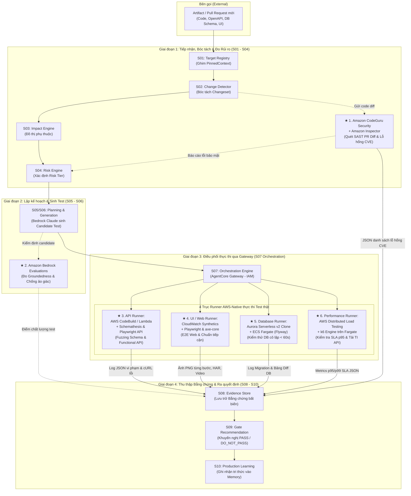

# BÁO CÁO NGHIÊN CỨU TOÀN DIỆN VỀ TOOL, FRAMEWORK KIỂM THỬ VÀ ĐỊNH HƯỚNG TÍCH HỢP CHO HỆ THỐNG TESTING INTELLIGENCE (TI)

---

## MỤC LỤC
1. [PHẦN 1: ĐỊNH NGHĨA TOÀN BỘ 15 NHÓM CÔNG CỤ / FRAMEWORK KIỂM THỬ VÀ GIÁ TRỊ MANG LẠI](#phần-1-định-nghĩa-toàn-bộ-15-nhóm-công-cụ--framework-kiểm-thử-và-giá-trị-mang-lại)
2. [PHẦN 2: LỰA CHỌN TỐI ƯU CHO HỆ THỐNG TI (ƯU TIÊN DỊCH VỤ AWS)](#phần-2-lựa-chọn-tối-ưu-cho-hệ-thống-ti-ưu-tiên-dịch-vụ-aws)
   - [2.1. Tổng quan bối cảnh & nguyên tắc kiến trúc TI](#21-tổng-quan-bối-cảnh--nguyên-tắc-kiến-trúc-ti)
   - [2.2. Sơ đồ luồng công cụ được lựa chọn trong Pipeline TI](#22-sơ-đồ-luồng-công-cụ-được-lựa-chọn-trong-pipeline-ti)
   - [2.3. Chi tiết 6 giải pháp trọng tâm & giá trị mang lại cho TI](#23-chi-tiết-6-giải-pháp-trọng-tâm--giá-trị-mang-lại-cho-ti)
3. [PHẦN 3: BẢNG SO SÁNH CHI TIẾT ƯU - NHƯỢC ĐIỂM, CHI PHÍ VÀ LÝ DO LỰA CHỌN](#phần-3-bảng-so-sánh-chi-tiết-ưu---nhược-điểm-chi-phí-và-lý-do-lựa-chọn)
   - [3.1. So sánh nhóm API Testing](#31-so-sánh-nhóm-api-testing)
   - [3.2. So sánh nhóm UI / Web Testing](#32-so-sánh-nhóm-ui--web-testing)
   - [3.3. So sánh nhóm Database & Ephemeral Integration Testing](#33-so-sánh-nhóm-database--ephemeral-integration-testing)
   - [3.4. So sánh nhóm Performance & Load Testing](#34-so-sánh-nhóm-performance--load-testing)
   - [3.5. So sánh nhóm Security & Code Analysis](#35-so-sánh-nhóm-security--code-analysis)
   - [3.6. So sánh nhóm Đánh giá mô hình AI (Model Evaluation)](#36-so-sánh-nhóm-đánh-giá-mô-hình-ai-model-evaluation)
   - [3.7. Bảng tổng kết ma trận quyết định công nghệ & chi phí cho TI](#37-bảng-tổng-kết-ma-trận-quyết-định-công-nghệ--chi-phí-cho-ti)

---

# PHẦN 1: ĐỊNH NGHĨA TOÀN BỘ 15 NHÓM CÔNG CỤ / FRAMEWORK KIỂM THỬ VÀ GIÁ TRỊ MANG LẠI

---

### 1. API Testing
Kiểm thử tầng giao tiếp giữa các thành phần phần mềm (REST, GraphQL, gRPC, SOAP) nhằm đảm bảo tính đúng đắn của dữ liệu, mã phản hồi HTTP, bảo mật và logic nghiệp vụ mà không cần giao diện người dùng.
* **Postman**: Nền tảng kiểm thử API giao diện đồ họa (GUI) phổ biến nhất thế giới. Cho phép tạo request, tổ chức bộ test (Collections), quản lý môi trường (Environments) và viết kịch bản assert bằng JavaScript.
* **Newman**: Trình thực thi dòng lệnh (CLI) dành riêng cho Postman Collections. Giúp đưa các bộ test Postman vào chạy tự động trong các pipeline CI/CD mà không cần mở giao diện GUI.
* **REST Assured**: Thư viện Java chuyên dụng cho kiểm thử tự động REST API theo phong cách BDD (Given/When/Then). Tích hợp sâu vào hệ sinh thái Java (JUnit/TestNG), hỗ trợ parse và xác thực JSON/XML mạnh mẽ.
* **pytest + requests**: Sự kết hợp giữa framework kiểm thử tiêu chuẩn của Python (`pytest`) và thư viện HTTP client phổ biến nhất (`requests`). Đơn giản, cực kỳ linh hoạt, tận dụng được sức mạnh của fixture và hệ sinh thái thư viện Python đồ sộ.
* **Karate**: Framework mã nguồn mở trên nền Java, kết hợp API testing, API mocks, performance testing và UI testing vào một ngôn ngữ domain-specific (DSL) dạng Gherkin mà không cần viết code Java phức tạp.
* **Playwright API**: Module kiểm thử API tích hợp sẵn trong Playwright (`request.newContext()`). Cho phép gọi HTTP trực tiếp với tốc độ cao, dùng chung phiên đăng nhập/cookie/token với các bài test giao diện Web.
* **k6**: Công cụ kiểm thử hiệu năng và API hiện đại viết bằng Go, kịch bản bằng JavaScript ES6. Hướng tới developer, tiêu tốn cực ít tài nguyên, hỗ trợ chạy đồng thời cả functional API và load API.
* **JMeter (Apache JMeter)**: Công cụ Java kỳ cựu chuyên đo tải và kiểm thử hiệu năng API/Web. Hỗ trợ đa giao thức (HTTP, JDBC, FTP, SOAP, JMS), mạnh về cấu hình kịch bản phức tạp bằng GUI.
* **SoapUI**: Công cụ kiểm thử chuyên sâu cho cả dịch vụ SOAP (dựa trên XML/WSDL) và REST API. Mạnh về kiểm thử tuân thủ chuẩn doanh nghiệp, mock services và kiểm tra bảo mật API cơ bản.

---

### 2. Database Testing
Kiểm tra tính toàn vẹn dữ liệu (Data Integrity), cấu trúc lược đồ (Schema Validation), thủ tục lưu trữ (Stored Procedures), trigger và các kịch bản chuyển đổi cấu trúc (Data Migrations).
* **pytest**: Dùng làm test runner để kết nối vào Database, thực hiện các truy vấn SELECT và assert kết quả trả về bằng Python.
* **SQLAlchemy**: Thư viện ORM và SQL Toolkit mạnh mẽ của Python. Hỗ trợ kết nối, trừu tượng hóa đa cơ sở dữ liệu (PostgreSQL, MySQL, SQLite, Oracle), dùng để chuẩn bị dữ liệu (seed data) và kiểm tra trạng thái bảng.
* **JDBC**: Chuẩn kết nối cơ sở dữ liệu của Java, cho phép code Java gửi các câu lệnh SQL trực tiếp để kiểm tra tính đúng đắn của dữ liệu trong các bài test tự động.
* **DBUnit**: Tiện ích mở rộng của JUnit, giúp đưa cơ sở dữ liệu về một trạng thái định trước (known state) giữa các lần chạy test thông qua các file XML/YAML chứa dữ liệu mẫu.
* **Testcontainers**: Thư viện cho phép khởi tạo các container Docker thật (PostgreSQL, MySQL, Redis, Kafka...) một cách tạm thời ngay trong code test. Giúp kiểm thử trên DB thật thay vì in-memory DB giả lập, và tự hủy container sau khi test xong.
* **Flyway**: Công cụ quản lý migration mã nguồn mở. Được dùng trong kiểm thử để kiểm tra các file script `.sql` migration có thể áp dụng thành công lên một database trắng hay không và có tương thích ngược không.
* **Liquibase**: Tương tự Flyway nhưng hỗ trợ định nghĩa schema bằng XML, YAML, JSON hoặc SQL. Dùng để kiểm thử việc tự động hóa nâng cấp và rollback cấu trúc bảng.
* **Great Expectations**: Framework Python chuyên kiểm thử chất lượng dữ liệu (Data Quality) và profile dữ liệu. Tự động kiểm tra các giả định về dữ liệu (VD: cột A không được null, cột B giá trị nằm trong khoảng [1..100]).
* **dbt tests**: Công cụ kiểm thử dữ liệu tích hợp trong framework dbt (data build tool). Chuyên dùng cho Data Warehouse để test tính duy nhất (unique), không rỗng (not_null), toàn vẹn tham chiếu (relationships) và các quy tắc nghiệp vụ tùy biến.
* **MongoDB Testcontainers**: Module chuyên biệt của Testcontainers dùng để dựng nhanh instance MongoDB Docker phục vụ kiểm thử tích hợp NoSQL.
* **pgTAP**: Bộ công cụ kiểm thử đơn vị (Unit Testing) viết bằng ngôn ngữ PL/pgSQL chạy trực tiếp bên trong PostgreSQL, tuân thủ giao thức TAP (Test Anything Protocol).

---

### 3. UI / Web Testing
Mô phỏng hành vi của người dùng thực trên trình duyệt web (click, gõ phím, cuộn trang, điều hướng) để đảm bảo giao diện và luồng nghiệp vụ hoạt động chính xác trên nhiều trình duyệt.
* **Playwright**: Framework kiểm thử E2E hiện đại nhất hiện nay do Microsoft phát triển. Hỗ trợ Chromium, Firefox, WebKit; chạy siêu nhanh qua Chrome DevTools Protocol (CDP); tự động chờ phần tử (auto-wait); hỗ trợ đa ngôn ngữ (TS, JS, Python, Java, C#).
* **Cypress**: Framework kiểm thử Web chạy trực tiếp bên trong vòng lặp sự kiện (event loop) của trình duyệt. Dễ cài đặt, giao diện debug trực quan theo thời gian thực (Time Travel), rất phổ biến trong cộng đồng frontend React/Vue.
* **Selenium**: Chuẩn kiểm thử tự động trình duyệt lâu đời nhất (W3C WebDriver). Hỗ trợ hầu như mọi trình duyệt, mọi ngôn ngữ lập trình, hệ sinh thái driver và grid đồ sộ nhưng tốc độ chậm hơn và dễ bị lỗi chờ phần tử (flaky).
* **WebdriverIO**: Framework kiểm thử tự động cho Node.js dựa trên chuẩn WebDriver và CDP. Có thể tự động hóa cả ứng dụng Web trên trình duyệt lẫn ứng dụng di động native qua Appium.
* **Puppeteer**: Thư viện Node.js do Google phát triển để điều khiển Chrome/Chromium qua DevTools Protocol. Thường dùng cho web scraping, crawl dữ liệu, render PDF và kiểm thử giao diện Chrome.
* **Robot Framework**: Framework kiểm thử hướng từ khóa (Keyword-driven), cú pháp dạng bảng dễ đọc, phù hợp cho acceptance test và các đội ngũ có manual tester/BA tham gia viết test case.

---

### 4. Mobile Testing
Đảm bảo ứng dụng di động chạy mượt mà, đúng chức năng trên các hệ điều hành (Android, iOS), đa dạng kích thước màn hình và cấu hình phần cứng.
* **Appium**: Chuẩn kiểm thử tự động đa nền tảng (Android, iOS, Windows) mã nguồn mở, hoạt động theo mô hình client-server dựa trên giao thức WebDriver.
* **Maestro**: Framework kiểm thử Mobile E2E thế hệ mới đơn giản, tốc độ cao. Viết kịch bản bằng YAML, tích hợp sẵn cơ chế auto-wait thông minh, khắc phục triệt để độ trễ của Appium.
* **Detox**: Framework kiểm thử "Gray box" E2E dành riêng cho ứng dụng React Native, chạy đồng bộ trực tiếp với luồng JavaScript của React Native.
* **Espresso**: Framework kiểm thử UI native chính thức của Google dành riêng cho Android, tốc độ thực thi cực nhanh do chạy cùng tiến trình (in-process) với ứng dụng.
* **XCTest / XCUITest**: Framework kiểm thử chính thức của Apple dành riêng cho iOS/macOS, can thiệp sâu vào các thành phần UI của hệ điều hành Apple.
* **Firebase Test Lab**: Dịch vụ đám mây của Google, cung cấp thiết bị thật và máy ảo Android/iOS để chạy test tự động (Robo test, Espresso).
* **BrowserStack**: Nền tảng đám mây thương mại hàng đầu cung cấp quyền truy cập vào hơn 3000 thiết bị di động thật và trình duyệt desktop thật.
* **Sauce Labs**: Nền tảng đám mây tương tự BrowserStack, hỗ trợ chạy song song quy mô lớn các bài test Selenium, Appium, Playwright trên đa nền tảng thiết bị.

---

### 5. Performance / Load Testing
Đo lường độ ổn định, tốc độ phản hồi, thông lượng (throughput) và mức tiêu thụ tài nguyên của hệ thống dưới các mức tải khác nhau.
* **Phân loại kiểm thử hiệu năng**:
  * *Load Testing*: Kiểm tra hành vi hệ thống dưới tải dự kiến bình thường.
  * *Stress Testing*: Ép hệ thống vượt quá tải tối đa để tìm điểm gãy (breaking point) và xem cách hệ thống tự hồi phục.
  * *Spike Testing*: Đột ngột tăng vọt lượng người dùng trong thời gian cực ngắn (VD: Flash sale).
  * *Endurance / Soak Testing*: Giữ mức tải ổn định trong thời gian dài (vài giờ đến vài ngày) để phát hiện rò rỉ bộ nhớ (memory leaks).
  * *Volume Testing*: Bơm một lượng dữ liệu khổng lồ vào database để kiểm tra tốc độ xử lý truy vấn.
  * *Scalability Testing*: Kiểm tra khả năng mở rộng quy mô (scale up / scale out) của hạ tầng khi tăng tải.
* **Công cụ**:
  * **k6**: Công cụ kiểm thử tải bằng mã nguồn (code-based), viết kịch bản bằng JS, tiêu tốn ít RAM/CPU nhất, hỗ trợ định nghĩa ngưỡng SLA (Thresholds) trực tiếp trong code để fail CI pipeline.
  * **JMeter**: Đo tải phức tạp với đầy đủ báo cáo HTML, đồ thị thời gian thực, hỗ trợ nhiều giao thức doanh nghiệp.
  * **Locust**: Framework kiểm thử tải viết hoàn toàn bằng Python, cho phép mô phỏng hành vi người dùng dưới dạng các tác vụ hướng đối tượng (User tasks), dễ mở rộng cụm worker phân tán.
  * **Gatling**: Framework đo tải hiệu năng cực cao viết bằng Scala/Java/Kotlin, dựa trên mô hình Akka Actor và Netty (Non-blocking I/O).
  * **Artillery**: Công cụ kiểm thử tải trên nền Node.js, kịch bản viết bằng YAML/JS, hỗ trợ mạnh kiểm thử WebSocket, Socket.io, HTTP và serverless.
  * **wrk / Apache Bench (ab)**: Các tiện ích dòng lệnh C siêu nhẹ dùng để benchmark nhanh thông lượng tối đa (Requests per second - RPS) của một endpoint HTTP.

---

### 6. Contract Testing
Kiểm thử tính tương thích giữa bên cung cấp dịch vụ (Provider) và bên tiêu thụ dịch vụ (Consumer) để đảm bảo hai bên hiểu đúng định dạng dữ liệu (API Contract) mà không cần tích hợp toàn bộ hệ thống lên môi trường thật.
* **Pact**: Framework Consumer-Driven Contract testing hàng đầu thế giới. Consumer viết test sinh ra một file "Pact" (hợp đồng JSON), Provider dùng file này để xác minh xem mình có đáp ứng đúng kỳ vọng của Consumer hay không. Tích hợp ma trận "Can-I-Deploy".
* **Spring Cloud Contract**: Giải pháp Contract testing dành riêng cho hệ sinh thái Spring (Java), tự động sinh ra stub cho client và test case cho server dựa trên file hợp đồng Groovy/YAML.
* **Schemathesis**: Công cụ tự động sinh test dựa trên chuẩn đặc tả OpenAPI / GraphQL. Tự động kiểm tra xem phản hồi thật của server có vi phạm contract đã công bố trong schema hay không.

---

### 7. Security Testing
Phát hiện các lỗ hổng bảo mật, điểm yếu cấu hình, rò rỉ khóa bí mật và mã độc trong suốt vòng đời phát triển phần mềm.
* **Phân loại lớp bảo mật**:
  * *SAST (Static Application Security Testing)*: Phân tích mã nguồn tĩnh để tìm lỗi logic bảo mật.
  * *Dependency / SCA (Software Composition Analysis)*: Quét các thư viện mã nguồn mở bên thứ ba để tìm mã định danh lỗ hổng đã biết (CVE).
  * *Container / IaC Scan*: Quét Dockerfile, tệp Terraform/CloudFormation để tìm cấu hình sai (misconfigurations).
  * *DAST (Dynamic Application Security Testing)*: Quét ứng dụng đang chạy từ bên ngoài thông qua tấn công giả lập.
  * *API Security*: Kiểm tra lỗi phân quyền (BOLA/IDOR), rate limiting, rò rỉ dữ liệu nhạy cảm.
* **Công cụ**:
  * **Semgrep**: Bộ quét mã nguồn tĩnh (SAST) cực nhanh, cho phép tự viết rule bảo mật bằng cú pháp giống hệt code thông thường.
  * **Trivy**: Bộ quét bảo mật đa năng và toàn diện nhất cho Container, Kubernetes, Repository mã nguồn, tệp phụ thuộc và cấu hình IaC.
  * **SonarQube**: Nền tảng quản lý chất lượng mã nguồn và bảo mật tĩnh tập trung (Security Hotspots, Code Smells, Bugs).
  * **OWASP ZAP**: Công cụ quét lỗ hổng ứng dụng web động (DAST) mã nguồn mở miễn phí phổ biến nhất thế giới.
  * **Burp Suite**: Nền tảng pentest ứng dụng web và API chuyên nghiệp, tiêu chuẩn vàng của các chuyên gia an ninh mạng.
  * **Nuclei**: Trình quét lỗ hổng dựa trên template YAML do cộng đồng đóng góp, tốc độ quét cực nhanh và độ tùy biến cao.
  * **Nikto**: Trình quét máy chủ web kỳ cựu, phát hiện các file tĩnh nguy hiểm, phiên bản máy chủ lỗi thời và lỗi cấu hình web server.

---

### 8. Unit Testing
Kiểm thử ở mức độ nhỏ nhất của mã nguồn (hàm, phương thức, class) một cách cô lập, tách rời hoàn toàn khỏi các phụ thuộc bên ngoài bằng cách sử dụng Mock/Stub.
* **Java: JUnit 5 + Mockito**: Chuẩn mực vàng cho lập trình Java. JUnit 5 cung cấp kiến trúc module hóa hiện đại; Mockito hỗ trợ giả lập đối tượng (mocking) và xác minh tương tác.
* **Python: pytest + unittest.mock**: `pytest` cung cấp cú pháp assert ngắn gọn và fixture mạnh mẽ; `unittest.mock` giúp patch các object, database và API call.
* **JavaScript / TypeScript: Jest / Vitest**: `Jest` là chuẩn lâu năm với đầy đủ runner, assertion, mock có sẵn; `Vitest` là thế hệ mới chạy cực nhanh dựa trên Vite (ESM native).
* **React: Vitest / Jest + React Testing Library (RTL)**: RTL khuyến khích kiểm thử component dưới góc nhìn của người dùng (dựa trên DOM text/role) thay vì can thiệp vào state nội bộ.
* **.NET: xUnit / NUnit / MSTest**: Các framework tiêu chuẩn cho C#/.NET; xUnit được ưa chuộng nhất nhờ thiết kế sạch và khả năng chạy song song.
* **PHP: PHPUnit / Pest**: `PHPUnit` là nền tảng cốt lõi; `Pest` mang phong cách viết test thanh lịch, tối giản tương tự Jest.
* **Go: testing + testify**: Go tích hợp sẵn package `testing`; thư viện `testify` bổ sung các hàm assert/require tiện dụng và mocking suite.

---

### 9. Component Testing
Kiểm thử các thành phần giao diện (UI Components) một cách độc lập trong một môi trường trình duyệt ảo hoặc thật mà không cần khởi động toàn bộ ứng dụng backend.
* **React Testing Library / Vue Test Utils**: Mount component vào môi trường DOM ảo (JSDOM) để tương tác và kiểm tra logic hiển thị.
* **Cypress Component Testing / Playwright Component Testing**: Khởi tạo và mount trực tiếp component lên trình duyệt thật (Chromium/Firefox) để kiểm tra giao diện, CSS và tương tác thật với tốc độ của unit test.
* **Storybook**: Môi trường phát triển và kiểm thử giao diện trực quan độc lập. Cho phép cô lập từng trạng thái (state/story) của component để review thiết kế và chạy test tự động.

---

### 10. Visual Regression Testing
Bắt lỗi sai lệch giao diện (UI layout shifts, vỡ font chữ, lệch màu sắc, sai CSS) bằng cách chụp ảnh màn hình và so sánh từng pixel giữa bản hiện tại với bản chuẩn (baseline snapshot).
* **Playwright Screenshots**: Tính năng tích hợp sẵn của Playwright (`toHaveScreenshot()`), tự động chụp ảnh và so sánh sai lệch pixel, có khả năng bỏ qua các vùng động (masking).
* **Percy (by BrowserStack)**: Dịch vụ đám mây tự động chụp DOM snapshot, render trên nhiều trình duyệt/độ phân giải và hiển thị bảng điều khiển trực quan để người dùng duyệt các thay đổi giao diện.
* **Applitools**: Nền tảng kiểm thử giao diện hàng đầu sử dụng AI (Visual AI) để nhận diện khác biệt như mắt người, tự động bỏ qua những pixel lệch nhỏ không đáng kể.
* **Chromatic**: Nền tảng chuyên biệt dành cho Storybook, tự động chụp và so sánh visual diff cho từng component mỗi khi có commit mới.
* **BackstopJS**: Công cụ mã nguồn mở tự host, sử dụng Puppeteer hoặc Playwright để chụp và so sánh ảnh giao diện cục bộ.

---

### 11. Accessibility Testing (a11y)
Đảm bảo ứng dụng đáp ứng các tiêu chuẩn tiếp cận cho người khuyết tật (khiếm thị, mù màu, liệt vận động) theo tiêu chuẩn quốc tế WCAG (Web Content Accessibility Guidelines) và chuẩn ARIA.
* **axe-core**: Công cụ kiểm tra độ tiếp cận mã nguồn mở mạnh mẽ nhất thế giới của Deque Systems. Là lõi cho hầu hết các công cụ a11y khác, đảm bảo tỷ lệ báo sai (false positive) bằng 0.
* **axe DevTools**: Tiện ích mở rộng trên trình duyệt cho phép lập trình viên quét và phân tích chi tiết các lỗi tiếp cận trên trang web hiện hành.
* **Lighthouse**: Công cụ phân tích web tự động của Google tích hợp sẵn trong Chrome DevTools, cung cấp điểm số Accessibility kèm theo đề xuất sửa đổi.
* **Pa11y**: Công cụ dòng lệnh (CLI) chạy tự động để quét danh sách các URL và xuất báo cáo vi phạm WCAG, dễ dàng gắn vào CI/CD.
* **WAVE**: Công cụ đánh giá trực quan trên trình duyệt của WebAIM, gắn trực tiếp các biểu tượng lỗi lên màn hình để dễ dàng phát hiện vùng thiếu tương phản hoặc thiếu thẻ alt.

---

### 12. API Schema / Fuzz / Property-based Testing
Phương pháp kiểm thử không sử dụng dữ liệu cố định (hardcoded data) mà sử dụng thuật toán để tự động sinh ra hàng nghìn trường hợp dữ liệu biên, dữ liệu ngẫu nhiên, dữ liệu dị biệt nhằm tìm ra các trường hợp ngoại lệ làm sập hệ thống.
* **Schemathesis**: Công cụ hàng đầu cho API. Nó đọc file tài liệu OpenAPI/Swagger, hiểu các ràng buộc kiểu dữ liệu, rồi tự động sinh ra hàng loạt request bất thường (fuzzing) để phát hiện vi phạm schema, rò rỉ dữ liệu hoặc lỗi HTTP 500.
* **Hypothesis**: Thư viện Property-based testing hàng đầu cho Python. Bạn định nghĩa "thuộc tính", Hypothesis sẽ tự động sinh dữ liệu để phản bác thuộc tính đó và thu nhỏ (shrink) mẫu dữ liệu lỗi về dạng đơn giản nhất.
* **jqwik**: Thư viện Property-based testing dành riêng cho Java / JUnit 5.
* **fast-check**: Thư viện Property-based testing dành cho JavaScript / TypeScript.

---

### 13. Distributed / Integration Testing
Kiểm thử sự phối hợp giữa nhiều dịch vụ vi mô (microservices) và các thành phần phụ thuộc của hạ tầng phân tán (Message Queue, Cache, Database, Third-party APIs).
* **Testcontainers**: Chuẩn mực vàng cho kiểm thử tích hợp. Khởi tạo toàn bộ các dependency dạng container Docker trong suốt quá trình test.
* **WireMock**: Máy chủ giả lập HTTP độc lập, cho phép định nghĩa các phản hồi linh hoạt để test các service gọi sang nhau mà không cần kết nối tới service thật.
* **MockServer**: Công cụ giả lập HTTP/HTTPS viết bằng Java, hỗ trợ ghi lại request (record) và phát lại (replay) để kiểm thử tích hợp.
* **Hoverfly**: Công cụ service virtualization viết bằng Go, có khả năng bắt gói tin mạng và mô phỏng độ trễ (latency) hoặc lỗi kết nối.
* **LocalStack**: Bản giả lập đầy đủ của các dịch vụ đám mây AWS (S3, SQS, SNS, DynamoDB, Lambda) chạy cục bộ bằng Docker, giúp test ứng dụng cloud-native mà không tốn chi phí AWS thật.

---

### 14. Mock / Stub
Kỹ thuật thay thế các thành phần phụ thuộc phức tạp, chậm chạp hoặc khó đoán định bằng các đối tượng giả lập nhằm mục đích cô lập vùng code cần kiểm thử.
* **WireMock / MockServer**: Dùng để mock các REST API bên ngoài thông qua mạng HTTP thật.
* **MSW (Mock Service Worker)**: Giải pháp mock API tuyệt vời cho JS/TS bằng cách can thiệp vào tầng network thông qua Service Worker, code ứng dụng không hề biết là đang gọi mock.
* **Mockito / unittest.mock**: Thư viện mock code nội bộ (In-memory) trong Java và Python.
* **Sinon.js / Nock**: Thư viện gián điệp (spies), giả lập (stubs) và mock HTTP call chuyên dụng cho hệ sinh thái Node.js.

---

### 15. CI/CD & Test Reporting
Hạ tầng điều phối việc chạy tự động các bài test mỗi khi có thay đổi mã nguồn, đồng thời trực quan hóa kết quả kiểm thử để hỗ trợ ra quyết định phát hành.
* **CI/CD Engines (GitHub Actions, GitLab CI, Jenkins, Azure DevOps)**: Tự động hóa quy trình Build $\rightarrow$ Test $\rightarrow$ Security Scan $\rightarrow$ Deploy theo pipeline định nghĩa bằng mã (YAML).
* **Allure Report**: Framework tạo báo cáo kiểm thử đa ngôn ngữ đẹp mắt, cung cấp biểu đồ lịch sử chạy, phân loại lỗi (Product defect / Test defect) và đính kèm ảnh/video.
* **ReportPortal**: Nền tảng quản lý báo cáo test tập trung sử dụng AI để tự động phân tích nguyên nhân lỗi test case trong các đợt chạy quy mô lớn.
* **JUnit XML / HTML Reports**: Các định dạng file báo cáo tiêu chuẩn để các hệ thống CI/CD đọc và hiển thị tỷ lệ test pass/fail.

---

# PHẦN 2: LỰA CHỌN TỐI ƯU CHO HỆ THỐNG TI (ƯU TIÊN DỊCH VỤ AWS)

---

### 2.1. Tổng quan bối cảnh & nguyên tắc kiến trúc TI

1. **Bối cảnh phân vùng hệ thống TI:**
   * **Account 1 (ap-southeast-1 - Backend TI):** CloudFront, TI API (:8000), Web Portal (:8001), SQLite lưu trạng thái & EBS gp3.
   * **Account 2 (us-east-1 - AgentCore & AI):** AgentCore Harness (TIJobRunner), Bedrock Model (Claude Opus / 3.5), AgentCore Gateway (MCP / AWS IAM), AgentCore Memory.
2. **Quy tắc lựa chọn công nghệ:**
   * **Ưu tiên dịch vụ AWS Managed & Serverless:** Giảm chi phí vận hành máy ảo EC2, tự động co giãn theo lượt chạy, tận dụng phân quyền AWS IAM.
   * **Đầu ra bắt buộc là Bằng chứng (Evidence-driven):** Mọi công cụ khi chạy phải xuất ra được bằng chứng máy đọc được (JSON structured evidence, traces, logs) để lưu vào **S08 Evidence Store**.
   * **Phạm vi tinh gọn:** Tập trung vào các trục kiểm thử cốt lõi cho Artifact doanh nghiệp (**API Functional & Fuzzing, UI/Web E2E, Database, Performance, Security, Model Quality**). *Không đề cập tới Kiểm thử Di động, Lưu trữ hạ tầng thuần túy, Contract Testing và Visual Regression Testing*.

---

### 2.2. Sơ đồ luồng công cụ được lựa chọn trong Pipeline TI

Sơ đồ dưới đây mô tả chính xác cách **6 dịch vụ AWS & công cụ kiểm thử được chọn** cắm trực tiếp vào chuỗi xử lý **S01 – S10** của TI (nằm giữa 2 tài khoản AWS: Backend TI ở `ap-southeast-1` và AgentCore ở `us-east-1`):

#### Bảng ánh xạ vị trí công cụ trong Pipeline TI:

| Chặng Pipeline TI | Công cụ / Dịch vụ AWS tích hợp | Cơ chế hoạt động trong Pipeline | Bằng chứng đẩy về S08 Evidence Store |
| :--- | :--- | :--- | :--- |
| **S02 $\rightarrow$ S04** *(Rủi ro)* | **Amazon CodeGuru Security + Amazon Inspector** | Tự động quét code diff của PR tìm lỗi OWASP/SQLi và quét tệp package tìm mã CVE. | File JSON thống kê danh sách lỗ hổng bảo mật, cung cấp số liệu cho `Risk Tier`. |
| **S05 / S06** *(Sinh test)* | **Amazon Bedrock Evaluations** (`TIRunnerGroundness`) | Chấm điểm các test case do AI sinh ra, đảm bảo bám sát artifact và không bịa đặt API. | Điểm số `GroundednessScore` & `GoalSuccessRate` (từ 0.0 đến 1.0). |
| **S07** *(API Testing)* | **AWS CodeBuild / Lambda + Schemathesis & Playwright API** | Fuzzing tự động hàng nghìn request từ file OpenAPI và chạy kịch bản chức năng tích hợp. | File JSON vi phạm schema, mã lỗi HTTP 500 kèm cURL command tái hiện lỗi. |
| **S07** *(UI/Web Testing)* | **Amazon CloudWatch Synthetics + Playwright & axe-core** | Chạy kịch bản E2E kiểm tra luồng người dùng trên trình duyệt không máy chủ; quét WCAG a11y. | Ảnh chụp màn hình hoàn thành từng bước, Video lượt chạy, file HAR network và log Console. |
| **S07** *(DB Testing)* | **Amazon Aurora Serverless v2 Clone + ECS Fargate** | Nhân bản DB staging bằng Copy-on-write trong < 60s, chạy migration script trên bản clone rồi xóa. | Log thực thi migration Flyway, bảng diff dữ liệu trước và sau khi test. |
| **S07** *(Tải & Hiệu năng)* | **AWS Distributed Load Testing + k6 Engine** | Tạo tải phân tán từ Fargate kiểm tra độ trễ SLA của PR và stress-test chính TI API (:8000). | File JSON thống kê phân vị độ trễ (p95, p99), biểu đồ Throughput RPS và tỷ lệ lỗi. |

---

### 2.3. Chi tiết 6 giải pháp trọng tâm & giá trị mang lại cho TI

#### 1. API Testing: AWS CodeBuild / Lambda + Schemathesis & Playwright API
* **Dịch vụ AWS:** **AWS CodeBuild** (cho job fuzzing diện rộng) hoặc **AWS Lambda** (cho kịch bản kiểm tra chức năng nhanh), điều phối qua **AgentCore Gateway**.
* **Công cụ kết hợp:** **Schemathesis** (tự động fuzzing từ file OpenAPI) và **Playwright API Client** (chạy kịch bản chức năng chuỗi request).
* **Giải quyết bài toán của TI:**
  * Hiện tại TI chỉ có adapter HTTP đơn giản, không tự động sinh được test cho các thay đổi schema.
  * Schemathesis đọc OpenAPI schema từ artifact, tự động sinh hàng nghìn payload biên (null, boundary, sai kiểu dữ liệu) bắn vào API thật để tìm lỗi HTTP 500 hoặc rò rỉ dữ liệu.
* **Evidence sinh ra cho S08:** File JSON chứa mã lỗi HTTP, payload gây crash và cURL command tái hiện lỗi.

#### 2. UI / Web Testing: Amazon CloudWatch Synthetics + Playwright
* **Dịch vụ AWS:** **Amazon CloudWatch Synthetics (Canaries)** kết hợp lưu trữ **Amazon S3**.
* **Công cụ kết hợp:** **Playwright** (Node.js runtime) và bộ kiểm tra trợ năng **axe-core**.
* **Giải quyết bài toán của TI:**
  * Thay thế việc tự duy trì trình duyệt Chromium nặng nề trên EC2 (:8000). CloudWatch Synthetics chạy Playwright serverless hoàn toàn.
  * Tự động chạy các kịch bản kiểm thử luồng người dùng E2E (đăng nhập, đặt hàng, tương tác form), bắt lỗi runtime JS trên console.
  * Tích hợp **axe-core** tự động bắt lỗi vi phạm chuẩn tiếp cận (Accessibility WCAG).
* **Evidence sinh ra cho S08:** Ảnh chụp màn hình hoàn thành từng bước, file HAR network ghi nhận request/response, video lượt chạy và log Console.

#### 3. Security & Static Risk Analysis: Amazon CodeGuru Security + Amazon Inspector
* **Dịch vụ AWS:** **Amazon CodeGuru Security** và **Amazon Inspector**.
* **Giải quyết bài toán của TI:**
  * Chặng **S04 (Risk Engine)** của TI hiện đang dựa vào LLM (Claude) đọc diff code để đoán rủi ro `RegressionRisk` ([TI API.pdf - trang 24](file:///c:/Users/LENOVO/TI/TI%20API.pdf)), rất dễ bị ảo giác hoặc bỏ sót.
  * CodeGuru Security phân tích trực tiếp PR diff bằng Machine Learning của AWS để tìm lỗ hổng bảo mật (OWASP Top 10, SQL Injection, hardcoded secrets). Inspector quét tệp phụ thuộc tìm mã lỗ hổng CVE đã công bố.
* **Evidence sinh ra cho S08:** Báo cáo định lượng danh sách lỗ hổng bảo mật dạng JSON. Giúp S04 tự động nâng hạng **`Risk Tier: CRITICAL`** chính xác 100%.

#### 4. Database & Integration Testing: Amazon Aurora Serverless v2 Cloning + AWS ECS Fargate
* **Dịch vụ AWS:** **Amazon Aurora Serverless v2** (tính năng **Database Cloning**) và **AWS ECS Fargate**.
* **Công cụ kết hợp:** **Flyway** (chạy migration) và **Great Expectations** (xác thực dữ liệu).
* **Giải quyết bài toán của TI:**
  * Giải quyết cảnh báo trong [FAQ.pdf (trang 3)](file:///c:/Users/LENOVO/TI/FAQ.pdf): *"Hành vi ứng dụng khi chạy cần kiểm thử runtime trên môi trường phù hợp"*. Không thể cho AI chạy bừa bãi trên DB thật.
  * Tính năng Aurora Cloning nhân bản database hàng trăm GB từ môi trường Staging trong **dưới 60 giây** nhờ cơ chế *Copy-on-write*, chi phí ban đầu gần như bằng 0.
  * Fargate task chạy migration script của PR lên bản clone này, kiểm tra dữ liệu, sau đó hủy bản clone.
* **Evidence sinh ra cho S08:** Log áp dụng migration và báo cáo diff dữ liệu trước/sau khi chạy.

#### 5. Performance & Load Testing: AWS Distributed Load Testing (DLT) + k6 Engine
* **Dịch vụ AWS:** **AWS Distributed Load Testing Solution** (chạy trên cụm **AWS Fargate**).
* **Công cụ kết hợp:** **k6 Engine** (viết kịch bản bằng JS).
* **Giải quyết bài toán của TI:**
  * Kiểm tra xem PR mới có làm tụt giảm hiệu năng hệ thống (Performance Regression) hay không.
  * Đồng thời làm công cụ kiểm thử tải định kỳ cho chính **TI API (:8000)** để đảm bảo TI không bị nghẽn (lỗi 503 `submission_busy`) khi có hàng trăm lượt submit artifact cùng lúc.
* **Evidence sinh ra cho S08:** File JSON thống kê phân vị độ trễ (p95, p99), biểu đồ throughput (RPS), tỷ lệ lỗi dưới áp lực tải.

#### 6. Đánh giá chất lượng mô hình AI: Amazon Bedrock Evaluations
* **Dịch vụ AWS:** **Amazon Bedrock Evaluations** (triển khai cho `TIRunnerGroundness` tại [TI API.pdf - trang 19 & 25](file:///c:/Users/LENOVO/TI/TI%20API.pdf)).
* **Giải quyết bài toán của TI:**
  * Giám sát chính con AI Claude Bedrock đang chạy trong **TIJobRunner**. Đảm bảo các test case do AI sinh ra ở chặng S05/S06 là có căn cứ (*Grounded*), bám sát nội dung artifact, không bịa đặt API bừa bãi.
* **Evidence sinh ra cho S08:** Điểm số đánh giá chất lượng AI (`GoalSuccessRate`, `GroundednessScore` từ 0.0 đến 1.0) đính kèm mỗi lượt chạy.

---

# PHẦN 3: BẢNG SO SÁNH CHI TIẾT ƯU - NHƯỢC ĐIỂM, CHI PHÍ VÀ LÝ DO LỰA CHỌN

> **Ghi chú định dạng:** Toàn bộ các bảng dưới đây được trình bày chuẩn: **Tiêu chí đánh giá nằm ở hàng ngang (các cột)** và **Các công cụ / dịch vụ so sánh nằm ở hàng dọc (các dòng)**, bổ sung cột **Chi phí** chi tiết.

---

### 3.1. So sánh nhóm API Testing

| Dịch vụ / Công cụ | Bản chất & Kiến trúc | Cơ chế tạo & Chạy test | Ưu điểm nổi bật | Nhược điểm / Hạn chế | Chi phí (Pricing Model) | Đánh giá & Lý do chọn cho TI |
| :--- | :--- | :--- | :--- | :--- | :--- | :--- |
| **Postman / Newman** | GUI App + Node.js CLI runner cho Collection tĩnh. | Manual: Con người phải viết sẵn request và script assert bằng JS. | Thân thiện, phổ biến nhất thế giới, dễ chia sẻ collection giữa các thành viên. | Khó kiểm thử dữ liệu ngẫu nhiên quy mô lớn; tốn công bảo trì kịch bản khi API thay đổi. | Free bản cơ sở; Team/Enterprise: **\$15 - \$49/user/tháng**. | **Không chọn**: TI cần tự động hóa đánh giá PR mà không phụ thuộc vào việc con người phải viết sẵn test case. |
| **REST Assured** | Thư viện Java chuyên dụng cho REST API Automation. | Code-based: Viết code Java theo cú pháp BDD (Given/When/Then). | Rất mạnh mẽ, chuẩn mực cho các dự án Java enterprise, kiểm tra JSON/XML tốt. | Ràng buộc vào JVM, nặng nề, không phù hợp cho AI Agent tự sinh kịch bản linh hoạt. | **Mã nguồn mở miễn phí 100%** (Chỉ tốn phí máy chủ CI chạy job). | **Không chọn**: Runtime của TI ưu tiên Python / Node.js; REST Assured quá cồng kềnh cho micro-runners. |
| **Playwright API** | HTTP client tích hợp sẵn trong Playwright runner. | Code-based: Viết script TypeScript/Python gọi endpoint trực tiếp. | Tốc độ cực nhanh, dùng chung ngữ cảnh (cookie, token) với UI test; cú pháp gọn. | Cần phải viết trước kịch bản logic; không tự động tìm ra các trường hợp biên dị biệt. | **Mã nguồn mở miễn phí 100%** (Chỉ tốn phí tài nguyên thực thi). | **Chọn làm phụ trợ**: Dùng cho các luồng test tích hợp chuỗi API chức năng có sẵn kịch bản. |
| **LỰA CHỌN TI: AWS CodeBuild + Schemathesis** | Fuzzing engine dựa trên OpenAPI Schema chạy trên AWS Serverless Container. | **Tự động 100%**: Đọc OpenAPI schema từ PR, tự sinh hàng nghìn input dị biệt (fuzzing). | • Tìm ra các lỗi HTTP 500 mà con người không nghĩ ra. • Không cần bảo trì test khi API đổi. • Tự co giãn theo tải. | Yêu cầu tài liệu API (OpenAPI/Swagger) phải chuẩn hóa để công cụ phân tích đúng. | • Schemathesis: **Miễn phí**. • CodeBuild: **\$0.005 / phút build** (100 phút đầu miễn phí/tháng). | **LỰA CHỌN TRỌNG TÂM API:** Tự động kiểm tra tính toàn vẹn của mọi PR sửa đổi API chỉ bằng cách nạp schema, chi phí siêu rẻ. |

---

### 3.2. So sánh nhóm UI / Web Testing

| Dịch vụ / Công cụ | Bản chất & Kiến trúc | Cơ chế vận hành & Automation | Ưu điểm nổi bật | Nhược điểm / Hạn chế | Chi phí (Pricing Model) | Đánh giá & Lý do chọn cho TI |
| :--- | :--- | :--- | :--- | :--- | :--- | :--- |
| **Selenium WebDriver** | Chuẩn W3C WebDriver cổ điển, mô hình Client-Server. | Code-based; điều khiển trình duyệt qua driver trung gian. | Hỗ trợ hầu hết trình duyệt và ngôn ngữ lập trình, hệ sinh thái đồ sộ lâu đời. | Tốc độ chậm, dễ bị lỗi chờ phần tử (flaky), tốn nhiều công dựng cụm Selenium Grid. | **Mã nguồn mở miễn phí**; nhưng tốn chi phí vận hành cụm Grid rất lớn. | **Không chọn**: Quá chậm chạp và cồng kềnh đối với pipeline đánh giá PR tức thời của TI. |
| **Cypress** | Chạy trực tiếp bên trong event loop của trình duyệt. | Code-based; chạy trong tab trình duyệt duy nhất. | Debug trực quan (Time Travel), dễ viết cho frontend React/Vue, tự động chờ tốt. | Hạn chế chạy đa tab, không điều khiển được nhiều trình duyệt cùng lúc, nặng tài nguyên. | Free bản local; Cloud quản lý: **\$75 - \$300+/tháng**. | **Không chọn**: Khó tích hợp headless sâu vào kiến trúc máy chủ AWS và hạn chế đa tab. |
| **Playwright tự host trên EC2 (Hiện trạng TI)** | Playwright điều khiển Chromium qua CDP chạy trên máy ảo EC2. | Chạy script Playwright trực tiếp trên máy chủ backend của TI. | Tốc độ cao, hỗ trợ đa tab, đa ngữ cảnh, bắt sự kiện mạng cực kỳ chính xác. | Đang làm nặng máy chủ EC2 backend (:8000), tốn công bảo trì Chromium và update driver. | Phải trả tiền duy trì máy ảo EC2 24/7 (VD: t3.large **~\$60/tháng** dù không chạy test). | **Không tối ưu**: Gây nghẽn tài nguyên trên máy chủ API của TI khi có nhiều PR cùng chạy. |
| **LỰA CHỌN TI: CloudWatch Synthetics + Playwright** | Playwright managed hoàn toàn trên hạ tầng Serverless của AWS. | Serverless Playwright Canary; tự động chạy kịch bản E2E và ghi nhận lỗi. | • Không cần bảo trì máy ảo trình duyệt. • Tự động quay video, chụp ảnh từng bước. • Quét chuẩn tiếp cận (axe-core). | Bị giới hạn thời gian chạy tối đa 15 phút cho mỗi lượt canary (đủ cho test PR). | **\$0.0012 đến \$0.0016 / lượt chạy Canary** (100 lượt miễn phí mỗi tháng). | **LỰA CHỌN TỐI ƯU UI:** Giải phóng máy chủ EC2, kiểm tra E2E tự động không máy chủ, chi phí chỉ trả theo số lần chạy. |

---

### 3.3. So sánh nhóm Database & Ephemeral Integration Testing

| Dịch vụ / Công cụ | Bản chất & Kiến trúc | Môi trường DB & Cơ chế test | Ưu điểm nổi bật | Nhược điểm / Hạn chế | Chi phí (Pricing Model) | Đánh giá & Lý do chọn cho TI |
| :--- | :--- | :--- | :--- | :--- | :--- | :--- |
| **DBUnit** | Tiện ích mở rộng của JUnit dùng in-memory database. | Database giả lập (H2, SQLite in-memory) nạp dữ liệu mẫu từ file XML. | Khởi tạo siêu nhanh trong vài giây, không cần cài đặt phần mềm bên ngoài. | Không phản ánh đúng hành vi, cú pháp riêng và trigger của PostgreSQL/MySQL thật. | **Mã nguồn mở miễn phí 100%**. | **Không chọn**: Vi phạm nguyên tắc "Bằng chứng đáng tin cậy" của TI vì chỉ chạy trên môi trường giả lập. |
| **Testcontainers chạy trên EC2** | Dựng Docker container thật ngay trong code test trên máy ảo. | Khởi tạo container PostgreSQL/MySQL thật từ image Docker trên EC2. | Chạy trên database thật 100%, tự động hủy container sau khi bài test kết thúc. | Làm quá tải máy ảo EC2 backend do Docker daemon chiếm nhiều RAM/CPU; khó nạp dữ liệu lớn. | Miễn phí phần mềm; nhưng phải nâng cấp cấu hình EC2 (tăng **\$30 - \$80/tháng** tiền máy ảo). | **Không chọn làm lõi**: Tốt cho máy cá nhân của lập trình viên, nhưng làm nặng máy chủ API tập trung của TI. |
| **LỰA CHỌN TI: Aurora Serverless v2 Clone + ECS Fargate** | Database Cloning trên nền tảng AWS Aurora kết hợp task Fargate. | Nhân bản DB thật bằng công nghệ **Copy-on-write**; Fargate chạy Flyway migration. | • Nhân bản DB hàng trăm GB trong **< 60 giây**. • Chạy thử nghiệm trên dữ liệu thật an toàn 100%. • Không ảnh hưởng DB staging. | Cần kiến trúc DB gốc đang sử dụng Amazon Aurora (PostgreSQL/MySQL). | • Clone: **\$0** dung lượng ban đầu. • Aurora ACU: **~\$0.12/ACU-giờ** (chạy vài phút rồi xóa). • Fargate: **~\$0.04/giờ**. | **LỰA CHỌN ĐỘT PHÁ:** Giúp TI tự tin kiểm thử các script migration nguy hiểm trước khi cho phép merge PR mà không sợ hỏng dữ liệu. |

---

### 3.4. So sánh nhóm Performance & Load Testing

| Dịch vụ / Công cụ | Bản chất & Kiến trúc | Kịch bản & Cơ chế phân tán | Ưu điểm nổi bật | Nhược điểm / Hạn chế | Chi phí (Pricing Model) | Đánh giá & Lý do chọn cho TI |
| :--- | :--- | :--- | :--- | :--- | :--- | :--- |
| **Apache JMeter** | Ứng dụng Java Desktop kỳ cựu chuyên đo tải truyền thống. | Cấu hình kịch bản qua giao diện đồ họa GUI / XML phức tạp. | Hỗ trợ hầu như mọi giao thức (HTTP, JDBC, SOAP, LDAP), nhiều plugin báo cáo. | Tiêu tốn cực kỳ nhiều RAM/CPU (chạy trên JVM); cấu hình cụm phân tán rất phức tạp. | **Mã nguồn mở miễn phí**; nhưng tốn chi phí máy chủ lớn nếu chạy tải cao. | **Không chọn**: Quá nặng nề, khó tích hợp tự động vào pipeline CI/CD hiện đại của TI. |
| **Locust** | Framework đo tải bằng code viết hoàn toàn bằng Python. | Viết kịch bản bằng code Python hướng đối tượng (User tasks). | Dễ viết cho Python developer, giao diện web theo dõi thời gian thực rất đẹp. | Bị nghẽn bởi Python GIL (Global Interpreter Lock), cần nhiều máy worker để tạo tải lớn. | **Mã nguồn mở miễn phí 100%**. | **Không chọn**: Tốn công quản lý và bảo trì cụm máy chủ worker khi cần test tải đột biến. |
| **k6 Standalone (Chạy trên máy ảo)** | Công cụ đo tải hiện đại viết bằng Go, tối ưu bộ nhớ. | Kịch bản viết bằng JavaScript ES6, định nghĩa SLA threshold trong code. | **Cực nhẹ**, thông lượng cao gấp 5-10 lần JMeter trên cùng một cấu hình máy; CI-friendly. | Muốn phân tán nhiều vùng địa lý (multi-region) phải tự viết script điều phối phức tạp. | Free bản local; k6 Cloud thương mại: **\$300 - \$1000+/tháng**. | **Chọn làm công cụ cốt lõi**, nhưng cần một nền tảng điều phối hạ tầng phân tán đi kèm. |
| **LỰA CHỌN TI: AWS Distributed Load Testing (DLT) + k6** | Giải pháp phân tán chính hãng AWS dựng trên nền AWS Fargate. | Kịch bản k6 chạy phân tán trên hàng chục container Fargate không máy chủ. | • Bơm tải hàng trăm nghìn request/giây từ nhiều Region. • Đo tải PR & stress-test chính TI API. • Tích hợp CloudWatch. | Phải mất 1-2 phút để AWS khởi tạo các task Fargate trước khi bài test bắt đầu. | Trả tiền theo thời gian chạy Fargate thực tế (khoảng **\$0.05 - \$0.20 cho mỗi đợt test 5 phút**). | **LỰA CHỌN TOÀN DIỆN HIỆU NĂNG:** Kết hợp hoàn hảo độ nhẹ của k6 với sức mạnh co giãn hạ tầng vô hạn của AWS Fargate. |

---

### 3.5. So sánh nhóm Security & Code Analysis

| Dịch vụ / Công cụ | Bản chất & Cơ chế quét | Thời điểm thực thi & Tích hợp | Ưu điểm nổi bật | Nhược điểm / Hạn chế | Chi phí (Pricing Model) | Đánh giá & Lý do chọn cho TI |
| :--- | :--- | :--- | :--- | :--- | :--- | :--- |
| **SonarQube** | Nền tảng phân tích mã nguồn tĩnh (SAST) truyền thống. | Thường quét toàn bộ kho mã nguồn định kỳ hoặc sau khi merge code. | Quản lý chất lượng mã tập trung, tính toán nợ kỹ thuật (Technical Debt) trực quan. | Chậm, sinh nhiều cảnh báo rác (false positives); phải tự duy trì server SonarQube riêng. | Community: Free; Developer/Enterprise: **\$150 - \$1,000+/tháng**. | **Không chọn**: Quá cồng kềnh, không phù hợp cho việc phân tích nhanh gọn theo từng PR của TI. |
| **OWASP ZAP** | Trình quét lỗ hổng ứng dụng web động (DAST) ngoài mạng. | Bắn request tấn công thử nghiệm từ bên ngoài vào web đang chạy. | Phát hiện tốt các lỗi runtime (SQLi, XSS, sai cấu hình header, cookie bảo mật). | Chỉ quét được tầng ngoài khi app đã deploy; không chỉ ra được dòng code cụ thể bị lỗi. | **Mã nguồn mở miễn phí 100%**. | **Không chọn làm lõi**: Không giải quyết được bài toán phân tích rủi ro trực tiếp từ artifact mã nguồn. |
| **Semgrep (CLI độc lập)** | Bộ phân tích cú pháp mã nguồn tĩnh (SAST) thế hệ mới. | Quét trực tiếp trên tệp mã nguồn hoặc git diff trong vài giây. | Cực nhanh, dễ viết rule riêng theo chuẩn doanh nghiệp; ít báo động giả. | Không tự động phân tích sâu được luồng dữ liệu phức tạp (data flow) xuyên tệp. | Community: Free; Team: **\$25/dev/tháng**. | **Dùng làm bổ trợ**: Phù hợp để viết thêm các custom rules bảo mật đặc thù riêng cho TI. |
| **LỰA CHỌN TI: Amazon CodeGuru Security + Inspector** | Dịch vụ phân tích mã nguồn bằng AI/ML chuyên sâu của AWS. | Gọi qua API ngay khi PR mở tại chặng **S02/S04** của pipeline TI. | • Đọc trực tiếp PR diff bằng Machine Learning. • Tìm chính xác lỗi OWASP và lỗ hổng CVE thư viện. • Xuất JSON cho Risk Engine. | Phụ thuộc vào các ngôn ngữ được AWS hỗ trợ chính thức (Java, Python, JS, TS, Go). | • CodeGuru: **\$10 cho mỗi 100,000 dòng code quét full** (diff nhỏ tốn vài cent). • Inspector: **\$0.30 / container scan**. | **LỰA CHỌN CỐT LÕI BẢO MẬT:** Cung cấp bằng chứng định lượng chính xác để chặng S04 tính toán `Risk Tier` mà không sợ AI bị ảo giác. |

---

### 3.6. So sánh nhóm Đánh giá mô hình AI (Model Evaluation)

| Dịch vụ / Công cụ | Bản chất & Kiến trúc | Cách thức đánh giá | Ưu điểm nổi bật | Nhược điểm / Hạn chế | Chi phí (Pricing Model) | Đánh giá & Lý do chọn cho TI |
| :--- | :--- | :--- | :--- | :--- | :--- | :--- |
| **Tự viết Logic Regex / Prompt** | Dùng các hàm Python viết tay hoặc gọi thêm một prompt LLM khác để chấm điểm. | Viết code so sánh chuỗi, kiểm tra từ khóa hoặc hỏi: "Câu trả lời này có đúng không?". | Dễ làm ban đầu, không cần cài đặt thêm thư viện hay cấu hình dịch vụ mới. | Thiếu căn cứ khoa học, dễ thiên vị, không có thang đo chuẩn hóa công nghiệp. | Tốn thêm token gọi LLM thông thường. | **Không chọn**: Không đảm bảo tính khách quan và chuẩn mực bằng chứng của TI. |
| **Ragas / DeepEval (Nguồn mở)** | Framework mã nguồn mở chuyên đánh giá ứng dụng LLM/RAG. | Chạy code Python tính toán các chỉ số: Faithfulness, Answer Relevance, Hallucination. | Bộ chỉ số phong phú, mã nguồn mở, cộng đồng AI phát triển mạnh mẽ. | Phải tự xây dựng pipeline tính toán và tự quản lý hạ tầng máy chủ chấm điểm. | Miễn phí phần mềm; tốn chi phí token LLM khi chạy evaluator. | **Tốt nhưng tốn công vận hành**: Cần phải tự duy trì worker chấm điểm riêng. |
| **LỰA CHỌN TI: Amazon Bedrock Evaluations** | Dịch vụ đánh giá chất lượng mô hình AI được quản lý nguyên bản trên AWS. | Tự động đo lường độ căn cứ (**Groundedness**), độ chính xác (**Accuracy**) và chống ảo giác. | • Tích hợp trực tiếp với model Bedrock Claude trong TI. • Chuẩn hóa theo tiêu chuẩn công nghiệp. • Xuất điểm số gắn vào S08. | Cần cấu hình IAM Role và quyền truy cập tập dữ liệu đánh giá trên AWS. | **Tính theo số token thực tế** của model evaluator (khoảng **vài cent** cho mỗi lượt kiểm định). | **LỰA CHỌN CỐT LÕI AI:** Hiện thực hóa module `TIRunnerGroundness` đã được thiết kế sẵn trong tài liệu kiến trúc của TI. |

---

### 3.7. Bảng tổng kết ma trận quyết định công nghệ & chi phí cho TI

| Hạng mục kiểm thử | Giải pháp lựa chọn cho TI | Vị trí trong Pipeline TI | Bằng chứng xuất ra (Evidence cho S08) | Chi phí ước tính / Cơ chế tính giá AWS | Giá trị cốt lõi mang lại |
| :--- | :--- | :--- | :--- | :--- | :--- |
| **1. Kiểm thử API** | **AWS CodeBuild + Schemathesis & Playwright API** | S05/S06 & S07 | File JSON ghi nhận vi phạm schema & HTTP 500 cURL | CodeBuild: **\$0.005 / phút** (100 phút đầu free/tháng) | Tự động fuzzing tìm edge-cases mà không cần con người viết test tay. |
| **2. Kiểm thử Giao diện Web (UI E2E)** | **CloudWatch Synthetics + Playwright** | S07 | Ảnh PNG các bước, Video lượt chạy, HAR traffic, axe a11y JSON | **\$0.0012 / lượt chạy Canary** (100 lượt đầu free/tháng) | Kiểm thử E2E không máy chủ, tự động ghi nhận lỗi runtime và chuẩn tiếp cận. |
| **3. Kiểm thử Bảo mật & Rủi ro** | **Amazon CodeGuru Security + Inspector** | S02 & S04 | File JSON báo cáo lỗ hổng CVE/CWE, điểm rủi ro | **~\$0.01 - \$0.05 / lượt PR diff** (theo số dòng code thay đổi) | Cung cấp bằng chứng định lượng giúp S04 xếp hạng `Risk Tier` chuẩn xác 100%. |
| **4. Kiểm thử Cơ sở dữ liệu** | **Aurora Serverless v2 Clone + Fargate** | S07 | Log thực thi migration, bảng diff dữ liệu trước/sau test | Clone: **\$0**; ACU: **~\$0.12/giờ** (chạy vài phút rồi xóa: **< \$0.02**) | Nhân bản DB Staging trong < 60s để test an toàn tuyệt đối trước khi merge. |
| **5. Kiểm thử Hiệu năng** | **AWS Distributed Load Testing + k6** | S07 & CI nội bộ | File JSON phân vị độ trễ (p95/p99), biểu đồ Throughput RPS | Fargate: **~\$0.05 - \$0.15 cho mỗi đợt test tải 5 phút** | Phát hiện suy thoái hiệu năng và kiểm tra sức chịu tải của chính TI API (:8000). |
| **6. Đánh giá Mô hình AI** | **Amazon Bedrock Evaluations** | S05/S06 | Điểm số `GroundednessScore`, `AccuracyScore` (0.0 - 1.0) | Token Bedrock: **vài cent / lượt kiểm định** | Đảm bảo AI Claude không bị ảo giác và sinh test case có căn cứ thực tế. |

---
*Tài liệu đã được cập nhật tinh gọn: loại bỏ hoàn toàn Contract Testing, Visual Regression Testing, Mobile Testing và Lưu trữ hạ tầng ra khỏi giải pháp TI; đồng thời giữ nguyên bảng so sánh theo định dạng hàng ngang (tiêu chí) - hàng dọc (dịch vụ) có cột chi phí.*
