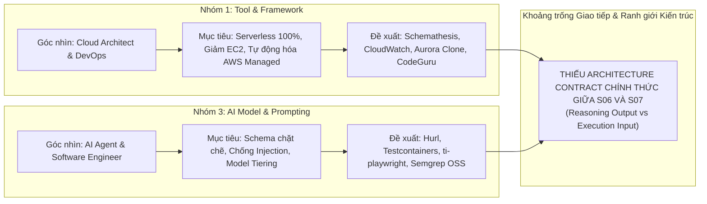

# BÁO CÁO REVIEW VÀ ĐỐI CHIẾU MÂU THUẪN GIỮA HAI BẢN ĐỀ XUẤT TASK 1 VÀ TASK 3
## ĐÁNH GIÁ TÍNH TƯƠNG THÍCH, ĐIỂM LỆCH PHA VÀ ĐỀ XUẤT ĐỒNG BỘ HÓA CHO HỆ THỐNG TESTING INTELLIGENCE (TI)

---

| Thuộc tính | Chi tiết |
| :--- | :--- |
| **Tài liệu tham chiếu 1** | [Task_1_Research_Tool_and_Framework_for_Testing.md](file:///D:/Doc/Research/Task_1_Research_Tool_and_Framework_for_Testing.md) |
| **Nhóm phụ trách 1** | Nhóm 1: Công cụ & Framework Kiểm thử (Tool & Framework Team) |
| **Tài liệu tham chiếu 2** | [Task_3_AI-Prompt_Research.md](file:///D:/Doc/Research/Task_3_AI-Prompt_Research.md) |
| **Nhóm phụ trách 2** | Nhóm 3: Mô hình AI & Prompt Engineering (AI Model & Prompting Team) |
| **Ngày lập báo cáo** | 22/09/2026 |
| **Hệ thống áp dụng** | Testing Intelligence (TI) Platform — Shared Evaluation Spine |
| **Trạng thái đối soát** | **XÁC NHẬN CÓ NHIỀU MÂU THUẪN VÀ LỆCH PHA CĂN BẢN (CONFLICTS DETECTED)** |

---

## 1. TỔNG QUAN ĐÁNH GIÁ (EXECUTIVE SUMMARY)

Sau khi đối chiếu toàn diện nội dung giữa tài liệu của **Nhóm 1 (Nghiên cứu Tool & Framework)** và **Nhóm 3 (Nghiên cứu AI Model & Prompting)**, kết luận đánh giá như sau:

> [!WARNING]
> **KẾT LUẬN CHÍNH**: Hai bản đề xuất **KHÔNG ĐỒNG BỘ** và đang tồn tại **nhiều mâu thuẫn kỹ thuật cốt lõi**. Nếu đưa vào triển khai ngay mà không hiệu chỉnh, hệ thống TI sẽ gặp tình trạng "đầu gãy đuôi":
> 1. **Nhóm 3 sinh ra dữ liệu/intent mà Nhóm 1 không có adapter để chạy.**
> 2. **Nhóm 1 xây dựng hạ tầng serverless AWS-native nhưng Nhóm 3 lại đề xuất công cụ mã nguồn mở chạy container cục bộ.**
> 3. **Nhóm 1 bác bỏ công cụ mà Nhóm 3 chọn làm cốt lõi (điển hình là Testcontainers).**
> 4. **Nhóm 1 đã cắt giảm phạm vi (Visual Regression, Contract Testing) nhưng Nhóm 3 vẫn đưa vào thiết kế.**

Mâu thuẫn này bắt nguồn từ việc hai nhóm tiếp cận hệ thống từ hai lăng kính khác nhau:
- **Nhóm 1** tiếp cận dưới góc nhìn **Hạ tầng AWS / Cloud Architect**: Tối ưu hóa tính serverless, giảm chi phí máy ảo EC2, tăng tính tự động không cần người bảo trì.
- **Nhóm 3** tiếp cận dưới góc nhìn **AI Agent / Software Developer**: Quen thuộc với hệ sinh thái container cục bộ (Docker socket, Hurl, Semgrep OSS) và tập trung sâu vào prompt engineering, schema candidate và chống injection.

---

## 2. MA TRẬN ĐỐI CHIẾU MÂU THUẪN TRỰC DIỆN

| Hạng mục đối chiếu | Đề xuất của Nhóm 1 ([Task 1](file:///D:/Doc/Research/Task_1_Research_Tool_and_Framework_for_Testing.md)) | Đề xuất của Nhóm 3 ([Task 3](file:///D:/Doc/Research/Task_3_AI-Prompt_Research.md)) | Mức độ xung đột | Hệ quả thực tế |
| :--- | :--- | :--- | :--- | :--- |
| **Triết lý Hạ tầng (Infra Architecture)** | **100% AWS Managed & Serverless**: CodeBuild, CloudWatch Synthetics, Aurora Serverless v2 Clone, Fargate. Hạn chế tối đa máy ảo EC2 và container chạy liên tục. | **Self-hosted Worker Container Sandbox**: Đóng gói các binary/thư viện OSS vào worker containers nội bộ (`ti-playwright`, `ti-k6-runner`, Testcontainers, Semgrep container). | 🔴 **Cực kỳ cao** | Lệch pha hoàn toàn về mô hình triển khai hạ tầng và chi phí vận hành. |
| **Domain 1: API Testing** | **Schemathesis + Playwright API** chạy trên **AWS CodeBuild/Lambda**. • *Cơ chế*: Tự động fuzzing 100% từ OpenAPI spec, không phụ thuộc AI/người viết test. | **Hurl (Rust CLI) + httpx/pydantic**. • *Cơ chế*: Prompt LLM (Sonnet 5/Haiku 4.5) sinh kịch bản JSON Candidate chi tiết từng case, bắn qua Hurl. | 🔴 **Rất cao** | Nhóm 1 không chuẩn bị Hurl adapter. Nếu dùng Schemathesis thì S06 của Nhóm 3 bị thừa thãi logic sinh test boundary. |
| **Domain 2: Database Testing** | **Amazon Aurora Serverless v2 Clone + ECS Fargate (Flyway)**. • *Quyết định*: **Bác bỏ Testcontainers** vì làm nặng EC2 và khó nạp DB lớn. | **Testcontainers (Python/Go) + SQLAlchemy/asyncpg**. • *Quyết định*: Chọn Testcontainers làm adapter sandbox chính, dựng DB mẫu sạch. | 🔴 **Trực tiếp bác bỏ nhau** | Nhóm 3 thiết kế adapter dựa trên công cụ mà Nhóm 1 kịch liệt loại trừ trong bảng quyết định công nghệ. |
| **Domain 3: UI / Web Testing** | **Amazon CloudWatch Synthetics (Canaries)** chạy Playwright serverless. • *Tài nguyên*: Chi trả \$0.0012/lần chạy, không cần duy trì browser container. | **ti-playwright Container** độc lập trong VPC nội bộ. • *Tài nguyên*: Phải duy trì máy chủ worker để quản lý Chromium qua CDP. | 🟡 **Trung bình** | Lệch định dạng giao tiếp: CloudWatch Synthetics nhận script NodeJS; Nhóm 3 lại phát ToolIntent JSON từng thao tác. |
| **Domain 4: Performance Testing** | **AWS Distributed Load Testing (DLT) trên Fargate** + k6. • *Quy mô*: Bơm tải phân tán từ nhiều Region, test PR và stress-test chính TI API (:8000). | **k6 binary container (`ti-k6-runner`)** + Prometheus / CloudWatch Exporter. • *Quy mô*: Chạy k6 cục bộ trong VPC worker. | 🟢 **Thấp (Đồng thuận engine)** | Cả hai cùng dùng **k6**, chỉ lệch phương thức điều phối phân tán (DLT Fargate solution vs. local container). |
| **Domain 5: Security Testing** | **Amazon CodeGuru Security + Amazon Inspector**. • *Đánh giá*: Semgrep chỉ là công cụ bổ trợ; SonarQube bị loại bỏ. | **Semgrep OSS + Trivy + Gitleaks**. • *Thiết kế*: 4 bức tường cô lập Context và toàn bộ logic schema xoay quanh Semgrep/Trivy/Gitleaks. | 🔴 **Rất cao** | Không có tiếng nói chung về tool. Nhóm 3 không hề chuẩn bị adapter cho CodeGuru; Nhóm 1 không dựng container cho Semgrep. |
| **Phạm vi: Visual Regression & Contract** | **Loại bỏ hoàn toàn** Contract Testing và Visual Regression Testing ra khỏi TI (dòng 215, 431). | Vẫn đưa **Contract Testing** vào schema (`CONTRACT_AND_FUNCTIONAL`) và dùng **Pixelmatch** để so visual diff (dòng 114, 956). | 🔴 **Mâu thuẫn Scope** | Nhóm 3 làm việc ngoài phạm vi đã được phê duyệt cắt giảm của Nhóm 1. |
| **Vai trò của AI trong Security / Risk (S04)** | Dùng **CodeGuru** quét mã để gán `Risk Tier: CRITICAL` chính xác 100%, thay thế LLM đọc diff nhằm triệt tiêu ảo giác. | Bắt buộc dùng **Claude Opus 5** để Threat Modeling & suy luận lỗ hổng logic nghiệp vụ tinh vi (IDOR, race conditions). | 🟡 **Xung đột triết lý** | Nhóm 1 muốn loại bỏ LLM khỏi khâu bảo mật; Nhóm 3 lại đưa LLM mạnh nhất vào khâu này. |
| **Đánh giá Mô hình AI (Evaluation)** | Chọn **Amazon Bedrock Evaluations** (`TIRunnerGroundness`) đo Groundedness & Accuracy (0.0 - 1.0). | Dùng **Deterministic Code Barrier** tại S09 + **Ground Truth Benchmark Loop nội bộ** (so sánh Manual Tests). | 🟡 **Lệch pha phương pháp** | Nhóm 3 không tích hợp Bedrock Evaluations của Nhóm 1; Nhóm 1 chưa có cơ chế Ground Truth Loop như Nhóm 3. |
| **Phiên bản Mô hình AI (Model Baseline)** | Cũ: Ghi nhận Bedrock Claude Opus / 3.5 đơn lẻ từ baseline cũ, chưa có phân tầng chi phí. | Mới: **v2.0.0 (22/09/2026)** với chiến lược **Model Tiering 3 cấp** (Haiku 4.5, Sonnet 5, Opus 5). | 🟡 **Độ trễ thông tin** | Nhóm 1 chưa cập nhật cấu trúc phân tầng model mới nhất từ Nhóm 3. |

---

## 3. PHÂN TÍCH CHI TIẾT CÁC ĐIỂM MÂU THUẪN QUAN TRỌNG

### 3.1. Xung đột sâu sắc nhất: Database Testing (Testcontainers vs. Aurora Cloning)

* **Nhóm 1 đã kết luận rõ ràng tại [Task 1 (Bảng 3.3, dòng 382)](file:///D:/Doc/Research/Task_1_Research_Tool_and_Framework_for_Testing.md#L382)**:
  > *"Testcontainers chạy trên EC2: Không chọn làm lõi... Làm quá tải máy ảo EC2 backend do Docker daemon chiếm nhiều RAM/CPU; khó nạp dữ liệu lớn... Phải nâng cấp cấu hình EC2 tăng $30 - $80/tháng."*
  > $\rightarrow$ Giải pháp thay thế được Nhóm 1 chọn là **Amazon Aurora Serverless v2 Cloning + ECS Fargate**.
* **Trái lại, Nhóm 3 tại [Task 3 (Phụ lục, dòng 952)](file:///D:/Doc/Research/Task_3_AI-Prompt_Research.md#L952)** lại đề xuất:
  > *"Testcontainers (Python/Go): Worker gọi Docker socket nội bộ dựng ephemeral container DB (Postgres/MySQL) sạch cho từng job; chạy test xong tự hủy."*
* **Hậu quả**: Nếu triển khai theo Nhóm 1 (máy chủ Backend không có Docker daemon để tiết kiệm tài nguyên và bảo mật), các lệnh gọi Testcontainers từ adapter của Nhóm 3 sẽ gây crash ngay lập tức. Ngược lại, nếu chạy theo Nhóm 3 thì sẽ phá vỡ mục tiêu hạ tầng serverless của Nhóm 1.

---

### 3.2. Mâu thuẫn về Phương pháp Sinh & Chạy Test API: Fuzzing vs. LLM Generation

* **Nhóm 1 chọn Schemathesis ([Task 1, dòng 362](file:///D:/Doc/Research/Task_1_Research_Tool_and_Framework_for_Testing.md#L362))**:
  - Triết lý: Không phụ thuộc vào con người hay AI viết test case. Chỉ cần nạp OpenAPI spec vào **Schemathesis**, công cụ tự động sinh hàng nghìn biến thể fuzzing để tìm lỗi sập hệ thống (HTTP 500).
* **Nhóm 3 xây dựng Prompt S05/S06 & Tool Hurl ([Task 3, dòng 108–194 & 950](file:///D:/Doc/Research/Task_3_AI-Prompt_Research.md#L108-L194))**:
  - Triết lý: Giao việc đọc OpenAPI cho **Claude Sonnet 5** (S05) và **Haiku 4.5** (S06) để AI tự sinh các file JSON `API_CANDIDATE_V1` (có method, path, headers, assertions, boundary data), sau đó gửi sang công cụ **Hurl** (viết bằng Rust) hoặc **httpx** để thực thi.
* **Hậu quả**: 
  - Đang có sự chồng chéo và lãng phí: Nếu đã dùng Schemathesis thì AI không cần tốn token sinh hàng trăm test boundary đơn giản.
  - Nhóm 1 hoàn toàn không đề cập hay cấu hình runtime cho **Hurl CLI** trong pipeline của mình.

---

### 3.3. Mâu thuẫn về Ngăn xếp Công cụ Bảo mật (Security Toolchain)

* **Nhóm 1 chốt giải pháp tại [Task 1 (Mục 2.3.3 & 3.5)](file:///D:/Doc/Research/Task_1_Research_Tool_and_Framework_for_Testing.md#L405)**:
  - Chọn **Amazon CodeGuru Security** và **Amazon Inspector** làm trục bảo mật chính.
  - Lý do: Phân tích diff bằng ML của AWS, tích hợp sẵn IAM, quét cả code lẫn CVE thư viện mà không phải quản lý container máy chủ.
* **Nhóm 3 thiết kế kiến trúc bảo mật tại [Task 3 (Mục 3.5 & Phụ lục)](file:///D:/Doc/Research/Task_3_AI-Prompt_Research.md#L776-L842)**:
  - Không hề có sự xuất hiện của CodeGuru hay Inspector.
  - Toàn bộ cơ chế kiểm định an ninh được xây dựng dựa trên bộ ba mã nguồn mở: **Semgrep OSS** (SAST), **Trivy** (SCA), và **Gitleaks** (Secrets).
  - Định dạng bằng chứng mong đợi tại S08 là **SARIF** từ Semgrep.
* **Hậu quả**: Hai nhóm đang chuẩn bị cho hai bộ công cụ hoàn toàn tách biệt. Adapter của Nhóm 3 viết cho Semgrep/Trivy/Gitleaks sẽ không tương thích với kết quả trả về từ Amazon CodeGuru Security của Nhóm 1.

---

### 3.4. Xung đột về Phạm vi Dự án (Project Scope Creep)

* **Nhóm 1 đã freeze phạm vi tinh gọn tại [Task 1 (Dòng 215, 431)](file:///D:/Doc/Research/Task_1_Research_Tool_and_Framework_for_Testing.md#L215)**:
  > *"Phạm vi tinh gọn: Tập trung vào các trục kiểm thử cốt lõi cho Artifact doanh nghiệp (API Functional & Fuzzing, UI/Web E2E, Database, Performance, Security, Model Quality). Không đề cập tới Kiểm thử Di động, Lưu trữ hạ tầng thuần túy, Contract Testing và Visual Regression Testing... Tài liệu đã được cập nhật tinh gọn: loại bỏ hoàn toàn Contract Testing, Visual Regression Testing..."*
* **Nhóm 3 lại mở rộng phạm vi tại [Task 3](file:///D:/Doc/Research/Task_3_AI-Prompt_Research.md)**:
  - Dòng 114: Đưa định nghĩa `test_type: "CONTRACT_AND_FUNCTIONAL"` vào Schema API.
  - Dòng 470: Đưa mục tiêu `(d) Visual Layout Conformance` vào kịch bản UI.
  - Dòng 956 (Phụ lục): Đưa công cụ **Pixelmatch / Resemble.js** vào danh mục công cụ cần chuyển giao cho Nhóm 1 để so sánh sai lệch ảnh từng pixel với baseline snapshot.
* **Hậu quả**: Nhóm 3 đang tốn tài nguyên thiết kế cho những tính năng mà Nhóm 1 đã thống nhất loại trừ để tinh gọn hệ thống.

---

### 3.5. Bất đồng quan điểm về Vai trò của LLM trong Đánh giá Rủi ro (S04 Risk Engine)

* **Nhóm 1 ([Task 1, dòng 320–321](file:///D:/Doc/Research/Task_1_Research_Tool_and_Framework_for_Testing.md#L320-L321))**:
  - Nhận định: LLM đọc diff mã nguồn rất dễ bị ảo giác, bỏ sót hoặc phán đoán sai mức độ nguy hiểm của PR.
  - Giải pháp: Giao toàn bộ việc đọc diff cho **Amazon CodeGuru Security** để máy móc định lượng, từ đó tự động nâng hạng `Risk Tier: CRITICAL` chính xác 100%.
* **Nhóm 3 ([Task 3, dòng 765–768](file:///D:/Doc/Research/Task_3_AI-Prompt_Research.md#L765-L768))**:
  - Nhận định: Công cụ tĩnh (SAST/CodeGuru) hoàn toàn bất lực trước các lỗ hổng logic nghiệp vụ tinh vi như IDOR, bypass phân quyền, race condition, hoặc multi-tenant data leaks.
  - Giải pháp: **BẮT BUỘC DÙNG Claude Opus 5** (model có GPQA Diamond 93.2%) ở chặng S04/S05 để thực hiện **Threat Modeling** chuyên sâu.
* **Đánh giá**: Cả hai bên đều có lý lẽ kỹ thuật riêng, nhưng đang mâu thuẫn về việc ai là "chủ tọa" quyết định Risk Tier tại S04.

---

### 3.6. Mâu thuẫn về Cơ chế Đánh giá Mô hình AI (Model Evaluation)

* **Nhóm 1 ([Task 1, mục 2.3.6 & 3.6](file:///D:/Doc/Research/Task_1_Research_Tool_and_Framework_for_Testing.md#L341-L346))**:
  - Chọn dịch vụ **Amazon Bedrock Evaluations** để hiện thực hóa module kiến trúc `TIRunnerGroundness`.
  - Mục đích: Dùng dịch vụ chuẩn hóa của AWS để chấm điểm `GroundednessScore` và `GoalSuccessRate` của Claude Bedrock mỗi khi sinh test case.
* **Nhóm 3 ([Task 3, dòng 70–74 & 831–835](file:///D:/Doc/Research/Task_3_AI-Prompt_Research.md#L70-L74))**:
  - Bày tỏ sự hoài nghi với các chỉ số benchmark tự công bố bên ngoài.
  - Đề xuất giải pháp kiểm soát chất lượng bằng:
    1. **Ground Truth Benchmark Loop nội bộ**: Đối chiếu kết quả AI với tập Manual Tests mẫu của doanh nghiệp/ngân hàng.
    2. **Deterministic Quality Gate Barrier (Law 5 & 7) tại S09**: Dùng logic code cứng để chặn (Ví dụ: `if vulns > 0 then REJECT`), không cần chấm điểm định tính bằng prompt.
* **Hậu quả**: Hai bên đang nói về hai tầng đo lường khác nhau và chưa thống nhất việc có dùng dịch vụ Bedrock Evaluations của AWS hay không.

---

## 4. PHÂN TÍCH NGUYÊN NHÂN GỐC RỄ (ROOT CAUSE)

1. **Thiếu Ranh giới Hợp đồng Giao tiếp (Contract Interface) giữa S06 và S07**:
   - Nhóm 3 coi S06 sinh ra kịch bản chạy được (Executable Test Candidates) cho các công cụ CLI truyền thống (Hurl, Testcontainers).
   - Nhóm 1 lại coi S07 là các AWS Managed Runners tiếp nhận artifact gốc (OpenAPI, SQL migration script, PR diff) để tự chạy fuzzing và scanning.
2. **Lệch pha thời điểm cập nhật kiến trúc**:
   - Nhóm 3 đã tiến nhanh sang thiết kế **Model Tiering 3 cấp (Haiku 4.5 / Sonnet 5 / Opus 5)** ngày 22/09/2026.
   - Nhóm 1 vẫn đang giữ giả định hệ thống dùng một model Claude Opus/3.5 duy nhất từ các tài liệu baseline ban đầu.

---

## 5. ĐỀ XUẤT PHƯƠNG ÁN ĐỒNG BỘ VÀ DUNG HÒA (ACTIONABLE RECOMMENDATIONS)

Để hợp nhất hai tài liệu thành một bản kiến trúc thống nhất, khả thi và tối ưu chi phí, đề xuất kế hoạch hành động 4 bước như sau:

### Bước 1: Thống nhất Ngăn xếp Công cụ Chuẩn hóa (Harmonized Tech Stack)

| Domain | Giải pháp Dung hòa Đề xuất | Trách nhiệm Nhóm 1 | Trách nhiệm Nhóm 3 |
| :--- | :--- | :--- | :--- |
| **API Testing** | **Kết hợp 2 chế độ (Dual Mode)**: • *Mode 1 (Fuzzing rộng)*: Chạy Schemathesis từ OpenAPI (Task 1). • *Mode 2 (Luồng phức tạp)*: Claude Sonnet 5 sinh kịch bản JSON (Task 3), nhưng thực thi bằng **Playwright API** (Task 1). | Đóng gói Schemathesis & Playwright API runner trên CodeBuild/Lambda. | Loại bỏ đề xuất **Hurl CLI**; chuẩn hóa candidate schema tương thích với Playwright API runner. |
| **Database Testing** | **Chấp nhận Aurora Clone của Task 1; Bỏ Testcontainers của Task 3**. Chạy kịch bản migration Flyway trên bản clone, kết hợp SQLAlchemy chạy query read-only kiểm tra `information_schema`. | Cung cấp cơ chế Clone Aurora trong < 60s và endpoint tạm thời cho worker. | Xóa bỏ dependency **Testcontainers** khỏi tài liệu và adapter; cập nhật ToolIntent trỏ vào Aurora Clone endpoint. |
| **UI Testing** | **Serverless Playwright trên CloudWatch Synthetics** (hoặc ECS Fargate khi kịch bản > 15 phút). | Cung cấp template runner biên dịch kịch bản. | Loại bỏ **Pixelmatch (Visual Regression)**; tập trung vào User Journey và Accessibility (**axe-core**). |
| **Performance** | **AWS DLT + k6 Engine trên Fargate** (Task 1) thực thi theo kịch bản tải và ngưỡng SLO sinh từ Task 3. | Dựng hạ tầng DLT Fargate. | Cung cấp kịch bản tải k6 và SLA thresholds json theo cấu trúc của Task 3. |
| **Security** | **Kết hợp 2 lớp (Hybrid Defense)**: • *Lớp 1 (Quét mã tĩnh & Secrets)*: Semgrep OSS + Gitleaks trong isolated container (Task 3). • *Lớp 2 (Quét CVE thư viện & Phân tích diff AWS)*: Amazon Inspector & CodeGuru Security (Task 1). | Cấu hình IAM & API gọi CodeGuru / Inspector. | Giữ nguyên 4 bức tường cô lập Context; tích hợp thêm kết quả của Inspector vào sanitization parser. |

---

### Bước 2: Thống nhất Phạm vi Dự án (Scope Freeze)
* **Yêu cầu Nhóm 3**:
  1. **Xóa bỏ hoàn toàn phần Visual Regression Testing (Pixelmatch / Resemble.js)** khỏi [Task_3_AI-Prompt_Research.md](file:///D:/Doc/Research/Task_3_AI-Prompt_Research.md) để đồng bộ với quyết định của Nhóm 1.
  2. Đổi tên `CONTRACT_AND_FUNCTIONAL` thành `SCHEMA_AND_FUNCTIONAL` để tránh nhập nhằng với Pact / Consumer-Driven Contract Testing.

---

### Bước 3: Đồng bộ Vai trò AI trong Risk Assessment & Threat Modeling (S04/S05)
* Thống nhất mô hình phân quyền:
  - **Dữ liệu thô (Raw Findings)**: 100% do công cụ quét định lượng (CodeGuru, Semgrep, Inspector, Gitleaks). Mô hình AI không được tự bịa ra lỗ hổng cú pháp.
  - **Phân loại Rủi ro Tự động**: Nếu có lỗ hổng `CRITICAL` hoặc `HIGH`, hệ thống tự động gán `Risk Tier: CRITICAL` bằng logic mã cứng (Deterministic Barrier - Tuân thủ Law 5 & 7).
  - **Vai trò của Claude Opus 5**: Chỉ kích hoạt khi `Risk Tier == CRITICAL` để thực hiện **Threat Modeling** (phân tích logic phân quyền, luồng tiền, giả lập kịch bản tấn công nghiệp vụ) mà công cụ tĩnh không hiểu được.

---

### Bước 4: Đồng bộ Phiên bản Mô hình AI sang Tài liệu Nhóm 1
* **Yêu cầu Nhóm 1**:
  - Cập nhật lại sơ đồ luồng tại Mục 2.2 và Bảng ma trận chi phí tại Mục 3.7 của [Task_1_Research_Tool_and_Framework_for_Testing.md](file:///D:/Doc/Research/Task_1_Research_Tool_and_Framework_for_Testing.md) để tích hợp chiến lược **Model Tiering 3 cấp** của Nhóm 3 (Haiku 4.5 cho các tác vụ mẫu hóa; Sonnet 5 cho Planning; Opus 5 cho Threat Modeling), thay vì ghi nhận Claude Opus / 3.5 nguyên khối.
  - Làm rõ vị trí của **Amazon Bedrock Evaluations**: Dùng để đánh giá định kỳ chất lượng sinh test của model trong pipeline CI/CD nội bộ, song song với **Ground Truth Benchmark Loop** của Nhóm 3.

---

## 6. KẾT LUẬN

Hai bản đề xuất của Nhóm 1 và Nhóm 3 đều có chất lượng nghiên cứu chuyên môn rất cao, nhưng đang được thực hiện độc lập và thiếu sự chốt chặn giao diện (Interface Handshake).

Việc áp dụng ngay 4 bước đồng bộ trên sẽ giúp kết hợp được **thế mạnh hạ tầng Serverless AWS tối ưu của Nhóm 1** với **năng lực phân tầng mô hình và thiết kế Prompting/Guardrail chống injection chặt chẽ của Nhóm 3**, tạo nên một kiến trúc hoàn chỉnh, an toàn và tối ưu chi phí cho hệ thống **Testing Intelligence (TI)**.
