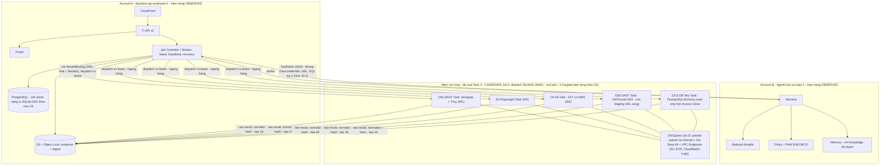
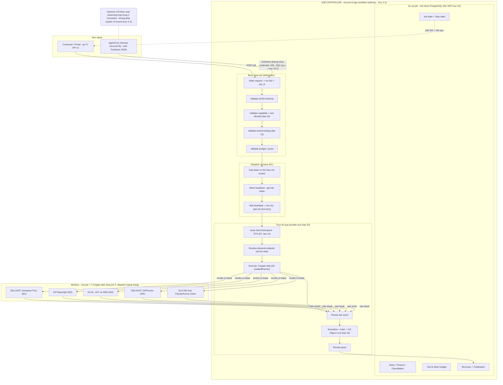

# Decision Package — Kiến trúc hỗ trợ đa loại testing cho Testing Intelligence (Task 2)

> Template theo mục 8.1 của `TI-Infrastructure-Research-Plan.md` · Phiên bản rút gọn cho deadline 2026-09-23.
> Nhãn sự thật: `OBSERVED` = đo/đọc được trực tiếp · `INFERRED` = suy luận có ghi giả định · `CANDIDATE` = đề xuất chưa kiểm chứng.

# 0. Trang bìa

| Thuộc tính         | Giá trị                                                                                                                                                   |
| ------------------ | --------------------------------------------------------------------------------------------------------------------------------------------------------- |
| Version / Ngày     | v0.2 / 2026-09-23 — cập nhật theo Review Feedback 22/09 (4 điểm sửa ở §6.3)                                                                                                                                   |
| Tác giả            | Hoàng (Task 2 — Architecture)                                                                                                                             |
| Trạng thái         | ☑ For review vòng 2 (sau Conditional Pass 22/09 — `Task_2_Architecture_Review_Feedback.md`) — ☐ For sign-off                                                                                                                             |
| Tài liệu liên quan | `TI-Research-Charter.md` (Q1/Q2 đã quyết) · `TI-Infrastructure-Research-Plan.md` · Architecture doc · Trang diagrams TI (đo 2026-09-21, commit `a31c47f`) |
| Giới hạn           | Không có quyền truy cập source code TI; chưa kịp spike P4 → mọi con số đều `CANDIDATE`, spike đề xuất ở §11                                               |

**DECISION REQUESTED — điều cần ký:**

1. Xác nhận **Q1 = Executor** (TI tự chạy test) và **Q2 = freeze taxonomy L0–L11** — đã quyết 2026-09-22, cần chữ ký Product Architect.
2. Phê duyệt **định hướng D2 sandbox = ECS Fargate trước, EKS+Karpenter khi cần** (chi tiết §6.2) — kèm exit note theo law 23.
3. Phê duyệt **roadmap wave W0–W4** và **budget spike P4** (§11) để chuyển `CANDIDATE` → `OBSERVED`.
4. *(v0.2)* Phê duyệt **gói 4 điều chỉnh theo Review Feedback 22/09** (chi tiết §6.3): tách **D5a SAST (W1)/D5b DAST (W3)**, thêm **D2.b Database Testing**, **D9 bỏ Network Firewall**, vẽ lại **sơ đồ §8 dispatch ngang hàng** — điều kiện để sign-off.

| Người ký | Vai trò           | Ký phần       | Chữ ký / ngày |
| -------- | ----------------- | ------------- | ------------- |
| Tan.Thai | Product Architect | Toàn bộ + ADR | ☐             |
| *(PM)*   | PM / Delivery     | §1, §11       | ☐             |

---

# 1. Tóm tắt lãnh đạo — 1 trang

**Phương án đề xuất (3 câu):** TI giữ nguyên evaluation spine đang chạy (API → Job Controller → AgentCore Harness → evidence store) `OBSERVED`; mở rộng sang **test execution** theo mô hình **Executor**: mọi loại test L0–L11 chạy trong **sandbox có kiểm soát** (đề xuất D2 = ECS Fargate) với egress mặc định đóng, mở theo binding; mỗi loại test = một **Evaluation Pack** gắn vào qua provider port — thêm loại test mới không đục lõi (đáp ứng mục tiêu "mở rộng, linh hoạt, tái sử dụng").

**Chi phí ước tính:** `CANDIDATE — chưa kiểm chứng` (cần spike P4):

| Hạng mục                                                         | Ước tính thô                                                   | Nhãn                                                                |
| ---------------------------------------------------------------- | -------------------------------------------------------------- | ------------------------------------------------------------------- |
| Sandbox Fargate (giả định ~500 job/tháng, 5 phút/job, 2vCPU/4GB) | ~$30–60/tháng *(compute thuần ~$5–7 — xem phép tính bên dưới)* | `INFERRED` từ giá công bố Fargate (đơn giá đã re-verify 2026-09-23) |
| Browser farm self-host (ECS, chạy theo job)                      | ~$50–150/tháng                                                 | `CANDIDATE` — chưa tra được giá chính thức (xem lưu ý bên dưới)     |
| Distributed Load Testing on AWS                                  | ~$30–90/tháng ở tải nhỏ                                        | `CANDIDATE` — chưa tra được giá chính thức (xem lưu ý bên dưới)     |
| Mạng sandbox D9 *(v0.2: bỏ Network Firewall → private subnet + VPC Endpoints)* | ~$22/tháng | `CANDIDATE` — chốt bằng hóa đơn sau spike |
| Build effort phase W1–W2                                         | 3–5 người-tháng                                                | `CANDIDATE`                                                         |

> **Phép tính Fargate từ đơn giá chính thức** (nguồn: https://aws.amazon.com/fargate/pricing/, tra ngày 2026-09-23 — tính tiền theo giây, tối thiểu 1 phút/task):
> 
> - Đơn giá Linux/x86, region us-east-1 (tham chiếu): **$0.000011244/vCPU-giây** (~$0.0405/vCPU-giờ) và **$0.000001235/GB-giây** (~$0.0044/GB-giờ).
> - 1 job (2vCPU + 4GB, 5 phút chạy + ~1 phút cold start = 6 phút tính tiền): (2 × 0.000011244 + 4 × 0.000001235) × 360s ≈ **$0.0099/job** → 500 job/tháng ≈ **~$5/tháng compute thuần**.
> - Con số **~$30–60/tháng** giữ nguyên làm *envelope thận trọng* vì đã gồm: region ap-southeast-1 (giá thường cao hơn us-east-1 ~10–25%), VPC Endpoints, CloudWatch Logs, ECR storage, data transfer. `INFERRED` — sẽ chuyển `OBSERVED` bằng hóa đơn thật sau spike P4.
> 
> **Lưu ý — phần CHƯA tính được và lý do:**
> 
> 1. **Đơn giá Fargate region ap-southeast-1 (Singapore):** trang pricing của AWS render bảng giá theo region bằng JavaScript động; HTML tĩnh không chứa bảng giá Singapore → không trích được trong phiên tra 2026-09-23. Cách tra: dùng **AWS Pricing Calculator** (calculator.aws) chọn region Singapore, hoặc **AWS Price List API**. Do đó mọi phép tính trên dùng us-east-1 làm mốc tham chiếu + hệ số dự phòng.
> 2. **Browser farm (~$50–150) & DLT on AWS (~$30–90):** chưa tra chứng trên trang giá chính thức trong phiên này (DLT on AWS là solution gồm nhiều dịch vụ con, cần cộng dồn Fargate + S3 + CloudWatch theo tải giả định) → giữ nguyên `CANDIDATE`, chốt bằng spike P4.

**Rủi ro lớn nhất:** Q1=Executor thuần làm chi phí/độ phức tạp cao hơn đáng kể so với hybrid (unit test L1 tự chạy trong sandbox đắt hơn nhiều so với nhận evidence từ CI consumer). → Giảm thiểu: cho phép L1/L2 nhận evidence bổ sung từ CI như chế độ phụ (đã ghi trong Charter).

**Điều cần ký:** 3 mục ở trang bìa.

---

# 2. Bối cảnh & mục tiêu

## 2.1. Hiện trạng TI — `OBSERVED` (nguồn: trang diagrams, lượt đo 2026-09-21, commit `a31c47f`)

- Bản V2 đang chạy: tiếp nhận có xác thực → job control bền (202 → poll tới terminal) → dispatch có lease sang AgentCore Harness → kết quả + evidence ghi bền → bên gọi đọc lại qua API/Runs. `OBSERVED`
- Hạ tầng 2 tài khoản AWS: backend ở ap-southeast-1; AgentCore Harness/Memory ở us-east-1. `OBSERVED`
- `completed ≠ PASS`; check không đo được ghi `not_evaluable`. `OBSERVED`
- **Gap tự ghi nhận:** "Security, performance, simulator và runtime tổng quát chưa hoàn tất"; Memory reuse chưa nghiệm thu; kho evidence xoá sau 90 ngày. `OBSERVED`

## 2.2. Gap cần đóng

| Gap                                      | Hệ quả nếu không đóng            | Lớp ảnh hưởng     |
| ---------------------------------------- | -------------------------------- | ----------------- |
| Không có sandbox chạy code không tin cậy | Không thể làm Executor           | L1–L7             |
| Không có browser farm                    | Không test được UI/E2E           | L3, L8            |
| Không có load generator                  | Không test được performance      | L5                |
| Không có scanner sandbox + egress policy | Không test được security dynamic | L6                |
| SQLite chỉ DEV                           | Không qualification được         | Toàn bộ (NFR §23) |

## 2.3. Q1–Q5

| #   | Quyết định                                                                      | Trạng thái                           |
| --- | ------------------------------------------------------------------------------- | ------------------------------------ |
| Q1  | **Executor — TI tự chạy test** (L1/L2 cho phép nhận evidence CI như chế độ phụ) | ✅ Quyết 2026-09-22 — chờ ký xác nhận |
| Q2  | Freeze taxonomy L0–L11                                                          | ✅ Quyết 2026-09-22                   |
| Q3  | Đề xuất D2 = ECS Fargate (chi tiết §6.2)                                        | ⏳ Chờ ký                             |
| Q4  | Mọi thứ mới qua provider port; không authority mới trên TIEF                    | ⏳ Nhận mặc định — chờ ký             |
| Q5  | AWS-first theo bản đồ §3.1 — kết quả ở §6                                       | ✅ Nội dung báo cáo này               |

---

# 3. Phạm vi & taxonomy

Taxonomy 12 lớp (Q2 đã freeze) — wave điều chỉnh theo Q1=Executor:

| Lớp | Loại test                      | Wave     | Chế độ                                             | Ghi chú                             |
| --- | ------------------------------ | -------- | -------------------------------------------------- | ----------------------------------- |
| L0  | Static / artifact / contract   | W0       | TI executes (đã có nền)                            | Củng cố                             |
| L1  | Unit / component               | W1       | TI executes trong sandbox (+ nhận evidence CI phụ) | ⚠️ Điểm đắt nhất của Executor thuần |
| L2  | API / integration / contract   | W1       | TI executes                                        | HTTP runner hiện hữu là mầm         |
| L3  | UI / E2E browser               | W2       | TI executes                                        | Buộc D3                             |
| L4  | Mobile                         | W3       | TI executes qua managed                            | AWS Device Farm                     |
| L5  | Performance / load             | W2       | TI executes                                        | DLT on AWS                          |
| L6  | Security dynamic               | W3       | TI executes                                        | ZAP/nuclei trong sandbox            |
| L7  | Chaos / resilience             | W4       | TI executes                                        | `CANDIDATE`                         |
| L8  | Accessibility / visual         | W2       | Đi kèm L3                                          | axe-core trong browser run          |
| L9  | Data quality                   | W4       | TI executes                                        | `CANDIDATE`                         |
| L10 | LLM / agent eval               | Liên tục | Đã có Harness/Bedrock                              | Thuộc Task 3 (Nghĩa)                |
| L11 | Infrastructure / compatibility | W3–W4    | TI executes                                        | Checkov/OPA trong sandbox           |

**Ngoài phạm vi đợt này:** viết Evaluation Pack chi tiết; thay đổi authority model; dữ liệu thật; claim production readiness.

---

# 4. Yêu cầu & ràng buộc

| Nhóm               | Ràng buộc                                                                                                                                                                                     | Nguồn               |
| ------------------ | --------------------------------------------------------------------------------------------------------------------------------------------------------------------------------------------- | ------------------- |
| Kiến trúc          | 24 laws — đặc biệt law 12–15 (artifact untrusted, không credential trong prompt, allowlist server-owned), law 16 (normalize + hash raw result), law 23 (provider port + replacement contract) | Architecture doc    |
| NFR                | PostgreSQL cho qualification; worker lease/heartbeat/recovery; cost/job & model cost/tenant                                                                                                   | §23                 |
| Định hướng         | AWS-first; mọi dịch vụ chọn kèm **exit note**                                                                                                                                                 | Plan §3.1           |
| Compliance         | Chỉ synthetic/redacted artifacts (§19.3); sandbox no-internet mặc định                                                                                                                        | §19.3, D9           |
| Nguồn lực research | Không có source code TI; không kịp spike trước deadline                                                                                                                                       | Ghi nhận 2026-09-22 |

---

# 5. Phương pháp

Pipeline: Problem-first → Longlist → Shortlist → Decision matrix → ADR nháp. Do deadline, **spike P4 chưa chạy** — mọi lựa chọn dựa trên docs chính thức + hiện trạng đo sẵn, gắn nhãn `CANDIDATE`/`INFERRED`, kèm kế hoạch spike để nâng cấp thành `OBSERVED` (§11). Nguồn: AWS docs chính thức (cao) > hiện trạng portal đo live (cao) > blog vendor (chỉ gợi ý).

---

# 6. Kết quả theo domain (D1–D14)

## 6.0. Bảng tổng hợp quyết định đề xuất

| Domain                | Đề xuất                                                                    | Build/Buy/Managed     | Nhãn                  | Exit note (law 23)                                        |
| --------------------- | -------------------------------------------------------------------------- | --------------------- | --------------------- | --------------------------------------------------------- |
| D1 Job orchestration  | Giữ Job Controller hiện hữu + SQS + PostgreSQL (lease/heartbeat)           | Build trên hiện trạng | `INFERRED`            | Queue qua interface; thay SQS không đục lõi               |
| D2 Sandbox            | **ECS Fargate task-per-job** (chi tiết §6.2)                               | Managed               | `CANDIDATE`           | Interface IsolatedRunner → thay EKS+Karpenter/Firecracker |
| D2.b Database Testing *(v0.2)* | Amazon Aurora Serverless v2 Clone + Fargate chạy Flyway / SQLAlchemy read-only (giải pháp Task 1 & 3 đã thống nhất — ⚠️ chờ xác nhận lại) | Managed | `CANDIDATE` | Clone + read-only → không đục production |
| D3 Browser farm       | Self-host Playwright trên ECS Fargate; đánh giá Device Farm ở L4           | Managed-infra         | `CANDIDATE`           | Chuẩn Playwright → đổi hạ tầng không đổi test             |
| D4 Load gen           | Distributed Load Testing on AWS (Fargate + k6/JMeter)                      | Managed solution      | `INFERRED`            | Script k6/JMeter portable                                 |
| D5a SAST/SCA/Secret *(v0.2, W1)* | Semgrep OSS + Trivy container trong sandbox — quét PR-time cho Risk Tier (đồng bộ Task 1 & 3) | OSS container | `CANDIDATE` | Scanner là container thay thế được |
| D5b DAST Runner *(v0.2, W3)* | ZAP/nuclei container + Inspector/ECR scan — chỉ chạy khi có Staging URL sống | OSS + managed | `CANDIDATE` | Scanner là container thay thế được |
| D6 Storage            | RDS PostgreSQL (Job Store) + S3 + Object Lock (evidence)                   | Managed               | `INFERRED`            | PostgreSQL/S3 là chuẩn mở                                 |
| D7 Secrets            | Secrets Manager + STS short-lived creds                                    | Managed               | `INFERRED`            | Interface secret provider                                 |
| D8 Observability      | CloudWatch + ADOT (OTel) + cost allocation tags                            | Managed, chuẩn OTel   | `INFERRED`            | OTel export sang backend bất kỳ                           |
| D9 Egress *(v0.2)*    | **Bỏ Network Firewall** (~$288/tháng/AZ) → private subnet không route internet + SG Deny All + VPC Endpoints (S3, ECR, CloudWatch Logs); no-internet mặc định (~$22/tháng) | Managed | `CANDIDATE` | Terraform module, chuẩn mạng |
| D10 Identity          | IAM Identity Center federate Entra ID (khớp Microsoft login hiện trạng)    | Managed               | `OBSERVED` hiện trạng | OIDC chuẩn                                                |
| D11 Cross-region/data | Chưa quyết — block bởi data classification (§19.3)                         | —                     | `CANDIDATE`           | KMS multi-region khi cần                                  |
| D12 Portal            | Giữ CloudFront + S3 + API (đang chạy)                                      | Hiện trạng            | `OBSERVED`            | —                                                         |
| D13 IaC/CI-CD         | CDK/Terraform + ECR + SBOM + deployment receipt                            | Build trên managed    | `INFERRED`            | Terraform/CDK portable                                    |
| D14 Provider ports    | Tự thiết kế interface; AWS là implementation đầu tiên                      | Build                 | `INFERRED`            | Bản thân nó là exit note                                  |

## 6.2. Chi tiết D2 — Sandbox (quyết định số 1, one-way door)

**Vấn đề:** Executor = chạy code không tin cậy của tenant trong môi trường multi-tenant. Yêu cầu: cô lập (isolation), no-internet mặc định, giới hạn CPU/mem/time, không credential trong workload, audit đầy đủ (law 12–16).

**Option Catalog (shortlist 3):**

| Option                          | Cách hoạt động                                     | Ưu điểm                                                                                        | Nhược điểm                                                    | Ghi chú                     |
| ------------------------------- | -------------------------------------------------- | ---------------------------------------------------------------------------------------------- | ------------------------------------------------------------- | --------------------------- |
| **ECS Fargate task-per-job**    | Mỗi test job = 1 Fargate task, VPC riêng không NAT | Cô lập mức VM giữa task; serverless trả tiền theo giây; không vận hành node; IAM role per task | Cold start ~30–60s; trần 16vCPU/120GB                         | **Đề xuất chọn cho W1–W2**  |
| EKS + Karpenter (+ gVisor/Kata) | Pod-per-job trên node ephemeral                    | Linh hoạt nhất; hợp job nặng/browser farm lớn; spot rẻ                                         | Vận hành phức tạp; cần team giỏi K8s                          | Nâng cấp khi throughput cao |
| AgentCore Runtime (microVM)     | Dùng runtime đã có ở Account B                     | Tái sử dụng hạ tầng hiện hữu; microVM isolation tốt                                            | Chưa chứng minh chịu browser/load test nặng `confidence: LOW` | Giữ cho agent reasoning     |

**Quyết định đề xuất:** D2 = **ECS Fargate task-per-job**, interface `IsolatedRunner` (input: image digest + command + egress binding + limits; output: exit code + logs + artifacts + trace) — W3+ có thể đổi EKS+Karpenter không sửa lõi (law 23). `CANDIDATE — chốt sau spike P4`

**Điều kiện khiến kết luận sai (falsifiability):** spike cho thấy (a) cold start Fargate làm p95 latency vượt ngưỡng consumer chấp nhận, hoặc (b) browser test cần >16vCPU/120GB, hoặc (c) cost/job vượt budget >30% → chuyển EKS+Karpenter.

---

## 6.3. Điều chỉnh v0.2 theo Review Feedback 22/09 (Conditional Pass)

Theo `Task_2_Architecture_Review_Feedback.md` (Product Architect & Hội đồng Kỹ thuật TI, 22/09/2026), kết luận: 🟡 **CHẤP THUẬN CÓ ĐIỀU KIỆN (CONDITIONAL PASS)** — cho phép chạy Spike P4 ngay; yêu cầu sửa 4 điểm lệch pha để nâng lên **v0.2 trước 24/09/2026** rồi mới ký chính thức (sign-off). Trạng thái xử lý trong bản v0.2 này:

| # | Action item từ feedback | Cách xử lý trong v0.2 | Trạng thái |
|---|-------------------------|------------------------|------------|
| 1 🔴 | **Đồng bộ bảo mật với Task 1 & 3 (D5):** ZAP/nuclei là DAST (cần web đang chạy) — không quét được code ở PR | Tách **D5a SAST/SCA/Secret = Semgrep OSS + Trivy** đưa vào **W1** (Risk Tier PR-time); D5 cũ đổi thành **D5b DAST Runner (ZAP/nuclei)** giữ ở **W3**, chỉ kích hoạt khi có Staging URL sống (§6.0, §7, §11, ADR-09) | ✅ Đã sửa |
| 2 🔴 | **Bổ sung miền Database Testing** (bảng D1–D14 đang bỏ quên) | Thêm domain **D2.b**: Amazon Aurora Serverless v2 Clone + Fargate chạy Flyway / SQLAlchemy read-only (§6.0, §8, ADR-09) | ✅ Đã sửa — ⚠️ chờ xác nhận lại với Task 1/3 |
| 3 🟡 | **Tối ưu chi phí D9:** bỏ AWS Network Firewall (~$280/tháng/AZ — lãng phí so với ~$30 compute) | Thay bằng **private subnet không route internet + Security Group Deny All + VPC Endpoints (S3, ECR, CloudWatch Logs)** → từ ~$320/tháng xuống **~$22/tháng** (con số "< $15" trong feedback hơi thấp — interface endpoint ~$7.3/tháng/cái/AZ) (§1, §6.0, ADR-08) | ✅ Đã sửa |
| 4 🟡 | **Sơ đồ §8** gây hiểu lầm "Fargate lồng Fargate"; thiếu luồng nhận kết quả từ AI (Task 3) | Vẽ lại §8: Job Controller nhận **ToolIntent JSON** từ AgentCore → tra **TenantBinding** (URL thật + Secrets) → **dispatch trực tiếp, ngang hàng** tới từng task chuyên biệt (D5a/D3/D4/D5b/D2.b); handshake chi tiết ở Phụ lục B | ✅ Đã sửa |

**Việc còn lại trước sign-off (theo §4 của feedback):** 1 buổi làm việc với đại diện Task 1 & Task 3 để khớp nối D2.b và D5a/D5b, sau đó xuất bản v0.2 final trước 24/09/2026.

---

# 7. Kết quả benchmark (spike)

**Chưa thực hiện** do deadline 2026-09-23. Kế hoạch spike (P4, đề xuất 2 tuần sau ký):

| Kịch bản        | Tool                          | Đo                                          | Target       |
| --------------- | ----------------------------- | ------------------------------------------- | ------------ |
| 1 API test      | Newman trong Fargate task     | cold start, latency end-to-end, cost/job    | < 2 phút/job |
| 1 UI test       | Playwright image trên Fargate | flake rate (100 lần chạy), video/trace size | flake < 2%   |
| 1 load test     | DLT on AWS (k6)               | max RPS, cost/1M requests                   | theo NFR     |
| 1 SAST scan *(v0.2)* | Semgrep + Trivy trong Fargate task | thời gian scan repo, false-positive rate | < 5 phút/repo |
| 1 DAST scan *(v0.2: chỉ chạy khi có Staging URL sống)* | ZAP baseline trong sandbox | thời gian scan, false-positive rate | < 15 phút |

Budget spike ước tính < $200 (tài nguyên theo giây, synthetic artifact). `CANDIDATE`

---

# 8. Phương án đề xuất — kiến trúc tổng thể

> **v0.2 (sửa theo review feedback 22/09, điểm 4):** Job Controller nhận **ToolIntent JSON** từ AgentCore Harness (Task 3), tra **TenantBinding** (URL thật + Secrets), rồi **dispatch trực tiếp, ngang hàng** tới từng Fargate task chuyên biệt — mỗi task chạy trong sandbox D2 qua interface `IsolatedRunner`, KHÔNG phải mô hình "Fargate lồng Fargate" như sơ đồ v0.1. Chi tiết handshake từng bước bên trong Job Controller: xem **Phụ lục B**.

> Nếu vẫn không hiển thị: cần viewer hỗ trợ Mermaid — VS Code cài extension **"Markdown Preview Mermaid Support"** rồi mở preview (Ctrl+Shift+V); Confluence dùng macro **Mermaid**; hoặc paste code trên vào https://mermaid.live để xem/xuất PNG chèn vào slide.

**Nguyên tắc mở rộng (ăn vào mục tiêu Task 2):** mỗi loại test mới = một **Evaluation Pack** (image + oracle + evidence schema) gắn qua provider port — *không đục lõi*. Chỉ đầu tư cơ chế mở rộng khi có ≥2 pack thật (YAGNI có kiểm soát).

**Ranh giới TIEF ↔ Shared Platform (Q4):** mọi thứ mới đi qua provider port; không authority mới trên TIEF; cutover theo gate G6.

---

# 9. Trade-off & phương án bị loại

| Quyết định                | Chọn thì MẤT gì                                                                                                | Phương án loại & lý do                                                                                                                                                     |
| ------------------------- | -------------------------------------------------------------------------------------------------------------- | -------------------------------------------------------------------------------------------------------------------------------------------------------------------------- |
| Q1 = Executor thuần       | Rẻ/nhanh của hybrid: L1 tự chạy trong sandbox đắt hơn nhiều so với nhận evidence từ CI; effort build D2–D5 lớn | Hybrid theo lớp (khuyến nghị gốc) — loại do định hướng quản lý; giữ cửa nhận evidence CI ở L1/L2 làm chế độ phụ                                                            |
| D2 = Fargate              | Cold start 30–60s; trần 16vCPU/120GB; ít kiểm soát kernel hơn EKS                                              | EKS+Karpenter ngay từ đầu — loại vì over-engineering khi chưa có throughput thật (YAGNI); AgentCore Runtime làm executor chính — loại vì chưa chứng minh `confidence: LOW` |
| D3 = self-host Playwright | Tự vận hành image browser, tự xử flake                                                                         | AWS Device Farm cho desktop browser — loại vì giá theo phút cao ở tải lớn; giữ cho L4 mobile                                                                               |
| AWS-first                 | Lock-in AWS                                                                                                    | Multi-cloud ngay — loại: provider port (law 23) + exit note biến one-way door thành two-way door                                                                           |
| Không spike trước khi nộp | Mọi con số chỉ là `CANDIDATE/INFERRED` — sếp ký "định hướng", chưa ký "số liệu"                                | Trì hoãn 2 tuần — loại vì deadline; spike chạy ngay sau ký (§11)                                                                                                           |

---

# 10. Rủi ro & giảm thiểu

| #   | Rủi ro                                                          | Mức   | Giảm thiểu                                                                                                                   |
| --- | --------------------------------------------------------------- | ----- | ---------------------------------------------------------------------------------------------------------------------------- |
| 1   | Q1=Executor bị đảo sau khi build D2–D5                          | Cao   | Ký xác nhận trước khi spike; ADR-01 ghi rõ one-way door                                                                      |
| 2   | Sandbox Fargate không đáp ứng (cold start/giới hạn)             | Trung | Spike §7 trước khi build; interface IsolatedRunner để đổi EKS                                                                |
| 3   | Chạy code lạ → rò rỉ/lạm dụng (multi-tenant)                    | Cao   | No-internet mặc định (D9); không credential trong workload (law 12–15); egress theo binding; synthetic artifact only (§19.3) |
| 4   | Flake rate UI test cao → evidence vô giá trị                    | Trung | Spike đo flake; chuẩn retry/trace/video bắt buộc trong pack                                                                  |
| 5   | Chi phí vượt khi scale                                          | Trung | Cost attribution per job/tenant (D8) từ ngày đầu; budget cap + alert                                                         |
| 6   | Giả định về implementation nội bộ TI sai (không có source code) | Trung | Mọi giả định ghi `confidence: LOW`; xác minh với team Tan.Thai trước G2                                                      |

---

# 11. Lộ trình wave + gates

| Wave | Nội dung                                 | Gate  | Claim được phép                                     |
| ---- | ---------------------------------------- | ----- | --------------------------------------------------- |
| W0   | L0 củng cố (đã có nền)                   | G3    | Artifact evaluation documented & running `OBSERVED` |
| W1   | L1–L2 + L6 SAST (Semgrep/Trivy) trong sandbox D2 (sau spike P4) *(v0.2)* | G4 | API/unit execution + SAST PR-time qualified trên synthetic |
| W2   | L3 UI + L8 a11y + L5 load                | G4–G5 | Browser & load execution qualified                  |
| W3   | L4 mobile + L6 DAST (ZAP/nuclei — cần Staging URL sống) + L11 *(v0.2)* | G5 | Managed device + DAST qualified |
| W4   | L7 chaos + L9 data + production-adjacent | G6    | Chỉ claim sau cutover                               |

**Việc ngay sau khi ký báo cáo này (2 tuần):** chạy spike §7 → cập nhật §6–§7 từ `CANDIDATE` → `OBSERVED` → nộp bản v1.0 for sign-off.

---

# 12. Decision log cần ký

| ADR    | Nội dung                                          | One-way door?                | Người ký               | Trạng thái                   |
| ------ | ------------------------------------------------- | ---------------------------- | ---------------------- | ---------------------------- |
| ADR-01 | Q1 = Executor                                     | Có (đảo = làm lại D2–D5)     | Product Architect      | ⏳ Chờ ký                     |
| ADR-02 | Q2 = Taxonomy L0–L11                              | Không                        | Product Architect      | ✅ Quyết 22/09                |
| ADR-03 | D2 = ECS Fargate + interface IsolatedRunner       | **Có — nghiên cứu sâu nhất** | Product Architect      | ⏳ CANDIDATE — chốt sau spike |
| ADR-04 | Q4 = provider port, không authority mới trên TIEF | Không                        | Product Architect      | ⏳ Chờ ký                     |
| ADR-05 | D3/D4/D5a/D5b theo §6.0 *(v0.2)*                                | Không (có exit note)         | Product Architect      | ⏳ CANDIDATE                  |
| ADR-06 | D6–D14 theo §6.0                                  | Tùy domain                   | Product Architect      | ⏳ CANDIDATE                  |
| ADR-07 | Roadmap W0–W4 + budget spike < $200               | Không                        | Product Architect + PM | ⏳ Chờ ký                     |
| ADR-08 *(v0.2)* | D9: bỏ Network Firewall → private subnet không route internet + SG Deny All + VPC Endpoints (S3, ECR, CloudWatch Logs) | Không | Product Architect | ⏳ CANDIDATE |
| ADR-09 *(v0.2)* | Tách D5a SAST/SCA/Secret (Semgrep + Trivy, W1) / D5b DAST (ZAP/nuclei, W3) + thêm D2.b Database Testing | Không | Product Architect | ⏳ CANDIDATE — chờ sync Task 1/3 |

---

## Phụ lục A. Nguồn tham khảo

| Nguồn                                                                                                                                                                               | Loại                                  | Tin cậy                   |
| ----------------------------------------------------------------------------------------------------------------------------------------------------------------------------------- | ------------------------------------- | ------------------------- |
| Trang diagrams TI — lượt đo 2026-09-21, commit `a31c47f` (`d1tibdarzmw3jq.cloudfront.net/diagrams`)                                                                                 | Hiện trạng đo live                    | Cao — `OBSERVED`          |
| `Testing Intelligence Architecture Overview and Integration with Xora Platform.md`                                                                                                  | Thiết kế nội bộ (laws, §19, §23, §28) | Cao                       |
| `TI-Infrastructure-Research-Plan.md` §2–§3.1                                                                                                                                        | Taxonomy + bản đồ AWS-first           | Cao                       |
| AWS docs: ECS/Fargate, EKS/Karpenter, Bedrock AgentCore, Distributed Load Testing on AWS, Device Farm, Inspector, Network Firewall, RDS, S3 Object Lock                             | Vendor docs chính thức                | Cao                       |
| Giá Fargate công bố (https://aws.amazon.com/fargate/pricing/ — tra 2026-09-23: us-east-1 $0.000011244/vCPU-giây, $0.000001235/GB-giây; giá ap-southeast-1 chưa trích được — xem §1) | Vendor pricing                        | Cao — re-verify khi spike |

> **Nguyên tắc đã tuân thủ:** mọi nhận định gắn nhãn OBSERVED/INFERRED/CANDIDATE; không con số nào từ marketing; mọi quyết định kèm exit note (law 23); falsifiability ghi ở §6.2; không claim vượt gate §28.

---

## Phụ lục B. Zoom bên trong Job Controller (tầng component — bổ sung cho sơ đồ §8)

> Sơ đồ §8 là tầng **system context** (tổng quát luồng chạy). Phụ lục này là tầng **component view** — mổ xẻ bên trong Job Controller, trả lời câu hỏi "1 job được xử lý thế nào sau khi vào cửa".
> Nguồn: Architecture doc **§4.3** (Job Controller giữ workflow authority — 8 thứ nó kiểm soát) và **§10.2** (tool execution flow 13 bước). File Mermaid tách riêng: `diagram-job-controller-detail.mmd`.

**Đọc nhanh:**

1. **Job Controller giữ sổ cái job, không phải AI** — *"AgentCore Harness không phải system of record cho TI job"* (§4.3). Harness chỉ kiểm soát reasoning/tool loop trong giới hạn 1 invocation; hết lượt, quyền chuyển trạng thái trả về Job Controller.
2. **Admission validate 5 lớp trước khi chạy:** JSON Schema → capability + tool allowlist (law 15) → tenant binding (law 13) → budget/quota (§10.2).
3. **Dispatch bền:** cấp lease có thời hạn, nhận heartbeat để gia hạn; mất heartbeat → thu hồi và giao lại worker khác (recovery — NFR §23).
4. **Execute an toàn theo law 12–16:** cấp grant ngắn hạn qua STS (D7), endpoint do server resolve (law 13), chạy trong sandbox D2, raw result persist → normalize + hash → S3 Object Lock (law 16), rồi revoke grant.
5. **ToolIntent không bao giờ chứa:** tenant ID tự khai báo, URL/hostname, AWS account, credential, arbitrary SQL/shell, path ngoài artifact scope (§10.1).
6. Policy ở `LOG_ONLY` **không đủ qualify** — Phase 1 bắt buộc `ENFORCE` hoặc deterministic enforcement trong TI Worker/Gateway; negative test phải chứng minh model không bypass được (§10.2).
