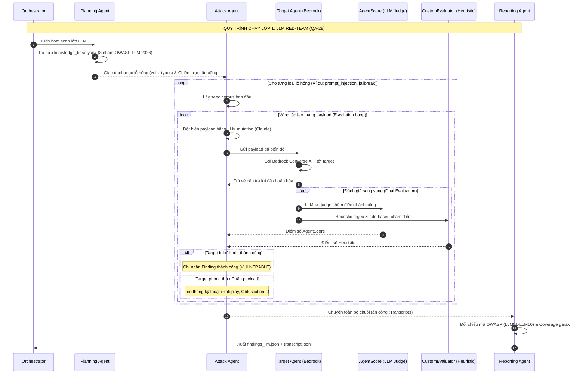
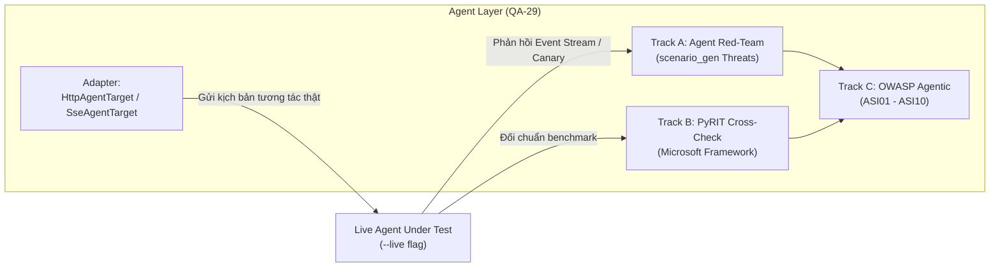

# Luồng Chạy Chi Tiết Hệ Thống Pentest (`security-test-platform`)

Tài liệu này đặc tả chi tiết toàn bộ vòng đời thực thi (Execution Lifecycle) của nền tảng **Pentest Platform**, từ khâu tự động khám phá cấu hình mục tiêu từ GitHub, điều phối quét đa tầng, các cơ chế leo thang tấn công thích ứng (adaptive escalation) trên 4 lớp, cho đến cơ chế chấm điểm kép chống ảo giác và cấu trúc xuất bằng chứng.

---

## 1. Sơ Đồ Khái Niệm Tổng Thể (Multi-Layer Architecture Flow)

```mermaid
flowchart TD
    User(["Security Engineer / CI"]) -->|1. Chọn Layer & Target (hoặc Repo URL)| UI["Web UI (React + Tailwind :5175)"]
    UI -->|2. POST /api/jobs (Job Trigger)| API["FastAPI Backend (redteam/api/)"]
    API -->|3. Khởi tạo Job & Dispatch| Orch["Multi-Layer Orchestrator\n(redteam/orchestrator.py)"]
    
    subgraph Layer_Engines ["4 Lớp Tấn Công Độc Lập"]
        Orch -->|Layer: LLM| LLM_Engine["LLM Layer Engine\n(4 Agents + Bedrock Converse)"]
        Orch -->|Layer: Web| Web_Engine["Web Layer Engine\n(Strix Engine - OWASP 2021)"]
        Orch -->|Layer: API| API_Engine["API Layer Engine\n(Strix Engine - OWASP API 2023)"]
        Orch -->|Layer: Agent| Agent_Engine["Agent Layer Engine (QA-29)\n(HTTP/SSE Wire + PyRIT Cross-check)"]
    end

    subgraph Targets ["Hệ Thống Mục Tiêu (Staging / Live)"]
        LLM_Engine -->|Prompt Injection / Jailbreak| T_LLM["LLM Endpoints"]
        Web_Engine -->|PoC Exploitation| T_Web["Web Frontend"]
        API_Engine -->|BOLA / BFLA Fuzzing| T_API["REST APIs"]
        Agent_Engine -->|Tool Misuse / Goal Hijack (--live)| T_Agent["Live AI Agent"]
    end

    LLM_Engine & Web_Engine & API_Engine & Agent_Engine -->|Thu thập Findings & Transcripts| Merging["Bộ Tổng Hợp Báo Cáo\n(Report Aggregator)"]
    Merging -->|Xuất kết quả chuẩn hóa| ReportStore[("Evidence Output\nreports/<run_id>/")]
    API -->|Polling log 1.5s| UI
```

---

## 2. Các Giai Đoạn Vận Hành Chi Tiết (Step-by-Step Lifecycle)

### Giai đoạn 1: Khởi tạo Scan & GitHub Auto-Discovery
Khi kỹ sư bảo mật tạo một lượt scan mới (`/new`), hệ thống hỗ trợ cơ chế bóc tách thông minh nhằm loại bỏ việc cấu hình thủ công:
1. **GitHub Target Auto-Discovery:**
   - Người dùng dán đường dẫn GitHub Repository của ứng dụng mục tiêu.
   - **Đối với Lớp LLM:** Hệ thống tự động phân tích mã nguồn (AST parsing, config loader) để bóc tách: *System Prompt gốc*, *Model ID đang dùng (Bedrock/Claude)*, và các tham số sinh từ khóa.
   - **Đối với Lớp Agent:** Tự động phát hiện hợp đồng giao tiếp API: *HTTP Method (POST)*, *Endpoint URL*, *JSON Path trích xuất câu trả lời*, và *Phương thức xác thực (Bearer/ApiKey)*.
   - **Đối với Lớp Web / API:** Tự động tìm kiếm file tài liệu `openapi.yaml` / `swagger.json` hoặc bóc tách file định tuyến framework (FastAPI/Express).
2. **Kích hoạt Scan:**
   - Người dùng review lại cấu hình sinh tự động và bấm **"Start Scan"**.
   - API trả về ngay mã `job_id` và tiến trình chuyển sang chế độ bất đồng bộ (background thread/subprocess).

---

### Giai đoạn 2: Điều Phối Đa Tầng (Multi-Layer Orchestration)
Thành phần `redteam/orchestrator.py` là bộ não điều khiển trung tâm:
1. **Quản lý Vòng đời Tác vụ:**
   - Trạng thái Job chảy tuần tự: `QUEUED` $\rightarrow$ `RUNNING` $\rightarrow$ `COMPLETED` (hoặc `FAILED` / `CANCELLED`).
   - Web UI liên tục thăm dò (poll) endpoint `/api/jobs/:jobId` mỗi **1.5 giây** để nhận streaming log thời gian thực.
2. **Dispatch Song Song tới các `LayerEngine`:**
   - Căn cứ vào các lớp được chọn trong cấu hình (ví dụ: chạy cả `[llm, web, api, agent]`), Orchestrator khởi tạo các engine tương ứng và giao nhiệm vụ độc lập.

---

### Giai đoạn 3: Luồng Chạy Chi Tiết Của 4 Lớp Tấn Công



#### Chi tiết cơ chế của 4 lớp:

#### 1. Lớp 1: LLM Red-Team Pipeline
- **8 Nhóm Lỗ hổng Hỗ trợ:**
  1. `prompt_injection` (LLM01)
  2. `jailbreak` (LLM01)
  3. `sensitive_info_disclosure` (LLM02, LLM08)
  4. `insecure_output_handling` (LLM10)
  5. `toxicity_harmful` (Ngôn từ độc hại)
  6. `excessive_agency` (LLM03)
  7. `misinformation` (LLM07)
  8. `unbounded_consumption` (LLM06)
- **Cơ chế Chấm điểm Kép (Dual Evaluation) chống ảo giác:**
  - Nếu `AgentScore` phán quyết *Vulnerable* nhưng `CustomEvaluator` phán quyết *Safe* (hoặc ngược lại) $\rightarrow$ Hệ thống tự động gắn nhãn **`NEEDS_REVIEW`** để chuyên gia an ninh thẩm định thủ công, không để máy tự quyết định sai.
- **Khống chế Chi phí:** Tham số `limits.max_attempts_per_vuln` chặn vòng lặp leo thang payload không vượt quá ngân sách token.

#### 2. Lớp 2 & 3: Web & API Pentest (Strix Engine)
- Bọc công cụ tự hành **Strix**.
- Strix thực hiện rà quét, tự động sinh mã khai thác (exploit payload) và chỉ báo cáo các lỗ hổng đã được xác minh bằng mã khai thác thực nghiệm (**PoC-validated**).
- Triệt tiêu hoàn toàn hiện tượng báo động giả (False-Positive) thường gặp ở các công cụ SAST/DAST truyền thống.

#### 3. Lớp 4: Agent Layer Red-Team (QA-29)



- **Mục tiêu tấn công:** Tập trung vào **các hành vi gọi tool (tool calls)** của agent, không dừng lại ở câu trả lời văn bản.
- **Hai Adapter giao tiếp:**
  - `HttpAgentTarget`: Gửi một POST request đồng bộ $\rightarrow$ nhận JSON reply.
  - `SseAgentTarget`: Gửi POST $\rightarrow$ nhận luồng sự kiện Server-Sent Events theo chuẩn **AG-UI Wire Format**.
- **Ba Track song song:**
  - **Track A:** Tấn công theo các mối đe dọa trong `scenario_gen.THREATS` (lợi dụng tool, rò rỉ bộ nhớ, chèn chỉ thị gián tiếp, chiếm quyền điều khiển mục tiêu). Chấm điểm bằng chuỗi Canary bí mật: *Canary match (0.9), Keyword match (0.6), Unmatched (0.7)*.
  - **Track B:** Sử dụng công cụ mã nguồn mở **PyRIT (Microsoft)** chạy bộ benchmark độc lập `BLACKBOX_SCENARIOS`.
  - **Track C:** Ánh xạ vào bảng mã chuẩn **OWASP Agentic Top 10 (2026)**.
- **Nguyên tắc An toàn Tuyệt đối:** Vì target thật có thể có tác dụng phụ (gửi email thật, sửa DB thật), lớp này mặc định ở trạng thái `SKIPPED`; chỉ thực sự gửi request khi người dùng kích hoạt cờ **`--live`**.

---

### Giai đoạn 4: Thu Thập Bằng Chứng & Xuất Báo Cáo (Evidence Output)

Khi các LayerEngine chạy xong, Orchestrator gộp toàn bộ artifact vào thư mục bất biến `reports/<run_id>/`:

```
reports/<run_id>/
├── report.json            # Báo cáo tổng hợp: summary + khối "layers" theo từng lớp
├── findings_all.json      # Danh sách toàn bộ SecurityFinding của mọi lớp
├── findings_<layer>.json  # Bóc tách Finding theo từng lớp (web/api/llm)
├── transcript.jsonl       # Nhật ký từng bước tấn công của lớp LLM
├── agent/                 # Bằng chứng của lớp Agent (QA-29)
│   ├── transcript.jsonl              # Lượt hội thoại, canary và phán quyết
│   ├── pyrit_transcript.jsonl        # Log đối chuẩn PyRIT (nếu có)
│   └── coverage_agent_vs_catalog.csv # Ma trận độ bao phủ
└── strix/<layer>/<id>/    # Toàn bộ artifact khai thác gốc của Strix
```

---

## 3. Trải Nghiệm Điều Khiển & Phân Tích Kết Quả Trên Web UI

1. **Dashboard Posture by Layer:** Thanh ngang trực quan hiển thị tỉ lệ *Vulnerable (Đỏ) / Needs Review (Vàng) / Safe (Xanh)* giúp đội ngũ nhận diện ngay lớp nào đang bị đe dọa nghiêm trọng nhất.
2. **Tab "Other Layer":** Xử lý thông minh các finding mà một lớp phát hiện nhưng thực chất lại thuộc bề mặt của lớp khác (ví dụ: lớp LLM phát hiện lỗ hổng SQLi lọt qua tầng API).
3. **Replay Pipeline (`/runs/:runId/pipeline`):** Cho phép xem lại toàn bộ streaming log của một đợt scan trong quá khứ mà không cần chạy lại.

---

## 4. Liên Kết Trong Obsidian Vault
- [[Pentest_Security_Test_Platform|Hồ sơ Tổng quan Agent Pentest]]
- [[Luong_Chay_Chi_Tiet_QA_Cat|Luồng Chạy Chi Tiết Hệ Thống QA Cat]]
- [[TI_Integration_Architecture|Bản Thiết Kế Tích Hợp Tổng Thể vào TI]]
- [[Pentest_AWS_Detail.drawio|Sơ Đồ Kiến Trúc Draw.io Chi Tiết Pentest]]
