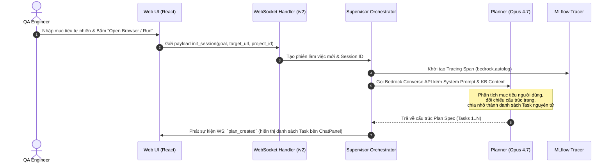
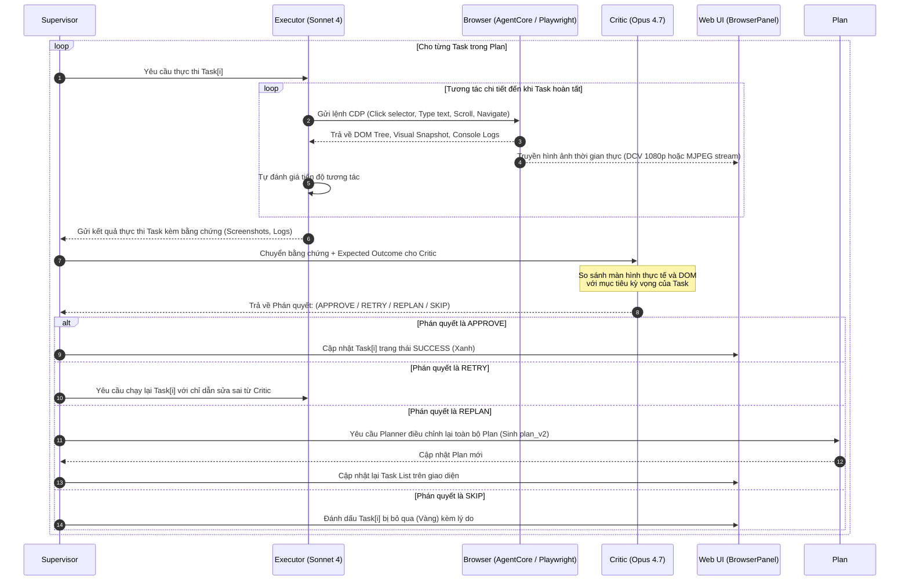

# Luồng Chạy Chi Tiết Hệ Thống QA Cat (`qa-agent`)

Tài liệu này đặc tả chi tiết toàn bộ vòng đời thực thi (Execution Lifecycle) của nền tảng **QA Cat**, từ khâu khởi tạo dự án, phân rã mục tiêu, điều khiển trình duyệt, vòng lặp đánh giá của các sub-agents cho đến khâu xuất bằng chứng và giám sát qua MLflow.

---

## 1. Sơ Đồ Khái Niệm Tổng Thể (Architecture Flow)

```mermaid
flowchart TD
    User(["QA Engineer"]) -->|1. Nhập URL & Mục tiêu tự nhiên| UI["Web UI (React 18 + Zustand)"]
    UI -->|2. WebSocket v2 (/api/ws/agent/v2)| Supervisor["Supervisor Orchestrator\n(FastAPI :8000)"]
    
    subgraph MultiAgent_Loop ["Vòng lặp Multi-Agent (AWS Bedrock)"]
        Supervisor -->|3. Yêu cầu lập kế hoạch| Planner["Planner Agent\n(Claude Opus 4.7)"]
        Planner -->|4. Test Plan v1 (Tasks)| Supervisor
        Supervisor -->|5. Giao Task hiện tại| Executor["Executor Agent\n(Claude Sonnet 4)"]
        
        Executor -->|6. Lệnh điều khiển CDP| Browser{"Browser Backend\n(AgentCore / Playwright)"}
        Browser -->|7. DOM, Screenshot, Logs| Executor
        Executor -->|8. Task Execution Result| Supervisor
        
        Supervisor -->|9. Thẩm định kết quả| Critic["Critic Agent\n(Claude Opus 4.7)"]
        Critic -->|10. Phán quyết:\nAPPROVE / RETRY / REPLAN / SKIP| Supervisor
    end

    Supervisor -->|11. Replan nếu fail| Planner
    Supervisor -->|12. Tracing & Metrics| MLflow["MLflow Observability\n(sqlite:///mlflow.db)"]
    Supervisor -->|13. Stream trạng thái & Video live| UI
    Supervisor -->|14. Lưu trữ Session & Artifacts| SQLite[("SQLite Database\n(qa-agent-data/)")]
```

---

## 2. Các Giai Đoạn Vận Hành Chi Tiết (Step-by-Step Lifecycle)

### Giai đoạn 1: Thiết lập & Khởi tạo Ngữ cảnh (Project Setup)
Mọi tác vụ trong QA Cat đều được đóng gói theo phạm vi **Project** (Tenant Scope):
1. **Khởi tạo qua Wizard 5 bước (`/projects/new`):**
   - **Bước 1 - Identity:** Nhập Tên dự án, Target URL cần kiểm thử.
   - **Bước 2 - Knowledge Base (KB):** Tải lên tài liệu nghiệp vụ (PDF, DOCX, spec) hoặc link SharePoint.
   - **Bước 3 - Chunk Recipe:** Cấu hình chiến lược phân mảnh văn bản (bot-aligned chunking) phục vụ tìm kiếm ngữ nghĩa với `Titan Embed v2`.
   - **Bước 4 - Guardrail & Persona:** Thiết lập các chốt chặn an toàn và vai trò của agent.
   - **Bước 5 - Test Plan:** Nạp test suite có sẵn (CSV/JSON) hoặc chọn chế độ tự động sinh.
2. **Quản lý phiên làm việc (Session & URL State):**
   - URL trạng thái hỗ trợ khôi phục tiến độ: `/projects/new?resume=<id>&step=<n>`.
   - Toàn bộ metadata, lịch sử chat, các plan version được lưu bền vững trong SQLite tại `./qa-agent-data/`.

---

### Giai đoạn 2: Tiếp nhận Mục tiêu & Phân rã Kế hoạch (Planning Phase)



- **Mô hình AI sử dụng:** **Claude Opus 4.7** (được chọn vì năng lực suy luận sâu, tránh thiếu sót các bước phụ thuộc).
- **Đặc điểm Plan:** Plan được đánh số version bất biến (`plan_v1`). Mỗi task có:
  - `task_id`: Định danh duy nhất.
  - `description`: Mô tả hành động cụ thể cần làm.
  - `expected_outcome`: Điều kiện nghiệm thu thành công của task.

---

### Giai đoạn 3: Thực thi Trình duyệt & Vòng lặp Multi-Agent (Execution Loop)

Đây là trái tim của hệ thống QA Cat, vận hành theo cơ chế khép kín **Executor $\rightarrow$ Browser $\rightarrow$ Critic**:



#### Hai chế độ Browser Backend:
1. **`agentcore` (Production / Demo):**
   - Trình duyệt điều khiển từ xa trên đám mây AWS thông qua **AWS AgentCore Browser**.
   - Kết nối bằng giao thức Chrome DevTools Protocol (CDP) có ký chứng thực **AWS SigV4**.
   - Hiển thị trực tiếp lên Web UI thông qua iframe **DCV Web Viewer** độ phân giải full HD (1920×1080).
   - Hỗ trợ tính năng **"Take Control"**: Người dùng có thể bấm nút để trực tiếp can thiệp chuột/phím vào trình duyệt, sau đó trả quyền lại cho Agent.
2. **`playwright_local` (Dev / Local CI):**
   - Chạy Playwright headless Chromium ngay trong container/local.
   - Stream khung hình qua chuẩn **MJPEG** kèm lớp phủ (overlay) tương tác.

---

### Giai đoạn 4: Đánh Giá Chất Lượng GenAI & Tracing (MLflow Observability)

Bên cạnh luồng UI Browser, QA Cat còn vận hành song song luồng **RAGAS / MLflow Evaluation** để kiểm định Chatbot:
1. **Thu thập dữ liệu:** Đọc bộ câu hỏi kiểm thử từ file CSV/JSON hoặc trực tiếp từ tương tác của bot trên UI.
2. **Gọi Bedrock Judge Adapter (`bedrock_judge_adapter.py`):**
   - Khắc phục lỗi tương thích của MLflow Gateway với AWS Bedrock bằng cách định tuyến trực tiếp qua `boto3 Converse API`.
   - Chấm điểm 4 metric cốt lõi:
     - **Faithfulness:** Câu trả lời có căn cứ từ tài liệu KB không?
     - **Answer Relevancy:** Câu trả lời có giải quyết đúng trọng tâm câu hỏi không?
     - **Context Precision:** Các đoạn trích dẫn có chuẩn xác không?
     - **Context Recall:** Có bỏ sót thông tin quan trọng nào trong tài liệu không?
3. **Ghi nhận Tracing (Non-breaking Opt-in):**
   - Mọi lượt gọi LLM được ghi nhận span: Token input/output, Latency (p50/p90/p99), Cost ước tính.
   - Dữ liệu lưu tại `./qa-agent-data/mlflow.db`. Người dùng có thể theo dõi qua tab **Lab** trên giao diện hoặc gõ lệnh CLI `qa-agent mlflow` để mở MLflow UI đầy đủ.

---

## 3. Các Trạng Thái & Xử Lý Ngoại Lệ (Error Handling)

| Tình huống lỗi | Hành vi xử lý của hệ thống |
| :--- | :--- |
| **Element không tìm thấy trên DOM** | Executor tự động thử các chiến lược fallback: tìm theo text, aria-label, hoặc chụp screenshot dùng Vision để xác định tọa độ click. |
| **Task lặp lại quá số lần quy định** | Nếu Critic từ chối `RETRY` vượt quá `max_attempts` (mặc định 3 lần) $\rightarrow$ Tự động chuyển sang `REPLAN` hoặc đánh dấu `FAILED`. |
| **Mất kết nối WebSocket / Trình duyệt** | Supervisor giữ trạng thái trong SQLite. Khi người dùng refresh trang, UI tự động kết nối lại và khôi phục đúng bước đang chạy. |
| **Lỗi ghi Tracing MLflow** | Tự động degrade về no-op handle, tuyệt đối không làm gián đoạn luồng test chính của trình duyệt. |

---

## 4. Liên Kết Trong Obsidian Vault
- [[QA_Agent_QA_Cat|Hồ sơ Tổng quan Agent QA Cat]]
- [[Luong_Chay_Chi_Tiet_Pentest|Luồng Chạy Chi Tiết Hệ Thống Pentest]]
- [[TI_Integration_Architecture|Bản Thiết Kế Tích Hợp Tổng Thể vào TI]]
- [[QA_Cat_AWS_Detail.drawio|Sơ Đồ Kiến Trúc Draw.io Chi Tiết QA Cat]]
