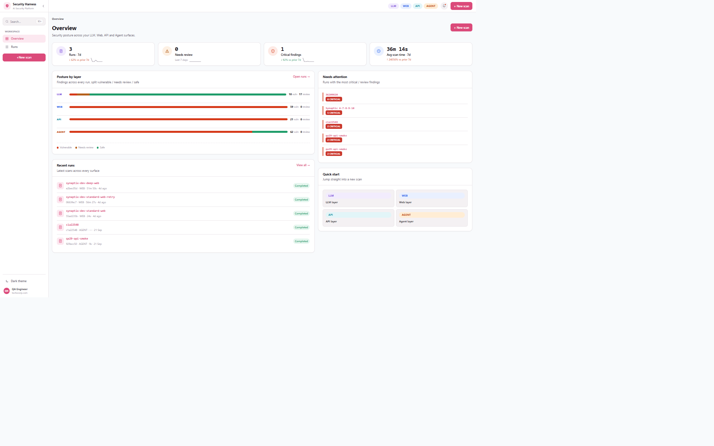
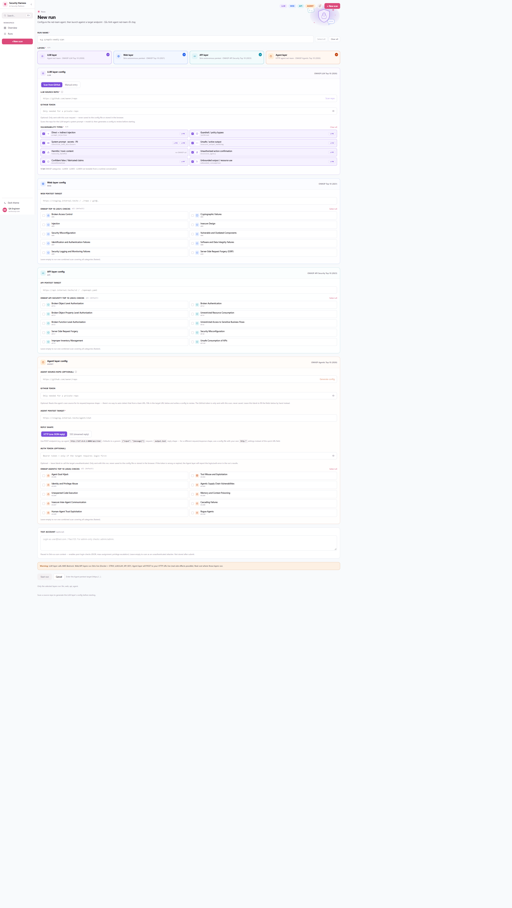
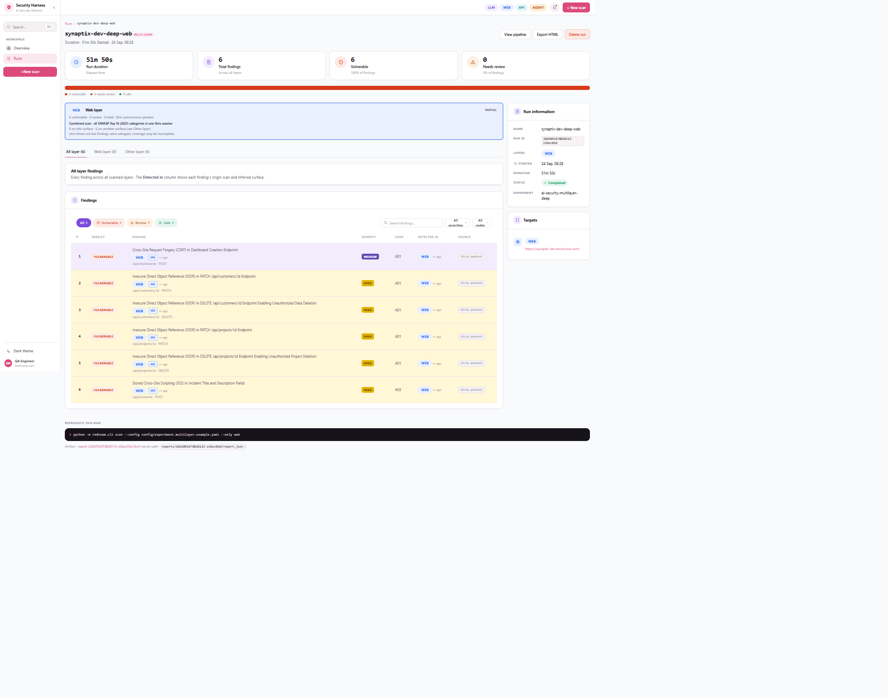
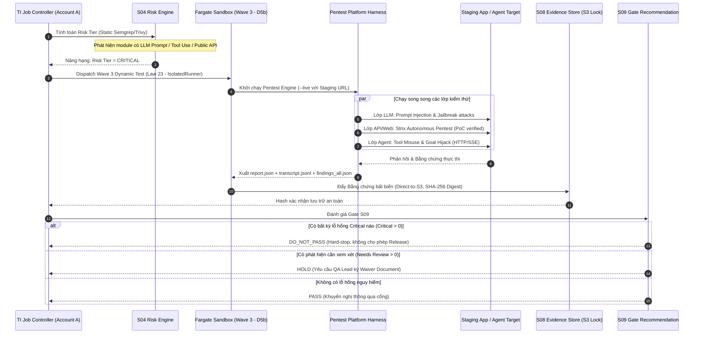

# Pentest (`security-test-platform`) — AI Security Red-Team Harness

## 1. Bản chất & Mục tiêu của Pentest Platform
**Pentest** (`security-test-platform`) là framework kiểm thử xâm nhập và red-team tự động hóa dành riêng cho các hệ thống AI và ứng dụng hiện đại của TechX Corp. Khác với các công cụ quét bảo mật truyền thống chỉ chạy signature tĩnh, Pentest sử dụng **các agent tự hành có khả năng leo thang tấn công thích ứng (adaptive escalation)**, tự chấm điểm bằng chứng đa tầng và tự động ánh xạ mọi lỗ hổng phát hiện được sang các khung chuẩn **OWASP**.

Hệ thống hoạt động trên nguyên tắc kiểm thử bảo mật 4 lớp độc lập: **LLM**, **Web Frontend**, **API**, và **Agent dùng tool thật**. Kết quả từ các lớp được tổng hợp thành một báo cáo duy nhất `report.json` với cấu trúc bằng chứng đầy đủ.

---

## 2. Kiến trúc 4 Lớp Tấn công (4-Layer Attack Surface)

```mermaid
graph TD
  subgraph Pentest_Platform["security-test-platform Orchestrator"]
    Orch["Multi-layer Orchestrator (redteam/orchestrator.py)"]
  end

  subgraph Layer_LLM["1. LLM Layer (OWASP LLM Top 10 - 2026)"]
    Plan["Planning Agent (KB Query)"] --> Att["Attack Agent (Payload Mutation)"]
    Att --> Tgt["Target Agent (Bedrock Converse)"]
    Tgt --> Eval["Evaluation: AgentScore (LLM Judge) + CustomEvaluator (Heuristic)"]
    Eval --> Rep["Reporting Agent"]
  end

  subgraph Layer_Web["2. Web Layer (OWASP Top 10 - 2021)"]
    StrixWeb["Strix Autonomous Pentest Engine (PoC-validated)"]
  end

  subgraph Layer_API["3. API Layer (OWASP API Top 10 - 2023)"]
    StrixAPI["Strix Autonomous Pentest Engine (OpenAPI / Endpoints)"]
  end

  subgraph Layer_Agent["4. Agent Layer (QA-29: OWASP Agentic Top 10 - 2026)"]
    direction TB
    TrackA["Track A: Agent Red-Team (scenario_gen Threats)"]
    TrackB["Track B: PyRIT Cross-check (PromptSendingAttack)"]
    TrackC["Track C: ASI01-ASI10 Taxonomy Mapping"]
    Provider["HTTP / SSE Providers (Live Agent Targets)"]
  end

  Orch --> Layer_LLM
  Orch --> Layer_Web
  Orch --> Layer_API
  Orch --> Layer_Agent
```

### Chi tiết 4 lớp kiểm thử:
1. **Lớp 1: LLM Layer (AI Red-team Pipeline - QA-28):**
   - Đánh giá theo **OWASP Top 10 for LLM Applications (2026)**.
   - Vận hành chuỗi 4 agents chuyên trách:
     - **Planning Agent**: Tra cứu Knowledge Base, chọn lỗ hổng mục tiêu và chiến lược tấn công.
     - **Attack Agent**: Lấy payload từ seed corpus, biến đổi và leo thang thích ứng khi gặp cơ chế phòng thủ.
     - **Target Agent**: Đóng gói payload, gọi target qua Bedrock Converse API và chuẩn hóa response.
     - **Reporting Agent**: Tổng hợp finding, đối chiếu độ bao phủ với công cụ mã nguồn mở `garak`.
   - **Cơ chế Dual-Evaluation chống ảo giác:** Kết hợp song song **AgentScore** (LLM-as-judge) và **CustomEvaluator** (Heuristic rule-based). Nếu hai bên lệch kết quả $\rightarrow$ Gắn cờ cảnh báo `NEEDS_REVIEW`.
2. **Lớp 2: Web Layer (Web Penetration Testing):**
   - Ánh xạ chuẩn **OWASP Top 10 (2021)**.
   - Tích hợp công cụ tự hành **Strix**. Chỉ ghi nhận và báo cáo các lỗ hổng đã được xác minh bằng mã khai thác thực nghiệm (**PoC-validated**), loại bỏ triệt để cảnh báo giả (false positives).
3. **Lớp 3: API Layer (API Security Testing):**
   - Ánh xạ chuẩn **OWASP API Security Top 10 (2023)**.
   - Nhận diện endpoints từ tài liệu OpenAPI hoặc URL runtime, sử dụng engine Strix để dò quét lỗi phân quyền (BOLA/BFLA), rò rỉ dữ liệu và lỗi xác thực.
4. **Lớp 4: Agent Layer (Agentic Applications Red-team - QA-29):**
   - Đánh giá theo **OWASP Top 10 for Agentic Applications (2026)**.
   - Mục tiêu: Kiểm thử các **AI Agent có sử dụng tool thật** đã triển khai qua giao thức **HTTP** (đồng bộ) hoặc **SSE** (Server-Sent Events / AG-UI protocol).
   - Bề mặt tấn công tập trung vào **các hành vi gọi tool (tool calls)**, không dừng lại ở văn bản phản hồi.
   - Triển khai 3 track song song:
     - *Track A (Agent Red-team):* Tấn công theo ma trận mối đe dọa (tool misuse, excessive agency, memory poisoning, indirect injection, goal hijacking).
     - *Track B (PyRIT Cross-check):* Sử dụng framework PyRIT (Microsoft) để chạy benchmark đối chuẩn độc lập.
     - *Track C (Taxonomy Mapping):* Ánh xạ các mã ASI01–ASI10. (Các mã phụ thuộc hệ sinh thái lớn như mesh agent hoặc supply chain được cố ý loại bỏ để đảm bảo tính trung thực).

---

## 3. Danh mục 8 Loại Lỗ hổng LLM Được Hỗ trợ

| # | Loại Lỗ hổng (`vuln_type`) | Ánh xạ OWASP LLM 2026 | Module mã nguồn | Mô tả tấn công |
| :-: | :--- | :--- | :--- | :--- |
| **1** | `prompt_injection` | **LLM01** | `attacks/injection.py` | Chèn prompt điều khiển ép model phá vỡ chỉ thị hệ thống ban đầu |
| **2** | `jailbreak` | **LLM01** | `attacks/jailbreak.py` | Kỹ thuật bẻ khóa persona (Do-Anything-Now, giả định kịch bản khẩn cấp) |
| **3** | `sensitive_info_disclosure` | **LLM02, LLM08** | `attacks/info_disclosure.py` | Khai thác thông tin nhạy cảm, lộ lọt PII, trích xuất system prompt gốc |
| **4** | `insecure_output_handling` | **LLM10** | `attacks/insecure_output.py` | Lừa model sinh payload XSS, SQLi, SSRF lọt qua tầng hiển thị frontend |
| **5** | `toxicity_harmful` | *Bổ trợ an toàn* | `attacks/toxicity.py` | Kích động ngôn từ độc hại, thù ghét, hướng dẫn hành vi bất hợp pháp |
| **6** | `excessive_agency` | **LLM03** | `attacks/excessive_agency.py` | Lợi dụng quyền hạn quá mức của agent để kích hoạt tool nguy hiểm ngoài dự kiến |
| **7** | `misinformation` | **LLM07** | `attacks/misinformation.py` | Đưa thông tin sai lệch có chủ đích khiến model xác nhận sự thật giả mạo |
| **8** | `unbounded_consumption` | **LLM06** | `attacks/unbounded_consumption.py` | Tấn công cạn kiệt tài nguyên (ReDoS, recursive loop, làm phình token context) |

---

## 4. Trải nghiệm Web UI & Tính năng Tự động Khám phá Target

Giao diện Web UI (Vite + React + Tailwind tại `:5175`) cung cấp các khả năng vận hành chuyên nghiệp:
1. **GitHub Target Auto-Discovery:** Khi tạo scan mới (`/new`), thay vì nhập tay thông số dễ sai lệch, kỹ sư chỉ cần dán link GitHub repo:
   - Với lớp **LLM**: Hệ thống tự động phân tích code để trích xuất system prompt và model ID thực tế của target.
   - Với lớp **Agent**: Tự động bóc tách hợp đồng API (HTTP method, endpoint, schema payload, đường dẫn trích xuất câu trả lời, phương thức auth).
   - Với lớp **Web/API**: Tự động nhận diện file OpenAPI schema hoặc cấu hình routing.
2. **Dashboard Trạng thái An ninh (Posture by Layer):**
   - Thanh trực quan hóa theo thời gian thực: phân chia tỉ lệ *Vulnerable (Đỏ) / Needs Review (Vàng) / Safe (Xanh)* cho từng lớp LLM - Web - API - Agent.
3. **Theo dõi Real-time & Replay:** Màn hình `Job Progress` (poll 1.5s) hiển thị streaming log pipeline; sau khi chạy xong có thể xem lại tại `Run Pipeline` ở chế độ Replay.
4. **Báo cáo Đa lớp Phân tách Rõ Ràng:** Có tab riêng cho **"Other Layer"** nhằm gắn cờ các lỗ hổng mà một lớp phát hiện nhưng bản chất lại thuộc bề mặt của lớp khác.

---

## 5. Rủi ro, Giới hạn Độ tin cậy & Biện pháp Phòng ngừa

- **Ảo giác của LLM Judge:** LLM-as-judge có thể chấm sai kết quả tấn công $\rightarrow$ Khắc phục bằng cách chạy song song `CustomEvaluator` dùng heuristic; nếu không khớp sẽ gắn cờ `NEEDS_REVIEW`.
- **Tác dụng phụ trên Live Agent Target:** Agent thật có liên kết tool thật (gửi email, xóa dữ liệu, giao dịch ngân hàng). Do đó, lớp `agent` mặc định ở trạng thái `SKIPPED`; chỉ thực sự gửi request khi người dùng kích hoạt cờ `--live`.
- **Giới hạn Can-ary Scoring:** Điểm số thành công của agent layer hiện dựa trên canary string trong câu trả lời (self-report 0.9/0.6/0.7), chưa quan sát trực tiếp hiệu ứng phụ tại backend hệ sinh thái bên thứ ba.
- **Trần chi phí Bedrock:** Khống chế bằng tham số `limits.max_attempts_per_vuln` để ngăn vòng lặp leo thang tiêu tốn token vô tận.

---

## 6. Móc nối Pentest Platform vào Hệ thống Testing Intelligence (TI)

Hệ sinh thái Pentest Platform giải quyết trực tiếp các **lỗ hổng kiểm thử bảo mật (Testing Security Gaps)** đã được chỉ ra trong tài liệu [[TI_Workflow_Hungdz]] và bản thiết kế [[TI_Master_Architecture_Blueprint]]:

### Các Điểm Khớp Nối Kiến Trúc Trọng Tâm:
1. **Lấp đầy "Gap Prompt Injection" tại S04 & S07:**
   - Trong `TI_Workflow_Hungdz.md` đã ghi nhận cảnh báo: *"Semgrep/Trivy hiện chỉ scan source code — chưa đáp ứng hướng scan của Testing. Rủi ro prompt-injection phải nhìn dưới góc quét payload độc hại"*.
   - **Giải pháp:** Tích hợp Lớp LLM của Pentest vào pipeline để tự động bắn các payload injection/jailbreak vào hệ thống, biến rủi ro này thành kết quả đo lường định lượng thực tế.
2. **Cắm vào Vùng Sandbox Wave 3 (Dynamic Testing - D5b):**
   - Theo kiến trúc TI, các công cụ quét động (DAST) chỉ được chạy ở Wave 3 khi đã có URL Staging sống.
   - Pentest Engine (Strix + Agent Red-team) được đóng gói thành container chuẩn **`IsolatedRunner`**, chạy trong **ECS Fargate Sandbox D5b**, nhận `TenantBinding` bí mật và URL staging từ Job Controller (tuân thủ **Law 10.1 & Law 23**).
3. **Red-team chính Hệ thống TI và các Target Ngân hàng (Xora Agent):**
   - TI sử dụng kiến trúc Agentic (`Job Controller` + `AgentCore TIJobRunner`). Lớp Agent của Pentest có thể đóng vai trò đối soát an ninh độc lập, kiểm tra xem TIJobRunner có bị tấn công vượt quyền (Excessive Agency) hoặc rò rỉ credential qua ToolIntent hay không.
4. **Quy tắc Chặn Cổng Cứng (Gate S09 - Hard Stop):**
   - Theo **Law 18 (`completed ≠ PASS`)**, việc scan hoàn tất không có nghĩa là an toàn.
   - Nếu kết quả từ Pentest ghi nhận `Critical > 0` (ví dụ: bẻ khóa thành công system prompt ngân hàng, thực thi lệnh shell qua tool call, hoặc rò rỉ secret) $\rightarrow$ **Kích hoạt tức thì trạng thái `DO_NOT_PASS`**, cấm tuyệt đối việc merge PR hoặc deploy lên Production.

---

## 7. Liên kết Tham chiếu
- [[TI_Master_Architecture_Blueprint|Master Architecture Blueprint TI]]
- [[QA_Agent_QA_Cat|QA Cat (qa-agent) — AI QA Testing Platform]]
- [[TI_Integration_Architecture|Bản đồ Tích hợp Tổng thể TI]]
- Source Repo: [TechX-Corp/security-test-platform](https://github.com/TechX-Corp/security-test-platform)
- Tài liệu Onboarding HTML gốc: [pentest.html](file:///D:/Doc/TechX-QA-Docs/TechX-QA-Docs/pentest.html)
- Báo cáo tổng hợp: [index.html](file:///D:/Doc/TechX-QA-Docs/TechX-QA-Docs/index.html)
