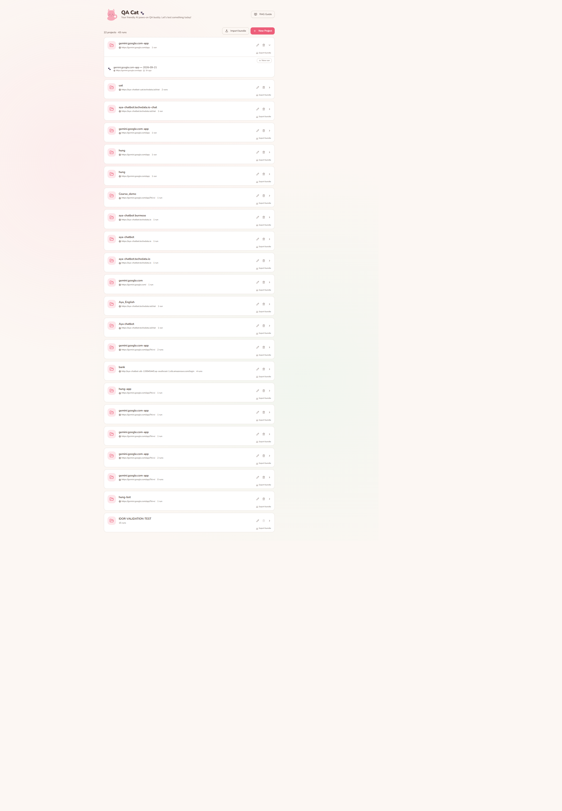
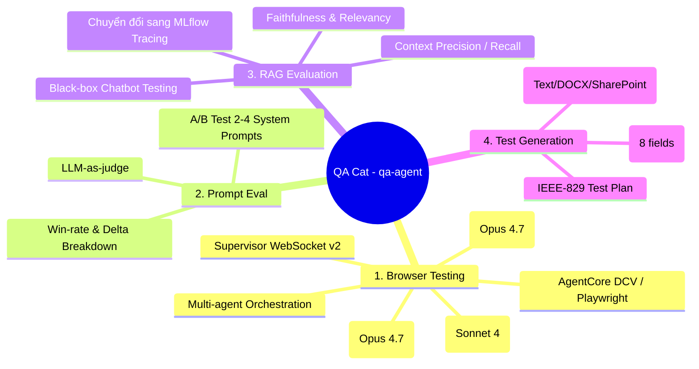
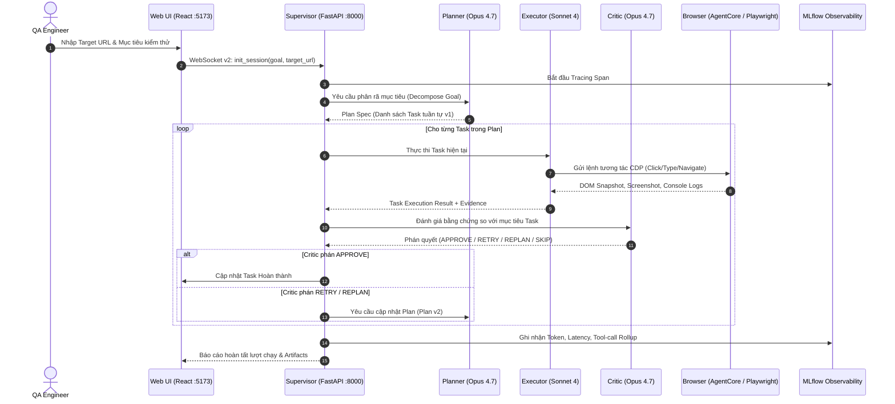
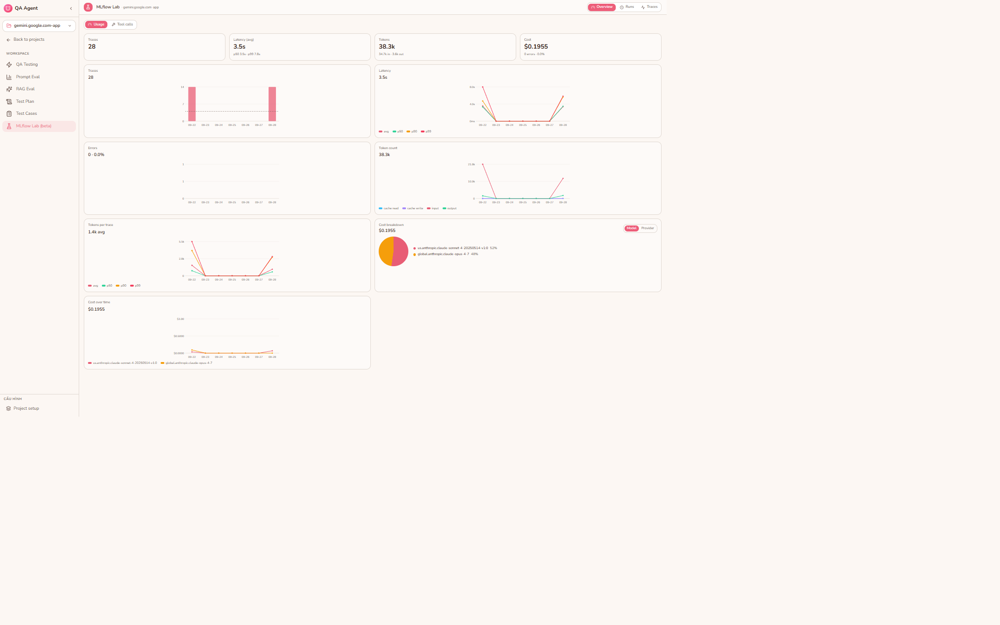

# QA Cat (`qa-agent`) — AI QA Testing Platform

## 1. Bản chất & Mục tiêu của QA Cat
**QA Cat** là nền tảng kiểm thử chất lượng phần mềm (AI QA Testing Platform) nội bộ của TechX Corp. Hệ thống hoạt động theo mô hình **Multi-agent** chạy trên nền **AWS Bedrock**, có khả năng điều khiển một trình duyệt thật (thông qua **Playwright local** hoặc **AWS AgentCore Browser**) để kiểm thử tự động giao diện Web, Chatbot và API; đồng thời cung cấp bộ công cụ đánh giá chuyên sâu cho GenAI/RAG và tự động sinh test artifacts từ tài liệu nghiệp vụ.

Hệ thống xoay quanh khái niệm **Project**: Cấu hình một lần (nguồn Knowledge Base, cách chunk, guardrail, target URL) qua wizard 5 bước, sau đó toàn bộ các module kiểm thử tự động scope dữ liệu theo Project được chọn.

---

## 2. Bốn Năng lực Lõi (Core Capabilities)

1. **Multi-Agent Browser Testing (Kiểm thử trình duyệt tự hành):**
   - Người dùng mô tả mục tiêu bằng ngôn ngữ tự nhiên (VD: *"Kiểm tra luồng đăng nhập và tạo giao dịch chuyển khoản"*).
   - **Planner** (Claude Opus 4.7): Phân tích mục tiêu, chia nhỏ thành các task khả thi.
   - **Executor** (Claude Sonnet 4): Điều khiển trình duyệt thật (click, fill, navigate, snapshot).
   - **Critic** (Claude Opus 4.7): Quan sát kết quả màn hình, phán quyết `APPROVE`, `RETRY`, `REPLAN`, hoặc `SKIP`.
   - **Supervisor**: Điều phối toàn bộ vòng lặp, quản lý WebSocket v2, lưu trữ plan bất biến theo từng version.
2. **Prompt Eval (A/B Testing System Prompts):**
   - Chạy thử nghiệm song song 2 đến 4 biến thể system prompt trên cùng một bộ test case chuẩn.
   - Judge LLM chấm điểm theo tiêu chí tùy biến, xuất bảng so sánh win-rate, điểm số trung bình và delta sai lệch từng tiêu chí.
3. **RAGAS Eval (Đánh giá Chatbot Black-box):**
   - Đánh giá chất lượng RAG Chatbot từ góc nhìn bên ngoài mà không cần can thiệp mã nguồn hay cơ sở tri thức nội bộ.
   - Đo lường 4 chỉ số vàng RAGAS: **Faithfulness** (Độ trung thực), **Answer Relevancy** (Độ liên quan), **Context Precision** (Độ chính xác ngữ cảnh) và **Context Recall** (Độ bao phủ ngữ cảnh).
   - Đang trong quá trình chuyển dịch sang **MLflow Tracing & Judges**.
4. **Test Plan / Test Case Generation (Sinh test tự động từ Requirement):**
   - Nhận diện yêu cầu thô (văn bản, PDF, DOCX, link SharePoint/Confluence).
   - Tự động sinh **Test Plan** chuẩn công nghiệp kiểu **IEEE-829**.
   - Sinh chi tiết các **Test Case** theo khuôn mẫu **SEAM-A 8 trường**, duy trì liên kết truy vết (traceability) ngược về kế hoạch ban đầu.

---

## 3. Kiến trúc Kỹ thuật & Luồng Dữ liệu (Workflow)

### 3.1. Stack Công nghệ
| Tầng | Công nghệ / Dịch vụ | Ghi chú kiến trúc |
| :--- | :--- | :--- |
| **Backend** | Python 3.14, FastAPI, native Playwright, `boto3` | Xử lý REST API, WebSocket v2 và điều phối agents |
| **LLM Tier** | AWS Bedrock Converse API | **Opus 4.7** (Planner, Critic) + **Sonnet 4** (Executor) |
| **Embeddings** | AWS Bedrock Titan Embed v2 | Dùng cho semantic search tài liệu KB và chấm điểm faithfulness |
| **Frontend** | React 18, Vite, TypeScript, Tailwind, shadcn/ui, Zustand | Giao diện Workspace 2 cột, hỗ trợ DCV live view iframe |
| **Browser Runtime** | AWS AgentCore Browser / Playwright Local | Cloud DCV remote browser (có nút "Take Control") hoặc Playwright MJPEG |
| **Storage** | SQLite | Lưu trữ session, chat history, plan runs, project config, test specs |
| **Observability** | `mlflow-skinny`, `mlflow.bedrock.autolog()` | Tracing LLM calls, span metrics, usage dashboard |

### 3.2. Sơ đồ Luồng Thực thi (End-to-End Workflow)

---

## 4. Trọng tâm Kỹ thuật Hiện tại: Chuyển dịch sang MLflow

Hiện tại nhóm phát triển đang hoàn thiện nhánh **`feat/mlflow-spike-phase-00`** nhằm chuyển dịch từ việc chấm điểm RAGAS thủ công sang nền tảng **MLflow GenAI Tracing & Evaluation**:
1. **Tracing Không Phá Vỡ (Non-breaking Opt-in):** Tracing chỉ kích hoạt khi có biến môi trường `MLFLOW_TRACKING_URI`. Mọi lỗi ghi log tự động degrade về no-op, tuân thủ nguyên tắc: *"Bộ đo không được phép làm hỏng đối tượng nó đang quan sát"*.
2. **Bedrock Native Autologging:** Kích hoạt `mlflow.bedrock.autolog()`, tự động bắt mọi token, latency, payload của Bedrock Converse API.
3. **Bedrock Judge Adapter (`bedrock_judge_adapter.py`):** Bản vá lỗi tương thích giữa MLflow và AWS Bedrock. Mặc định `GatewayAdapter` của MLflow đòi hỏi endpoint OpenAI-compatible; adapter này định tuyến trực tiếp qua Bedrock Converse boto3, cho phép dùng LLM-as-judge của MLflow trên hạ tầng AWS.
4. **Scoping theo Project:** Ghi tag `qa_agent.project_id` trên mọi trace để tab Lab lọc chuẩn xác theo từng dự án.

---

## 5. Móc nối QA Cat vào Hệ thống Testing Intelligence (TI)

Để đưa QA Cat vào kiến trúc tổng thể của [[TI_Master_Architecture_Blueprint]] và quy trình thực thi [[TI_Workflow_Hungdz]], các điểm tích hợp được xác định cụ thể như sau:

| Thành phần TI | Năng lực tương ứng từ QA Cat | Cơ chế Tích hợp & Quy chuẩn Tuân thủ |
| :--- | :--- | :--- |
| **S05 / S06 (Planning & Generation)** | Module `testgen` (Sinh Test Plan IEEE-829 & Test Case SEAM-A) | Cung cấp prompt template và schema sinh test case cho `TIJobRunner`. Đảm bảo đầu ra tuân thủ chuẩn **SEAM-A** 8 trường. |
| **S07 (UI Execution Runner)** | Multi-agent Browser Testing (Planner - Executor - Critic) | Đóng gói thành **IsolatedRunner Container** (chạy headless Playwright trên ECS Fargate Task D3). Chỉ nhận `ToolIntent JSON`, lấy `TenantBinding` từ Job Controller (Law 10.1). |
| **S07 (Model Evaluation)** | Module `ragas_eval` & MLflow Bedrock Judge Adapter | Đo lường chất lượng các chatbot và ứng dụng RAG trong hệ thống mục tiêu. Tích hợp trực tiếp vào trục kiểm thử GenAI của TI. |
| **S08 (Evidence Store)** | Traces, HAR file, Screenshot, DOM snapshot, Video run | Dữ liệu raw được băm `sha256Digest` và đẩy trực tiếp lên S3 Object Lock (Direct-to-S3, tuân thủ Law 16). |
| **S09 (Gate Recommendation)** | Bộ chỉ số GenAI (Faithfulness, Relevancy) | Cung cấp giá trị định lượng cho Gate: **Nếu Faithfulness < 0.85 → Kích hoạt trạng thái `HOLD`** (chặn tự động, yêu cầu Human-in-the-loop duyệt Waiver). |

### Các Luật Kiến trúc TI Cần Áp Dụng Chặt Chẽ:
- **Law 4.3 (Workflow Authority):** Toàn bộ trạng thái phiên chạy không để SQLite của QA Cat tự quyết; `Job Controller` trên Account A là System of Record duy nhất.
- **Law 5 & 7 (Deterministic Measurement & Zero Self-Declaration):** Critic Agent chỉ đưa ra nhận định bước; phán quyết Pass/Fail cuối cùng của toàn bộ Test Suite phải đo bằng assertion khách quan của Test Runner.
- **Law 18 (`completed ≠ PASS`):** Kịch bản browser chạy hết các bước (`completed`) không đồng nghĩa với việc chức năng ứng dụng đạt chuẩn (`PASS`).

---

## 6. Liên kết Tham chiếu
- [[TI_Master_Architecture_Blueprint|Master Architecture Blueprint TI]]
- [[Pentest_Security_Test_Platform|Pentest Security Test Platform (security-test-platform)]]
- [[TI_Integration_Architecture|Bản đồ Tích hợp Tổng thể TI]]
- Source Repo: [TechX-Corp/qa-agent](https://github.com/TechX-Corp/qa-agent)
- Tài liệu Onboarding HTML gốc: [qa-agent.html](file:///D:/Doc/TechX-QA-Docs/TechX-QA-Docs/qa-agent.html)
