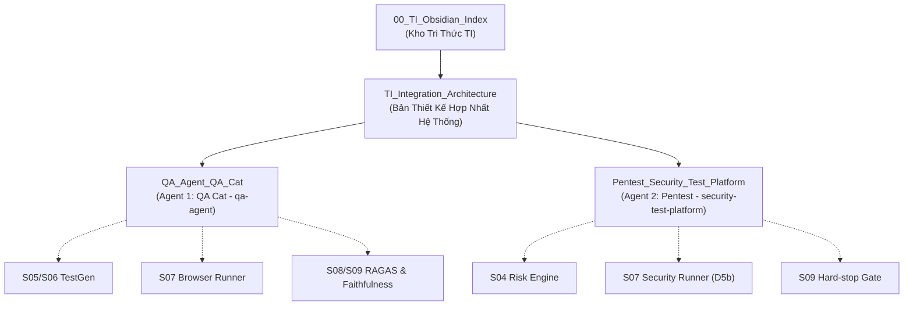

# Testing Intelligence (TI) — Obsidian Vault MOC

Chào mừng bạn đến với kho tài liệu số hóa **Testing Intelligence (TI)** của TechX Corp. Kho tài liệu này được cấu trúc theo chuẩn ghi chú liên kết (Zettelkasten / Obsidian Network Graph) nhằm kết nối toàn diện kiến trúc TI với hai nền tảng AI Agent cốt lõi: **QA Cat** và **Pentest Platform**.

---

## 🗺️ Bản Đồ Điều Hướng Tài Liệu (Navigation Hub)

---

## 📑 Danh Sách Hồ Sơ Agent & Kiến Trúc

### 1. [[QA_Agent_QA_Cat|Hồ sơ Agent 1: QA Cat (`qa-agent`)]]
- **Bản chất:** Nền tảng Multi-Agent QA trên AWS Bedrock.
- **Năng lực chính:**
  - Điều khiển trình duyệt thật (Playwright / AWS AgentCore Browser) với bộ 3 agent: **Planner (Opus 4.7) $\rightarrow$ Executor (Sonnet 4) $\rightarrow$ Critic (Opus 4.7)**.
  - A/B Testing và đánh giá System Prompt variants.
  - Đánh giá chất lượng RAG Chatbot theo chuẩn RAGAS (Faithfulness, Relevancy, Context Precision/Recall).
  - Tự động sinh Test Plan (IEEE-829) và Test Cases (SEAM-A 8 trường) từ tài liệu yêu cầu.
  - Tích hợp lớp quan sát **MLflow Tracing** & Bedrock Native Judge.
- **Trạng thái:** Hoàn thiện retest nhánh `feat/mlflow-spike-phase-00`.

### 2. [[Pentest_Security_Test_Platform|Hồ sơ Agent 2: Pentest Platform (`security-test-platform`)]]
- **Bản chất:** AI Security Red-Team Harness tự động hóa trên 4 lớp.
- **Năng lực chính:**
  - **Lớp LLM:** Tấn công tự thích ứng 8 nhóm lỗ hổng OWASP LLM 2026 (Prompt Injection, Jailbreak, Info Disclosure, Excessive Agency...).
  - **Lớp Web & API:** Tích hợp engine tự hành Strix (OWASP Top 10 & API Security Top 10) với các finding được xác thực bằng mã PoC thực tế.
  - **Lớp Agent (QA-29):** Red-team agent dùng tool thật qua HTTP/SSE (AG-UI format) và đối chuẩn độc lập với PyRIT (Microsoft).
  - Tự động khám phá target từ GitHub repo và bảng điều khiển trực quan *Posture by layer*.
- **Trạng thái:** Hoàn thiện retest nhánh `feat/qa-29-agent-layer`.

### 3. [[TI_Integration_Architecture|Bản Thiết Kế Tích Hợp Tổng Thể vào TI (Master Blueprint)]]
- **Nội dung:** Chiến lược hợp nhất 2 agent vào xương sống 10 chặng xử lý **S01–S10** của Testing Intelligence Platform.
- **Các luật kiến trúc cốt lõi áp dụng:**
  - **Law 4.3 (Workflow Authority):** Job Controller (Account A) nắm giữ quyền điều phối duy nhất.
  - **Law 5 & 7 (Deterministic Measurement):** Cấm AI tự khai báo kết quả; đo lường bằng assertion và PoC thật.
  - **Law 10.1 (ToolIntent Handshake):** Chỉ truyền parameter biểu tượng; bảo mật URL và credentials.
  - **Law 16 (Immutable Evidence Digest):** Băm SHA-256 đẩy trực tiếp lên S3 Object Lock.
  - **Law 18 (`completed ≠ PASS`):** Tách bạch trạng thái kỹ thuật và phán quyết an toàn tại Gate S09.
  - **Law 23 (IsolatedRunner):** Đóng gói runner container sandbox chuẩn hóa trên ECS Fargate.

### 4. [[Luong_Chay_Chi_Tiet_QA_Cat|Đặc Tả Luồng Chạy Chi Tiết: QA Cat (Execution Flow)]]
- **Nội dung:** Toàn bộ vòng đời thực thi từ khởi tạo Project Wizard 5 bước, Supervisor điều phối, phân rã mục tiêu (Planner Opus 4.7), điều khiển trình duyệt CDP (Executor Sonnet 4), thẩm định kết quả (Critic Opus 4.7 với APPROVE/RETRY/REPLAN), đến cơ chế đánh giá RAGAS và tracing qua MLflow.

### 5. [[Luong_Chay_Chi_Tiet_Pentest|Đặc Tả Luồng Chạy Chi Tiết: Pentest Platform (Execution Flow)]]
- **Nội dung:** Toàn bộ vòng đời thực thi từ khâu GitHub Auto-Discovery (bóc tách prompt & API contract), Multi-layer Orchestration, 4 Layer Engines (LLM red-team leo thang payload, Strix Web/API 100% PoC, Agent Layer QA-29 HTTP/SSE + PyRIT), cơ chế chấm điểm kép (Dual-Evaluation) chống ảo giác, đến cấu trúc xuất thư mục bằng chứng `reports/<run_id>/`.

---

## 🎨 Sơ Đồ Kiến Trúc AWS (Draw.io Diagrams)
- [[TechX_AWS_Core_Architecture.drawio|1. Sơ đồ Chính: Core AWS Architecture (Tối giản)]] — Toàn cảnh các service chính, tối giản ký tự, tập trung luồng lõi.
- [[QA_Cat_AWS_Detail.drawio|2. Sơ đồ Phụ: QA Cat Detailed Architecture]] — Chi tiết Private EC2, Docker Compose, AgentCore Browser DCV, MLflow Tracing.
- [[Pentest_AWS_Detail.drawio|3. Sơ đồ Phụ: Pentest Detailed 4-Layer Architecture]] — Chi tiết 4 lớp tấn công, Strix Engine, PyRIT, Adapters HTTP/SSE.
- [[TechX_Master_Architecture.drawio|4. Master Workbook (3-in-1 Tabs)]] — File tổng hợp chứa cả 3 sơ đồ trên theo từng tab riêng biệt.

---

## 🔗 Liên Kết Tài Liệu Kỹ Thuật Gốc (Workspace `D:\Doc`)
- [Master Architecture Blueprint TI](file:///D:/Doc/diagram/TI_Master_Architecture_Blueprint.md)
- [Quy trình Luồng Thực thi TI — Hùng QA Strategy](file:///D:/Doc/diagram/Hung/TI_Workflow_Hungdz.md)
- [Bảng Thuật Ngữ Chuẩn Hóa GLOSSARY_TI](file:///D:/Doc/Research/GLOSSARY_TI.md)
- [Báo cáo Nghiên cứu Công cụ Kiểm thử Task 1](file:///D:/Doc/Research/Task_1_Research_Tool_and_Framework_for_Testing.md)
- [Đề xuất Tích hợp Jev AI vào TI](file:///D:/Doc/Research/De_Xuat_Ap_Dung_Jev_AI_Vao_TI_Platform.md)
- [Báo cáo Tổng hợp HTML Nguồn TechX QA](file:///D:/Doc/TechX-QA-Docs/TechX-QA-Docs/index.html)
