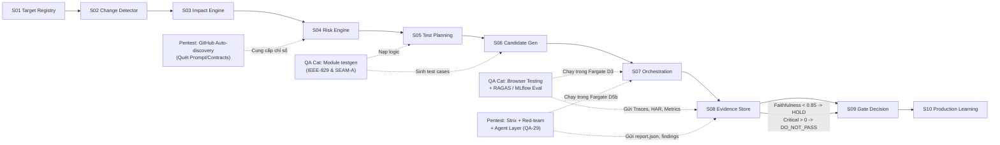
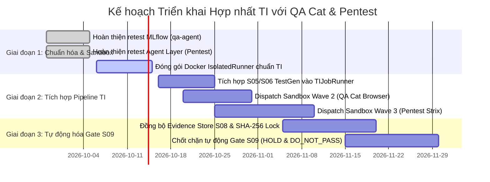

# Bản Thiết Kế Tích Hợp Hệ Thống: Đưa QA Cat & Pentest Platform vào Testing Intelligence (TI)

## 1. Tầm Nhìn Kiến Trúc Hợp Nhất

Hệ thống **Testing Intelligence (TI) Platform** được định vị là **Khung điều phối và thực thi kiểm thử đa miền toàn diện (Enterprise Test Execution & Evaluation Spine)** của TechX Corp. Trong khi đó:
- [[QA_Agent_QA_Cat|QA Cat (`qa-agent`)]] đại diện cho trục **Chất lượng Phần mềm & Đánh giá GenAI (Functional QA, Autonomous Browser Testing, RAGAS/MLflow Evaluation)**.
- [[Pentest_Security_Test_Platform|Pentest (`security-test-platform`)]] đại diện cho trục **An ninh Tự hành & Red-teaming Đa tầng (OWASP LLM, Web, API, Agentic Security)**.

Việc hợp nhất 2 nền tảng này vào TI sẽ hoàn thiện **bức tranh kiểm thử toàn diện từ Code tĩnh $\rightarrow$ Luồng nghiệp vụ $\rightarrow$ Trải nghiệm giao diện $\rightarrow$ An ninh đa tầng** cho các sản phẩm ngân hàng và ứng dụng AI (như Xora Banking Platform).

```
                      ┌──────────────────────────────────────────────┐
                      │    TESTING INTELLIGENCE (TI) PLATFORM        │
                      │       Control Plane - Account A              │
                      │  Job Controller (Workflow Authority - Law 4) │
                      └──────────────┬───────────────────────────────┘
                                     │
           ┌─────────────────────────┴────────────────────────┐
           ▼                                                  ▼
┌─────────────────────────────┐                    ┌─────────────────────────────┐
│    QA CAT (qa-agent)        │                    │ PENTEST PLATFORM (QA-30)    │
│  Trục Đảm bảo Chất lượng    │                    │  Trục Kiểm thử An ninh      │
├─────────────────────────────┤                    ├─────────────────────────────┤
│ • Planner / Executor / Critic│                    │ • LLM Red-team (8 Threats)  │
│ • Browser Testing (Playwright)│                   │ • Web & API Pentest (Strix) │
│ • RAGAS & MLflow Evaluation │                    │ • Agent Layer (HTTP / SSE)  │
│ • TestGen (IEEE-829, SEAM-A)│                    │ • PyRIT Cross-check         │
└─────────────────────────────┘                    └─────────────────────────────┘
           │                                                  │
           └─────────────────────────┬────────────────────────┘
                                     ▼
                      ┌──────────────────────────────┐
                      │      S08 EVIDENCE STORE      │
                      │  S3 Object Lock (Direct S3)  │
                      │  SHA-256 Digest (Law 16)     │
                      └──────────────┬───────────────┘
                                     ▼
                      ┌──────────────────────────────┐
                      │  S09 DECISION GATE (Law 18)  │
                      │    PASS / HOLD / DO_NOT_PASS │
                      └──────────────────────────────┘
```

---

## 2. Ma Trận So Sánh & Bổ Trợ Giữa 2 Agent

| Tiêu chí | [[QA_Agent_QA_Cat|QA Cat (`qa-agent`)]] | [[Pentest_Security_Test_Platform|Pentest (`security-test-platform`)]] |
| :--- | :--- | :--- |
| **Mục tiêu tối thượng** | Đảm bảo tính đúng đắn chức năng, trải nghiệm người dùng và chất lượng GenAI/RAG. | Phát hiện lỗ hổng bảo mật, nguy cơ bị tấn công và lạm quyền hệ thống. |
| **Bề mặt kiểm thử** | Web UI (DOM, tương tác người dùng), Chatbot trả lời, System Prompt, API specs. | LLM Prompts, Web Application (OWASP 2021), REST API (OWASP API 2023), Tool Calls của Agent. |
| **Mô hình Agent con** | **Planner (Opus 4.7) $\rightarrow$ Executor (Sonnet 4) $\rightarrow$ Critic (Opus 4.7)** được điều phối bởi Supervisor qua WebSocket v2. | **Planning $\rightarrow$ Attack $\rightarrow$ Target $\rightarrow$ Evaluation $\rightarrow$ Reporting** được điều phối bởi multi-layer Orchestrator. |
| **Công nghệ lõi** | Playwright, AWS AgentCore Browser (DCV), Bedrock Converse, RAGAS, MLflow Tracing. | Bedrock Converse, Strix Autonomous Pentest, PyRIT (Microsoft), Heuristic Evaluator. |
| **Cơ chế phán quyết** | Critic phán quyết: `APPROVE`, `RETRY`, `REPLAN`, `SKIP`. Metric: RAGAS / MLflow Score. | Dual Evaluation: `AgentScore` (LLM-as-judge) + `CustomEvaluator` (Heuristic). Lệch $\rightarrow$ `NEEDS_REVIEW`. |
| **Môi trường Sandbox** | Đang chạy tại `qa-agent.techxcorp.com` (EC2 Private qua SSM + Docker Compose). | Đang chạy local `:5175`, chuẩn bị deploy domain `pentest.techxcorp.com`. |
| **Trọng tâm hiện tại** | Nhánh `feat/mlflow-spike-phase-00`: Tracing Bedrock, Bedrock Judge Adapter, tab Lab. | Nhánh `feat/qa-29-agent-layer`: Red-team Agent dùng tool qua HTTP/SSE + PyRIT cross-check. |

---

## 3. Bản Đồ Ánh Xạ Vào Chuỗi 10 Chặng Xử Lý Của TI (S01 – S10)



### Chi tiết từng giai đoạn:

### 3.1. Chặng S04: Đánh Giá Rủi Ro (Risk Engine)
- **Đóng góp của Pentest:**
  - `GitHub Target Discovery` tự động quét kho mã nguồn để bóc tách: System prompt, mô hình LLM sử dụng, và danh sách các tool mà agent được phép gọi.
  - Nếu PR chạm vào các file cấu hình prompt nhạy cảm hoặc cấp thêm quyền cho tool nguy hiểm $\rightarrow$ S04 tự động nâng mức **`Risk Tier: CRITICAL`**.
- **Đóng góp của QA Cat:**
  - Module `Prompt Eval` phát hiện độ biến thiên (delta) giữa prompt cũ và prompt mới; nếu độ lệch vượt ngưỡng dung sai $\rightarrow$ Tăng điểm rủi ro hồi quy (Regression Risk).

### 3.2. Chặng S05 & S06: Lập Kế Hoạch & Sinh Test Candidate
- **Đóng góp của QA Cat:**
  - Nhập tài liệu đặc tả (SRS/Confluence/PR Diff), module `testgen` tự động sinh **Test Plan chuẩn IEEE-829** và **Candidate Test Cases chuẩn SEAM-A 8 trường**.
  - Đảm bảo tính truy vết (traceability) từ requirement đến từng bước assert mà không cần QA engineer phải viết thủ công.

### 3.3. Chặng S07: Điều Phối Thực Thi (Orchestration & Sandboxing)
Cả 2 agent được chuẩn hóa thành các container chạy trong **ECS Fargate Sandbox** theo cơ chế **IsolatedRunner (Law 23)**:
- **Wave 2 (Functional Execution):**
  - **QA Cat Browser Runner (Sandbox D3):** Nhận kịch bản từ S06, kích hoạt cụm 3 agent (Planner - Executor - Critic) lái Playwright headless tương tác với Web Staging.
  - **QA Cat RAGAS/MLflow Runner:** Chạy kịch bản kiểm thử black-box đo 4 chỉ số RAGAS trên các chatbot ngân hàng.
- **Wave 3 (Dynamic Security Execution - D5b):**
  - **Pentest Strix Runner:** Chạy dò quét OWASP Web & API trên URL Staging thực tế (chỉ báo cáo lỗi PoC-validated).
  - **Pentest Agent Red-team Runner:** Bắn các kịch bản payload (OWASP LLM & Agentic Top 10) vào endpoint HTTP/SSE của target với cờ `--live`.

### 3.4. Chặng S08 & S09: Thu Thập Bằng Chứng & Phán Quyết Cổng (Decision Gate)
- **Thu thập bằng chứng (S08 - Law 16):**
  - QA Cat xuất ra: Video lượt chạy, ảnh chụp màn hình từng bước, file HAR traffic mạng, MLflow traces.
  - Pentest xuất ra: `report.json`, `findings_all.json`, `transcript.jsonl`, và bằng chứng khai thác thực nghiệm.
  - Toàn bộ bằng chứng được hash **SHA-256 Digest** và đẩy trực tiếp lên **S3 Object Lock (Direct-to-S3)**.
- **Luật Phán quyết Gate (S09 - Law 18):**
  ```
  IF (Pentest.Critical_Vulnerabilities > 0 OR Secrets_Leaked > 0) THEN
      DECISION = "DO_NOT_PASS"  // Cấm tuyệt đối release, không thể override
  ELSE IF (QA_Cat.Faithfulness < 0.85 OR Pentest.Needs_Review > 0) THEN
      DECISION = "HOLD"         // Chặn tự động, yêu cầu QA Lead duyệt Waiver kèm bằng chứng
  ELSE
      DECISION = "PASS"         // Khuyến nghị đủ điều kiện thông qua cổng kiểm thử
  END IF
  ```

---

## 4. Tuân Thủ 24 Architecture Laws Của TI

| Mã Luật TI | Yêu cầu Luật | Cách Áp dụng cho QA Cat & Pentest |
| :--- | :--- | :--- |
| **Law 4.3** | **Workflow Authority** | `Job Controller` (Account A) là cơ quan duy nhất nắm giữ sổ cái trạng thái job. Cả QA Cat và Pentest không được tự chủ trì vòng đời release; SQLite nội bộ của 2 tool chỉ là bộ đệm tạm thời cho từng lượt chạy runner. |
| **Law 5 & 7** | **Deterministic Measurement & Zero AI Self-Declaration** | AI tuyệt đối không tự chấm điểm `PASS` cho chính mình. QA Cat dùng Playwright DOM assertion và RAGAS toán học; Pentest dùng Strix PoC verification và canary hash string. |
| **Law 10.1 & 13** | **Server-Owned Binding & Untrusted Artifact** | Model chỉ phát `ToolIntent JSON`. Toàn bộ URL thật, token xác thực, AWS credentials do Job Controller tra cứu từ `TenantBinding` và cấp qua AWS STS ngắn hạn lúc dispatch vào Sandbox. |
| **Law 16** | **Immutable Evidence Digest** | Mọi artifact sinh ra (`report.json`, traces, screenshots) phải được băm SHA-256 ngay trong container Sandbox và đẩy thẳng lên S3 Object Lock; không lưu trữ phân mảnh trên ổ đĩa EC2. |
| **Law 18** | **`completed ≠ PASS`** | Trạng thái kỹ thuật `completed` (quét xong không chết process) hoàn toàn tách biệt với phán quyết chất lượng `PASS`. Kết quả scan phải qua bộ luật Gate tại S09. |
| **Law 23** | **IsolatedRunner & Replacement Contract** | Cả 2 engine được bọc qua interface `IsolatedRunner`. Sau này nếu thay thế Playwright bằng framework khác hoặc thay thế Strix bằng công cụ pentest mới, lõi điều phối của TI không bị ảnh hưởng. |

---

## 5. Lộ Trình Triển Khai Thực Tế (Phased Roadmap)



1. **Giai đoạn 1 (Hiện tại — W0):** Hoàn thiện 2 nhánh phát triển độc lập (`feat/mlflow-spike-phase-00` của QA Cat và `feat/qa-29-agent-layer` của Pentest). Đóng gói mỗi engine thành một Docker image chuẩn tuân thủ interface `IsolatedRunner`.
2. **Giai đoạn 2 (W1 — W2):** Nối module `testgen` của QA Cat vào `TIJobRunner` (Account B) để phục vụ S05/S06. Cấu hình Job Controller để dispatch task Fargate cho cả 2 engine ở Wave 2 và Wave 3.
3. **Giai đoạn 3 (W3 — W4):** Chuẩn hóa đường dẫn đẩy bằng chứng Direct-to-S3 lên `S08 Evidence Store`, kích hoạt logic Gate S09 tự động chấm điểm Faithfulness và chặn lỗ hổng Critical trước khi cho phép merge code vào Production.

---

## 6. Liên Kết Nội Bộ Obsidian
- [[QA_Agent_QA_Cat|Tài liệu Chi tiết Agent 1: QA Cat (qa-agent)]]
- [[Pentest_Security_Test_Platform|Tài liệu Chi tiết Agent 2: Pentest Platform (security-test-platform)]]
- [[00_TI_Obsidian_Index|Trang Mục lục Điều hướng Vault (Index)]]
- File Kiến trúc Gốc: [TI_Master_Architecture_Blueprint.md](file:///D:/Doc/diagram/TI_Master_Architecture_Blueprint.md)
- Quy trình Thực thi: [TI_Workflow_Hungdz.md](file:///D:/Doc/diagram/Hung/TI_Workflow_Hungdz.md)
- Báo cáo Tooling Task 1: [Task_1_Research_Tool_and_Framework_for_Testing.md](file:///D:/Doc/Research/Task_1_Research_Tool_and_Framework_for_Testing.md)
