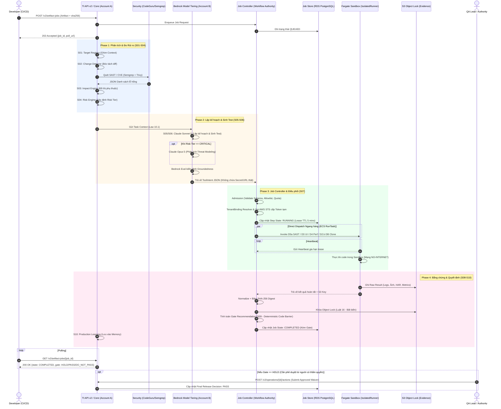

# TÀI LIỆU THUYẾT TRÌNH: SƠ ĐỒ LUỒNG THỰC THI (WORKFLOW) TESTING INTELLIGENCE (TI)
**Người trình bày:** Hùng (QA Strategy)
**Mục tiêu:** Giúp toàn bộ team (DevOps, Architecture, AI, Tooling) hiểu rõ bức tranh toàn cảnh về cách một tác vụ kiểm thử chạy thực tế trong hệ thống TI, từ lúc tiếp nhận đến khi ra quyết định cuối cùng.

---

## 1. LỜI MỞ ĐẦU (Dành cho người trình bày)
Chào mọi người, hôm nay mình sẽ chia sẻ về Workflow thực tế của hệ thống TI. Bản vẽ này được đúc kết từ **Master Architecture Blueprint** mới nhất, tổng hợp công sức của tất cả các mảng: Hạ tầng (Nguyên, Hoàng), AI (Nghĩa) và Tooling (Trang). 

Mục đích của sơ đồ này là để chúng ta thấy rõ: AI đóng vai trò gì, Job Controller điều phối ra sao, và kết quả được lưu trữ như thế nào để đảm bảo tính minh bạch, bảo mật tuyệt đối.

---

## 2. SƠ ĐỒ WORKFLOW TỔNG THỂ (MERMAID)

*(Mọi người có thể đối chiếu sơ đồ này với bản PDF `workflow.TI.pdf` đã được gửi)*

---

## 3. GIẢI THÍCH CHI TIẾT TỪNG GIAI ĐOẠN (Để chia sẻ với team)

### 🚀 Khởi tạo: Tiếp nhận Yêu cầu
Mọi thứ bắt đầu khi Developer (hoặc CI/CD pipeline) gửi một request `POST /v2/artifact-jobs` kèm theo mã nguồn/artifact và mã băm `sha256`. API của chúng ta sẽ không bắt Client phải đợi, mà trả về ngay mã `202 Accepted` kèm một `job_id` để Client có thể chủ động theo dõi (Polling). Job này được đưa vào hàng đợi và lưu trạng thái `QUEUED` trong Database.

### 🔍 Phase 1: Phân tích & Đo Rủi ro (S01 - S04)
Đây là bước "khám bệnh" ban đầu:
- **S01 & S02**: Hệ thống ghim ngữ cảnh và bóc tách những dòng code thay đổi (diff).
- **Security Scanners**: Ngay lập tức, mã nguồn được đẩy cho Semgrep và CodeGuru quét tĩnh (SAST) để tìm lỗ hổng.
- **S03 & S04**: Dựa trên độ lớn của thay đổi và danh sách lỗ hổng bảo mật trả về, **Risk Engine** sẽ xác định mức độ rủi ro (`Risk Tier`).

### 🧠 Phase 2: Lập kế hoạch & Sinh Test bằng AI (S05 - S06)
Đây là lúc "Não bộ" (Account B) hoạt động:
- Khác với trước đây dùng Opus cho mọi thứ rất tốn kém, chúng ta áp dụng **Model Tiering**:
  - Dùng **Claude Sonnet 5** để lập kế hoạch và sinh kịch bản test (vừa đủ thông minh, tốc độ nhanh, tiết kiệm chi phí).
  - *Chỉ khi nào* Phase 1 báo về `Risk Tier == CRITICAL`, hệ thống mới "mời" chuyên gia **Claude Opus 5** vào để phân tích Threat Modeling chuyên sâu.
- Đặc biệt, mọi kịch bản AI sinh ra đều phải qua **Bedrock Evaluations** kiểm tra để chống "ảo giác" (hallucination).
- Kết quả của Phase này là một file **ToolIntent JSON**. File này cực kỳ an toàn: Nó chỉ chứa các ID mang tính biểu tượng, tuyệt đối **không** chứa URL thật hay Password/Secret.

### ⚙️ Phase 3: Điều phối & Thực thi (Trái tim của hệ thống - S07)
Đây là phần "Cơ bắp" do Job Controller đảm nhiệm:
- Job Controller là người nắm quyền tối cao (**Workflow Authority**). Nó nhận `ToolIntent JSON` từ AI, kiểm tra xem AI có định làm gì vượt quyền không (Allowlist).
- **TenantBinding & Security**: JC sẽ tra cứu cấu hình để lấy URL thật, gọi lên AWS STS để lấy Token ngắn hạn. Đảm bảo an toàn tuyệt đối.
- **Dispatch Ngang Hàng**: JC đẩy lệnh chạy song song xuống các Fargate Sandbox (UI, API, DB Clone,...).
- Các Sandbox này (Fargate) hoàn toàn cô lập, không có mạng Internet (`NO-INTERNET`), và phải liên tục gửi `Heartbeat` (nhịp tim) về cho JC mỗi 5 phút để chứng minh nó vẫn đang sống.

### ⚖️ Phase 4: Bằng chứng & Ra Quyết định (S08 - S10)
Sau khi Fargate chạy xong:
- Kết quả thô (Logs, Video quay màn hình test, Metrics) được đẩy thẳng lên S3.
- JC sẽ thu thập, chuẩn hóa, **Băm mã SHA-256** và khóa cứng lại bằng **S3 Object Lock** (không ai có quyền xóa sửa, đáp ứng Luật 16 về bằng chứng kiểm toán).
- Hệ thống đánh giá các tiêu chí cứng (Deterministic Gate S09) và ra quyết định: `PASS`, `DO_NOT_PASS`, hoặc `HOLD`.
- Cuối cùng, Client liên tục gọi `GET /v2/artifact-jobs/{job_id}` sẽ nhận được kết quả cuối.

### 👤 Yếu tố Con người (Waiver / Override)
Trong trường hợp Gate đánh giá là `HOLD` (nghi ngờ rủi ro nhưng chưa chắc chắn), quy trình của chúng ta không bị "cứng nhắc". Một QA Lead có thẩm quyền có thể xem xét bằng chứng trên cổng Portal và gọi API `Approved Waiver` để phê duyệt cho qua (`PASS`).

---

## 4. TỔNG KẾT (Key Takeaways)
- **Rõ ràng vai trò**: AI chỉ đóng vai trò tư duy (Reasoning), Job Controller mới là người ra lệnh thực thi (Execution).
- **Tối ưu chi phí**: Chiến lược Model Tiering (Sonnet/Opus) và chia luồng xử lý giúp tiết kiệm hàng ngàn đô la tiền hạ tầng.
- **Bảo mật tuyệt đối**: Sandbox không internet, Token ngắn hạn, Bằng chứng bất biến khóa trên S3.
- **Workflow này đã sẵn sàng để trình bày với khách hàng và chuyển giao cho team triển khai Wave 1.**
