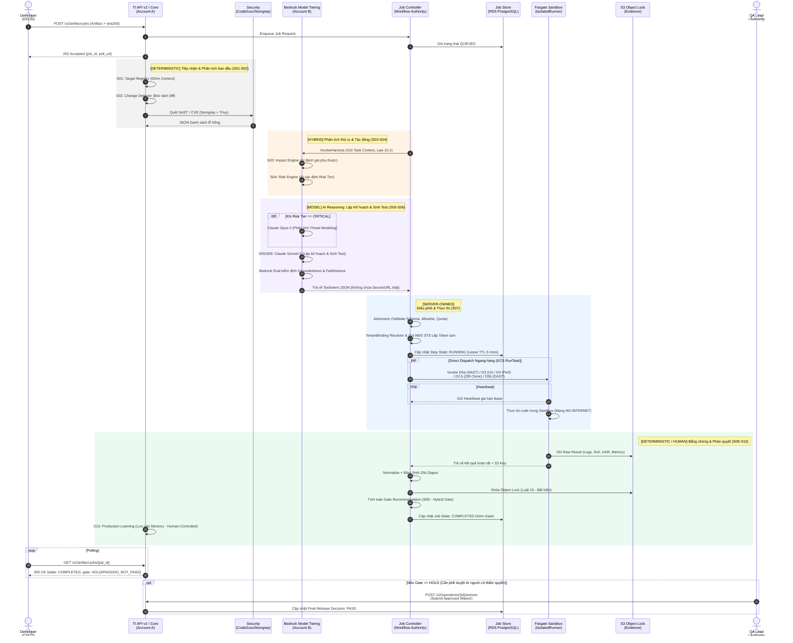

# TÀI LIỆU ĐẶC TẢ SƠ ĐỒ LUỒNG THỰC THI (WORKFLOW) TESTING INTELLIGENCE (TI)
**Chịu trách nhiệm:** QA Strategy & Architecture Team
**Mục tiêu:** Cung cấp tài liệu tham chiếu chi tiết giúp toàn bộ các nhóm (DevOps, Architecture, AI, Tooling) hiểu rõ vòng đời của một tác vụ kiểm thử (Job) trong hệ thống TI, từ lúc hệ thống tiếp nhận yêu cầu đến khi ra quyết định phát hành cuối cùng.

---

## 1. TỔNG QUAN LUỒNG THỰC THI
Bản vẽ Workflow này được đúc kết từ **Master Architecture Blueprint** mới nhất, thể hiện sự đồng bộ kiến trúc giữa các mảng: Hạ tầng, AI và Tooling. 

Tài liệu này đặc tả rõ sự phân tách trách nhiệm giữa các thành phần cốt lõi: vai trò suy luận của AI (Reasoning), quyền điều phối của Job Controller (Execution Authority), và cơ chế lưu trữ bằng chứng để đảm bảo tính minh bạch, bảo mật tuyệt đối của hệ thống.

---

## 2. SƠ ĐỒ WORKFLOW TỔNG THỂ (MERMAID)

*(Tài liệu có thể được tham chiếu cùng với sơ đồ gốc định dạng PDF `workflow.TI.pdf`)*

---

## 3. ĐẶC TẢ CHI TIẾT TỪNG GIAI ĐOẠN

### Khởi tạo: Tiếp nhận Yêu cầu
Quá trình bắt đầu khi Developer (hoặc CI/CD pipeline) gọi request `POST /v2/artifact-jobs` đính kèm mã nguồn/artifact và mã băm `sha256`. Hệ thống API hoạt động theo cơ chế bất đồng bộ, phản hồi ngay mã HTTP `202 Accepted` kèm theo một `job_id`. Job được đưa vào hàng đợi với trạng thái `QUEUED` trong cơ sở dữ liệu. Client sẽ sử dụng cơ chế Polling để chủ động theo dõi trạng thái tiếp theo.

### Phase 1: Phân tích ban đầu (S01 - S02)
Giai đoạn này thực hiện phân tích cơ học và tĩnh (Deterministic) không có sự can thiệp của AI:
- **S01 & S02**: Hệ thống API ghim ngữ cảnh (Target Registry) và bóc tách tự động những dòng code thay đổi (Change Detector).
- **Security Scanners**: Mã nguồn lập tức được đẩy qua các công cụ quét tĩnh (SAST) như Semgrep và CodeGuru để nhận diện các lỗ hổng bảo mật cơ bản.

### Phase 2: AI Phân tích Rủi ro & Sinh Test (S03 - S06)
Đây là giai đoạn xử lý suy luận (Reasoning) do Account B đảm nhiệm, được kích hoạt thông qua lệnh `InvokeHarness` từ Job Controller:
- **S03 & S04**: AI (Harness) tiếp nhận báo cáo từ Phase 1 để phân tích đồ thị phụ thuộc (Impact) và xác định mức độ rủi ro hệ thống (`Risk Tier`).
- **Chiến lược Model Tiering**: Hệ thống phân bổ mô hình AI tối ưu hóa chi phí và hiệu suất:
  - Sử dụng **Claude Sonnet 5** làm mô hình mặc định để lập kế hoạch và sinh kịch bản test (cân bằng giữa tốc độ và khả năng).
  - *Chỉ khi* đánh giá S04 trả về `Risk Tier == CRITICAL`, mô hình **Claude Opus 5** mới được gọi để phân tích mô hình đe dọa (Threat Modeling) chuyên sâu.
- **Kiểm định chất lượng**: Các kịch bản AI sinh ra bắt buộc qua chốt chặn **Bedrock Evaluations** nhằm đánh giá độ bám sát tài liệu (**Groundedness**) và độ trung thực (**Faithfulness**), ngăn chặn triệt để hiện tượng ảo giác (Hallucination).
- Kết quả đầu ra là **ToolIntent JSON** - một định dạng an toàn chỉ chứa các định danh (Symbolic IDs), tuyệt đối không chứa URL thật, mật khẩu hay tham số chạy code tùy ý.

### Phase 3: Điều phối & Thực thi (S07)
Giai đoạn thực thi (Execution) được kiểm soát nghiêm ngặt bởi Job Controller (Account A):
- **Workflow Authority**: Job Controller tiếp nhận `ToolIntent JSON`, thực hiện đối chiếu quyền hạn thông qua cơ chế Allowlist.
- **TenantBinding & Security**: Job Controller tra cứu cấu hình thực tế để nội suy URL đích, đồng thời gọi AWS STS để cấp Token ngắn hạn (Short-lived Credentials) đảm bảo an ninh danh tính.
- **Dispatch Ngang Hàng**: Các lệnh thực thi được phân phối song song (par) tới các container ECS Fargate (Sandbox). Những Sandbox này bao gồm: D5a (SAST), D3 (UI), D4 (Perf), D2.b (DB Clone), và D5b (DAST - ZAP/Nuclei).
- **Cô lập & Heartbeat**: Mọi Sandbox Fargate đều chạy trong vùng mạng hoàn toàn đóng (`NO-INTERNET`). Để duy trì trạng thái, Sandbox phải liên tục gửi `Heartbeat` về Job Controller định kỳ mỗi 5 phút (Lease TTL).

### Phase 4: Bằng chứng & Ra Quyết định (S08 - S10)
Giai đoạn thu thập và đối soát cuối cùng:
- **Thu thập & Băm (Hashing)**: Khi Sandbox hoàn tất, mọi kết quả thô (Logs, Video test, Metrics) được lưu trực tiếp vào S3. Job Controller thu thập, chuẩn hóa, và tiến hành băm **SHA-256 Digest**.
- **Tính Bất Biến (Law 16)**: Bằng chứng được khóa cứng bằng **S3 Object Lock**, đảm bảo tuân thủ tiêu chuẩn kiểm toán (không thể xóa hay chỉnh sửa).
- **Phán quyết (Gate S09)**: Hệ thống sử dụng rào chắn kiểm định cứng (Deterministic Code Barrier) để đưa ra khuyến nghị Gate cuối cùng: `PASS`, `DO_NOT_PASS`, hoặc `HOLD`. 
- Quá trình hoàn tất bằng việc cập nhật trạng thái thành `COMPLETED` cho Client. Những tri thức kiểm thử hợp lệ sẽ được lưu lại (S10 - Production Learning) làm cơ sở cho các lần quét sau.

### Yếu tố Con người (Waiver / Override)
Trong quy trình kiểm soát rủi ro, hệ thống duy trì cơ chế "Human-in-the-loop". Nếu Gate tự động xếp loại `HOLD` (cảnh báo rủi ro), người có thẩm quyền (QA Lead / Authority) có quyền trực tiếp xem xét bằng chứng và gửi lệnh `Approved Waiver` thông qua API `/actions` để cưỡng chế duyệt phát hành (`PASS`).

---

## 4. KẾT LUẬN KIẾN TRÚC
- **Phân tách Trách nhiệm Rõ Ràng**: AI chỉ đóng vai trò tư duy và lên kịch bản (Reasoning); quyền sinh sát và thực thi hoàn toàn nằm ở Job Controller (Execution).
- **Hiệu Quả Kinh Tế**: Việc áp dụng Model Tiering và tách luồng xử lý ngang hàng giúp tối ưu ngân sách hạ tầng và chi phí Token AI.
- **Bảo Mật Kép**: Sự kết hợp giữa Sandbox Không Internet, Token STS Ngắn hạn và S3 Object Lock đảm bảo tính toàn vẹn dữ liệu cho mọi hệ thống tích hợp.
