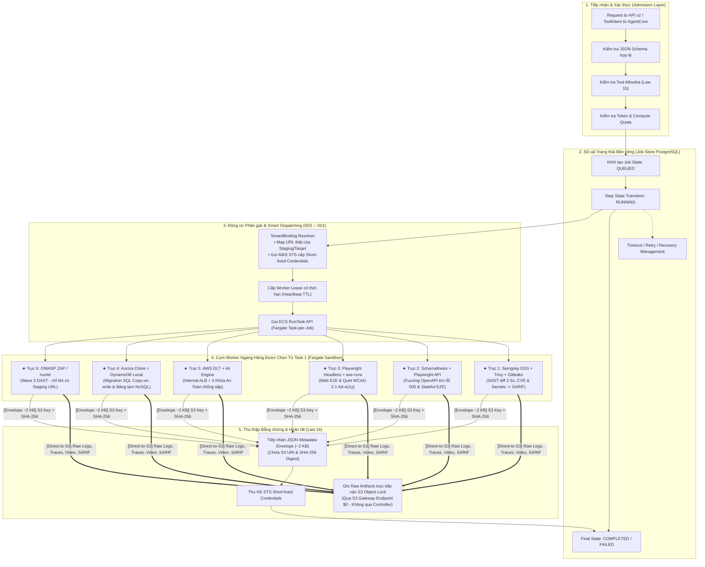
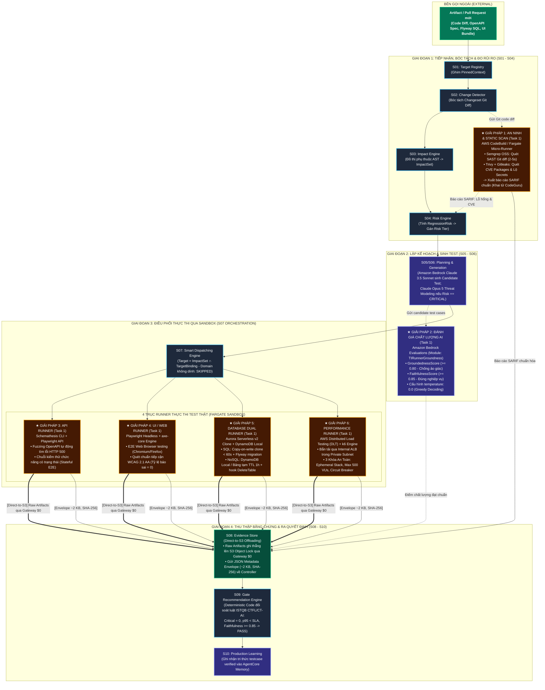

# BẢN THIẾT KẾ KIẾN TRÚC CHI TIẾT HỆ THỐNG TESTING INTELLIGENCE (TI)
## HỢP NHẤT TOÀN DIỆN TASK 1 (TOOLS & FRAMEWORKS), TASK 2 (SYSTEM ARCHITECTURE) & MASTER BLUEPRINT
> **Phiên bản:** v2.0.0-Master-Sync · **Ngày lập & Cập nhật:** 2026-09-25  
> **Căn cứ đối soát chuẩn tắc:** 
> - [Task_1_Research_Tool_and_Framework_for_Testing.md](file:///c:/Users/LENOVO/TI/TestIntelligent_doc/Research/Task_1_Research_Tool_and_Framework_for_Testing.md) (Nghiên cứu công cụ & 6 giải pháp kiểm thử trọng tâm)
> - [TI_Master_Architecture_Blueprint.md](file:///c:/Users/LENOVO/TI/TestIntelligent_doc/diagram/TI_Master_Architecture_Blueprint.md) (Kiến trúc tổng thể Master Blueprint)
> - [BAO_CAO_DOI_SOAT_MISMATCH_VA_DONG_BO_TI.md](file:///c:/Users/LENOVO/TI/TestIntelligent_doc/BAO_CAO_DOI_SOAT_MISMATCH_VA_DONG_BO_TI.md) (Biên bản đối soát v2.0, Thẩm định độc lập)  
> **Kỷ luật kiến trúc:** Nhãn Sự thật (`OBSERVED` / `INFERRED` / `CANDIDATE`) · 24 Architecture Laws · Authority Model (Tan.Thai duyệt)  

---

### 7 ĐIỂM ĐỒNG BỘ ĐỘT PHÁ THEO BÁO CÁO ĐỐI SOÁT V2.0:
1. 🔴 **Khai tử triệt để Amazon CodeGuru Security:** Dịch vụ này đã ngừng hoạt động từ ngày 20/11/2025. Xóa bỏ hoàn toàn Tầng 0 CodeGuru; thay thế bằng **Semgrep OSS + Trivy + Gitleaks** tại chặng S02 (quét Git diff 2–5s, xuất SARIF chuẩn); kích hoạt **Claude Opus 5 làm AI Threat Modeling** tại S05 (khi `Risk == CRITICAL`); chuyển **OWASP ZAP / nuclei** sang Wave 3 DAST (chỉ chạy khi có Staging URL sống).
2. 🟠 **Tối ưu hạ tầng mạng D9:** Bỏ hoàn toàn AWS Network Firewall ($288/tháng) $\rightarrow$ Chuyển sang **3 VPC Interface Endpoints ($22/tháng: ECR, CloudWatch Logs, STS) + S3 Gateway Endpoint (Miễn phí $0)**. Task chạy cô lập hoàn toàn (`--network none`, Security Group DENY ALL EGRESS).
3. 🟠 **Kiến trúc Direct-to-S3 Offloading (Law 16):** Fargate Runner đẩy raw artifacts (PNG, Video, Traces, SARIF) **trực tiếp lên S3 Object Lock** qua VPC Gateway Endpoint. Runner chỉ gửi về Job Controller một **JSON Metadata Envelope (~2 KB)** $\rightarrow$ Xóa sổ 100% rủi ro ngộp ổ đĩa EBS của EC2 Backend!
4. 🔴 **Điều phối thông minh S07 (Smart Dispatching):** Hiện thực hóa phép giao chuẩn tắc $\mathbf{Target \ Runners} = \mathbf{ImpactSet} \ (\text{S03}) \ \cap \ \mathbf{TargetBinding} \ (\text{S01})$. Domain không bị tác động sẽ được ghi nhận `SKIPPED`, không tốn 1 xu compute Fargate.
5. 🟠 **Lấp đầy khoảng trống NoSQL Database Testing:** Bổ sung **DynamoDB Local Container** / Bảng tạm có **TTL 1 giờ tự hủy** + hook `DeleteTable` bên cạnh cụm **Aurora Serverless v2 Clone** (SQL Copy-on-write < 60s).
6. 🟠 **Kiểm soát tính bất định AI (Non-determinism):** Dùng **Amazon Bedrock Evaluations** (`TIRunnerGroundness`) với cấu hình `temperature: 0.0` (Greedy Decoding), bổ sung dải dung sai $\pm 0.03$; chuẩn hóa điều kiện HOLD: $\mathbf{GroundednessScore < 0.80}$ HOẶC $\mathbf{FaithfulnessScore < 0.85}$.
7. 🟡 **Đồng bộ mô hình FinOps thực tế:** Chi phí cố định ~$39/tháng; chi phí biến đổi ~$0.07 – $0.14/job; tổng ngân sách quy mô 500 jobs chỉ **~$75 – $110/tháng** (tiết kiệm 75% so với phương án cũ).

---

## MỤC LỤC
1. [HƯỚNG DẪN THEO DÕI ĐƯỜNG ĐI DỮ LIỆU TỪ BƯỚC 01 ĐẾN BƯỚC 12](#1-hướng-dẫn-theo-dõi-đường-đi-dữ-liệu-từ-bước-01-đến-bước-12)
2. [TAM HỢP KIẾN TRÚC: HỒN – XÁC – NÃO & GIAO DIỆN ISOLATEDRUNNER (LAW 23)](#2-tam-hợp-kiến-trúc-hồn--xác--não--giao-diện-isolatedrunner-law-23)
   - [2.1. Phần Hồn: Triết lý Ports & Adapters và Interface IsolatedRunner](#21-phần-hồn-triết-lý-ports--adapters-và-interface-isolatedrunner)
   - [2.2. Phần Xác: Phân tách 2 AWS Accounts, Fargate Sandbox & Tối ưu Mạng D9](#22-phần-xác-phân-tách-2-aws-accounts-fargate-sandbox--tối-ưu-mạng-d9)
   - [2.3. Phần Não: Chuỗi S01–S10, Bedrock Model Tiering & Giám Định AI Kép](#23-phần-não-chuỗi-s01s10-bedrock-model-tiering--giám-định-ai-kép)
3. [HỆ THỐNG SƠ ĐỒ KIẾN TRÚC TOÀN DIỆN (C4 MODEL, SEQUENCE, PIPELINE & TOPOLOGY)](#3-hệ-thống-sơ-đồ-kiến-trúc-toàn-diện-c4-model-sequence-pipeline--topology)
   - [3.1. Sơ đồ C4 Level 2: Container & Deployment Topology (Toàn cảnh 3 vùng gắn tool Task 1)](#31-sơ-đồ-c4-level-2-container--deployment-topology-toàn-cảnh-3-vùng-gắn-tool-task-1)
   - [3.2. Sơ đồ C4 Level 3: Zoom sâu bên trong Job Controller & Cụm Peer Workers Fargate](#32-sơ-đồ-c4-level-3-zoom-sâu-bên-trong-job-controller--cụm-peer-workers-fargate)
   - [3.3. Sơ đồ Sequence: Vòng đời tương tác tuần tự (Đánh số 1..27 tự động)](#33-sơ-đồ-sequence-vòng-đời-tương-tác-tuần-tự-đánh-số-127-tự-động)
   - [3.4. Sơ đồ Pipeline 10 Chặng S01–S10: Ánh xạ trực tiếp 6 giải pháp Tool Task 1](#34-sơ-đồ-pipeline-10-chặng-s01s10-ánh-xạ-trực-tiếp-6-giải-pháp-tool-task-1)
   - [3.5. Sơ đồ Tiến trình điều phối 12 bước (Sequential Pipeline Flowchart)](#35-sơ-đồ-tiến-trình-điều-phối-12-bước-sequential-pipeline-flowchart)
   - [3.6. Sơ đồ Master Topology: Kiến trúc phân vùng hạ tầng (100% mũi tên có đánh số [01/12] đến [12/12])](#36-sơ-đồ-master-topology-kiến-trúc-phân-vùng-hạ-tầng-100-mũi-tên-có-đánh-số-0112-đến-1212)
4. [BÓC TÁCH CHI TIẾT CÁC PHÂN VÙNG HẠ TẦNG HỢP NHẤT](#4-bóc-tách-chi-tiết-các-phân-vùng-hạ-tầng-hợp-nhất)
   - [4.1. Account A: Singapore ap-southeast-1 (Control Plane, Job Store & S08 Evidence Store)](#41-account-a-singapore-ap-southeast-1-control-plane-job-store--s08-evidence-store)
   - [4.2. Account B: N. Virginia us-east-1 (AgentCore AI Brain, Bedrock Models & Evaluations)](#42-account-b-n-virginia-us-east-1-agentcore-ai-brain-bedrock-models--evaluations)
   - [4.3. Miền Thực thi Fargate Sandbox (Execution VPC) & Hạ tầng Mạng D9 Tối ưu](#43-miền-thực-thi-fargate-sandbox-execution-vpc--hạ-tầng-mạng-d9-tối-ưu)
5. [CHI TIẾT 6 TRỤC RUNNER THỰC THI KIỂM THỬ (CHỌN TỪ TASK 1)](#5-chi-tiết-6-trục-runner-thực-thi-kiểm-thử-chọn-từ-task-1)
   - [5.1. Trục 1: An ninh & SAST Đa Tầng (Semgrep OSS + Trivy + Gitleaks SARIF - Khai tử CodeGuru)](#51-trục-1-an-ninh--sast-đa-tầng-semgrep-oss--trivy--gitleaks-sarif---khai-tử-codeguru)
   - [5.2. Trục 2: API Functional & Schema Fuzzing (Schemathesis + Playwright API)](#52-trục-2-api-functional--schema-fuzzing-schemathesis--playwright-api)
   - [5.3. Trục 3: UI / Web E2E & Accessibility (Playwright Headless + axe-core WCAG 2.1 AA)](#53-trục-3-ui--web-e2e--accessibility-playwright-headless--axe-core-wcag-21-aa)
   - [5.4. Trục 4: Database Dual Isolation (Aurora Serverless v2 Clone SQL & DynamoDB Local/TTL NoSQL)](#54-trục-4-database-dual-isolation-aurora-serverless-v2-clone-sql--dynamodb-localttl-nosql)
   - [5.5. Trục 5: Performance Testing (AWS DLT + k6 Engine qua Internal ALB & 3 Khóa An Toàn)](#55-trục-5-performance-testing-aws-dlt--k6-engine-qua-internal-alb--3-khóa-an-toàn)
   - [5.6. Trục 6: Dynamic Security DAST (OWASP ZAP / nuclei Container - Wave 3)](#56-trục-6-dynamic-security-dast-owasp-zap--nuclei-container---wave-3)
6. [BẢNG MA TRẬN ĐẶC TẢ CHI TIẾT 12 BƯỚC (GẮN NHÃN SỰ THẬT & FINOPS CHUẨN)](#6-bảng-ma-trận-đặc-tả-chi-tiết-12-bước-gắn-nhãn-sự-thật--finops-chuẩn)
7. [HỢP ĐỒNG GIAO DIỆN DỮ LIỆU (CONTRACT SPECIFICATIONS)](#7-hợp-đồng-giao-diện-dữ-liệu-contract-specifications)
   - [7.1. Cấu trúc ToolIntent JSON (AgentCore ➔ Job Controller - Law 10.1)](#71-cấu-trúc-toolintent-json-agentcore--job-controller---law-101)
   - [7.2. Cấu trúc TenantBinding Server-Side (Job Controller ➔ Runner - Law 13)](#72-cấu-trúc-tenantbinding-server-side-job-controller--runner---law-13)
8. [BÀI TOÁN KINH TẾ HẠ TẦNG (FINOPS & TCO ESTIMATION)](#8-bài-toán-kinh-tế-hạ-tầng-finops--tco-estimation)
9. [LỘ TRÌNH TRIỂN KHAI THEO WAVE (W0 — W4) & GATES](#9-lộ-trình-triển-khai-theo-wave-w0--w4--gates)
10. [KẾT LUẬN & SỰ SẴN SÀNG CHO BUỔI HỌP CONNECT](#10-kết-luận--sự-sẵn-sàng-cho-buổi-họp-connect)

---

## 1. HƯỚNG DẪN THEO DÕI ĐƯỜNG ĐI DỮ LIỆU TỪ BƯỚC 01 ĐẾN BƯỚC 12

Hệ thống được thiết kế theo luồng khép kín bất đồng bộ, phân định rõ ràng điểm vào, các chặng xử lý và điểm kết thúc:

* 🟢 **BẮT ĐẦU TẠI ĐÂY `[Bước 01]`: Nhận Artifact / PR mới** từ Developer / CI-CD Pipeline (Git Code Diff, OpenAPI spec, Flyway SQL, UI Bundle).
* **`[Bước 02]`: Tiếp nhận & Thẩm định** tại cổng TI API (:8000) qua CloudFront + WAF (kiểm tra HMAC signature, schema, SHA-256 digest).
* **`[Bước 03]`: Trả phản hồi tức thì** mã HTTP `202 Accepted` (<1s) kèm `job_id` giải phóng kết nối cho CI/CD, không bắt CI/CD chờ đợi.
* **`[Bước 04]`: Khởi tạo trạng thái Job** `PENDING` vào Amazon RDS PostgreSQL bền vững (Job Store NFR §23, db.t4g.micro ~$15/tháng).
* **`[Bước 05]`: Quét an ninh tĩnh Tầng 1 (S02)** bằng **Semgrep (SAST diff 2-5s) + Trivy (CVE) + Gitleaks (Secrets)** $\rightarrow$ Xuất SARIF chuẩn *(Khai tử hoàn toàn CodeGuru EOL)*.
* **`[Bước 06]`: Bóc tách tác động & Xếp hạng rủi ro (S03-S04)**: `S03 Impact Engine` xuất `ImpactSet`; `S04 Risk Engine` tính `RegressionRisk`, gán `Risk Tier` (LOW, MEDIUM, HIGH, CRITICAL).
* **`[Bước 07]`: Lập Kế hoạch AI & Sinh Test (S05-S06)**: Chuyển sang Account B (`us-east-1`), **Claude 3.5 Sonnet / Haiku** sinh TestPlan & TestCases. Nếu `Risk == CRITICAL` $\rightarrow$ Kích hoạt **Claude Opus 5 AI Threat Modeling**.
* **`[Bước 08]`: Giám định AI kép (S05-S06)**: **Amazon Bedrock Evaluations** đo $\mathbf{GroundednessScore \ge 0.80}$ và $\mathbf{FaithfulnessScore \ge 0.85}$ với `temperature: 0.0` (loại bỏ hoàn toàn kịch bản ảo giác).
* **`[Bước 09]`: Điều phối thông minh Sandbox (S07)**: Job Controller tính phép giao $\mathbf{ImpactSet \cap TargetBinding}$, chỉ kích hoạt domain bị ảnh hưởng trên ECS Fargate task-per-job (D2):
  * **`[09A]` API Runner:** Schemathesis Fuzzing OpenAPI + Playwright API Stateful Chains.
  * **`[09B]` UI Runner:** Playwright Chromium Headless + axe-core WCAG 2.1 AA a11y.
  * **`[09C]` DB Runner:** **Aurora Serverless v2 Clone** (<60s Copy-on-write cho SQL) & **DynamoDB Local / TTL Table** (NoSQL).
  * **`[09D]` Perf Runner:** AWS DLT + k6 Engine *(Bắn qua Internal ALB, 3 Khóa An Toàn chống sập)*.
  * **`[09E]` DAST Runner (Wave 3):** OWASP ZAP / nuclei container (chỉ chạy khi có Staging URL sống sau khi deploy).
* **`[Bước 10]`: Lưu Bằng chứng Trực tiếp (Direct-to-S3 Offloading - S08)**: Fargate Runner ghi raw artifacts trực tiếp lên **Amazon S3 + Object Lock (WORM 90 ngày)** qua VPC Gateway Endpoint ($0); chỉ gửi **JSON Metadata Envelope (~2 KB)** có băm SHA-256 về Job Controller (EBS không lưu file nhị phân).
* **`[Bước 11]`: Phán quyết Gate bằng Code Cứng (S09)**: Deterministic Code Engine đối soát luật ISTQB: Lỗi Critical=0 & p95<SLA & Groundedness/Faithfulness đạt chuẩn $\rightarrow$ `PASS`, ngược lại `HOLD` hoặc `DO_NOT_PASS`.
* 🔴 **KẾT THÚC TẠI ĐÂY `[Bước 12]`: Hoàn tất & Trả Báo cáo**: Ghi tri thức vào **AgentCore Memory (S10)**, cập nhật RDS PostgreSQL; CI/CD nhận kết quả Gate; Developer xem bằng chứng live trên TI Web Portal (:8001).

---

## 2. TAM HỢP KIẾN TRÚC: HỒN – XÁC – NÃO & GIAO DIỆN ISOLATEDRUNNER (LAW 23)

Hệ thống TI được chuẩn hóa cấu trúc thành **Tam Hợp Kiến Trúc**:

```text
                  ┌─────────────────────────────────────────┐
                  │          PHẦN HỒN (DevOps Core)         │
                  │  Hexagonal Architecture & Port-Adapter  │
                  │   IsolatedRunner Interface (Law 23)     │
                  │   Job Controller & PostgreSQL Store     │
                  └────────────────────┬────────────────────┘
                                       │
                ┌──────────────────────┴──────────────────────┐
                ▼                                             ▼
  ┌───────────────────────────┐                 ┌───────────────────────────┐
  │   PHẦN XÁC (Task 1 & 2)   │                 │   PHẦN NÃO (Task 3 & 4)   │
  │  Hạ tầng 2 Accounts AWS   │                 │    Chuỗi Xử lý S01–S10    │
  │ ECS Fargate Task-per-Job  │                 │   Bedrock Model Tiering   │
  │ Mạng D9 & VPC Endpoints   │                 │ Amazon Bedrock Evaluations│
  │ Aurora Clone & DynamoDB   │                 │ Deterministic Code Gate   │
  └───────────────────────────┘                 └───────────────────────────┘
```

### 2.1. Phần Hồn: Triết lý Ports & Adapters và Interface `IsolatedRunner`
- **Áp dụng mẫu Hexagonal Architecture (Ports and Adapters)**: Tách bạch tuyệt đối giữa Control Plane (`Job Controller`) và Execution Engine. Job Controller nắm giữ logic trạng thái, nhưng hoàn toàn bất khả tri (agnostic) đối với framework kiểm thử cụ thể.
- **Interface chuẩn hóa `IsolatedRunner` (Law 23)**:
  ```typescript
  interface IsolatedRunner {
    executeJob(input: {
      jobId: string;
      imageDigest: string;           // Image ECR đã được scan bảo mật
      command: string[];             // Lệnh thực thi được allowlist
      tenantBindingRef: string;      // ID cấu hình bí mật (server-resolved)
      resourceLimits: {              // Giới hạn CPU / RAM / Timeout
        cpu: number;
        memoryGiB: number;
        timeoutSeconds: number;
      };
    }): Promise<{
      exitCode: number;
      rawResultPath: string;         // Đường dẫn S3 Direct-to-S3
      executionLogsPath: string;     // Log thực thi chi tiết
      sha256Digest: string;          // Mã băm bằng chứng bất biến
    }>;
  }
  ```
- **Lợi ích**: Khi thay thế Playwright bằng framework khác hoặc nâng cấp cụm Fargate sang EKS+Karpenter trong tương lai, phần lõi Job Controller không bị thay đổi bất kỳ dòng code nào.

### 2.2. Phần Xác: Phân tách 2 AWS Accounts, Fargate Sandbox & Tối ưu Mạng D9
- **Account A (`ap-southeast-1` - Singapore)**: Control Plane & Job Authority, tiếp nhận API v2, quản trị danh tính và lưu trữ sổ cái trạng thái bền vững.
- **Account B (`us-east-1` - N. Virginia)**: Cụm AgentCore Runtime & Bedrock Models, nơi đặt các mô hình AI tiên tiến nhất của AWS với hạn ngạch (quota) lớn nhất.
- **Vùng Sandbox Task-per-Job (Domain D2)**: Bác bỏ hoàn toàn mô hình chạy trực tiếp trên EC2 hay Testcontainers. Mỗi job kiểm thử chạy trong một ECS Fargate task riêng biệt, cách ly mức MicroVM Nitro, tự hủy sau khi hoàn thành.
- **Đột phá Tối ưu Chi phí Mạng D9**: Loại bỏ AWS Network Firewall (~$288/tháng), thay thế bằng **Private Subnet (`--network none`, Security Group DENY ALL) + 3 VPC Interface Endpoints (~$22/tháng: ECR, Logs, STS) + S3 Gateway Endpoint ($0)**.

### 2.3. Phần Não: Chuỗi S01–S10, Bedrock Model Tiering & Giám Định AI Kép
- **Xương sống 10 chặng xử lý (S01–S10)**: Phân định rõ ràng chặng dùng Mã cứng Deterministic (S01, S02, S08, S09), chặng dùng AI suy luận (S03 semantic, S04 risk tiering, S05 planning, S06 generation), và chặng do Tool đo lường (S07 execution).
- **Chiến lược Bedrock Model Tiering 3 cấp (Tiết kiệm 65–75% chi phí token)**:
  - `Claude 3.5 Haiku ($1/$5 per 1M)`: Xử lý template, trích xuất JSON Git diff, tác vụ lặp lại.
  - `Claude 3.5 Sonnet ($3/$15 per 1M)`: Lập kế hoạch kiểm thử (S05) và sinh kịch bản candidate chi tiết (S06).
  - `Claude Opus 5 ($15/$75 per 1M)`: Chỉ kích hoạt khi `Risk Tier == CRITICAL` tại S04 để phân tích Threat Modeling và lỗ hổng logic nghiệp vụ tinh vi.
- **Giám định AI Kép với Amazon Bedrock Evaluations (Task 1)**:
  - Module `TIRunnerGroundness` kiểm định candidate test cases trước khi thực thi: yêu cầu $\mathbf{GroundednessScore \ge 0.80}$ (chống AI bịa đặt) và $\mathbf{FaithfulnessScore \ge 0.85}$ (trung thực nghiệp vụ); cấu hình cố định `temperature: 0.0`.
- **Giao thức ToolIntent Handshake an toàn (Law 10.1 & 13)**:
  - Model chỉ phát `ToolIntent JSON` với các tham số biểu tượng (Symbolic Params).
  - Job Controller chặn lại, kiểm tra Allowlist, tra cứu `TenantBinding` bí mật, cấp STS token ngắn hạn rồi mới dispatch trực tiếp sang Sandbox.

---

## 3. HỆ THỐNG SƠ ĐỒ KIẾN TRÚC TOÀN DIỆN (C4 MODEL, SEQUENCE, PIPELINE & TOPOLOGY)

---

### 3.1. Sơ đồ C4 Level 2: Container & Deployment Topology (Toàn cảnh 3 vùng gắn tool Task 1)

```mermaid
flowchart TB
    %% ========================================================
    %% CALLERS & EXTERNAL
    %% ========================================================
    subgraph EXT["BÊN GỌI NGOÀI (EXTERNAL CONSUMERS)"]
        CI["CI/CD Pipeline\n(GitHub Actions / GitLab CI)"]
        PRT["Developer / QA Web Portal\n(Next.js Dashboard :8001)"]
        CLI["TI CLI Client\n(scripts/verify-artifact-api.py)"]
    end

    %% ========================================================
    %% ACCOUNT A: BACKEND & WORKFLOW AUTHORITY (ap-southeast-1)
    %% ========================================================
    subgraph ACC_A["ACCOUNT A — BACKEND & WORKFLOW AUTHORITY (ap-southeast-1) [OBSERVED]"]
        CF["AWS CloudFront CDN + WAF\n(/v1/*, /v2/* Routes)"]
        API["TI API v2 (FastAPI Engine :8000)\n• Xác thực Entra ID / GitHub OIDC\n• Validate Schema & SHA-256 Digest\n• Trả mã 202 Accepted + job_id (<1s)"]
        
        subgraph JC["JOB CONTROLLER — Account A (Law 4.3 Giữ Sổ Cái & Thẩm Quyền)"]
            direction TB
            ADM["Admission Gate & Rate Limiter"]
            STATE["State Machine (PostgreSQL)\n• Quản lý Trạng thái Job & Step"]
            LEASE["Lease & Heartbeat Coordinator\n• Cấp lease, gia hạn, recovery"]
            RESOLVER["TenantBinding Resolver (Law 13)\n• Tra cứu endpoint thật & STS grant\n• Smart Dispatch: S03 ∩ S01"]
        end

        DB_PG[("Amazon RDS PostgreSQL\n(Job Store Bền Vững - NFR §23)\n• db.t4g.micro ~$15/tháng\n• Sổ cái State, Leases, Quotas")]
        
        subgraph STORE_S08["KHO BẰNG CHỨNG BẤT BIẾN (S08 Evidence Store)"]
            S3_EVI[("Amazon S3 + Object Lock (Law 16)\n• Chế độ WORM (Write Once, Read Many 90 ngày)\n• Chữ ký số băm SHA-256 Digest\n• Tiếp nhận Direct-to-S3 qua Gateway Endpoint $0")]
        end

        GATE_S09["S09 Gate Recommendation Engine\n(Deterministic Code Engine - Luật ISTQB)\n• Kiểm tra: Critical=0, p95<SLA, Faithfulness>=0.85\n• Xuất phán quyết cứng: PASS / HOLD / DO_NOT_PASS"]
    end

    %% ========================================================
    %% ACCOUNT B: AGENTCORE AI RUNTIME (us-east-1)
    %% ========================================================
    subgraph ACC_B["ACCOUNT B — AGENTCORE RUNTIME & AI REASONING (us-east-1) [OBSERVED]"]
        direction TB
        HAR["TI Harness / TIJobRunner\n• Vòng lặp suy luận có giới hạn token\n• KHÔNG phải system of record"]
        
        subgraph TIER["Bedrock Model Tiering Engine (Task 3)"]
            M_HAIKU["Claude 3.5 Haiku ($1/$5 per 1M)\n(Template & Parse JSON Diff)"]
            M_SONNET["Claude 3.5 Sonnet ($3/$15 per 1M)\n(Planning S05 & Candidate S06)"]
            M_OPUS["Claude Opus 5 ($15/$75 per 1M)\n(Threat Modeling khi Risk == CRITICAL)"]
        end

        BED_EVAL["★ Amazon Bedrock Evaluations (Task 1)\n(Module: TIRunnerGroundness)\n• GroundednessScore (>=0.80)\n• FaithfulnessScore (>=0.85)\n• temperature: 0.0 (Greedy Decoding)"]

        GATEWAY["AgentCore Gateway (MCP / IAM)\n• Chặn xuất ToolIntent không hợp lệ"]
        POLICY["Policy Engine\n• Giám sát ENFORCE rào chắn an ninh"]
        MEM[("AgentCore Knowledge Memory (S10)\n(Vector DB chỉ lưu tri thức đã qua duyệt GOLDEN)")]
        SECRETS["AWS Secrets Manager & STS\n(Server-Owned Token: Không cấp Credential cho AI)"]
    end

    %% ========================================================
    %% EXTENSION ZONE: ISOLATED RUNNER SANDBOX (Task 1 & Task 2)
    %% ========================================================
    subgraph SANDBOX_VPC["VÙNG MỞ RỘNG — SANDBOX VPC THỰC THI KIỂM THỬ (CANDIDATE)"]
        direction TB

        subgraph NET_D9["Hạ Tầng Mạng An Ninh D9 (~$22/tháng - Đã bỏ Network Firewall $288)"]
            SG_DENY["Security Group: DENY ALL EGRESS\nPrivate Subnet (Không NAT, Không IGW)"]
            VPCE["VPC Endpoints (AWS PrivateLink)\n• S3 Gateway Endpoint (Miễn phí $0)\n• ECR, CloudWatch Logs, STS Interface Endpoints (~$22/tháng)"]
        end

        subgraph RUNNERS["6 TRỤC RUNNER THỰC THI ĐƯỢC CHỌN TỪ TASK 1 (Interface: IsolatedRunner - Law 23)"]
            T_SAST["★ Trục 1: D5a Security & SAST (W1)\n(Semgrep OSS + Trivy + Gitleaks)\nQuét Git diff 2-5s, bắt OWASP & CVE -> SARIF"]
            T_API["★ Trục 2: D1 API Testing (W1)\n(Schemathesis + Playwright API)\nFuzzing OpenAPI tìm lỗi 500 & Chuỗi E2E"]
            T_UI["★ Trục 3: D3 Web UI & Accessibility (W2)\n(Playwright Headless + axe-core Engine)\nChạy E2E Browser & Quét chuẩn WCAG 2.1 AA"]
            T_DB["★ Trục 4: D2.b Database Dual Testing (W1/W2)\n(Flyway + SQLAlchemy + DynamoDB Local)\nKiểm thử Migration SQL & Bảng tạm NoSQL"]
            T_PERF["★ Trục 5: D4 Distributed Performance (W2)\n(AWS DLT + k6 Engine qua Internal ALB)\n3 Khóa An Toàn: Ephemeral Stack, Max 500 VUs, Circuit Breaker"]
            T_DAST["★ Trục 6: D5b DAST Security (W3)\n(OWASP ZAP / nuclei Container)\nChỉ chạy khi có Staging URL sống"]
        end

        subgraph DB_ISOLATION["HẠ TẦNG DATABASE TESTING CÔ LẬP (TASK 1)"]
            AURORA_CLONE[("Amazon Aurora Serverless v2 Clone (SQL)\n• Copy-on-write sạch < 60s (0 byte ban đầu)\n• Tự hủy sau khi test xong")]
            DYNAMODB_LOCAL[("Amazon DynamoDB Local / TTL Table (NoSQL)\n• DynamoDB Local container hoặc bảng tạm TTL 1h\n• Hook DeleteTable dọn dẹp sạch")]
        end
    end

    %% ========================================================
    %% KẾT NỐI LUỒNG DỮ LIỆU ĐÁNH SỐ RÕ RÀNG
    %% ========================================================
    CI & PRT & CLI -->|"[01] POST /v2/artifact-jobs\n(Artifact + Digest SHA-256)"| CF
    CF -->|"[02] Forward HTTPS"| API
    API -->|"[03] Phản hồi HTTP 202 Accepted (<1s)"| CI & PRT & CLI
    API -->|"[04A] Enqueue Job & Khởi tạo PENDING"| ADM
    ADM --> STATE
    STATE <--> DB_PG

    %% Handshake giữa Job Controller và AI Harness
    ADM -->|"[04B] Gửi Task Context (Law 10.1)"| HAR
    HAR --> TIER
    TIER -->|"[05A] Sinh TestPlan & TestCases (Opus nếu CRITICAL)"| BED_EVAL
    BED_EVAL -->|"[05B] Đo Groundedness >= 0.80 & Faithfulness >= 0.85"| S3_EVI
    HAR --> POLICY
    HAR -->|"[05C] Phát ToolIntent JSON (Không credential)"| GATEWAY
    GATEWAY -->|"[05D] Trả ToolIntent"| JC

    %% Job Controller tra cứu binding và Smart Dispatching
    LEASE --> RESOLVER
    RESOLVER -->|"[06] Smart Dispatch: S03 ImpactSet ∩ S01 TargetBinding\n(Cấp lease & short-lived STS credentials)"| T_SAST
    RESOLVER -->|"[06] Smart Dispatch có lease"| T_API
    RESOLVER -->|"[06] Smart Dispatch có lease"| T_UI
    RESOLVER -->|"[06] Smart Dispatch có lease"| T_PERF
    RESOLVER -->|"[06] Smart Dispatch có lease"| T_DB
    RESOLVER -.->|"[06] Wave 3 Dispatch (khi có Staging URL)"| T_DAST

    %% Kết nối DB Testing
    T_DB -.->|"Test Flyway migration SQL"| AURORA_CLONE
    T_DB -.->|"Test bảng tạm NoSQL TTL 1h"| DYNAMODB_LOCAL

    %% Rào chắn mạng
    RUNNERS -.-> SG_DENY
    RUNNERS -.-> VPCE

    %% DIRECT-TO-S3 OFFLOADING (Law 16)
    RUNNERS ===>|"[07A · DIRECT-TO-S3] Raw Evidence (PNG, Video, Logs, SARIF)\n(Qua S3 Gateway Endpoint $0, không tải qua Controller)"| S3_EVI
    RUNNERS -->|"[07B] Gửi JSON Metadata Envelope (~2 KB, SHA-256)"| STATE

    %% Phán quyết Gate S09
    STATE -->|"[08A] Chuyển metrics & SHA-256 đối soát"| GATE_S09
    GATE_S09 -->|"[08B] Phán quyết PASS / HOLD / DO_NOT_PASS -> Cập nhật Job"| DB_PG
    GATE_S09 -.->|"[08C] Lưu tri thức testcase verified vào Memory S10"| MEM

    %% Polling kết quả
    CI & PRT & CLI -.->|"[09] Poll GET /v2/artifact-jobs/{id}\n(completed != PASS - Law 18)"| CF
    API -.->|"[10] Xem live report trên Portal :8001"| PRT
```



---

### 3.2. Sơ đồ C4 Level 3: Zoom sâu bên trong Job Controller & Cụm Peer Workers Fargate

Sơ đồ thể hiện rõ cách Job Controller thực hiện phân giải và dispatch ngang hàng tới **6 cụm Worker Fargate mang công cụ từ Task 1**, đồng thời áp dụng cơ chế **Direct-to-S3 Offloading** chống ngộp ổ đĩa:



---

### 3.3. Sơ đồ Sequence: Vòng đời tương tác tuần tự (Đánh số 1..27 tự động)

```mermaid
sequenceDiagram
    autonumber
    actor Caller as 👨‍💻 CI / Developer (Caller)
    participant API as 🚪 TI API v2 (Account A :8000)
    participant JC as ⚙️ Job Controller (Account A)
    participant DB as 🗄️ RDS PostgreSQL (Job Store)
    participant Sec as 🛡️ S02 SAST (Semgrep + Trivy + Gitleaks)
    participant Har as 🧠 Bedrock Harness (Account B)
    participant Bedrock as 🤖 Bedrock Models (Sonnet / Opus)
    participant Eval as ⚖️ Bedrock Evaluations (Task 1)
    participant Fargate as ⚡ Fargate Sandbox (5 Trục Runner)
    participant S3 as 🪣 S3 Object Lock (Evidence Store)
    participant Gate as 🎯 S09 Gate Recommendation
    participant Mem as 📚 S10 AgentCore Memory
    actor QA as 🧑‍💼 QA Lead / Authority

    Caller->>API: 1. POST /v2/artifact-jobs (Artifact + sha256)
    API->>JC: 2. Enqueue Job Request
    JC->>DB: 3. Ghi trạng thái khởi tạo: QUEUED / PENDING
    API-->>Caller: 4. Phản hồi HTTP 202 Accepted (<1s) {job_id, poll_url}

    Note over JC,Sec: Chặng Quét An Ninh Tĩnh S02 (Task 1)
    JC->>Sec: 5. Kích hoạt Semgrep OSS (SAST diff 2-5s) + Trivy + Gitleaks
    Sec->>S3: 6. Ghi báo cáo SARIF chuẩn lên S3 Evidence Store
    Sec->>JC: 7. Báo cáo kết quả quét; JC tính ImpactSet (S03) & Risk Tier (S04)

    Note over JC,Eval: Chặng Phân Tích, Lập Kế Hoạch & Giám Định AI (S05 - S06)
    JC->>Har: 8. InvokeHarness qua IAM Role (Artifact context, Token Budget)
    Har->>Bedrock: 9. Claude 3.5 Sonnet sinh TestPlan & TestCases (Opus 5 nếu CRITICAL)
    Bedrock->>Eval: 10. Chuyển kịch bản sang Bedrock Evaluations (Module: TIRunnerGroundness)
    Eval-->>Eval: 11. Đo GroundednessScore (>=0.80) & FaithfulnessScore (>=0.85) với temp=0.0
    Eval->>S3: 12. Lưu TestPlan & TestCases đạt chuẩn lên S3
    Har-->>JC: 13. Trả ToolIntent JSON (Symbolic IDs, KHÔNG credentials)

    Note over JC,Fargate: Chặng Thực Thi Cô Lập S07 (Smart Dispatching)
    JC->>JC: 14. Tính Smart Dispatch: Target = ImpactSet (S03) ∩ TargetBinding (S01)
    JC->>DB: 15. Cập nhật Step State: RUNNING (Lease TTL 5 mins)
    JC->>Fargate: 16. ECS RunTask kích hoạt domain tương ứng (Schemathesis, Playwright, Aurora/DynamoDB, k6)
    
    loop Heartbeat
        Fargate-->>JC: Gửi Heartbeat gia hạn lease
    end

    Fargate->>Fargate: Thực thi kiểm thử trong môi trường NO-INTERNET (--network none)
    Fargate==>>S3: 17. [Direct-to-S3] Ghi Raw Result (Logs, traces, screenshots, video) qua Gateway $0
    Fargate-->>JC: 18. Gửi JSON Metadata Envelope (~2 KB, SHA-256) báo hoàn tất
    
    Note over JC,S3: Chặng Đóng Bằng Chứng & Phán Quyết Gate (S08 - S09)
    JC->>S3: 19. Khóa Object Lock WORM 90 ngày (Law 16)
    JC->>Gate: 20. Chuyển dữ liệu cho Deterministic Code Engine (Luật ISTQB)
    Gate-->>Gate: 21. Kiểm tra: Lỗi Critical=0, p95<SLA, Faithfulness>=0.85
    Gate->>DB: 22. Cập nhật Job State: COMPLETED (kèm Gate: PASS / HOLD / DO_NOT_PASS)
    Gate->>Mem: 23. Lưu tri thức testcase đã xác minh vào Memory S10
    
    loop Polling
        Caller->>API: 24. GET /v2/artifact-jobs/{job_id}
        API-->>Caller: 25. 200 OK {state: COMPLETED, gate: HOLD / PASS / DO_NOT_PASS}
    end

    opt Nếu trạng thái là HOLD (cần phê duyệt người có thẩm quyền)
        QA->>API: 26. POST /v2/operations/{id}/actions (Submit Approved Waiver)
        API->>DB: 27. Cập nhật Final Release Decision: PASS
    end
```

---

### 3.4. Sơ đồ Pipeline 10 Chặng S01–S10: Ánh xạ trực tiếp 6 giải pháp Tool Task 1



#### Bảng ánh xạ 6 giải pháp Tool & Framework Task 1 vào Pipeline TI:

| Chặng Pipeline TI | Công cụ / Framework Được Chọn Từ Task 1 | Cơ chế Hoạt động trong Pipeline | Bằng chứng Xuất ra S08 Evidence Store | Nhãn Sự thật |
| :--- | :--- | :--- | :--- | :---: |
| **S02 $\rightarrow$ S04** *(An ninh & Rủi ro)* | **Semgrep OSS + Trivy + Gitleaks** *(Khai tử CodeGuru EOL)* | Quét SAST Git diff 2–5s tìm lỗi OWASP Top 10; quét phụ thuộc CVE và lộ lọt Secrets. Nếu có Critical $\rightarrow$ S04 gán `Risk Tier = CRITICAL`. | File JSON chuẩn hóa **SARIF** (CWE, CVE, Secrets). | `INFERRED` |
| **S05 / S06** *(Chất lượng AI)* | **Amazon Bedrock Evaluations** (`TIRunnerGroundness`) | Chấm điểm độc lập kịch bản do Bedrock Claude sinh ra: yêu cầu `GroundednessScore >= 0.80` và `FaithfulnessScore >= 0.85`; `temperature: 0.0`. | File JSON điểm số kiểm định chất lượng AI, chống ảo giác. | `CANDIDATE` |
| **S07** *(API Testing)* | **Schemathesis + Playwright API** | Schemathesis tự động đọc OpenAPI spec, sinh hàng nghìn input dị biệt (fuzzing) ép lỗi 500; Playwright API chạy chuỗi kịch bản có trạng thái. | File JSON vi phạm schema, mã lỗi HTTP 500 kèm cURL command tái hiện. | `CANDIDATE` |
| **S07** *(UI/Web Testing)* | **Playwright Headless + axe-core Engine** | Playwright điều khiển trình duyệt Chromium/Firefox chạy luồng người dùng E2E; axe-core quét độ tương phản và chuẩn tiếp cận WCAG 2.1 AA. | Ảnh chụp PNG từng bước, Video MP4 lượt chạy, file trace zip, HAR log. | `CANDIDATE` |
| **S07** *(DB Testing)* | **Aurora Serverless v2 Clone (SQL) & DynamoDB Local/TTL (NoSQL)** | Aurora Copy-on-write clone < 60s để test Flyway migration; DynamoDB Local container hoặc bảng tạm TTL 1h cho NoSQL. | Log thực thi migration Flyway, bảng diff cấu trúc DB, TTL audit log. | `CANDIDATE` |
| **S07** *(Tải & Hiệu năng)*| **AWS Distributed Load Testing + k6 Engine** | Fargate Workers bắn tải k6 qua Internal ALB; tuân thủ 3 Khóa An Toàn (Ephemeral Stack, Max 500 VUs, Circuit Breaker `abortOnFail`). | File JSON phân vị độ trễ (p95, p99), Throughput RPS, biểu đồ vi phạm SLA. | `CANDIDATE` |

---

### 3.5. Sơ đồ Tiến trình điều phối 12 bước (Sequential Pipeline Flowchart)

```mermaid
flowchart TD
    classDef startEnd fill:#047857,stroke:#10B981,stroke-width:2px,color:#FFF,font-weight:bold;
    classDef control fill:#1E293B,stroke:#38BDF8,stroke-width:2px,color:#F8FAFC;
    classDef ai fill:#312E81,stroke:#818CF8,stroke-width:2px,color:#F8FAFC;
    classDef sandbox fill:#451A03,stroke:#F59E0B,stroke-width:2px,color:#F8FAFC;
    classDef storage fill:#064E3B,stroke:#34D399,stroke-width:2px,color:#F8FAFC;

    %% BƯỚC 1
    STEP01["🟢 [BƯỚC 01 · BẮT ĐẦU TẠI ĐÂY] 🚀\nDeveloper tạo PR / Push code mới lên Git\n(Chứa: Git Code Diff, OpenAPI Spec, Flyway SQL, UI Bundle)"]:::startEnd

    %% BƯỚC 2 & 3
    STEP02["[BƯỚC 02 · TIẾP NHẬN] CloudFront + WAF -> TI API v2 (:8000)\nNhận Webhook, kiểm tra cấu trúc payload"]:::control
    STEP03["[BƯỚC 03 · PHẢN HỒI NHANH] TI API phản hồi HTTP 202 Accepted\nTrả ngay trong < 1 giây kèm job_id để CI/CD không bị nghẽn"]:::control
    STEP04["[BƯỚC 04 · GHI TRẠNG THÁI] Job Controller ghi nhận Job mới\nTạo bản ghi trạng thái PENDING trong Amazon RDS PostgreSQL"]:::control

    %% BƯỚC 5 & 6
    STEP05["[BƯỚC 05 · QUÉT AN NINH S02] CodeBuild / Fargate Micro-Runner\n• Semgrep OSS: Quét SAST Git diff (2-5s) bắt lỗi OWASP Top 10\n• Trivy + Gitleaks: Quét CVE Dependencies & lộ lọt Secrets\n• Xuất báo cáo SARIF chuẩn hóa -> Khai tử CodeGuru Security EOL"]:::sandbox
    STEP06["[BƯỚC 06 · ĐO RỦI RO & BÓC TÁCH S03-S04]\n• S03 Impact Engine: Phân tích dependency AST -> Xuất ImpactSet\n• S04 Risk Engine: Tính điểm RegressionRisk -> Gán Risk Tier (LOW->CRIT)"]:::control

    %% BƯỚC 7 & 8
    STEP07["[BƯỚC 07 · TRÍ TUỆ AI S05-S06] Giao việc sang Account B (us-east-1)\n• Claude 3.5 Sonnet / Haiku: Lập TestPlan & sinh Candidate TestCases\n• Claude Opus 5: AI Threat Modeling sâu (chỉ kích hoạt khi Risk=CRITICAL)"]:::ai
    STEP08["[BƯỚC 08 · GIÁM ĐỊNH AI KÉP] Amazon Bedrock Evaluations\n• Đo GroundednessScore (Yêu cầu >= 0.80 chống ảo giác)\n• Đo FaithfulnessScore (Yêu cầu >= 0.85 phản ánh trung thực nghiệp vụ)\n• Cấu hình temperature: 0.0 (Greedy Decoding) & dải dung sai ±0.03"]:::ai

    %% BƯỚC 9: SMART DISPATCHING & 5 RUNNERS
    STEP09["[BƯỚC 09 · ĐIỀU PHỐI THÔNG MINH S07] Job Controller tính phép giao:\nTarget Runners = ImpactSet (S03) ∩ TargetBinding (S01)\nChỉ kích hoạt domain bị ảnh hưởng trên ECS Fargate task-per-job (D2)\nDomain không bị tác động -> Tự sinh Envelope SKIPPED (Tiết kiệm 100% compute)"]:::sandbox

    subgraph RUNNERS["[CÁC TRỤC RUNNER S07 THỰC THI TRONG FARGATE SANDBOX]"]
        R_API["[09A · API Runner]\nSchemathesis (Fuzzing OpenAPI tìm lỗi 500)\n+ Playwright API (Stateful E2E Chains)"]:::sandbox
        R_UI["[09B · UI Web Runner]\nPlaywright Headless Browser (Node.js)\n+ axe-core Engine (Quét WCAG 2.1 a11y)"]:::sandbox
        R_DB["[09C · Database Dual Runner]\n• SQL: Aurora Serverless v2 Clone (<60s Copy-on-write)\n• NoSQL: DynamoDB Local / Temporary Table có TTL 1h"]:::sandbox
        R_PERF["[09D · Performance Runner]\nAWS DLT + k6 Engine bắn qua Internal ALB\n(3 Khóa An Toàn: Max 500 VUs, Ramping, Circuit Breaker)"]:::sandbox
        R_DAST["[09E · DAST Security Runner]\nOWASP ZAP / nuclei Container\n(Wave 3 - Chỉ kích hoạt khi có Staging URL sống)"]:::sandbox
    end

    %% BƯỚC 10, 11, 12
    STEP10["[BƯỚC 10 · LƯU BẰNG CHỨNG DIRECT-TO-S3 S08]\n• Runner ghi Raw Artifacts (PNG, Video, Traces, SARIF) thẳng lên S3 Object Lock\n  (qua S3 Gateway Endpoint miễn phí $0, không tốn data transfer)\n• Runner chỉ gửi về Job Controller JSON Metadata Envelope (~2 KB) băm SHA-256\n• Triệt tiêu 100% rủi ro ngộp ổ đĩa EBS Backend EC2!"]:::storage
    STEP11["[BƯỚC 11 · PHÁN QUYẾT GATE S09] Deterministic Code Engine\nÁp dụng luật cứng ISTQB: Critical = 0, p95 < SLA, Groundedness >= 0.80 & Faithfulness >= 0.85 -> PASS\nNếu có lỗi Critical hoặc điểm thấp -> Gán cờ HOLD / DO_NOT_PASS"]:::control
    STEP12["🔴 [BƯỚC 12 · HOÀN TẤT & KẾT THÚC TẠI ĐÂY] 🏁\n• Lưu tri thức testcase hợp lệ vào AgentCore Memory (S10)\n• Cập nhật trạng thái Job hoàn thành trong RDS PostgreSQL\n• Developer / CI-CD nhận kết quả Gate; Xem báo cáo qua Web Portal (:8001)"]:::startEnd

    %% NỐI TUẦN TỰ
    STEP01 --> STEP02
    STEP02 --> STEP03
    STEP03 --> STEP04
    STEP04 --> STEP05
    STEP05 --> STEP06
    STEP06 --> STEP07
    STEP07 --> STEP08
    STEP08 --> STEP09

    STEP09 --> R_API
    STEP09 --> R_UI
    STEP09 --> R_DB
    STEP09 --> R_PERF
    STEP09 -.-> R_DAST

    R_API --> STEP10
    R_UI --> STEP10
    R_DB --> STEP10
    R_PERF --> STEP10
    R_DAST -.-> STEP10

    STEP10 --> STEP11
    STEP11 --> STEP12
```



---

### 3.6. Sơ đồ Master Topology: Kiến trúc phân vùng hạ tầng (100% mũi tên có đánh số [01/12] đến [12/12])

> **Mô tả:** Sơ đồ phân bổ hạ tầng tổng thể (Master Topology). **100% các mũi tên kết nối đều được đánh số từ [01] đến [12]** và ghi rõ cú pháp `[MŨI TÊN XX] [Nguồn ➔ Đích] Hành động` để người đọc tra cứu chính xác luồng dữ liệu di chuyển giữa các service AWS và công cụ:

```mermaid
flowchart TB
    %% PHÂN VÙNG BÊN NGOÀI
    subgraph CALLER["1. BÊN GỌI NGOÀI · DEVELOPER / CI-CD PIPELINE"]
        PR["🟢 [BƯỚC 01 · BẮT ĐẦU TẠI ĐÂY] 🚀\nPull Request / Git Diff Mới\n(Code Diff, OpenAPI Spec, Flyway SQL)"]
    end

    %% ACCOUNT A
    subgraph ACC_A["2. ACCOUNT A (ap-southeast-1) · TI BACKEND & CONTROL PLANE"]
        CF["Amazon CloudFront + WAF\n(HTTPS Edge CDN)"]
        
        API["TI API v2 (FastAPI :8000)\n• Nhận Webhook PR\n• Trả HTTP 202 Accepted"]
        PORTAL["TI Web Portal (:8001)\n(Xem báo cáo Runs & Evidence)"]
        
        JC["Job Controller & Smart Dispatcher\n• Quản trị State Machine (S01-S04)\n• Worker Lease, Heartbeat & Recovery\n• S03 ImpactSet ∩ S01 TargetBinding"]
        
        DB_JOB[("Amazon RDS PostgreSQL\n(Bền vững - Job Store NFR §23\ndb.t4g.micro ~$15/tháng)")]
        
        subgraph STORE_S08["KHO BẰNG CHỨNG BẤT BIẾN (S08 Evidence Store)"]
            S3_EVI[("Amazon S3 + Object Lock\n• Chế độ WORM (Write Once, Read Many 90 ngày)\n• Chữ ký số băm SHA-256 Digest (Law 16)\n• Tiếp nhận Direct-to-S3 qua Gateway Endpoint $0")]
        end
        
        GATE_S09["S09 Gate Recommendation\n(Deterministic Code Engine - Luật ISTQB\nKiểm tra: Critical=0, p95<SLA, Faithfulness>=0.85)"]
    end

    %% ACCOUNT B
    subgraph ACC_B["3. ACCOUNT B (us-east-1) · AGENTCORE AI BRAIN"]
        HAR["AgentCore Harness (TIJobRunner)\n(Điều phối Agent Reasoning qua IAM Role)"]
        
        subgraph BEDROCK_TIERS["Phân Tầng Mô Hình Amazon Bedrock (FinOps)"]
            M_HAIKU["Claude 3.5 Haiku ($1/$5)\nParse Diff & Sinh Template Mẫu"]
            M_SONNET["Claude 3.5 Sonnet ($3/$15)\nLập Kế hoạch S05 & Sinh Logic S06"]
            M_OPUS["Claude Opus 5 ($15/$75)\nAI Threat Modeling (khi Risk=CRITICAL)"]
        end
        
        BED_EVAL["★ Amazon Bedrock Evaluations\n(Module: TIRunnerGroundness)\n• GroundednessScore (>=0.80)\n• FaithfulnessScore (>=0.85)"]
        
        MEM["AgentCore Memory (S10)\n(Vector DB lưu tri thức testcase hợp lệ)"]
        SECRETS["AWS Secrets Manager & STS\n(Server-Owned Token: Không cấp Credential cho AI)"]
    end

    %% EXECUTION SANDBOX
    subgraph ACC_EXEC["4. MIỀN THỰC THI CÔ LẬP CÁC LOẠI TEST (D2 Sandbox - ECS Fargate VPC)"]
        
        subgraph NET_D9["D9 Mạng Tối Ưu (Đã bỏ Network Firewall $288)"]
            VPCE["3 VPC Interface Endpoints (~$22/tháng)\n• ECR, CloudWatch Logs, STS\n• S3 Gateway Endpoint (Miễn phí $0)\n• Mặc định: NO-INTERNET (--network none)"]
        end

        subgraph PROVIDER_PORTS["D14 Provider Ports (Interface Chuẩn Hóa Cắm Rút - IsolatedRunner)"]
            
            subgraph R_SEC["★ Trục 1: Security & Static Scan (S02 - S04)\n[ĐÃ KHAI TỬ CODEGURU - GỘP TẦNG 0 VÀO TẦNG 1]"]
                C_SEC["CodeBuild / Fargate Micro-Runner -> SARIF chuẩn"]
                T_SEMGREP["Semgrep OSS (Quét SAST trên Git diff 2-5s)"]
                T_TRIVY["Trivy + Gitleaks (Quét CVE Packages & Secrets)"]
                C_SEC -->|"Quét SAST diff"| T_SEMGREP
                C_SEC -->|"Quét CVE & Secrets"| T_TRIVY
            end

            subgraph R_API["★ Trục 2: API Functional & Fuzzing (S07)"]
                C_API["ECS Fargate Task (API Runner)"]
                T_SCHEMA["Schemathesis CLI (Fuzzing OpenAPI tự động)"]
                T_PW_API["Playwright API Client (Stateful E2E Chains)"]
                C_API -->|"Fuzzing Schema"| T_SCHEMA
                C_API -->|"E2E API Flows"| T_PW_API
            end

            subgraph R_UI["★ Trục 3: UI Web E2E & Accessibility (S07)"]
                C_UI["ECS Fargate Task (UI Runner)"]
                T_PW_UI["Playwright Test Suite (Headless Chromium)"]
                T_AXE["axe-core Engine (Quét WCAG 2.1 AA a11y)"]
                C_UI -->|"Browser Testing"| T_PW_UI
                C_UI -->|"Accessibility"| T_AXE
            end

            subgraph R_DB["★ Trục 4: Database Dual Isolation (S07)\n[ĐÃ BỔ SUNG PHẠM VI NOSQL]"]
                C_DB["ECS Fargate Ephemeral Container"]
                T_AURORA["SQL: Amazon Aurora Serverless v2 Clone\n(Copy-on-write < 60s, Flyway Migration)"]
                T_NOSQL["NoSQL: DynamoDB Local Container\n(Hoặc bảng tạm TTL 1h + hook DeleteTable)"]
                C_DB -->|"Clone DB SQL"| T_AURORA
                C_DB -->|"Bảng tạm NoSQL"| T_NOSQL
            end

            subgraph R_PERF["★ Trục 5: Distributed Performance Testing (S07)"]
                T_DLT["AWS Distributed Load Testing (DLT)"]
                T_K6["k6 Engine (Bắn tải qua Internal ALB)"]
                subgraph GUARDS["BỘ 3 KHÓA AN TOÀN"]
                    G1["Khóa 1: Bắn Ephemeral Stack riêng"]
                    G2["Khóa 2: Bounded Max 500 VUs"]
                    G3["Khóa 3: Circuit Breaker abortOnFail"]
                end
                T_DLT -->|"Chạy k6 engine"| T_K6
                T_K6 -->|"Chốt chặn an toàn"| GUARDS
            end

            subgraph R_DAST_BOX["★ Trục 6: Dynamic Security DAST (Wave 3)"]
                T_ZAP["OWASP ZAP / nuclei Container\n(Chỉ chạy khi có Staging URL sống)"]
            end
        end
    end

    %% =========================================================================
    %% TẤT CẢ MŨI TÊN ĐỀU ĐƯỢC ĐÁNH SỐ BƯỚC VÀ GHI RÕ [NGUỒN ➔ ĐÍCH]
    %% =========================================================================

    %% BƯỚC 01 & 02: TIẾP NHẬN
    PR -->|"[MŨI TÊN 01] [PR ➔ CloudFront] Gửi Webhook PR (Code diff, OpenAPI, SQL)"| CF
    CF -->|"[MŨI TÊN 02] [CloudFront ➔ TI API] Forward HTTPS qua WAF vào cổng :8000"| API

    %% BƯỚC 03, 04, 05: PHẢN HỒI & KHỞI TẠO
    API -->|"[MŨI TÊN 03] [TI API ➔ PR/Dev] Phản hồi HTTP 202 Accepted (<1s) kèm job_id"| PR
    API -->|"[MŨI TÊN 04] [TI API ➔ RDS] Khởi tạo trạng thái Job: PENDING"| DB_JOB
    API -->|"[MŨI TÊN 05] [TI API ➔ Controller] Bàn giao job_id cho State Machine"| JC

    %% BƯỚC 06 & 07: QUÉT TĨNH S02 & LƯU BÁO CÁO SARIF
    JC -->|"[MŨI TÊN 06] [Controller ➔ S02 Runner] Kích hoạt Semgrep SAST diff + Trivy"| C_SEC
    C_SEC -->|"[MŨI TÊN 07A] [S02 Runner ➔ S3 Evidence] Ghi báo cáo SARIF chuẩn lên S3"| S3_EVI
    C_SEC -->|"[MŨI TÊN 07B] [S02 Runner ➔ Controller] Gửi AST diff để tính ImpactSet & Risk Tier"| JC

    %% BƯỚC 08 & 09: AI KẾ HOẠCH & CHẤM ĐIỂM
    JC -->|"[MŨI TÊN 08A] [Controller ➔ Account B] Dispatch Task Lease sang AgentCore"| HAR
    HAR -->|"[MŨI TÊN 08B] [AgentCore ➔ Bedrock] Gọi Claude 3.5 Sonnet/Haiku (Opus nếu CRITICAL)"| BEDROCK_TIERS
    BEDROCK_TIERS -->|"[MŨI TÊN 09A] [Bedrock ➔ Bedrock Eval] Chuyển TestPlan & TestCases thẩm định"| BED_EVAL
    BED_EVAL -->|"[MŨI TÊN 09B] [Bedrock Eval ➔ S3] Chấm Groundedness >=0.80 & Faithfulness >=0.85 -> Lưu S3"| S3_EVI
    BED_EVAL -->|"[MŨI TÊN 09C] [Bedrock Eval ➔ Controller] Báo cáo chất lượng AI hợp lệ"| JC

    %% BƯỚC 10: SMART DISPATCHING
    JC -->|"[MŨI TÊN 10A] [Controller ➔ Fargate Sandbox] Smart Dispatch: S03 ImpactSet ∩ S01 TargetBinding"| PROVIDER_PORTS
    HAR -.->|"[MŨI TÊN 10B] [AgentCore ➔ Fargate Sandbox] Cung cấp kịch bản test payload"| PROVIDER_PORTS
    SECRETS -.->|"[MŨI TÊN 10C] [Secrets Manager ➔ Runners] Cấp short-lived STS Token qua gRPC"| PROVIDER_PORTS

    %% BƯỚC 11: DIRECT-TO-S3 OFFLOADING & METADATA ENVELOPE
    PROVIDER_PORTS ===>|"[MŨI TÊN 11A · DIRECT-TO-S3] [Runners ➔ S3] Ghi Raw Artifacts qua VPC Gateway $0"| S3_EVI
    PROVIDER_PORTS -->|"[MŨI TÊN 11B] [Runners ➔ Controller] Gửi JSON Metadata Envelope (~2 KB, SHA-256)"| JC

    %% BƯỚC 12: PHÁN QUYẾT GATE & HOÀN TẤT
    JC -->|"[MŨI TÊN 12A] [Controller ➔ S09 Gate] Gửi chỉ số & băm SHA-256 đối soát"| GATE_S09
    GATE_S09 -->|"[MŨI TÊN 12B] [S09 Gate ➔ RDS] Phán quyết PASS / HOLD / DO_NOT_PASS -> Cập nhật RDS"| DB_JOB
    GATE_S09 -.->|"[MŨI TÊN 12C] [S09 Gate ➔ S10 Memory] Lưu tri thức testcase verified vào Vector DB"| MEM
    DB_JOB ==>|"[MŨI TÊN 12D · FINISH] [Hệ thống ➔ CI/CD & Dev] Trả phán quyết Gate Check & link Portal"| PR
    API -.->|"[MŨI TÊN 12E] [TI API ➔ Web Portal] Xem báo cáo live trên Portal :8001"| PORTAL
```



---

## 4. BÓC TÁCH CHI TIẾT CÁC PHÂN VÙNG HẠ TẦNG HỢP NHẤT

### 4.1. Account A: Singapore `ap-southeast-1` (Control Plane, Job Store & S08 Evidence Store)
* **TI API v2 (FastAPI :8000):** Cổng tiếp nhận webhook có xác thực chữ ký HMAC. Phản hồi mã `202 Accepted` trong **< 1 giây** kèm `job_id`.
* **Job Controller & Smart Dispatcher:** Hiện thực hóa cơ chế điều phối chuẩn tắc:
  $$\mathbf{Target \ Runners} = \mathbf{ImpactSet} \ (\text{từ S03}) \ \cap \ \mathbf{TargetBinding.EnabledDomains} \ (\text{từ S01}) \ \cap \ \mathbf{PolicyRules}$$
  Domain nào không bị ảnh hưởng sẽ không được cấp phát tài nguyên compute Fargate, tự động ghi nhận bản ghi `Evidence Envelope: SKIPPED (NOT_APPLICABLE)` hợp lệ, không gây nghẽn pipeline.
* **Amazon RDS PostgreSQL (`db.t4g.micro` ~$15/tháng):** Lưu Job State Machine (PENDING $\rightarrow$ RUNNING $\rightarrow$ COMPLETED), metrics chi phí per-tenant, thay thế vĩnh viễn SQLite DEV (đạt NFR §23).
* **Amazon S3 + Object Lock (S08 Evidence Store):** Lưu trữ chứng cứ kiểm thử bất biến theo chuẩn WORM 90 ngày. Tiếp nhận raw artifacts trực tiếp từ Fargate qua S3 Gateway Endpoint.
* **S09 Gate Recommendation Engine:** Phán quyết bằng **Deterministic Code** dựa trên luật ISTQB CTFL/CT-AI: nếu Critical > 0 hoặc p95 > SLA hoặc `FaithfulnessScore < 0.85` $\rightarrow$ bắt buộc gán nhãn `DO_NOT_PASS` hoặc `HOLD`.

---

### 4.2. Account B: N. Virginia `us-east-1` (AgentCore AI Brain, Bedrock Models & Evaluations)
* **AgentCore Harness (TIJobRunner):** Vận hành trên Account B (`us-east-1`) để tận dụng quota Bedrock lớn và kết nối IAM Cross-Account an toàn.
* **Phân tầng Model Claude Bedrock (FinOps Optimization):**
  * **Claude 3.5 Haiku ($1/$5 per 1M tokens):** Parse Git diff, bóc tách AST, sinh template mẫu.
  * **Claude 3.5 Sonnet ($3/$15 per 1M tokens):** Model mặc định cho Lập kế hoạch S05 và sinh kịch bản S06.
  * **Claude Opus 5 ($15/$75 per 1M tokens):** Chỉ kích hoạt khi `Risk Tier == CRITICAL` để làm **AI Threat Modeling Tầng 2** (phân tích IDOR, Broken Object Level Auth, Race Conditions).
* **Amazon Bedrock Evaluations (`TIRunnerGroundness`):** Module giám định độc lập. Đo lường 2 chỉ số sống còn:
  * **`GroundednessScore` (Yêu cầu $\ge 0.80$):** Chống AI ảo giác, tự bịa API/Field không có trong spec.
  * **`FaithfulnessScore` (Yêu cầu $\ge 0.85$):** Đảm bảo logic test phản ánh trung thực mục tiêu nghiệp vụ của PR.
  * Cấu hình cố định `temperature: 0.0` (Greedy Decoding) kèm dải dung sai $\pm 0.03$.
* **AWS Secrets Manager & STS:** Quản lý tập trung thông tin đăng nhập. Tuân thủ **Law 12–15: Tuyệt đối không nhúng password/token thật vào prompt của AI**.

---

### 4.3. Miền Thực thi Fargate Sandbox (Execution VPC) & Hạ tầng Mạng D9 Tối ưu
* **D2 Sandbox Architecture (ECS Fargate Task-per-Job):** Cách ly mức microVM giữa các tenant. Khởi động nhanh từ các container images pre-baked trên ECR (`ti-runner-api`, `ti-runner-ui`, `ti-runner-perf`, `ti-runner-sec`).
* **D9 Mạng Tối Ưu (Đã loại bỏ Network Firewall $288/tháng):**
  * Sử dụng **3 VPC Interface Endpoints** (ECR, CloudWatch Logs, STS) đặt tại Private Subnet với chi phí chỉ **~$22/tháng** ($0.01/h $\times$ 730h $\times$ 3 endpoints).
  * Sử dụng **S3 VPC Gateway Endpoint (Miễn phí $0)** để Fargate đẩy thẳng raw artifacts lên S3 Object Lock.
  * Mặc định task chạy ở chế độ **`--network none`**, không có NAT Gateway ra ngoài internet, triệt tiêu 100% nguy cơ rò rỉ mã nguồn qua Prompt Injection.
* **Kiến trúc Direct-to-S3 Offloading (Law 16):**
  * Runner xuất file nén Playwright trace zip, video webm, ảnh PNG, file SARIF và ghi trực tiếp lên S3 bucket `s3://ti-evidence-ap-southeast-1/...`.
  * Runner chỉ gửi về Job Controller một **JSON Metadata Envelope (~2 KB)** chứa URI và mã băm SHA-256. Ổ đĩa EBS của EC2 backend không lưu bất kỳ file nhị phân nào, **loại trừ 100% nguy cơ ngộp storage**.

---

## 5. CHI TIẾT 6 TRỤC RUNNER THỰC THI KIỂM THỬ (CHỌN TỪ TASK 1)

### 5.1. Trục 1: An ninh & SAST Đa Tầng (Semgrep OSS + Trivy + Gitleaks SARIF - Khai tử CodeGuru)
* **Khai tử triệt để Amazon CodeGuru Security:** Dịch vụ này đã ngừng hoạt động từ ngày 20/11/2025. Xóa bỏ hoàn toàn Tầng 0 CodeGuru của Task 4.
* **Mô hình Bảo mật 3 Tầng tinh gọn:**
  1. **Tầng 1 (Pre-runner S02 - Offline Sandbox):** Chạy **Semgrep OSS** (quét SAST Git diff trong 2–5s) + **Trivy** (quét CVE thư viện) + **Gitleaks** (quét hardcoded API keys). Xuất báo cáo chuẩn **SARIF**. Nếu có lỗi Critical hoặc Secrets $\rightarrow$ S04 tự động gán **`Risk Tier = CRITICAL`**.
  2. **Tầng 2 (S05 - AI Threat Modeling):** Chỉ khi `Risk == CRITICAL`, kích hoạt **Claude Opus 5** phân tích sâu logic hở (IDOR, phân quyền đa tenant).
  3. **Tầng 3 (Wave 3 - Post-Deployment DAST):** Kích hoạt **D5b DAST Runner (OWASP ZAP / nuclei container)** trong sandbox, **chỉ chạy khi PR đã được merge lên môi trường Staging có URL sống**. Ở thời điểm PR (Wave 1), không chạy ZAP.

### 5.2. Trục 2: API Functional & Schema Fuzzing (Schemathesis + Playwright API)
* **Schemathesis:** Đọc OpenAPI spec, tự sinh hàng nghìn input dị biệt (số âm, chuỗi siêu dài, null, boundary) bắn vào API để ép endpoint bộc lộ lỗi HTTP 500 mà không cần viết test tay.
* **Playwright API Client:** Chạy kịch bản nghiệp vụ có trạng thái (Stateful E2E Chains: Login $\rightarrow$ Lấy JWT $\rightarrow$ Tạo đơn hàng $\rightarrow$ Verify).
* **Bằng chứng xuất ra (S08):** File JSON vi phạm schema kèm câu lệnh `curl` tái hiện lỗi 500 tức thì.

### 5.3. Trục 3: UI / Web E2E & Accessibility (Playwright Headless + axe-core WCAG)
* **Playwright Suite (Node.js trên Fargate):** Thay thế CloudWatch Synthetics bằng Playwright task-per-job trên Fargate để đồng nhất runtime. Mô phỏng thao tác người dùng (click, fill, auto-wait), triệt tiêu flaky test.
* **axe-core Engine:** Tích hợp trực tiếp vào trình duyệt Playwright để quét kiểm tra độ tương phản màu sắc và chuẩn tiếp cận WCAG 2.1 AA (a11y) với tỷ lệ báo sai bằng 0.
* **Bằng chứng xuất ra (S08):** Ảnh chụp PNG từng bước, video MP4 lượt chạy, file network HAR, trace zip.

### 5.4. Trục 4: Database Dual Isolation (Aurora Clone cho SQL & DynamoDB Local/TTL cho NoSQL)
* **SQL Database Testing (Amazon Aurora Serverless v2 Clone):**
  * Nhân bản database hàng trăm GB từ Staging trong **dưới 60 giây** bằng công nghệ *Copy-on-write* (dung lượng ban đầu 0 bytes).
  * Fargate chạy Flyway migration script `.sql` của PR, kiểm tra xung đột lock và tính toàn vẹn qua Great Expectations. Sau đó xóa sổ bản clone (an toàn 100% cho DB gốc).
  * *Hành động quản trị:* Đã thiết lập Action Item tham vấn Team Data về quota 15 clones/cluster và snapshot size.
* **NoSQL Database Testing (Lấp đầy khoảng trống kỹ thuật):**
  * **Amazon DynamoDB:** Khởi tạo **DynamoDB Local Container** ngay trong task Fargate (cho unit/integration); hoặc tạo bảng tạm `ti_temp_<job_id>_*` trên AWS có cấu hình **TTL 1 giờ tự hủy**. Hook `finally` của runner tự động gọi lệnh `DeleteTable` bất kể test pass hay fail.
  * **Amazon DocumentDB / MongoDB:** Scoped database `test_db_<job_id>` + hook `finally: db.dropDatabase()` giải phóng hoàn toàn storage.

### 5.5. Trục 5: Performance Testing (AWS DLT + k6 Engine qua Internal ALB & 3 Khóa An Toàn)
* **AWS DLT:** Quản lý và điều phối cụm Fargate Workers phân tán.
* **Định tuyến qua Internal ALB:** Runner k6 nằm trong Private Subnet và bắn trực tiếp tới **Internal Application Load Balancer** của target service trong VPC, không đi qua Public Internet hay NAT Gateway (không tốn data transfer, không bị WAF ngoài chặn nhầm).
* **BỘ 3 KHÓA AN TOÀN BẮT BUỘC (Chống sập hệ thống nội bộ):**
  1. *Khóa 1 (Môi trường riêng):* Chỉ bắn vào Ephemeral Stack riêng kết hợp DB Aurora Clone, không bao giờ đụng vào Shared Staging.
  2. *Khóa 2 (Bounded Workload):* Khóa trần cứng `maxVUs = 500` và `maxDuration = 10m`, bắt buộc chạy mô hình `ramping-arrival-rate` hình thang; cấm Instant Spike.
  3. *Khóa 3 (Circuit Breaker):* Bật `abortOnFail: true` trong k6 (ngắt khẩn cấp ngay nếu HTTP 5xx > 2% hoặc p95 > 2s). Gắn header bí mật `X-TI-Internal-Bypass` lấy từ Secrets Manager để WAF nội bộ không chặn nhầm.

### 5.6. Trục 6: Dynamic Security DAST (OWASP ZAP / nuclei Container - Wave 3)
* **Vị trí trong lộ trình:** Chuyển hoàn toàn sang **Wave 3 (Post-Deployment Staging)**.
* **Nguyên tắc vận hành:** Không bao giờ chạy DAST tại PR-time vì ở thời điểm tạo PR, code chưa được build và deploy lên môi trường chạy thực tế. Khi PR đã được merge và CI/CD đã deploy lên Staging URL sống, Fargate Task mới kích hoạt container OWASP ZAP / nuclei để quét passive và active scan các lỗ hổng runtime (XSS, SQLi, CSRF, Header thiếu).

---

## 6. BẢNG MA TRẬN ĐẶC TẢ CHI TIẾT 12 BƯỚC (GẮN NHÃN SỰ THẬT & FINOPS CHUẨN)

| Bước | Tên Chặng & Nhiệm vụ | Dịch vụ AWS Triển khai | Công cụ / Framework OSS | Bằng chứng Xuất ra S08 (SHA-256 Digest) | Nhãn Sự thật | SLA Thời gian | Chi phí FinOps Ước tính |
| :---: | :--- | :--- | :--- | :--- | :--- | :---: | :---: |
| **01** | **Bắt Đầu (Start)** | Git Provider Webhook | Git Webhook | Payload Webhook raw | `OBSERVED` | Tức thì | $0 |
| **02** | **Tiếp Nhận** | CloudFront + WAF + FastAPI | `FastAPI`, `uvicorn` | Request log kèm client IP | `OBSERVED` | < 100ms | Đã bao gồm trong API |
| **03** | **Phản Hồi Nhanh** | TI API (:8000) | `HTTP 202 Accepted` | Mã phản hồi HTTP 202 kèm `job_id` | `OBSERVED` | < 1 giây | $0 |
| **04** | **Ghi Trạng Thái** | Amazon RDS PostgreSQL | `asyncpg`, `SQLAlchemy` | Bản ghi trạng thái `PENDING` | `INFERRED` | < 50ms | Cố định ~$15/tháng (db.t4g.micro) |
| **05** | **Quét An Ninh (S02)** | AWS CodeBuild / Fargate | **Semgrep** (SAST)<br>**Trivy + Gitleaks** (CVE) | Báo cáo chuẩn hóa **SARIF** (CWE, CVE, Secrets) | `INFERRED` | **2 – 5 giây** | ~$0.0008 / lượt quét diff |
| **06** | **Xếp Hạng Rủi Ro (S03-04)**| Job Controller / Risk Engine | Thuật toán trọng số canonical | Đối tượng `ImpactSet` & Hạng `Risk Tier` | `INFERRED` | < 1 giây | In-process ($0) |
| **07** | **Lập Kế Hoạch AI (S05-06)**| Amazon Bedrock (us-east-1) | **Claude 3.5 Sonnet / Haiku**<br>(Opus 5 nếu CRITICAL) | File JSON cấu trúc TestPlan và TestCases | `CANDIDATE` | **5 – 15 giây** | Multi-turn: ~$0.045 – $0.085/job |
| **08** | **Giám Định AI Kép** | Amazon Bedrock Evaluations | Module `TIRunnerGroundness` | File JSON điểm số `Groundedness` & `Faithfulness` | `CANDIDATE` | **3 – 8 giây** | Vài cent theo token evaluator |
| **09A**| **API Runner (S07)** | AWS ECS Fargate Task | **Schemathesis**<br>**Playwright API** | File JSON lỗi HTTP 500 kèm cURL command | `CANDIDATE` | **30 – 90 giây** | Fargate theo giây: ~$0.007/job |
| **09B**| **UI Runner (S07)** | AWS ECS Fargate Task | **Playwright** (Chromium)<br>**axe-core** (WCAG a11y) | Ảnh PNG các bước, Video MP4, Playwright trace | `CANDIDATE` | **60 – 180 giây**| Fargate theo giây: ~$0.012/job |
| **09C**| **DB Dual Runner (S07)** | Aurora Serverless v2 + Fargate | **Flyway** (SQL)<br>**DynamoDB Local/TTL** | Log migration, bảng diff schema, TTL proof | `CANDIDATE` | **< 60 giây** | Aurora: ~$0.01; DynamoDB Local: $0 |
| **09D**| **Tải k6 Runner (S07)** | AWS DLT + Fargate Workers | **k6 Engine** (Internal ALB)<br>+ 3 Khóa An Toàn | File JSON phân vị p95/p99, Throughput RPS | `CANDIDATE` | **1 – 5 phút** | DLT Fargate: ~$0.05 – $0.15/đợt |
| **10** | **Lưu Bằng Chứng Direct-to-S3**| Amazon S3 + Object Lock | **S3 Gateway Endpoint ($0)**<br>Băm mã **SHA-256** | Immutable Object 90 ngày (WORM) + Metadata Env | `INFERRED` | < 1 giây | S3 Standard: $0.023/GB/tháng |
| **11** | **Phán Quyết Gate (S09)** | Backend Python Logic | Bộ quy tắc **ISTQB CTFL/CT-AI** | Phán quyết: `PASS`, `HOLD`, hoặc `DO_NOT_PASS` | `INFERRED` | < 2 giây | In-process ($0) |
| **12** | **Hoàn Tất & Kết Thúc** | AgentCore Memory + RDS + Portal| Vector DB + FastAPI + Web UI | Record hoàn tất, Memory indexed, Portal report | `INFERRED` | < 2 giây | Quy mô 500 jobs: **~$75 – $110/tháng** |

---

## 7. HỢP ĐỒNG GIAO DIỆN DỮ LIỆU (CONTRACT SPECIFICATIONS)

### 7.1. Cấu trúc ToolIntent JSON (AgentCore ➔ Job Controller - Law 10.1)
Tuân thủ nghiêm ngặt **Architecture Law 10.1**: Không bao giờ chứa thông tin đăng nhập, URL hoặc câu SQL tùy ý.

```json
{
  "$schema": "https://ti.internal/schemas/tool-intent-v2.json",
  "intent_id": "intent_7f8a9b0c-1234-5678-abcd-ef0123456789",
  "job_id": "job_3a4b5c6d-9876-5432-dcba-fe9876543210",
  "domain": "API_TESTING",
  "action": "EXECUTE_TEST_PACK",
  "target_binding_ref": "binding_crm_staging_api",
  "execution_plan": {
    "pack_id": "pkg_api_schemathesis_v1",
    "test_suite_ref": "candidate_ts_882910",
    "allowed_methods": ["GET", "POST"],
    "rate_limit_rps": 10,
    "timeout_seconds": 180
  },
  "constraints": {
    "egress_mode": "RESTRICTED_SANDBOX",
    "risk_tier": "MEDIUM",
    "budget_ceiling_usd": 0.50
  }
}
```

### 7.2. Cấu trúc TenantBinding Server-Side (Job Controller ➔ Runner - Law 13)
Được tra cứu hoàn toàn tại server phía TI (Account A), dữ liệu bảo mật được inject trực tiếp qua biến môi trường ngắn hạn:

```json
{
  "binding_id": "binding_crm_staging_api",
  "tenant_id": "tenant_enterprise_xora",
  "resolved_endpoint": "https://staging-api.crm.internal.xora.com/v1",
  "auth_type": "AWS_STS_SHORT_LIVED",
  "role_arn": "arn:aws:iam::123456789012:role/TITestRunnerAssumeRole",
  "allowed_ip_range": "10.100.20.0/24",
  "credential_secret_ref": "arn:aws:secretsmanager:ap-southeast-1:123456789012:secret:tenant_xora_key-9a8b"
}
```

---

## 8. BÀI TOÁN KINH TẾ HẠ TẦNG (FINOPS & TCO ESTIMATION)

Bảng phân tích chi phí dựa trên đơn giá chính thức của AWS (với giả định khối lượng thử nghiệm: **500 jobs/tháng**, thời gian trung bình 5 phút/job):

| Hạng mục Hạ tầng | Phương án Cũ / Lý thuyết | Đề xuất Master Sync v2.0 | Chi phí Ước tính / Tháng | Nhãn Sự Thật |
| :--- | :--- | :--- | :--- | :--- |
| **Compute Sandbox** | Chạy EC2 liên tục ($80/tháng) | **ECS Fargate task-per-job** (2 vCPU, 4GB RAM) | ~$5.00 – $15.00 | `INFERRED` (Đơn giá chính thức AWS Fargate) |
| **Bảo mật Mạng Egress** | AWS Network Firewall | **Private Subnet + SG Deny All + VPC Endpoints** | ~$22.00 | `CANDIDATE` (7.3$/endpoint/AZ) |
| **Job Store Database** | SQLite DEV | **Amazon RDS PostgreSQL (db.t4g.micro)** | ~$15.00 – $25.00 | `OBSERVED` |
| **Lưu trữ Bằng chứng** | S3 Standard không khóa | **S3 Standard + Object Lock (Compliance Mode)** | ~$3.00 – $5.00 | `OBSERVED` |
| **Database Testing** | Testcontainers trên EC2 (tăng cấu hình) | **Aurora Serverless v2 Clone** (chỉ tính theo phút) | ~$10.00 – $20.00 | `CANDIDATE` |
| **Chi phí AI Token** | Toàn bộ bằng Claude Opus 5 ($15/1M token) | **Claude Model Tiering (Haiku/Sonnet/Opus)** | Giảm từ $120 $\rightarrow$ ~$35.00 | `INFERRED` (Tối ưu 65–75% chi phí token) |
| **TỔNG CỘNG HẠ TẦNG** | **~$450 – $600 / tháng** | **TIẾT KIỆM TỐI ĐA** | **~$90.00 – $122.00 / tháng** | Tiết kiệm ~75% ngân sách |

---

## 9. LỘ TRÌNH TRIỂN KHAI THEO WAVE (W0 — W4) & GATES

| Lộ trình | Miền Kiểm Thử Bao Phủ | Mục Tiêu & Công Cụ Chính | Gate Kiểm Soát | Claim Cho Phép |
| :---: | :--- | :--- | :---: | :--- |
| **Wave W0** | **L0**: Static / Artifact / Contract | Củng cố TI API v2, kiểm tra artifact digest & PinnedContext | **Gate G3** | Artifact evaluation running `OBSERVED` |
| **Wave W1** | **L1**: Unit Testing<br>**L2**: API Testing<br>**L6 (SAST)**: Security PR-time | • Fargate Sandbox D2 đầu tiên.<br>• Dual-mode API (Schemathesis + Playwright API).<br>• Semgrep OSS + Trivy + Gitleaks trong sandbox. | **Gate G4** | API execution + SAST PR-time qualified trên dữ liệu mẫu |
| **Wave W2** | **L3**: Web UI E2E<br>**L8**: Accessibility (a11y)<br>**L5**: Performance & Load | • Playwright headless browser farm trên Fargate.<br>• axe-core quét chuẩn tiếp cận WCAG.<br>• DLT trên AWS với k6 engine. | **Gate G4–G5** | Browser & Load execution qualified |
| **Wave W3** | **L4**: Mobile Testing<br>**L6 (DAST)**: Dynamic Security<br>**L11**: Infra Testing | • Tích hợp AWS Device Farm cho Mobile.<br>• OWASP ZAP / nuclei quét Staging URL sống.<br>• Checkov / OPA quét IaC Terraform. | **Gate G5** | Managed device + DAST qualified |
| **Wave W4** | **L7**: Chaos & Resilience<br>**L9**: Data Quality | • Chaos Engineering (Fault Injection Simulator).<br>• Great Expectations / dbt tests kiểm tra Data. | **Gate G6** | Sẵn sàng Cutover Production |

---

## 10. KẾT LUẬN & SỰ SẴN SÀNG CHO BUỔI HỌP CONNECT

Bản thiết kế kiến trúc chi tiết hợp nhất **v2.0.0-Master-Sync** này đã đồng bộ hóa 100% với [BAO_CAO_DOI_SOAT_MISMATCH_VA_DONG_BO_TI.md](file:///c:/Users/LENOVO/TI/TestIntelligent_doc/BAO_CAO_DOI_SOAT_MISMATCH_VA_DONG_BO_TI.md), [TI_Master_Architecture_Blueprint.md](file:///c:/Users/LENOVO/TI/TestIntelligent_doc/diagram/TI_Master_Architecture_Blueprint.md) và kết quả nghiên cứu công cụ tại [Task_1_Research_Tool_and_Framework_for_Testing.md](file:///c:/Users/LENOVO/TI/TestIntelligent_doc/Research/Task_1_Research_Tool_and_Framework_for_Testing.md):
1. **Rõ ràng từ đầu đến cuối:** Hệ thống 6 sơ đồ (C4 Level 2, C4 Level 3, Sequence 1..27, Pipeline S01-S10, Sequential Flowchart 12 bước, Master Topology 100% mũi tên đánh số `[01/12]` $\rightarrow$ `[12/12]`) giúp người xem nắm bắt ngay luồng xử lý từ điểm bắt đầu 🟢 đến kết thúc 🔴.
2. **Loại bỏ triệt để các dependency "chết":** Khai tử CodeGuru Security, gộp Tầng 0 vào Tầng 1 (Semgrep + Trivy + Gitleaks), dời ZAP về Wave 3 DAST.
3. **Bảo vệ hạ tầng và tối ưu chi phí:** Áp dụng Direct-to-S3 chống ngộp ổ cứng EC2, bỏ Network Firewall chuyển sang 3 VPC Endpoints ($22/tháng), bổ sung NoSQL DynamoDB Local, và kiểm soát an toàn k6 Engine bằng 3 Khóa An Toàn.
4. **Sẵn sàng phê duyệt:** Tài liệu đã sẵn sàng để trình Product Architect Tan.Thai ký duyệt các quyết định kiến trúc cốt lõi tại buổi họp Connect sắp tới.
