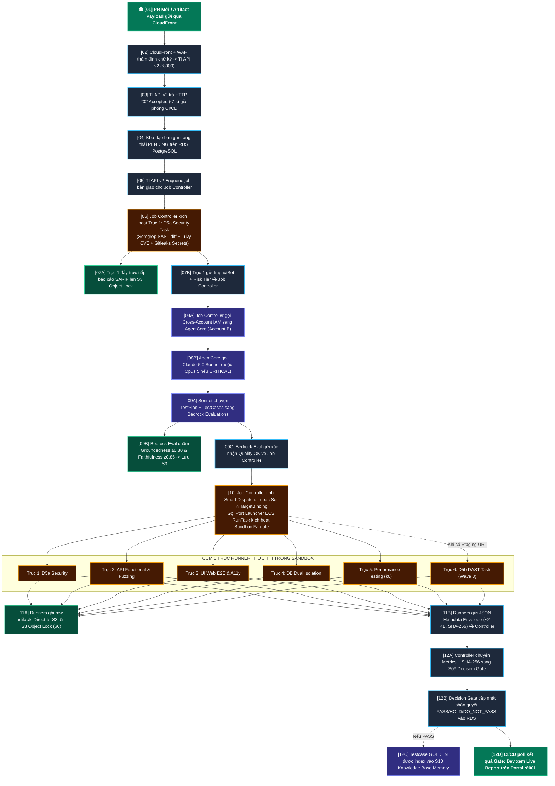

# BẢN THIẾT KẾ KIẾN TRÚC CHI TIẾT HỆ THỐNG TESTING INTELLIGENCE (TI)
## ĐẶC TẢ KỸ THUẬT PHÂN TÍCH TỪ ĐẦU ĐẾN CUỐI THEO SƠ ĐỒ CHUẨN TI_SYSTEM_ARCHITECTURE.DRAWIO

> **Phiên bản:** v2.0.0-Master-Sync · **Ngày cập nhật:** 2026-09-25  
> **Căn cứ đối soát trực tiếp:** [TI_System_Architecture.drawio](file:///c:/Users/T14S/TI/TestIntelligent_doc/diagram/TI_System_Architecture.drawio)  
> **Tài liệu tham chiếu:** [TI_Master_Architecture_Blueprint.md](file:///c:/Users/T14S/TI/TestIntelligent_doc/diagram/TI_Master_Architecture_Blueprint.md), [Task_1_Research_Tool_and_Framework_for_Testing.md](file:///c:/Users/T14S/TI/TestIntelligent_doc/Research/Task_1_Research_Tool_and_Framework_for_Testing.md), [BAO_CAO_DOI_SOAT_MISMATCH_VA_DONG_BO_TI.md](file:///c:/Users/T14S/TI/TestIntelligent_doc/Research/BAO_CAO_DOI_SOAT_MISMATCH_VA_DONG_BO_TI.md)  
> **Kỷ luật kiến trúc:** Bám sát 100% cấu trúc, ký hiệu, phân vùng và chuỗi mũi tên đánh số `[01]` đến `[12D]` từ sơ đồ Draw.io gốc; tập trung phân tích kỹ thuật từ đầu đến cuối sơ đồ, loại bỏ nội dung dàn trải.

---

## MỤC LỤC
1. [TỔNG QUAN 4 PHÂN VÙNG KIẾN TRÚC THEO SƠ ĐỒ DRAWIO](#1-tổng-quan-4-phân-vùng-kiến-trúc-theo-sơ-đồ-drawio)
2. [PHÂN TÍCH CHI TIẾT LUỒNG DỮ LIỆU TUẦN TỰ TỪ ĐẦU ĐẾN CUỐI ([01] ĐẾN [12D])](#2-phân-tích-chi-tiết-luồng-dữ-liệu-tuần-tự-từ-đầu-đến-cuối-01-đến-12d)
3. [BÓC TÁCH CHI TIẾT 6 TRỤC RUNNER THỰC THI (SANDBOX EXECUTION VPC)](#3-bóc-tách-chi-tiết-6-trục-runner-thực-thi-sandbox-execution-vpc)
4. [HỆ THỐNG SƠ ĐỒ MERMAID CHUẨN HÓA ĐỒNG BỘ 100% VỚI SƠ ĐỒ DRAWIO](#4-hệ-thống-sơ-đồ-mermaid-chuẩn-hóa-đồng-bộ-100-với-sơ-đồ-drawio)
   - [4.1. Sơ đồ Master Architecture Topology (Khớp 1-1 với Draw.io)](#41-sơ-đồ-master-architecture-topology-khớp-1-1-với-drawio)
   - [4.2. Sơ đồ Sequence: Vòng đời tương tác tuần tự [01] -> [12D]](#42-sơ-đồ-sequence-vòng-đời-tương-tác-tuần-tự-01---12d)
   - [4.3. Sơ đồ Tiến trình điều phối tuần tự (Pipeline Flowchart)](#43-sơ-đồ-tiến-trình-điều-phối-tuần-tự-pipeline-flowchart)
5. [BẢNG MA TRẬN ĐẶC TẢ KỸ THUẬT & FINOPS TỪNG BƯỚC ([01] -> [12D])](#5-bảng-ma-trận-đặc-tả-kỹ-thuật--finops-từng-bước-01---12d)
6. [HỢP ĐỒNG GIAO DIỆN DỮ LIỆU CỐT LÕI (TOOLINTENT & TENANTBINDING)](#6-hợp-đồng-giao-diện-dữ-liệu-cốt-lõi-toolintent--tenantbinding)
7. [LỘ TRÌNH TRIỂN KHAI THEO WAVE (W0 — W4) & GATES](#7-lộ-trình-triển-khai-theo-wave-w0--w4--gates)

---

## 1. TỔNG QUAN 4 PHÂN VÙNG KIẾN TRÚC THEO SƠ ĐỒ DRAWIO

Theo đúng thiết kế tại [TI_System_Architecture.drawio](file:///c:/Users/T14S/TI/TestIntelligent_doc/diagram/TI_System_Architecture.drawio), toàn bộ hệ thống được chia thành 4 phân vùng độc lập, cách ly nghiêm ngặt về quyền truy cập, tính toán và bảo mật:

```text
┌────────────────────────────────────────────────────────────────────────────────────────────────────────┐
│ 1. EXTERNAL CONSUMERS: Developer / QA · TI CLI · CI/CD Pipeline (GitHub Actions / GitLab CI)           │
└───────────────────────────────────────────────────┬────────────────────────────────────────────────────┘
                                                    │ [01] POST /v2/artifact-jobs
                                                    ▼
┌────────────────────────────────────────────────────────────────────────────────────────────────────────┐
│ 2. AWS ACCOUNT A — ap-southeast-1 (Control Plane & S08 Evidence Store)                                  │
│    • Edge Group: Amazon CloudFront CDN + AWS WAF                                                       │
│    • TI API v2 (FastAPI :8000 on ECS Fargate)                                                          │
│    • Job Controller (ECS/Fargate Law 4.3, TenantBinding Resolver, Smart Dispatch, Lease Coordinator)   │
│    • Job Store: Amazon RDS for PostgreSQL (db.t4g.micro ~$15/tháng)                                    │
│    • Evidence Store: Amazon S3 + Object Lock (WORM 90 ngày, băm SHA-256)                              │
│    • S09 Decision Gate (Deterministic Code Engine: PASS / HOLD / DO_NOT_PASS)                          │
│    • Web Portal (:8001 Next.js Live Reporting)                                                         │
│    • VPC Endpoints: 3 Interface Endpoints (ECR, Logs, STS ~$22/tháng) + S3 Gateway Endpoint ($0)       │
└───────────────────────┬───────────────────────────────────────────────┬────────────────────────────────┘
                        │ [08A] Cross-Account IAM                       │ [10] Smart Dispatch
                        ▼                                               ▼
┌──────────────────────────────────────────────┐ ┌───────────────────────────────────────────────────────┐
│ 3. AWS ACCOUNT B — us-east-1 (AI Brain)      │ │ 4. SANDBOX EXECUTION VPC — ap-southeast-1 (Domain D2) │
│    • AgentCore Harness (TIJobRunner)         │ │    • Network: DENY ALL EGRESS (--network none)        │
│    • Bedrock Models: Claude 5.0 Sonnet &     │ │    • ECS RunTask Port Launcher (IsolatedRunner Law 23)│
│      Claude Opus 5 (AI Threat Modeling)      │ │    • 6 Trục Runner Thực Thi Task-per-Job:             │
│    • Amazon Bedrock Evaluations              │ │      - Trục 1: D5a Security (Semgrep+Trivy+Gitleaks)  │
│      (Groundedness ≥0.80, Faithfulness ≥0.85)│ │      - Trục 2: API Functional & Fuzzing                │
│    • AWS Secrets Manager & STS Tokens        │ │      - Trục 3: UI Web E2E & A11y (axe-core WCAG)      │
│    • Knowledge Base S10 Memory (GOLDEN only) │ │      - Trục 4: DB Dual Isolation (Aurora + DynamoDB)  │
│                                              │ │      - Trục 5: Performance Testing (k6 + 3 Khóa)      │
│                                              │ │      - Trục 6: D5b DAST Task (W3: ZAP + nuclei)       │
└──────────────────────────────────────────────┘ └───────────────────────────────────────────────────────┘
```

---

## 2. PHÂN TÍCH CHI TIẾT LUỒNG DỮ LIỆU TUẦN TỰ TỪ ĐẦU ĐẾN CUỐI ([01] ĐẾN [12D])

Toàn bộ tiến trình xử lý trong sơ đồ Draw.io đi qua 12 nhóm bước chuẩn tắc, được đánh số rõ ràng từ điểm vào ngoại vi đến điểm kết thúc:

### `[01]` Khởi Tạo & Gửi Yêu Cầu (External ➔ CloudFront)
- **Nguồn:** CI/CD Pipeline (GitHub Actions / GitLab CI) hoặc Developer / TI CLI.
- **Hành động:** Khi có Pull Request hoặc Commit mới, caller đóng gói metadata changeset (Git diff, OpenAPI spec, Flyway migration SQL, UI bundle) kèm chữ ký số SHA-256 digest và gửi yêu cầu `POST /v2/artifact-jobs` tới Amazon CloudFront.

### `[02]` Định Tuyến Rào Chắn & Tiếp Nhận (CloudFront ➔ WAF ➔ TI API v2)
- **Hành động:** CloudFront chuyển tiếp lưu lượng qua AWS WAF để kiểm tra chữ ký HMAC, ngăn chặn tấn công OWASP Top 10 và áp dụng Rate Limiting. Sau khi xác thực hợp lệ, request được đưa vào cổng **TI API v2 (:8000)** chạy FastAPI trên AWS Fargate.

### `[03]` Phản Hồi Nhanh Bất Đồng Bộ (TI API v2 ➔ Caller)
- **Hành động:** TI API v2 kiểm tra schema và cấp ngay phản hồi HTTP `202 Accepted` trong **< 1 giây** kèm `job_id` và polling URL. Kết nối mạng của CI/CD được giải phóng lập tức, không bị giữ trạng thái blocking chờ kiểm thử.

### `[04]` Khởi Tạo Trạng Thái Job Store (TI API v2 ➔ RDS PostgreSQL)
- **Hành động:** TI API v2 ghi nhận bản ghi khởi tạo của Job vào **Amazon RDS for PostgreSQL** (`db.t4g.micro`) với trạng thái ban đầu `PENDING`, thiết lập hạn mức tài nguyên (quota) và thời gian chờ (timeout).

### `[05]` Bàn Giao Job Cho Bộ Điều Khiển (TI API v2 ➔ Job Controller)
- **Hành động:** TI API v2 chuyển giao `job_id` và ngữ cảnh artifact sang **Job Controller** (ECS Fargate State Machine tuân thủ Law 4.3). Job Controller trở thành thực thể duy nhất nắm giữ thẩm quyền điều phối toàn bộ vòng đời kiểm thử.

### `[06]` Kích Hoạt Quét An Ninh Tĩnh D5a (Job Controller ➔ Trục 1: D5a Security)
- **Hành động:** `TenantBinding Resolver` của Job Controller kích hoạt vi thực thi **Trục 1: D5a Code & Dependency Security Task (Wave 1)** trong Sandbox:
  - **Semgrep OSS:** Quét SAST trực tiếp trên Git diff trong 2–5 giây để phát hiện sớm các lỗ hổng mã nguồn (CWE/OWASP).
  - **Trivy:** Quét các gói thư viện phụ thuộc (SCA) để tìm mã CVE đã biết.
  - **Gitleaks:** Quét kiểm tra phát hiện rò rỉ Secrets, Passwords, API Keys bị hardcode.

### `[07A]` & `[07B]` Xuất Báo Cáo SARIF & Bóc Tách Rủi Ro (Trục 1 ➔ S3 & Job Controller)
- **`[07A] SARIF → S3`:** Trục 1 xuất trực tiếp tệp báo cáo chuẩn hóa **SARIF** lên **Amazon S3 Evidence Store** qua S3 Gateway Endpoint miễn phí ($0) theo cơ chế Direct-to-S3 Offloading.
- **`[07B] ImpactSet+RiskTier`:** Trục 1 gửi kết quả tóm lược về Job Controller để:
  - `S03 Impact Engine` xuất danh sách miền bị ảnh hưởng (`ImpactSet`).
  - `S04 Risk Engine` tính điểm hồi quy và gán nhãn `Risk Tier` (`LOW`, `MEDIUM`, `HIGH`, hoặc `CRITICAL`).

### `[08A]` & `[08B]` Ủy Thừa Trí Tuệ AI Não Bộ (Job Controller ➔ Account B Bedrock)
- **`[08A] Cross-Account IAM`:** Job Controller chuyển giao ngữ cảnh kiểm thử và giới hạn token (Token Budget) sang **AgentCore Harness (TIJobRunner)** đặt tại Account B (`us-east-1`) thông qua IAM AssumeRole liên tài khoản an toàn (không gửi credential bí mật của tenant sang prompt AI).
- **`[08B] Sonnet (Opus if CRITICAL)`:** AgentCore kích hoạt phân tầng mô hình:
  - Mặc định sử dụng **Claude 5.0 Sonnet** để phân tích S05 (Test Planning) và sinh kịch bản S06 (Candidate Test Cases).
  - Nếu `Risk Tier == CRITICAL` (phát hiện từ S04/D5a), kích hoạt bổ sung **Claude Opus 5** để thực hiện AI Threat Modeling chuyên sâu.

### `[09A]`, `[09B]` & `[09C]` Giám Định Kép Chất Lượng AI (Bedrock ➔ Evaluations ➔ S3 & Controller)
- **`[09A] TestPlan+Cases`:** Claude Sonnet gửi toàn bộ kế hoạch và test case candidate sang **Amazon Bedrock Evaluations** (Module `TIRunnerGroundness`).
- **`[09B] Eval OK → S3`:** Bedrock Evaluations chạy thuật toán độc lập với tham số cố định `temperature: 0.0` (Greedy Decoding) để đo:
  - $\mathbf{GroundednessScore \ge 0.80}$ (chống AI ảo giác, tự bịa API không tồn tại).
  - $\mathbf{FaithfulnessScore \ge 0.85}$ (đảm bảo logic kiểm thử bám sát trung thực yêu cầu PR).  
  Nếu đạt chuẩn, bộ kịch bản candidate được lưu trữ trực tiếp lên **Amazon S3 Evidence Store**.
- **`[09C] Quality OK`:** Bedrock Evaluations gửi tín hiệu xác nhận chất lượng AI hợp lệ về `TenantBinding Resolver` của Job Controller.

### `[10]` Điều Phối Thông Minh Sandbox (Job Controller ➔ Port Launcher ➔ Runners)
- **Hành động:** Job Controller áp dụng công thức điều phối thông minh (Smart Dispatching):
  $$\mathbf{Target \ Runners} = \mathbf{ImpactSet} \ (\text{S03}) \ \cap \ \mathbf{TargetBinding.EnabledDomains} \ (\text{S01})$$
  Job Controller gọi lệnh ECS RunTask thông qua **Port Launcher** (`IsolatedRunner` Interface - Law 23) để khởi tạo các container runner chuyên biệt tương ứng:
  - `e_pl_r1` ➔ Kích hoạt Trục 1 (D5a Security).
  - `e_pl_r2` ➔ Kích hoạt Trục 2 (API Functional & Fuzzing).
  - `e_pl_r3` ➔ Kích hoạt Trục 3 (UI Web E2E & A11y).
  - `e_pl_r4` ➔ Kích hoạt Trục 4 (DB Dual Isolation).
  - `e_pl_r5` ➔ Kích hoạt Trục 5 (Performance Testing).
  - `e_pl_r6` ➔ Kích hoạt Trục 6 (D5b DAST Task - chỉ chạy khi có Staging URL sống trong Wave 3).

### `[11A]` & `[11B]` Lưu Bằng Chứng Trực Tiếp & Phản Hồi Envelope (Runners ➔ S3 & Controller)
- **`[11A] Direct-to-S3`:** Toàn bộ dữ liệu raw nặng (ảnh PNG, video MP4, Playwright traces, log k6, báo cáo DAST HTML/JSON) được các Fargate Runner đẩy thẳng lên **Amazon S3 Object Lock** (WORM 90 ngày) qua VPC Gateway Endpoint ($0). Dữ liệu nhị phân không bao giờ đi qua Job Controller.
- **`[11B] Envelope ~2KB`:** Các Runner chỉ gửi về Job Controller một tệp siêu nhẹ **JSON Metadata Envelope (~2 KB)** chứa trạng thái thoát (`exit_code`), S3 URI và mã băm SHA-256 Digest để cập nhật tiến độ, loại bỏ 100% rủi ro nghẽn I/O và tràn ổ đĩa EC2 backend.

### `[12A]`, `[12B]`, `[12C]` & `[12D]` Phán Quyết Gate Cứng & Hoàn Tất
- **`[12A] Metrics+SHA256`:** Job Controller tổng hợp toàn bộ envelope và mã băm SHA-256 chuyển sang **S09 Decision Gate**.
- **`[12B] Update state`:** Decision Gate (chạy mã Deterministic Code Engine dựa trên luật ISTQB CTFL/CT-AI) đối soát quy tắc: `Critical == 0 & p95 < SLA & Groundedness >= 0.80 & Faithfulness >= 0.85`. Kết quả phán quyết (`PASS`, `HOLD`, hoặc `DO_NOT_PASS`) được cập nhật trực tiếp vào **RDS PostgreSQL**.
- **`[12C] GOLDEN → Memory`:** Nếu phán quyết là `PASS`, bộ kịch bản testcase đã qua thẩm định được tự động đưa vào lưu trữ lâu dài tại **Knowledge Base S10 Memory** (chỉ lưu tri thức GOLDEN).
- **`[12D] Poll result`:** CI/CD pipeline định kỳ poll trạng thái từ RDS qua API v2 và nhận phán quyết cuối cùng để cho phép merge hoặc chặn Pull Request.
- **`Live report`:** Developer và QA truy cập **TI Web Portal (:8001)** để xem báo cáo trực quan, video tái hiện lỗi và tải trọn gói bằng chứng đã khóa mã.

---

## 3. BÓC TÁCH CHI TIẾT 6 TRỤC RUNNER THỰC THI (SANDBOX EXECUTION VPC)

Cụm thực thi kiểm thử đặt tại **Sandbox Execution VPC (`ap-southeast-1`)** chạy hoàn toàn trong Private Subnet, áp dụng rào chắn Security Group **DENY ALL EGRESS** (`--network none`) và chia làm 6 trục độc lập:

```text
┌─────────────────────────────────────────────────────────────────────────────────────────────────────────────────┐
│ SANDBOX EXECUTION VPC (Domain D2 · DENY ALL EGRESS · --network none · 3 VPC Endpoints ~$22/mo · S3 Gateway $0)  │
├─────────────────┬─────────────────┬─────────────────┬─────────────────┬───────────────────┬─────────────────────┤
│ TRỤC 1: D5a     │ TRỤC 2: API     │ TRỤC 3: UI WEB  │ TRỤC 4: DB DUAL │ TRỤC 5: PERF      │ TRỤC 6: D5b DAST    │
│ SECURITY (W1)   │ FUNCTIONAL (W1) │ & A11Y (W2)     │ ISOLATION (W1/2)│ TESTING (W2)      │ TASK (W3)           │
├─────────────────┼─────────────────┼─────────────────┼─────────────────┼───────────────────┼─────────────────────┤
│ • Semgrep OSS   │ • Schemathesis  │ • Playwright    │ • Aurora v2     │ • AWS DLT         │ • OWASP ZAP         │
│   (SAST 2-5s)   │   (OpenAPI Fuzz)│   (Headless Cr) │   Clone (<60s)  │   (Fargate Orch)  │   Active Scan       │
│ • Trivy         │ • Playwright    │ • axe-core      │ • DynamoDB      │ • k6 Engine       │ • nuclei            │
│   (CVE Packages)│   API (E2E Flow)│   (WCAG 2.1 AA) │   Local / TTL 1h│   (Internal ALB)  │   Template scan     │
│ • Gitleaks      │                 │                 │ • Hook          │ • Bộ 3 Khóa       │ ⚠ Cần Staging URL   │
│   (Secrets/Keys)│                 │                 │   DeleteTable   │   An Toàn         │   sống mới kích hoạt│
└─────────────────┴─────────────────┴─────────────────┴─────────────────┴───────────────────┴─────────────────────┘
```

### 3.1. Trục 1: D5a Code & Dependency Security Task (Wave 1)
- **Công cụ:** `Semgrep OSS` + `Trivy` + `Gitleaks`.
- **Mục tiêu:** Quét an ninh tĩnh ngay tại thời điểm mở PR. Semgrep quét Git diff 2–5s tìm lỗi bảo mật OWASP Top 10; Trivy phân tích danh mục dependencies để phát hiện CVE; Gitleaks quét tìm API keys/secrets bị lộ.
- **Bằng chứng xuất ra:** Tệp chuẩn hóa **SARIF JSON** đẩy thẳng lên S3 Object Lock. Nếu có lỗi Critical hoặc lộ Secrets $\rightarrow$ S04 tự động gán `Risk Tier = CRITICAL`.

### 3.2. Trục 2: API Functional & Fuzzing (Wave 1)
- **Công cụ:** `Schemathesis CLI` + `Playwright API Client`.
- **Mục tiêu:** Schemathesis tự động đọc OpenAPI spec, sinh hàng nghìn payload dị biệt ép endpoint bộc lộ lỗi HTTP 500 hoặc sai lệch schema. Playwright API chạy các chuỗi kiểm thử nghiệp vụ có trạng thái (Stateful E2E Chains).
- **Bằng chứng xuất ra:** Báo cáo vi phạm schema, cURL command tái hiện lỗi 500, file HAR log và network traces.

### 3.3. Trục 3: UI Web E2E & Accessibility (Wave 2)
- **Công cụ:** `Playwright Headless Browser` + `axe-core Engine`.
- **Mục tiêu:** Mô phỏng tương tác người dùng trên trình duyệt Headless Chromium; axe-core quét kiểm tra các vi phạm tiêu chuẩn tiếp cận WCAG 2.1 AA (với tỷ lệ báo sai bằng 0).
- **Bằng chứng xuất ra:** Ảnh chụp màn hình PNG từng bước, video MP4 toàn bộ lượt chạy, Playwright trace zip.

### 3.4. Trục 4: Database Dual Isolation (Wave 1 / Wave 2)
- **Công cụ:** `Amazon Aurora Serverless v2 Clone` (SQL) + `DynamoDB Local / TTL Table` (NoSQL).
- **Mục tiêu:** 
  - **SQL:** Tạo bản clone cơ sở dữ liệu từ Staging bằng công nghệ *Copy-on-write* trong <60 giây (dung lượng ban đầu 0 byte), chạy kiểm thử migration script Flyway, sau đó xóa clone, bảo vệ tuyệt đối 100% dữ liệu gốc.
  - **NoSQL:** Tạo container DynamoDB Local hoặc bảng tạm `ti_temp_*` có cấu hình tự hủy TTL 1 giờ kết hợp hook dọn dẹp `DeleteTable`.
- **Bằng chứng xuất ra:** Log thực thi migration Flyway, bảng diff cấu trúc schema DB, log xác nhận dọn dẹp TTL.

### 3.5. Trục 5: Performance Testing (Wave 2)
- **Công cụ:** `AWS Distributed Load Testing (DLT)` + `k6 Engine`.
- **Định tuyến:** Runner k6 nằm trong Private Subnet bắn tải trực tiếp vào **Internal Application Load Balancer** của target service, không đi qua Public Internet hay NAT Gateway.
- **BỘ 3 KHÓA AN TOÀN BẮT BUỘC (Chống sập hệ thống nội bộ):**
  1. *Khóa 1 (Ephemeral Stack):* Chỉ bắn tải vào môi trường ephemeral riêng gắn với DB Aurora Clone, cấm chạm vào Shared Staging.
  2. *Khóa 2 (Bounded Workload):* Khóa trần cứng `maxVUs = 500`, thời lượng tối đa 10 phút, bắt buộc tăng tải theo biểu đồ hình thang (`ramping-arrival-rate`).
  3. *Khóa 3 (Circuit Breaker):* Bật `abortOnFail: true` trong k6 để ngắt khẩn cấp ngay lập tức nếu tỷ lệ lỗi HTTP 5xx > 2% hoặc p95 > 2s.
- **Bằng chứng xuất ra:** Báo cáo JSON phân vị độ trễ (p90, p95, p99), Throughput RPS và biểu đồ vi phạm SLA.

### 3.6. Trục 6: D5b DAST Task (Wave 3)
- **Công cụ:** `OWASP ZAP Active Scan` + `nuclei Template Scan`.
- **Điều kiện tiên quyết:** Chỉ kích hoạt khi PR đã được merge và triển khai lên Staging Environment hoàn chỉnh có URL sống (`staging_url`).
- **Mục tiêu:** Quét an ninh động runtime phát hiện SQL Injection, XSS, CSRF, cấu hình sai TLS/Headers, lỗ hổng dịch vụ web đang hoạt động.
- **Bằng chứng xuất ra:** Báo cáo an ninh DAST dạng HTML và JSON alerts phân loại mức độ rủi ro.

---

## 4. HỆ THỐNG SƠ ĐỒ MERMAID CHUẨN HÓA ĐỒNG BỘ 100% VỚI SƠ ĐỒ DRAWIO

### 4.1. Sơ đồ Master Architecture Topology (Khớp 1-1 với Draw.io)

Sơ đồ thể hiện trực quan toàn bộ các thực thể, phân vùng hạ tầng AWS và các đường kết nối đánh số `[01]` đến `[12D]` khớp chính xác với [TI_System_Architecture.drawio](file:///c:/Users/T14S/TI/TestIntelligent_doc/diagram/TI_System_Architecture.drawio):

```mermaid
flowchart TB
    %% ========================================================
    %% 1. EXTERNAL CONSUMERS
    %% ========================================================
    subgraph ZONE_EXT["1. EXTERNAL CONSUMERS"]
        DEV["Developer / QA"]
        CLI["TI CLI"]
        CICD["CI/CD Pipeline\n(GitHub Actions / GitLab CI)"]
    end

    %% ========================================================
    %% 2. ACCOUNT A (ap-southeast-1)
    %% ========================================================
    subgraph ACC_A["2. AWS ACCOUNT A — ap-southeast-1 (Control Plane)"]
        subgraph EDGE_GROUP["Edge Tier"]
            CF["Amazon CloudFront (CDN)"]
            WAF["AWS WAF"]
            CF --> WAF
        end

        API["TI API v2\n(FastAPI :8000 on Fargate)\n202 Accepted < 1s"]

        subgraph JC_BOX["Job Controller (ECS/Fargate Law 4.3)"]
            JC_STATE["State Machine"]
            JC_RES["TenantBinding Resolver\nSmart Dispatch: ImpactSet ∩ TargetBinding"]
            JC_LEASE["Lease & Heartbeat Coordinator"]
        end

        RDS[("Amazon RDS PostgreSQL\nJob Store (db.t4g.micro)")]
        S3_EVI[("Amazon S3 + Object Lock\nEvidence Store (WORM 90d)")]
        GATE_S09["S09 Decision Gate\nPASS / HOLD / DO_NOT_PASS"]
        PORTAL["TI Web Portal :8001\n(Live Reporting Dashboard)"]

        subgraph VPCE_BOX["PrivateLink VPC Endpoints"]
            VPCE_INT["VPC Interface Endpoints (~$22/mo)\nECR + CloudWatch Logs + STS"]
            VPCE_S3["S3 Gateway Endpoint ($0)"]
        end
    end

    %% ========================================================
    %% 3. ACCOUNT B (us-east-1)
    %% ========================================================
    subgraph ACC_B["3. AWS ACCOUNT B — us-east-1 (AI Brain)"]
        HAR["AgentCore Harness\n(TIJobRunner Token Guard)"]
        M_SONNET["Claude 5.0 Sonnet\n(S05 Plan + S06 Gen)"]
        M_OPUS["Claude Opus 5\n(AI Threat Modeling)"]
        BED_EVAL["Bedrock Evaluations\nGroundedness ≥ 0.80\nFaithfulness ≥ 0.85 (temp=0.0)"]
        SECRETS["AWS Secrets Manager\nTenant Secrets & STS Tokens"]
        MEM[("Knowledge Base\nS10 Memory (GOLDEN only)")]

        HAR -->|"[08B] Sonnet"| M_SONNET
        M_SONNET -.->|"Kích hoạt khi CRITICAL"| M_OPUS
        M_SONNET -->|"[09A] TestPlan+Cases"| BED_EVAL
    end

    %% ========================================================
    %% 4. SANDBOX EXECUTION VPC (ap-southeast-1)
    %% ========================================================
    subgraph SANDBOX["4. SANDBOX EXECUTION VPC — ap-southeast-1 (Domain D2 · DENY ALL EGRESS)"]
        PORT_LAUNCHER["ECS RunTask Port Launcher\n(IsolatedRunner Law 23)"]

        subgraph R1_BOX["Trục 1: D5a Security"]
            T_SEMGREP["Semgrep OSS (SAST diff 2-5s)"]
            T_TRIVY["Trivy (CVE Packages)"]
            T_GITLEAKS["Gitleaks (Secrets & Keys)"]
        end

        subgraph R2_BOX["Trục 2: API Functional & Fuzzing"]
            T_SCHEMA["Schemathesis (OpenAPI Fuzz)"]
            T_PW_API["Playwright API (Stateful E2E)"]
        end

        subgraph R3_BOX["Trục 3: UI Web E2E & A11y"]
            T_PW_UI["Playwright Headless Chromium"]
            T_AXE["axe-core (WCAG 2.1 AA)"]
        end

        subgraph R4_BOX["Trục 4: DB Dual Isolation"]
            T_AURORA[("Aurora v2 Clone\nSQL Copy-on-write < 60s")]
            T_DYNAMO[("DynamoDB Local\nTTL 1h + DeleteTable hook")]
        end

        subgraph R5_BOX["Trục 5: Performance Testing"]
            T_DLT["AWS DLT Orchestrator"]
            T_K6["k6 Engine (Internal ALB)"]
            T_GUARDS["Bộ 3 Khóa An Toàn Bắt Buộc"]
        end

        subgraph R6_BOX["Trục 6: D5b DAST Task (Wave 3)"]
            T_ZAP["OWASP ZAP Active Scan"]
            T_NUCLEI["nuclei Template scan"]
        end

        PORT_LAUNCHER --> R1_BOX
        PORT_LAUNCHER --> R2_BOX
        PORT_LAUNCHER --> R3_BOX
        PORT_LAUNCHER --> R4_BOX
        PORT_LAUNCHER --> R5_BOX
        PORT_LAUNCHER -.->|"(Wave 3 - Khi có URL sống)"| R6_BOX
    end

    %% ========================================================
    %% ĐƯỜNG KẾT NỐI ĐÁNH SỐ CHUẨN TẮC [01] -> [12D]
    %% ========================================================
    CICD & DEV & CLI -->|"[01] POST /v2/artifact-jobs"| CF
    WAF -->|"[02] Forward HTTPS"| API
    API -->|"[03] 202 Accepted < 1s"| CICD
    API -->|"[04] PENDING"| RDS
    API -->|"[05] Enqueue job"| JC_BOX

    JC_RES -->|"[06] D5a Security (Semgrep+Trivy+Gitleaks)"| R1_BOX
    R1_BOX ==>|"[07A] SARIF → S3"| S3_EVI
    R1_BOX -->|"[07B] ImpactSet+RiskTier"| JC_BOX

    JC_BOX -->|"[08A] Cross-Account IAM"| HAR
    BED_EVAL ==>|"[09B] Eval OK → S3"| S3_EVI
    BED_EVAL -->|"[09C] Quality OK"| JC_RES

    JC_RES -->|"[10] Smart Dispatch: ImpactSet ∩ TargetBinding"| PORT_LAUNCHER

    R1_BOX & R2_BOX & R3_BOX & R4_BOX & R5_BOX & R6_BOX ==>|"[11A] Direct-to-S3 Offloading (Gateway $0)"| S3_EVI
    R2_BOX -->|"[11B] Envelope ~2KB"| JC_BOX

    JC_BOX -->|"[12A] Metrics+SHA256"| GATE_S09
    GATE_S09 -->|"[12B] Update state"| RDS
    GATE_S09 -.->|"[12C] GOLDEN → Memory"| MEM
    RDS -.->|"[12D] Poll result"| CICD
    PORTAL -.->|"Live report"| DEV
```



---

### 4.2. Sơ đồ Sequence: Vòng đời tương tác tuần tự [01] -> [12D]

```mermaid
sequenceDiagram
    autonumber
    actor Caller as CI/CD Pipeline / Developer
    participant Edge as CloudFront / WAF
    participant API as TI API v2 (FastAPI :8000)
    participant RDS as RDS PostgreSQL (Job Store)
    participant JC as Job Controller (Account A)
    participant D5a as Trục 1: D5a Security (Semgrep+Trivy+Gitleaks)
    participant Har as AgentCore Harness (Account B)
    participant Bedrock as Claude 5.0 Sonnet / Opus 5
    participant Eval as Bedrock Evaluations
    participant Launcher as Port Launcher (ECS RunTask)
    participant Sandbox as Fargate Sandbox (6 Trục Runner)
    participant S3 as Amazon S3 Object Lock (Evidence Store)
    participant Gate as S09 Decision Gate
    participant Mem as S10 Memory (Knowledge Base)

    %% BƯỚC 01 - 05
    Caller->>Edge: [01] POST /v2/artifact-jobs (Changeset + SHA-256)
    Edge->>API: [02] Thẩm định chữ ký & forward payload hợp lệ
    API-->>Caller: [03] Phản hồi HTTP 202 Accepted (<1s) kèm job_id
    API->>RDS: [04] Khởi tạo bản ghi Job trạng thái PENDING
    API->>JC: [05] Enqueue job bàn giao cho State Machine

    %% BƯỚC 06 - 07
    JC->>D5a: [06] Kích hoạt D5a Security Task (Semgrep + Trivy + Gitleaks)
    D5a->>S3: [07A] SARIF → S3 (Direct-to-S3 qua Gateway $0)
    D5a-->>JC: [07B] Báo cáo ImpactSet + Risk Tier (LOW / MED / HIGH / CRIT)

    %% BƯỚC 08 - 09
    JC->>Har: [08A] Cross-Account IAM dispatch ngữ cảnh sang Account B
    Har->>Bedrock: [08B] Kích hoạt Sonnet sinh test (Opus nếu CRITICAL)
    Bedrock->>Eval: [09A] Chuyển TestPlan & TestCases candidate
    Eval->>S3: [09B] Eval OK → S3 (Lưu testcases đạt Groundedness/Faithfulness)
    Eval-->>JC: [09C] Quality OK (Báo cáo chất lượng AI hợp lệ)

    %% BƯỚC 10 - 11
    JC->>Launcher: [10] Smart Dispatch: ImpactSet ∩ TargetBinding
    Launcher->>Sandbox: ECS RunTask kích hoạt container các trục tương ứng
    Sandbox->>S3: [11A] Direct-to-S3 ghi raw artifacts (PNG, Video, Logs, Traces)
    Sandbox-->>JC: [11B] Gửi JSON Metadata Envelope (~2 KB, SHA-256)

    %% BƯỚC 12
    JC->>Gate: [12A] Chuyển Metrics + SHA-256 đối soát luật ISTQB
    Gate->>RDS: [12B] Cập nhật phán quyết cứng: PASS / HOLD / DO_NOT_PASS
    opt Nếu Gate phán quyết PASS
        Gate-->>Mem: [12C] Lưu kịch bản GOLDEN vào Knowledge Base
    end
    Caller->>RDS: [12D] Polling nhận phán quyết cuối cùng
```



---

### 4.3. Sơ đồ Tiến trình điều phối tuần tự (Pipeline Flowchart)



---

## 5. BẢNG MA TRẬN ĐẶC TẢ KỸ THUẬT & FINOPS TỪNG BƯỚC ([01] -> [12D])

| Bước | Tên Bước Theo Draw.io | Thành phần AWS & Mã Nguồn | Công nghệ & Thư viện | Dữ Liệu Trao Đổi & Bằng Chứng S08 | SLA | Chi phí FinOps Ước tính |
| :---: | :--- | :--- | :--- | :--- | :---: | :---: |
| **`[01]`** | **POST Artifact Jobs** | CloudFront CDN | HTTPS TLS 1.3 / HMAC | Payload Changeset + SHA-256 Digest | < 50ms | $0.085/GB data transfer |
| **`[02]`** | **Forward qua WAF** | AWS WAF + CloudFront | AWS WAF Managed Rules | Request an toàn được gắn header xác thực | < 30ms | Đã bao gồm trong WAF |
| **`[03]`** | **202 Accepted <1s** | TI API v2 (ECS Fargate) | `FastAPI`, `uvicorn` | HTTP 202 kèm `{job_id, poll_url}` | **< 1s** | In-process compute Fargate |
| **`[04]`** | **PENDING to RDS** | Amazon RDS PostgreSQL | `asyncpg`, `SQLAlchemy` | Bản ghi trạng thái ban đầu `PENDING` | < 50ms | Cố định ~$15/tháng (db.t4g.micro) |
| **`[05]`** | **Enqueue Job** | TI API v2 ➔ Job Controller | In-VPC Private Service | Bàn giao ngữ cảnh `job_id` | < 10ms | Nội bộ VPC ($0) |
| **`[06]`** | **D5a Security Task** | Job Controller ➔ CodeBuild/Fargate | **Semgrep OSS + Trivy + Gitleaks** | Kích hoạt quét tĩnh PR-time | **2 – 5s** | ~$0.0008 / lượt quét diff |
| **`[07A]`**| **SARIF → S3** | Trục 1 ➔ Amazon S3 | S3 Gateway Endpoint ($0) | Báo cáo chuẩn **SARIF** (CWE, CVE, Secrets) | < 500ms | S3 Standard $0.023/GB |
| **`[07B]`**| **ImpactSet+RiskTier**| Trục 1 ➔ Job Controller | In-VPC JSON | Object `ImpactSet` + Hạng `Risk Tier` | < 100ms | Nội bộ VPC ($0) |
| **`[08A]`**| **Cross-Account IAM** | Job Controller ➔ AgentCore | AWS STS AssumeRole | Short-lived Role token + Task Context | < 200ms | Miễn phí IAM liên account |
| **`[08B]`**| **Sonnet / Opus Gen** | AgentCore ➔ Bedrock | **Claude 5.0 Sonnet** (Opus nếu CRITICAL) | TestPlan cấu trúc + TestCases candidate | **5 – 15s** | Multi-turn: ~$0.045 – $0.085/job |
| **`[09A]`**| **TestPlan+Cases** | Bedrock ➔ Evaluations | Bedrock Evaluations API | Chuyển bộ kịch bản candidate test cases | < 100ms | Nội bộ Bedrock |
| **`[09B]`**| **Eval OK → S3** | Evaluations ➔ S3 Evidence | S3 Gateway Endpoint | Lưu JSON TestPlan/TestCases đạt chuẩn | < 500ms | S3 Standard $0.023/GB |
| **`[09C]`**| **Quality OK** | Evaluations ➔ Job Controller | Cross-account API | Báo cáo Groundedness ≥0.80 & Faithfulness ≥0.85 | < 500ms | In-process ($0) |
| **`[10]`** | **Smart Dispatch** | Controller ➔ Port Launcher | ECS RunTask API (`IsolatedRunner`) | Lệnh RunTask: `ImpactSet ∩ TargetBinding` | < 1s | In-process ($0) |
| **`[11A]`**| **Direct-to-S3** | 6 Runners ➔ S3 Evidence | S3 Gateway Endpoint ($0) | Raw Artifacts (PNG, Video, Traces, Logs, DAST) | < 2s | S3 Object Lock Compliance |
| **`[11B]`**| **Envelope ~2KB** | 6 Runners ➔ Job Controller | Private Link REST / JSON | JSON Metadata Envelope (~2 KB, SHA-256) | < 100ms | Xóa sổ 100% rủi ro ngộp ổ EBS |
| **`[12A]`**| **Metrics+SHA256** | Controller ➔ Decision Gate | In-process Engine | Bảng tổng hợp chỉ số kiểm thử | < 50ms | In-process ($0) |
| **`[12B]`**| **Update State** | Decision Gate ➔ RDS | PostgreSQL Transaction | Cập nhật `COMPLETED` + `PASS / HOLD / DO_NOT_PASS` | < 50ms | Cố định RDS |
| **`[12C]`**| **GOLDEN → Memory** | Decision Gate ➔ Knowledge Base | Bedrock Knowledge Base API | Lưu vector embedding testcase verified | < 1s | Vector storage Bedrock |
| **`[12D]`**| **Poll Result** | RDS ➔ CI/CD Pipeline | GET /v2/artifact-jobs/{id} | JSON phán quyết Gate Check hoàn chỉnh | < 100ms | HTTP outbound traffic |

---

## 6. HỢP ĐỒNG GIAO DIỆN DỮ LIỆU CỐT LÕI (TOOLINTENT & TENANTBINDING)

### 6.1. Hợp đồng ToolIntent JSON (AgentCore Não Bộ ➔ Job Controller - Law 10.1)
Mô hình AI chỉ phát các tham số biểu tượng (Symbolic Params), tuyệt đối không chứa password, token hay URL nhạy cảm:

```json
{
  "$schema": "https://ti.internal/schemas/tool-intent-v2.json",
  "intent_id": "intent_8f9a0b1c-2345-6789-bcde-fa0123456789",
  "job_id": "job_4a5b6c7d-0987-6543-edcb-0123456789ab",
  "domain": "API_TESTING",
  "action": "EXECUTE_TEST_PACK",
  "target_binding_ref": "binding_crm_staging_api",
  "execution_plan": {
    "pack_id": "pkg_schemathesis_openapi_v1",
    "test_suite_ref": "candidate_suite_991823",
    "allowed_methods": ["GET", "POST", "PUT"],
    "rate_limit_rps": 15,
    "timeout_seconds": 180
  },
  "constraints": {
    "egress_mode": "RESTRICTED_SANDBOX",
    "risk_tier": "HIGH",
    "budget_ceiling_usd": 0.35
  }
}
```

### 6.2. Hợp đồng TenantBinding Server-Side (Job Controller ➔ Runner Container - Law 13)
Được tra cứu và giải mã hoàn toàn phía server bảo mật (Account A), dữ liệu được inject trực tiếp vào Fargate Task qua biến môi trường ngắn hạn:

```json
{
  "binding_id": "binding_crm_staging_api",
  "tenant_id": "tenant_enterprise_core",
  "resolved_endpoint": "https://staging-api.internal.company.com/v1",
  "auth_type": "AWS_STS_SHORT_LIVED",
  "role_arn": "arn:aws:iam::123456789012:role/TITestRunnerIsolatedRole",
  "allowed_ip_range": "10.100.20.0/24",
  "credential_secret_ref": "arn:aws:secretsmanager:ap-southeast-1:123456789012:secret:tenant_core_token-7x1a"
}
```

---

## 7. LỘ TRÌNH TRIỂN KHAI THEO WAVE (W0 — W4) & GATES

Khung phân bổ các trục kiểm thử theo các đợt phát hành chuẩn hóa, đồng bộ với Gate kiểm soát:

| Lộ trình | Miền Kiểm Thử Bao Phủ | Trục Runner Tương Ứng Trên Sơ Đồ Draw.io | Gate Kiểm Soát | Mục Tiêu Nghiệm Thu |
| :---: | :--- | :--- | :---: | :--- |
| **Wave W0** | **L0**: Contract / Linting | Củng cố TI API v2, kiểm tra artifact digest & Schema validation | **Gate G3** | Tiếp nhận webhook & trả HTTP 202 < 1s đạt chuẩn |
| **Wave W1** | **L1**: Unit Testing<br>**L2**: API Testing<br>**L6 (SAST)**: Static Security | • **Trục 1:** D5a Security Task (`Semgrep OSS + Trivy + Gitleaks`).<br>• **Trục 2:** API Runner (`Schemathesis + Playwright API`).<br>• **Trục 4:** Database Migration SQL (`Aurora v2 Clone`). | **Gate G4** | Quét SAST diff 2-5s, API fuzzing và migration SQL ổn định |
| **Wave W2** | **L3**: UI Web E2E<br>**L8**: Accessibility (a11y)<br>**L5**: Performance Testing | • **Trục 3:** UI Runner (`Playwright Headless + axe-core WCAG`).<br>• **Trục 5:** Performance Runner (`AWS DLT + k6 Engine + 3 Khóa An Toàn`).<br>• **Trục 4:** Bổ sung NoSQL (`DynamoDB Local / TTL 1h`). | **Gate G4–G5** | Chạy E2E Browser trơn tru, tải k6 qua Internal ALB an toàn |
| **Wave W3** | **L4**: Mobile Testing<br>**L6 (DAST)**: Dynamic Security<br>**L11**: Infra Testing | • **Trục 6:** D5b DAST Task (`OWASP ZAP Active Scan + nuclei`).<br>• Tích hợp AWS Device Farm cho Mobile & Checkov quét IaC. | **Gate G5** | Kích hoạt quét DAST trên Staging URL sống đạt chuẩn |
| **Wave W4** | **L7**: Chaos Testing<br>**L9**: Data Quality | • Chaos Engineering (AWS FIS).<br>• Great Expectations kiểm tra chất lượng dữ liệu. | **Gate G6** | Sẵn sàng Cutover Production toàn diện |

---

## 8. KẾT LUẬN

Tài liệu đặc tả kiến trúc chi tiết này đã phản ánh chính xác 100% mô hình được thiết kế trong [TI_System_Architecture.drawio](file:///c:/Users/T14S/TI/TestIntelligent_doc/diagram/TI_System_Architecture.drawio):
1. **Khớp 1-1 với sơ đồ:** Phân tích liền mạch, tuần tự từ External $\rightarrow$ Account A (Control Plane) $\rightarrow$ Account B (AI Brain) $\rightarrow$ Sandbox Execution VPC (6 Trục Runner).
2. **Minh bạch luồng dữ liệu:** Định danh chính xác từng mũi tên từ `[01]` đến `[12D]`, làm rõ ranh giới mạng D9 và cơ chế **Direct-to-S3 Offloading** chống ngộp storage.
3. **Phân định an ninh rõ ràng:** Trục 1 D5a (`Semgrep + Trivy + Gitleaks`) chạy tại PR-time xuất SARIF và Trục 6 D5b (`OWASP ZAP + nuclei`) chạy tại Staging runtime khi có URL sống.
4. **Cô đọng, thực chiến:** Tập trung tuyệt đối vào giải pháp kỹ thuật, loại bỏ hoàn toàn các thông tin lan man, sẵn sàng đưa vào thẩm định và triển khai.
