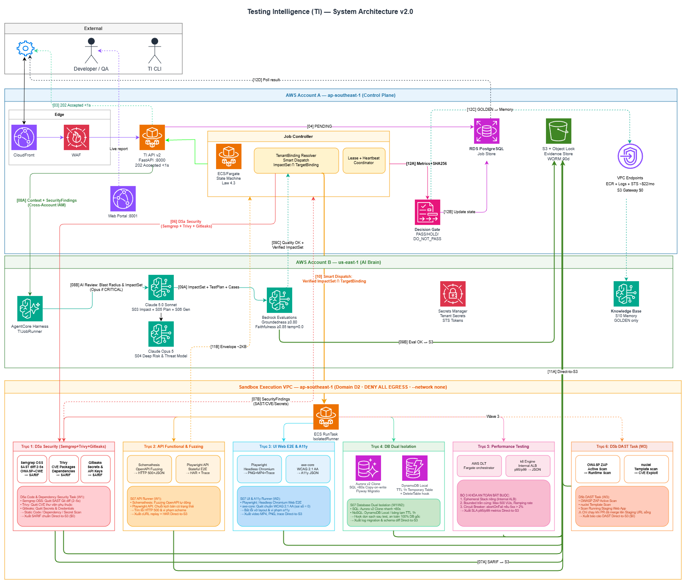

# BẢN THIẾT KẾ KIẾN TRÚC CHI TIẾT HỆ THỐNG TESTING INTELLIGENCE (TI) V2.1 CANDIDATE
## ĐẶC TẢ KỸ THUẬT PHÂN TÍCH TỪ ĐẦU ĐẾN CUỐI THEO SƠ ĐỒ CHUẨN TI_SYSTEM_ARCHITECTURE-ARCHITECTURE_V2

> **Phiên bản:** v2.1.0-CANDIDATE · **Ngày cập nhật:** 2026-09-28  
> **Căn cứ đối soát trực tiếp:** [`TI_System_Architecture.drawio`](TI_System_Architecture.drawio) (SUPERSEDED) · [`images/TI_Master_Architecture.drawio`](images/TI_Master_Architecture.drawio)  
> **Hình ảnh sơ đồ kiến trúc chuẩn:** [`images/TI_System_Architecture-Architecture_V2.drawio.png`](images/TI_System_Architecture-Architecture_V2.drawio.png)  
> **Kỷ luật kiến trúc & Sự thật (ADR-0002/0003):** Khớp theo bản vẽ `v2.1 CANDIDATE` ngày 28/09/2026.  
> ⚠️ **LƯU Ý QUAN TRỌNG:** Đây là **THIẾT KẾ ĐÍCH (CANDIDATE, CHƯA TRIỂN KHAI)**. Hiện trạng đo kiểm thực tế (`OBSERVED`, đo 22/09/2026 trên commit ghim `8a61cf66`): Hệ thống vẫn chạy trên **1 EC2 duy nhất** (TI API cổng `:8000` + Web Portal cổng `:8001`), dữ liệu evidence ghi trực tiếp vào ổ đĩa EBS, cổng `#97` vẫn mở, `runtime_binding` và Memory reuse vẫn mang nhãn `UNVERIFIED`. Đúng Law 18: *Bản vẽ kiến trúc giải thích thiết kế, không thay thế bằng chứng nghiệm thu.*

---

## MỤC LỤC
1. [TỔNG QUAN 4 PHÂN VÙNG KIẾN TRÚC THEO SƠ ĐỒ V2.1](#1-tổng-quan-4-phân-vùng-kiến-trúc-theo-sơ-đồ-v21)
2. [PHÂN TÍCH CHI TIẾT LUỒNG DỮ LIỆU TUẦN TỰ TỪ ĐẦU ĐẾN CUỐI ([01] ĐẾN [12D])](#2-phân-tích-chi-tiết-luồng-dữ-liệu-tuần-tự-từ-đầu-đến-cuối-01-đến-12d)
3. [BÓC TÁCH CHI TIẾT 6 TRỤC RUNNER THỰC THI (SANDBOX EXECUTION VPC)](#3-bóc-tách-chi-tiết-6-trục-runner-thực-thi-sandbox-execution-vpc)
4. [SƠ ĐỒ KIẾN TRÚC HỆ THỐNG HIỆN TẠI (SYSTEM ARCHITECTURE DIAGRAM)](#4-sơ-đồ-kiến-trúc-hệ-thống-hiện-tại-system-architecture-diagram)
5. [BẢNG MA TRẬN ĐẶC TẢ KỸ THUẬT & FINOPS TỪNG BƯỚC ([01] -> [12D])](#5-bảng-ma-trận-đặc-tả-kỹ-thuật--finops-từng-bước-01---12d)
6. [HỢP ĐỒNG GIAO DIỆN DỮ LIỆU CỐT LÕI (TOOLINTENT & TENANTBINDING)](#6-hợp-đồng-giao-diện-dữ-liệu-cốt-lõi-toolintent--tenantbinding)
7. [CÁC KHỐI VẬN HÀNH & BẢO VỆ NỀN TẢNG BẮT BUỘC](#7-các-khối-vận-hành--bảo-vệ-nền-tảng-bắt-buộc)
8. [LỘ TRÌNH TRIỂN KHAI THEO WAVE (W0 — W4) & GATES](#8-lộ-trình-triển-khai-theo-wave-w0--w4--gates)
9. [KẾT LUẬN](#9-kết-luận)

---

## 1. TỔNG QUAN 4 PHÂN VÙNG KIẾN TRÚC THEO SƠ ĐỒ V2.1

Toàn bộ hệ thống được chia thành 4 phân vùng độc lập, cách ly nghiêm ngặt về mạng, quyền IAM và trách nhiệm xử lý:

```text
┌────────────────────────────────────────────────────────────────────────────────────────────────────────┐
│ 1. EXTERNAL CONSUMERS: Developer / QA · TI CLI · CI/CD Pipeline (GitHub Actions / GitLab CI)           │
└───────────────────────────────────────────────────┬────────────────────────────────────────────────────┘
                                                    │ [01] POST /v2/artifact-jobs
                                                    ▼
┌────────────────────────────────────────────────────────────────────────────────────────────────────────┐
│ 2. AWS ACCOUNT A — ap-southeast-1 (Control Plane & Evidence Store — System of Record)                 │
│    • Edge Group: Amazon CloudFront CDN + AWS WAF (OWASP Rules + Rate Limit; HMAC tại API/Lambda@Edge)  │
│    • TI API v2: FastAPI (:8000) on AWS Fargate (Trả 202 Accepted < 1s, khởi tạo state: queued)         │
│    • Job Controller: ECS Fargate Law 4.3 (State Machine, TenantBinding Resolver, Smart Dispatch)       │
│    • Job Store: Amazon RDS for PostgreSQL (db.t4g.micro ~$15/tháng [CANDIDATE])                        │
│    • Evidence Store: Amazon S3 + Object Lock (WORM 90 ngày, SHA-256 Digest)                            │
│    • Secrets & STS: AWS Secrets Manager & STS Tokens (Account A — Law 13: Secrets KHÔNG sang Prompt)   │
│    • S09 Decision Gate: Deterministic Code Engine (PASS / HOLD+Waiver / DO_NOT_PASS)                   │
│    • Web Portal: Next.js (:8001) Live Reporting Dashboard                                              │
└───────────────────────┬───────────────────────────────────────────────┬────────────────────────────────┘
                        │ [08A] Context + SecurityFindings              │ [10] Smart Dispatch
                        │       (Cross-Account IAM, KHÔNG mang secret)  │      (Verified ImpactSet ∩ Binding)
                        ▼                                               ▼
┌──────────────────────────────────────────────┐ ┌───────────────────────────────────────────────────────┐
│ 3. AWS ACCOUNT B — us-east-1 (AI Brain)      │ │ 4. SANDBOX EXECUTION VPC — ap-southeast-1 (Domain D2) │
│    • AgentCore Gateway: Policy / MCP Handler │ │    • Network: Private Subnet không IGW/NAT            │
│    • AgentCore Harness: TIJobRunner (v5)     │ │    • SG DENY ALL EGRESS (chỉ mở prefix-list VPCE)    │
│    • Bedrock Models (Dual-Model Tiering):    │ │    • VPC Endpoints: ECR, Logs, STS (~$22/mo) + S3 ($0)│
│      - Claude Sonnet 5 (anthropic.claude-    │ │    • ECS RunTask Port Launcher (IsolatedRunner Law 23)│
│        sonnet-5 — S03 gợi ý + S05/S06 TestGen│ │    • 6 Trục Runner Thực Thi Task-per-Job:             │
│        [CANDIDATE])                          │ │      - Trục 1: D5a Security (Semgrep+Trivy+Gitleaks)  │
│      - Claude Opus 5 (S04 Deep Risk Threat   │ │      - Trục 2: API Functional & Fuzzing (Schemathesis)│
│        khi Risk Tier == CRITICAL [CANDIDATE])│ │      - Trục 3: UI Web E2E & A11y (axe-core WCAG)      │
│    • Bedrock Evaluations (temperature: 0.0): │ │      - Trục 4: DB Dual Isolation (Aurora v2 + Dynamo) │
│      (Groundedness ≥0.80, Faithfulness ≥0.85)│ │      - Trục 5: Performance Testing (k6 + 3 Khóa)      │
│    • Knowledge Base S10 Memory (GOLDEN only  │ │      - Trục 6: D5b DAST Task (W3: ZAP + nuclei)       │
│      — UNVERIFIED chưa nghiệm thu reuse)     │ │    • Bằng chứng: Direct-to-S3, Envelope 2KB về Account│
└──────────────────────────────────────────────┘ └───────────────────────────────────────────────────────┘
```

* **Phân vùng 1 (External Consumers):** Tác nhân kích hoạt kiểm thử từ bên ngoài (Lập trình viên, QA, CI/CD Pipeline).
* **Phân vùng 2 (AWS Account A — Singapore):** Tầng điều khiển trung tâm (Control Plane), giữ sổ cái trạng thái duy nhất (`Job Store`), thẩm quyền điều phối (`Workflow Authority`), lưu trữ bằng chứng bất biến (`Evidence Store`), và quản lý Secrets/STS Tokens (Law 13).
* **Phân vùng 3 (AWS Account B — N. Virginia):** Tầng suy luận trí tuệ nhân tạo (AI Brain), đảm nhiệm phân tích ngữ nghĩa, đề xuất gợi ý `ImpactSet` và kế hoạch kiểm thử (`TestPlan`/`TestCases`), được kiểm chứng độc lập bởi Bedrock Evaluations chống ảo giác trước khi trả về `ToolIntent JSON`.
* **Phân vùng 4 (Sandbox Execution VPC — Singapore):** Tầng thực thi cô lập microVM Fargate task-per-job, áp dụng chính sách mạng không Internet (`Private Subnet không IGW/NAT + SG DENY ALL EGRESS + VPC Endpoints`) để chạy 6 Trục Runner an toàn tuyệt đối.

---

## 2. PHÂN TÍCH CHI TIẾT LUỒNG DỮ LIỆU TUẦN TỰ TỪ ĐẦU ĐẾN CUỐI ([01] ĐẾN [12D])

Tiến trình vận hành trên sơ đồ Draw.io đi qua 12 nhóm bước chuẩn tắc, đánh số rõ ràng từ điểm vào ngoại vi đến điểm kết thúc:

### `[01]` Khởi Tạo & Gửi Yêu Cầu (External ➔ CloudFront)
* **Caller:** CI/CD Pipeline (GitHub Actions / GitLab CI) hoặc Developer qua TI CLI.
* **Hành động:** Khi có Pull Request mới, caller đóng gói metadata changeset (Git diff, OpenAPI spec, Flyway migration SQL) kèm chữ ký số SHA-256 digest và gửi yêu cầu `POST /v2/artifact-jobs` tới CloudFront.

### `[02]` Thẩm Định Biên & Chuyển Tiếp HTTPS (CloudFront ➔ WAF ➔ TI API v2)
* **Thành phần:** Amazon CloudFront + AWS WAF.
* **Hành động:** CloudFront chuyển tiếp lưu lượng qua AWS WAF để ngăn chặn tấn công OWASP Top 10 và áp dụng Rate Limiting. Xác thực chữ ký HMAC được thực hiện tại **TI API v2** (hoặc Lambda@Edge) nhằm đảm bảo an toàn tính toàn vẹn gói tin (WAF managed rules không tự động xác thực HMAC). Request hợp lệ được đưa vào cổng `:8000` của **TI API v2** chạy trên AWS Fargate.

### `[03]` Phản Hồi Bất Đồng Bộ Cực Nhanh (TI API v2 ➔ Caller)
* **Thành phần:** TI API v2 (FastAPI Engine).
* **Hành động:** Validate schema của artifact và digest SHA-256. Trả ngay phản hồi HTTP `202 Accepted` kèm `job_id` trong thời gian **< 1 giây**, giải phóng hoàn toàn tiến trình CI/CD runner mà không bắt pipeline phải chờ đợi.

### `[04]` Khởi Tạo Trạng Thái queued (TI API v2 ➔ RDS PostgreSQL)
* **Thành phần:** TI API v2 ➔ Amazon RDS for PostgreSQL (`rds_pg`).
* **Hành động:** Ghi nhận bản ghi Job mới vào cơ sở dữ liệu với trạng thái khởi tạo **`queued`** (chuẩn hóa thống nhất theo bộ 4 trạng thái của Portal: `queued`, `running`, `completed`, `failed`) kèm thông tin tenant, commit SHA và audit metadata.

### `[05]` Đưa Job Vào Hàng Đợi Điều Phối (TI API v2 ➔ Job Controller)
* **Thành phần:** TI API v2 ➔ Job Controller (`jc_box`).
* **Hành động:** Đưa `job_id` và ngữ cảnh artifact vào máy trạng thái của Job Controller, chuyển trạng thái Job sang **`running`**.

### `[06]` Kích Hoạt Quét An Ninh Tĩnh D5a (Job Controller ➔ Trục 1 Sandbox)
* **Thành phần:** Job Controller ➔ `r1_box` (Trục 1: D5a Security trong Sandbox VPC).
* **Hành động:** Kích hoạt container Fargate task-per-job chạy song song bộ ba công cụ:
  * **Semgrep OSS:** Quét SAST trực tiếp trên Git diff (thời gian cực nhanh 2–5 giây).
  * **Trivy:** Quét danh mục thư viện phụ thuộc (SCA) phát hiện mã CVE.
  * **Gitleaks:** Quét phát hiện rò rỉ Secrets, Passwords, API Keys trong changeset.
* **Quy chuẩn chạy Pre-scan:** Chạy **đúng 1 lần** duy nhất (dùng chung container image D5a với ruleset rút gọn, đóng DEF-S3-011).

### `[07A]` & `[07B]` Xuất Báo Cáo SARIF & Bàn Giao SecurityFindings (Trục 1 ➔ S3 & Job Controller)
* **`[07A] SARIF → S3`:** Trục 1 xuất trực tiếp tệp báo cáo chuẩn hóa **SARIF** lên **Amazon S3 Evidence Store** qua S3 Gateway Endpoint miễn phí ($0) theo cơ chế Direct-to-S3 Offloading.
* **`[07B] SecurityFindings`:** Trục 1 gửi danh sách phát hiện an ninh tĩnh (`SecurityFindings`: danh mục lỗ hổng SAST, CVE packages và secret leaks) về cho Job Controller.
  * *Lưu ý kiến trúc (Quyết định chốt):* Trục 1 là công cụ quét tĩnh theo pattern-matching, **không tự ý suy diễn `ImpactSet` nghiệp vụ**. Trục 1 chỉ cung cấp dữ liệu bằng chứng an ninh thô cho bước tiếp theo.

### `[08A]` & `[08B]` AI Semantic Review: Tính Toán Blast Radius & ImpactSet (Job Controller ➔ Account B Bedrock)
* **`[08A] Context + SecurityFindings`:** Job Controller chuyển giao toàn bộ ngữ cảnh PR Changeset (Git diff, OpenAPI spec, SQL migration) kèm theo `SecurityFindings` từ Trục 1 sang **AgentCore Harness (TIJobRunner)** tại Account B (`us-east-1`) qua IAM STS AssumeRole ngắn hạn. Tuyệt đối không mang secrets/credentials hay URL đích thật vào prompt.
* **`[08B] AI Review: Blast Radius & ImpactSet (Sonnet / Opus if CRITICAL)`:**
  * **Claude Sonnet 5** (`anthropic.claude-sonnet-5`, `us-east-1` [CANDIDATE]) đảm nhiệm **AI Semantic Code Review (S03 Impact Engine)**: Phân tích AST, Call Graph và Dependency Graph để xác định phạm vi lan truyền tác động thực sự, từ đó đề xuất giả thuyết đối tượng chuẩn tắc **`ImpactSet`** (chỉ rõ chính xác các domain và endpoints bị ảnh hưởng: API, UI, Database, hay Performance).
  * **S04 Risk Engine:** Đánh giá mức độ rủi ro tổng hợp từ `SecurityFindings` (D5a) và độ phức tạp mã nguồn để đề xuất `Risk Tier` (`LOW`, `MEDIUM`, `HIGH`, hoặc `CRITICAL`). Nếu phát hiện lỗ hổng nghiêm trọng hoặc rò rỉ secret (`Risk Tier == CRITICAL`), kích hoạt bổ sung **Claude Opus 5** để thực hiện AI Threat Modeling chuyên sâu.
  * *Nguyên tắc phân quyền S03/S04 (G-18):* Harness ở Account B là bộ não suy luận đề xuất giả thuyết `ImpactSet`/`RiskTier`; sau khi qua Evaluations xác thực, **Job Controller tại Account A là System of Record chốt `Verified ImpactSet` và `RiskTier`**.
  * Sinh kế hoạch kiểm thử (**S05 Test Planning**) và kịch bản candidate (**S06 Candidate Generation**) bám sát chính xác `ImpactSet` vừa sinh, đóng gói dưới dạng `ToolIntent JSON`.

### `[09A]`, `[09B]` & `[09C]` Giám Định Kép & Trả Về Verified ImpactSet (Bedrock ➔ Evaluations ➔ S3 & Controller)
* **`[09A] ImpactSet + TestPlan + Cases`:** Claude Sonnet gửi `ImpactSet`, kế hoạch kiểm thử và candidate test cases sang **Amazon Bedrock Evaluations** (Module `TIRunnerGroundness`).
* **`[09B] Eval OK → S3`:** Bedrock Evaluations chạy thuật toán độc lập với tham số cố định `temperature: 0.0` (Greedy Decoding) để đo **Bộ 6 chỉ số GenAI (Tolerance ±0.03)**:
  * $\mathbf{GroundednessScore \ge 0.80}$ (chống AI ảo giác, tự bịa API/Field không tồn tại).
  * $\mathbf{FaithfulnessScore \ge 0.85}$ (trung thực với logic nghiệp vụ). **Nếu Faithfulness < 0.85 → tự động kích hoạt trạng thái HOLD**.
  * $\mathbf{ContextRelevance \ge 0.80}$ (đúng phạm vi thay đổi).
  * $\mathbf{AnswerRelevance \ge 0.80}$ (bám sát mục tiêu kiểm thử).
  * $\mathbf{Toxicity = 0.0}$ (không chứa mã/dữ liệu độc hại).
  * $\mathbf{HallucinationRate \le 0.05}$ (tỷ lệ suy diễn sai dưới 5%).
  * *Chính sách Retry (C-3):* Nếu chỉ số chưa đạt ngưỡng, cho phép tự động tái sinh tối đa $N$ lần ($N \le 2$, ghi log kiểm toán lên S3). Nếu quá $N$ lần vẫn không đạt $\rightarrow$ Chuyển thẳng sang nhánh `HOLD`.
  * Các kịch bản đạt chuẩn được lưu thẳng vào S3 Evidence Store.
* **`[09C] Quality OK + Verified ImpactSet`:** Bedrock Evaluations gửi tín hiệu xác nhận chất lượng AI hợp lệ kèm theo **`Verified ImpactSet`** và `Risk Tier` về `TenantBinding Resolver` của Job Controller (Account A).

### `[10]` Điều Phối Thông Minh Kích Hoạt Runners (Job Controller ➔ Port Launcher ➔ Runners)
* **Thành phần:** Job Controller ➔ `port_launcher` ➔ Cụm 6 Trục Runner trong Sandbox VPC.
* **Công thức Smart Dispatching (G-15):** $\mathbf{Target = Verified\ ImpactSet \cap TargetBinding}$.
* **Hành động:** Job Controller chỉ gọi ECS RunTask (`IsolatedRunner` Law 23) để kích hoạt **chính xác các Trục Runner nằm trong `Verified ImpactSet` do AI xác định và được khai báo trong `TargetBinding`**. Các miền không bị tác động được đánh dấu **`SKIPPED`** ngay lập tức, tiết kiệm 100% tài nguyên compute.

### `[11A]` & `[11B]` Cơ Chế Direct-to-S3 Offloading & Envelope Metadata (Runners ➔ S3 & Controller)
* **`[11A] Direct-to-S3 Offloading` (Law 16):** Toàn bộ dữ liệu artifact nặng (ảnh PNG, video MP4, Playwright traces, log k6, báo cáo DAST) được các Runner đẩy thẳng lên S3 Object Lock (WORM 90 ngày) qua S3 Gateway Endpoint ($0).
* **`[11B] Envelope ~2KB`:** Runner chỉ gửi về Job Controller một **JSON Metadata Envelope siêu nhẹ (~2 KB)** chứa exit code, S3 URI và mã băm SHA-256 Digest $\rightarrow$ Triệt tiêu 100% rủi ro nghẽn I/O và tràn ổ đĩa backend.

### `[12A]` ➔ `[12D]` Phán Quyết Gate, Cập Nhật Trạng Thái & Hoàn Tất
* **`[12A] Metrics+SHA256`:** Job Controller đối soát mã băm SHA-256 và chuyển envelope cùng metrics sang **S09 Decision Gate**.
* **`[12B] Phán Quyết Gate 3 Nhánh & Update State (G-09, G-17):`** Decision Gate chạy mã **Deterministic Code Engine** đối soát các luật cứng, tách biệt hoàn toàn trạng thái thực thi (`state = completed`) với kết quả chất lượng (`gate_result`). **Quy tắc tối thượng Law 18: `completed ≠ PASS` (Khuyến nghị của Gate không thay thế phê duyệt phát hành cuối cùng)**:
  1. **`PASS`:** Mọi chỉ số kiểm thử thỏa mãn (`Critical == 0`, `p95 < SLA`, `Groundedness >= 0.80`, `Faithfulness >= 0.85`).
  2. **`HOLD + Waiver`:** Kích hoạt khi có cảnh báo biên, chỉ số tiệm cận ngưỡng hoặc `Faithfulness < 0.85`. Người có thẩm quyền (QA Lead) kiểm tra evidence và ghi nhận bản ghi `WaiverDecision` (chứa người duyệt, lý do, thời điểm). *Lưu ý:* `WaiverDecision` chỉ cho phép gỡ trạng thái giữ trong TI, quyết định phát hành cuối cùng thuộc về Release Authority / XoraOps.
  3. **`DO_NOT_PASS (Hard-stop)`:** Kích hoạt ngay lập tức khi phát hiện `Critical > 0`, `SECRETS_LEAKED > 0`, mã băm SHA-256 mismatch, hoặc rollback thất bại. Cấm tuyệt đối mọi hành vi override thủ công.
* **`[12C] GOLDEN → Memory`:** Chỉ khi Gate đạt `PASS`, test case hợp lệ mới được xem xét đưa vào Bedrock Knowledge Base (S10 Memory) để phục vụ Few-shot Learning (hiện mang nhãn `UNVERIFIED — chưa nghiệm thu reuse`).
* **`[12D] Polling Kết Quả (G-11):`** CI/CD pipeline định kỳ thăm dò kết quả qua API chuẩn: `CI → GET /v2/artifact-jobs/{id} → TI API v2 → RDS` (không truy cập trực tiếp RDS) để nhận phán quyết hoàn chỉnh và quyết định hành vi merge Pull Request.

---

## 3. BÓC TÁCH CHI TIẾT 6 TRỤC RUNNER THỰC THI (SANDBOX EXECUTION VPC)

Mỗi trục là một container Fargate task-per-job độc lập, chạy trong Private Subnet không có Internet Gateway/NAT Gateway với rào chắn mạng **DENY ALL EGRESS**, chỉ thông qua các VPC Endpoints cần thiết:

```text
┌─────────────────────────────────────────────────────────────────────────────────────────────────────────────────┐
│ SANDBOX EXECUTION VPC (Domain D2 · Private Subnet không IGW/NAT · SG DENY ALL EGRESS · VPCE ~$22/mo · S3 $0)    │
├─────────────────┬─────────────────┬─────────────────┬─────────────────┬───────────────────┬─────────────────────┤
│ TRỤC 1: D5a     │ TRỤC 2: API     │ TRỤC 3: UI WEB  │ TRỤC 4: DB DUAL │ TRỤC 5: PERF      │ TRỤC 6: D5b DAST    │
│ SECURITY (W1)   │ FUNCTIONAL (W1) │ & A11Y (W2)     │ ISOLATION (W1/2)│ TESTING (W2)      │ TASK (W3)           │
├─────────────────┼─────────────────┼─────────────────┼─────────────────┼───────────────────┼─────────────────────┤
│ • Semgrep OSS   │ • Schemathesis  │ • Playwright    │ • Aurora v2     │ • AWS DLT         │ • OWASP ZAP         │
│   (SAST 2-5s)   │   (OpenAPI Fuzz)│   (Headless Cr) │   Clone (<60s)  │   (Fargate Orch)  │   Active Scan       │
│ • Trivy         │ • Playwright    │ • axe-core      │ • DynamoDB      │ • k6 Engine       │ • nuclei            │
│   (CVE Packages)│   API (E2E Flow)│   (WCAG 2.1 AA) │   Local / TTL 1h│   (Internal ALB)  │   Template scan     │
│ • Gitleaks      │                 │                 │ • Hook          │ • Bộ 3 Khóa       │ ⚠ Cần Staging URL   │
│   (Secrets/Keys)│                 │                 │   DeleteTable   │   An Toàn         │   sống mới kích hoạt│
└─────────────────┴─────────────────┴─────────────────┴─────────────────┴───────────────────┴─────────────────────┘
```

1. **Trục 1: D5a Security Task (`r1_box`):** `Semgrep OSS` (quét AST Git diff 2–5s) + `Trivy` (quét CVE phụ thuộc) + `Gitleaks` (quét secrets). Xuất file chuẩn SARIF lên S3 (`[07A]`) và gửi `SecurityFindings` về Controller (`[07B]`).
2. **Trục 2: API Functional & Fuzzing (`r2_box`):** `Schemathesis` (fuzzing hàng nghìn payload biên từ OpenAPI spec) + `Playwright API` (thực thi luồng nghiệp vụ E2E có trạng thái).
3. **Trục 3: UI Web E2E & Accessibility (`r3_box`):** `Playwright Headless Chromium` (chạy kịch bản người dùng E2E) + `axe-core Engine` (nhúng trình duyệt quét tiêu chuẩn tiếp cận WCAG 2.1 AA, tỷ lệ báo sai bằng 0).
4. **Trục 4: Database Dual Isolation (`r4_box`):** `Amazon Aurora Serverless v2 Clone` (clone copy-on-write trong < 60s để test Flyway migration SQL, sau đó tự hủy, `PENDING tham vấn Team Data`) + `DynamoDB Local / Ephemeral Table` (bảng tạm tự hủy TTL 1 giờ).
5. **Trục 5: Performance Testing (`r5_box`):** `AWS DLT` + `k6 Engine` bắn tải trực tiếp vào Internal ALB qua mạng nội bộ. Bắt buộc tuân thủ **Bộ 3 Khóa An Toàn**: Ephemeral DB riêng, trần cứng tối đa 500 VUs trong 10 phút, và Circuit Breaker ngắt khẩn cấp nếu lỗi HTTP 5xx > 2% (cần phê duyệt của DevOps).
6. **Trục 6: D5b DAST Task (`r6_box`):** `OWASP ZAP Active Scan` + `nuclei`. **Chỉ kích hoạt tại Wave 3 khi có Staging URL sống** sau khi PR đã deploy thành công, quét an ninh động tìm SQLi, XSS, CSRF.

---

## 4. SƠ ĐỒ KIẾN TRÚC HỆ THỐNG HIỆN TẠI (SYSTEM ARCHITECTURE DIAGRAM)

### 4.1. Hình ảnh Sơ đồ Kiến trúc Chuẩn (Draw.io Export)

Sơ đồ được thiết kế và đồng bộ chuẩn xác tại tệp gốc [`TI_System_Architecture.drawio`](TI_System_Architecture.drawio) (SUPERSEDED) và [`images/TI_Master_Architecture.drawio`](images/TI_Master_Architecture.drawio):



### 4.2. Bản Đồ Trực Quan Các Phân Vùng & Chuỗi Kết Nối [01] ➔ [12D]

Bản đồ dưới đây mô phỏng chính xác cấu trúc hình học và chuỗi luồng đi qua AI Semantic Review:

```text
========================================================================================================================
[EXTERNAL CONSUMERS] (zone_ext)
Developer / QA  ·  TI CLI  ·  CI/CD Settings / Runner
       │
       ▼ [01] POST /v2/artifact-jobs (Changeset, OpenAPI, Digest SHA-256)
========================================================================================================================
[AWS ACCOUNT A: ap-southeast-1 Singapore] (zone_acct_a) — CONTROL PLANE & EVIDENCE STORE
  CloudFront (CDN) ──► WAF ──► [02] TI API v2 (:8000) ──► [03] 202 Accepted (<1s) ──► Caller
                                     │
                  ┌──────────────────┴──────────────────┐
                  ▼ [04] queued bản ghi                 ▼ [05] Enqueue job
             RDS PostgreSQL                        Job Controller (jc_box)
             (rds_pg: db.t4g.micro)                  ├─ jc_ecs (State Machine)
                                                     ├─ jc_resolver (TenantBinding & Smart Dispatch)
                                                     └─ jc_lease (Worker Lease)
                                                        │
       ┌────────────────────────────────────────────────┼────────────────────────────────────────┐
       ▼ [06] D5a Security                              ▼ [08A] Context + SecurityFindings       ▼ [10] Smart Dispatch
=========================================  =============================================  ==============================
[SANDBOX EXECUTION VPC] (sandbox)          [AWS ACCOUNT B: us-east-1] (zone_acct_b)       [PORT LAUNCHER] (port_launcher)
Domain D2 · DENY ALL EGRESS                 AGENTCORE AI BRAIN                             ECS RunTask (Law 23)
Private Subnet · VPCE + S3 Gateway $0       AgentCore Harness (agentcore)                  │
                                              │ [08B] AI Review: Blast Radius & ImpactSet   ▼
  Trục 1: D5a Security (r1_box)               Bedrock Models (Sonnet 5 + Opus if CRITICAL) CỤM 6 TRỤC RUNNER SANDBOX:
    • Semgrep OSS (SAST 2-5s)                 │ [09A] ImpactSet + TestPlan + Cases           • Trục 1: D5a Security
    • Trivy (CVE Packages)                    Bedrock Evaluations (bedrock_eval)             • Trục 2: API Fuzzing
    • Gitleaks (Secrets)                      (Groundedness ≥0.80, Faith. ≥0.85)             • Trục 3: UI Web & axe A11y
       │──► [07A] SARIF ──► S3 Evidence               │──► [09B] Eval OK ──► S3 Evidence     • Trục 4: Aurora v2 Clone
       └──► [07B] SecurityFindings ──► Controller     └──► [09C] Quality OK + Verified       • Trục 5: Perf k6 (3 Khóa)
                                                                 ImpactSet ──► Controller    • Trục 6: D5b DAST (ZAP)
                                                                                             │
                                                                                             ├──► [11A] Direct-to-S3 ($0)
                                                                                             └──► [11B] Envelope ~2KB ──┐
                                                                                                                        │
========================================================================================================================│
[HOÀN TẤT & PHÁN QUYẾT GATE] (Account A)                                                                                │
                                                                                                                        │
   S09 Decision Gate (s09_gate) ◄───────────────── [12A] Metrics + SHA-256 Digest ◄─────────────────────────────────────┘
   (Deterministic Code Engine: Critical==0, p95<SLA, Groundedness≥0.80, Faithfulness≥0.85)
     │
     ├────► [12B] Update State ──────────► RDS PostgreSQL (state=completed | gate_result=PASS / HOLD+Waiver / DO_NOT_PASS)
     │                                        │
     │                                        └─► [12D] Poll Result (CI → API v2 → RDS) ──► CI/CD Pipeline (Merge / Block)
     │
     ├────► [12C] GOLDEN Test Cases ─────► S10 Knowledge Base Memory (Account B: bedrock_kb — UNVERIFIED)
     │
     └────► Live Report & Video Trace ───► Web Portal (:8001 Next.js Dashboard) ──► Developer / QA
========================================================================================================================
```

---

## 5. BẢNG MA TRẬN ĐẶC TẢ KỸ THUẬT & FINOPS TỪNG BƯỚC ([01] -> [12D])

> **Ghi chú kỷ luật:** Cột **SLA** phản ánh *mục tiêu thiết kế (CANDIDATE)*, không phải cam kết đã đo tại hiện trạng. Mọi chi phí đều mang nhãn theo `GLOSSARY_TI.md`.

| Bước | Tên Bước Trên Sơ Đồ | Thành phần AWS | Công nghệ / Tool | Dữ Liệu Trao Đổi & Bằng Chứng | SLA (Mục tiêu) | Chi phí FinOps Ước tính | Nhãn Sự Thật |
| :---: | :--- | :--- | :--- | :--- | :---: | :---: | :---: |
| **`[01]`** | **POST Artifact Jobs** | Amazon CloudFront | HTTPS TLS 1.3 / ACM | Payload Changeset + SHA-256 Digest | < 50ms | $0.085/GB data transfer | `INFERRED` |
| **`[02]`** | **Forward qua WAF** | AWS WAF + CloudFront | AWS WAF Managed Rules | Request an toàn được gắn header xác thực | < 30ms | Đã bao gồm trong WAF | `INFERRED` |
| **`[03]`** | **202 Accepted <1s** | TI API v2 (ECS Fargate) | `FastAPI`, `uvicorn` | HTTP 202 kèm `{job_id, poll_url}` | **< 1s** | Cụm Fargate Control Plane | `CANDIDATE` |
| **`[04]`** | **queued to RDS** | Amazon RDS PostgreSQL | `asyncpg`, `SQLAlchemy` | Bản ghi trạng thái ban đầu `queued` | < 50ms | Cố định ~$15/tháng (db.t4g.micro) | `CANDIDATE` |
| **`[05]`** | **Enqueue Job** | TI API v2 ➔ Job Controller | In-VPC Private Service | Bàn giao ngữ cảnh `job_id` | < 10ms | Nội bộ VPC ($0) | `INFERRED` |
| **`[06]`** | **D5a Security Task** | Job Controller ➔ Trục 1 | **Semgrep + Trivy + Gitleaks** | Kích hoạt quét tĩnh PR-time (1 lần) | **2 – 5s** | Compute Fargate per-second | `CANDIDATE` |
| **`[07A]`**| **SARIF → S3** | Trục 1 ➔ Amazon S3 | S3 Gateway Endpoint ($0) | Báo cáo chuẩn **SARIF** (CWE, CVE, Secrets) | < 500ms | S3 Standard $0.023/GB | `INFERRED` |
| **`[07B]`**| **SecurityFindings** | Trục 1 ➔ Job Controller | In-VPC JSON | Danh sách phát hiện lỗ hổng SAST/CVE/Secrets | < 100ms | Nội bộ VPC ($0) | `INFERRED` |
| **`[08A]`**| **Context + SecurityFindings** | Job Controller ➔ AgentCore | AWS STS AssumeRole | Changeset + SecurityFindings + Token Budget | < 200ms | Miễn phí IAM liên account | `INFERRED` |
| **`[08B]`**| **AI Review: Impact & TestGen**| AgentCore ➔ Bedrock | **Claude Sonnet 5** (Opus nếu CRITICAL) | S03 Blast Radius ➔ `ImpactSet` + Test Plan | **5 – 15s** | Multi-turn: ~$0.045 – $0.085/job | `CANDIDATE` |
| **`[09A]`**| **ImpactSet + TestPlan + Cases**| Bedrock ➔ Evaluations | Bedrock Evaluations API | Chuyển `ImpactSet` + Candidate Test Cases | < 100ms | Nội bộ Bedrock | `CANDIDATE` |
| **`[09B]`**| **Eval OK → S3** | Evaluations ➔ S3 Evidence | S3 Gateway Endpoint | Lưu JSON TestPlan/TestCases đạt chuẩn | < 500ms | S3 Standard $0.023/GB | `INFERRED` |
| **`[09C]`**| **Quality OK + Verified ImpactSet**| Evaluations ➔ Job Controller | Cross-account API | Báo cáo Groundedness ≥0.80 + Verified `ImpactSet` | < 500ms | In-process ($0) | `CANDIDATE` |
| **`[10]`** | **Smart Dispatch** | Controller ➔ Port Launcher | ECS RunTask (`IsolatedRunner`) | Lệnh RunTask: `Verified ImpactSet ∩ TargetBinding` | < 1s | In-process ($0) | `CANDIDATE` |
| **`[11A]`**| **Direct-to-S3** | 6 Runners ➔ S3 Evidence | S3 Gateway Endpoint ($0) | Raw Artifacts (PNG, Video, Traces, Logs, DAST) | < 2s | S3 Object Lock Compliance | `CANDIDATE` |
| **`[11B]`**| **Envelope ~2KB** | 6 Runners ➔ Job Controller | Private Link REST / JSON | JSON Metadata Envelope (~2 KB, SHA-256) | < 100ms | Xóa sổ 100% rủi ro ngộp ổ EBS | `CANDIDATE` |
| **`[12A]`**| **Metrics+SHA256** | Controller ➔ Decision Gate | In-process Engine | Bảng tổng hợp chỉ số kiểm thử | < 50ms | In-process ($0) | `CANDIDATE` |
| **`[12B]`**| **Update State** | Decision Gate ➔ RDS | PostgreSQL Transaction | Cập nhật `state=completed` + `gate_result` | < 50ms | Cố định RDS | `CANDIDATE` |
| **`[12C]`**| **GOLDEN → Memory** | Decision Gate ➔ Knowledge Base | Bedrock Knowledge Base API | Lưu vector embedding testcase verified | < 1s | Vector storage Bedrock | `UNVERIFIED` |
| **`[12D]`**| **Poll Result** | CI ➔ TI API v2 ➔ RDS | GET /v2/artifact-jobs/{id} | JSON phán quyết Gate Check hoàn chỉnh | < 100ms | HTTP outbound traffic | `CANDIDATE` |

---

## 6. HỢP ĐỒNG GIAO DIỆN DỮ LIỆU CỐT LÕI (TOOLINTENT & TENANTBINDING)

### 6.1. Hợp đồng ToolIntent JSON (AgentCore AI Intelligence ➔ Job Controller - Law 10.1)
Mô hình AI chỉ phát các tham số biểu tượng (Symbolic Params), tuyệt đối không chứa password, token hay URL nhạy cảm:

```json
{
  "$schema": "https://ti.internal/schemas/tool-intent-v2.json",
  "intent_id": "intent_8f9a0b1c-2345-6789-bcde-fa0123456789",
  "job_id": "job_4a5b6c7d-0987-6543-edcb-0123456789ab",
  "domain": "API_TESTING",
  "action": "EXECUTE_TEST_PACK",
  "target_binding_ref": "binding_crm_staging_api",
  "execution_plan": {
    "pack_id": "pkg_schemathesis_openapi_v1",
    "test_suite_ref": "candidate_suite_991823",
    "allowed_methods": ["GET", "POST", "PUT"],
    "rate_limit_rps": 15,
    "timeout_seconds": 180
  },
  "constraints": {
    "egress_mode": "RESTRICTED_SANDBOX",
    "risk_tier": "HIGH",
    "budget_ceiling_usd": 0.35
  }
}
```

### 6.2. Hợp đồng TenantBinding Server-Side (Job Controller ➔ Runner Container - Law 13)
Được tra cứu và giải mã hoàn toàn phía server bảo mật (Account A), dữ liệu được inject trực tiếp vào Fargate Task qua biến môi trường ngắn hạn:

```json
{
  "binding_id": "binding_crm_staging_api",
  "tenant_id": "tenant_enterprise_core",
  "resolved_endpoint": "https://staging-api.internal.company.com/v1",
  "auth_type": "AWS_STS_SHORT_LIVED",
  "role_arn": "arn:aws:iam::123456789012:role/TITestRunnerIsolatedRole",
  "allowed_ip_range": "10.100.20.0/24",
  "credential_secret_ref": "arn:aws:secretsmanager:ap-southeast-1:123456789012:secret:tenant_core_token-7x1a"
}
```

---

## 7. CÁC KHỐI VẬN HÀNH & BẢO VỆ NỀN TẢNG BẮT BUỘC (G-13, G-16, G-20, G-21)

Để bảo đảm tính khả thi triển khai thực tế trên hạ tầng AWS và tránh các điểm nghẽn vận hành (Operational Bottlenecks), hệ thống TI bắt buộc phải tích hợp 8 khối thiết kế sau:

### 7.1. AgentCore Gateway & Chính Sách IAM Liên Account (Law 4)
* **Vị trí:** Biên vào Account B (`us-east-1`).
* **Vai trò:** Đóng vai trò là reverse proxy kiểm soát mọi yêu cầu gọi mô hình Bedrock. Thực thi chính sách bảo mật MCP (Model Context Protocol), phân tích Token Budget, kiểm tra quyền `AssumeRole` từ Job Controller và ghi nhận audit log chi tiết.

### 7.2. Quản Trị Mã Nguồn Test Script Tập Trung (`ti-test-packs/` — F07)
* **Kho lưu trữ:** Repository riêng biệt `ti-test-packs/` (CANDIDATE).
* **Versioning:** Mọi kịch bản kiểm thử (Playwright E2E, k6 perf scenarios, Schemathesis contracts) được đánh số phiên bản theo **Git Tag** (`vX.Y.Z`).
* **Kỷ luật cô lập:** Task Fargate trong Sandbox tuyệt đối **không tải động (dynamic download) script từ Internet hay Git public** trong lúc runtime; toàn bộ kịch bản được nướng sẵn (pre-baked) vào container image hoặc nạp từ S3 nội bộ qua S3 Gateway Endpoint.

### 7.3. Pipeline Đóng Gói Pre-baked Images & Đường Giao Hàng (D04)
* **Đường giao hàng (nét đứt):** `GitHub Actions ➔ Amazon ECR ➔ AWS Systems Manager (SSM) Parameter Store`.
* **4 Container Image Pre-baked Chuyên Dụng:**
  1. `ti-runner-sast`: Nướng sẵn Semgrep OSS, Trivy, Gitleaks.
  2. `ti-runner-api`: Nướng sẵn Schemathesis, Playwright API engine.
  3. `ti-runner-ui`: Nướng sẵn Chromium headless, Playwright, axe-core engine.
  4. `ti-runner-perf`: Nướng sẵn k6 engine cùng các extension giám sát.
* **Ghim SHA-256 Digest:** Các task definition của ECS Fargate luôn tham chiếu bằng **Image Digest cố định** (ví dụ `sha256:7f9a...`), nghiêm cấm dùng tag `latest`.

### 7.4. Cảnh Báo An Toàn Tải: Chống "Tự DoS Người Nhà" & AWS Ban (B10, F08)
* **Cảnh báo rủi ro:** Việc kích hoạt k6 bắn tải với số lượng VU lớn từ Sandbox có thể gây cạn kiệt băng thông NAT/VPC nội bộ hoặc kích hoạt cơ chế AWS Abuse/Fraud tự động khóa tài khoản (AWS Ban).
* **Quy chuẩn bắt buộc:** Trước khi chạy k6 (Trục 5), Job Controller phải kiểm tra cờ phê duyệt từ **DevOps / SRE Team**. Mọi cuộc kiểm thử tải đều phải hướng vào **Internal ALB** với trần khống chế tối đa 500 VUs và kích hoạt Circuit Breaker ngắt khẩn cấp khi lỗi 5xx vượt quá 2%.

### 7.5. Tham Vấn Team Data về Aurora Serverless v2 Clone Quota (F05)
* **Trạng thái:** `PENDING tham vấn Team Data`.
* **Cơ chế:** Việc clone Database copy-on-write bằng Aurora Serverless v2 phụ thuộc vào hạn ngạch tài khoản AWS (Storage Snapshot Quota, IOPS Burst Limits). Cần phối hợp với Team Data để cấu hình auto-delete sau 60 phút và giới hạn tối đa 3 cluster clone đồng thời.

### 7.6. Nhánh NoSQL Ephemeral Testing (Trục 4 — G-16, D11)
* **Thành phần:** `DynamoDB Local` container hoặc AWS DynamoDB Ephemeral Table với tiền tố `ti_ephemeral_{job_id}`.
* **Cơ chế dọn dẹp:** Đính kèm cấu hình TTL 1 giờ và Hook tự hủy `DeleteTable` sau khi test hoàn tất, đảm bảo không để lại rác dữ liệu hay phát sinh chi phí lưu trữ dư thừa.

### 7.7. Ranh Giới Quét An Ninh & Rủi Ro Prompt-Injection (Footnote bắt buộc — F09)
* **Giới hạn hiện tại:** `Semgrep OSS` và `Trivy` hiện chỉ quét tĩnh trên **mã nguồn phần mềm (source code diff)** và danh mục thư viện phụ thuộc, **chưa thể phát hiện hành vi runtime động của LLM**.
* **Định hướng Shift-Left:** Vì TI là nền tảng kiểm thử tự động (không có UI Chat tương tác người dùng mở), rủi ro **Prompt-Injection** được định nghĩa dưới góc độ: *Phát hiện các payload độc hại cố tình cài cắm vào Git commit / OpenAPI spec nhằm thao túng prompt của AgentCore Harness*.

### 7.8. AgentCore Runtime 18 Receipt & Ràng Buộc S10 Memory (D08, Law 10.2)
* **Biên lai lịch sử (Receipt):** AgentCore Runtime 18 ghi nhận tại commit `fbdd8dfc` / image `efabf57dcd8c` (14/09/2026).
* **Ràng buộc tri thức:** Khối Knowledge Base S10 Memory hiện mang nhãn **`UNVERIFIED — chưa nghiệm thu reuse`**. Chỉ những kịch bản kiểm thử đạt tiêu chuẩn vàng `GOLDEN` (vượt qua Gate S09 deterministic với phán quyết `PASS`) mới được index vào bộ nhớ dài hạn nhằm triệt tiêu nguy cơ "ô nhiễm tri thức" (knowledge pollution).

---

## 8. LỘ TRÌNH TRIỂN KHAI THEO WAVE (W0 — W4) & GATES

| Lộ trình | Miền Kiểm Thử Bao Phủ | Trục Runner Tương Ứng Trên Sơ Đồ | Gate Kiểm Soát | Mục Tiêu Nghiệm Thu |
| :---: | :--- | :--- | :---: | :--- |
| **Wave W0** | **L0**: Contract / Linting | Củng cố TI API v2, kiểm tra artifact digest & Schema validation | **Gate G3** | Tiếp nhận webhook & trả HTTP 202 < 1s đạt chuẩn |
| **Wave W1** | **L1**: Unit Testing<br>**L2**: API Testing<br>**L6 (SAST)**: Static Security | • **Trục 1:** D5a Security (`Semgrep OSS + Trivy + Gitleaks`).<br>• **Trục 2:** API Runner (`Schemathesis + Playwright API`).<br>• **Trục 4:** Database Migration SQL (`Aurora v2 Clone`). | **Gate G4** | Quét SAST diff 2-5s, API fuzzing và migration SQL ổn định |
| **Wave W2** | **L3**: UI Web E2E<br>**L8**: Accessibility (a11y)<br>**L5**: Performance Testing | • **Trục 3:** UI Runner (`Playwright Headless + axe-core WCAG`).<br>• **Trục 5:** Performance Runner (`AWS DLT + k6 + 3 Khóa An Toàn`).<br>• **Trục 4:** Bổ sung NoSQL (`DynamoDB Local / TTL 1h`). | **Gate G4–G5** | Chạy E2E Browser trơn tru, tải k6 qua Internal ALB an toàn |
| **Wave W3** | **L4**: Mobile Testing<br>**L6 (DAST)**: Dynamic Security<br>**L11**: Infra Testing | • **Trục 6:** D5b DAST Task (`OWASP ZAP Active Scan + nuclei`).<br>• Tích hợp AWS Device Farm cho Mobile & Checkov quét IaC. | **Gate G5** | Kích hoạt quét DAST trên Staging URL sống đạt chuẩn |
| **Wave W4** | **L7**: Chaos Testing<br>**L9**: Data Quality | • Chaos Engineering (AWS FIS).<br>• Great Expectations kiểm tra chất lượng dữ liệu. | **Gate G6** | Sẵn sàng Cutover Production toàn diện |

---

## 9. KẾT LUẬN & CAM KẾT SỰ THẬT (SHIFT-LEFT QUALITY INVARIANTS)

Bản đặc tả kỹ thuật chi tiết v2.1 CANDIDATE này hoàn thiện toàn diện các thiếu sót kỹ thuật trước đây:
1. **Đồng bộ tuyệt đối với sơ đồ chuẩn:** Khớp hoàn toàn với bản vẽ `TI_System_Architecture-Architecture_V2` và các tài liệu của Hùng (Workflow) cùng Hoàng (Master Blueprint).
2. **Tuân thủ kỷ luật ranh giới sự thật:** Tách bạch rõ ràng giữa thiết kế đích `CANDIDATE` và hiện trạng đo kiểm `OBSERVED` (1 EC2, ghim `8a61cf66`).
3. **Quyền lực thuộc về Job Controller (Account A):** Khóa chặt ranh giới AI (Account B chỉ suy luận gợi ý, Job Controller là System of Record chốt `Verified ImpactSet`).
4. **Cô lập mạng và an toàn dữ liệu tuyệt đối:** Thực thi Private Subnet không IGW/NAT, SG DENY ALL EGRESS, bảo mật secrets tại Account A (Law 13), và Direct-to-S3 Offloading (Law 16) triệt tiêu nguy cơ ngộp ổ cứng.
5. **Cổng Gate S09 Deterministic:** Tách biệt trạng thái thực thi khỏi kết quả đánh giá chất lượng; tuân thủ nghiêm ngặt nguyên lý **Law 18: `completed ≠ PASS`** và cơ chế Human-in-the-loop Waiver.
