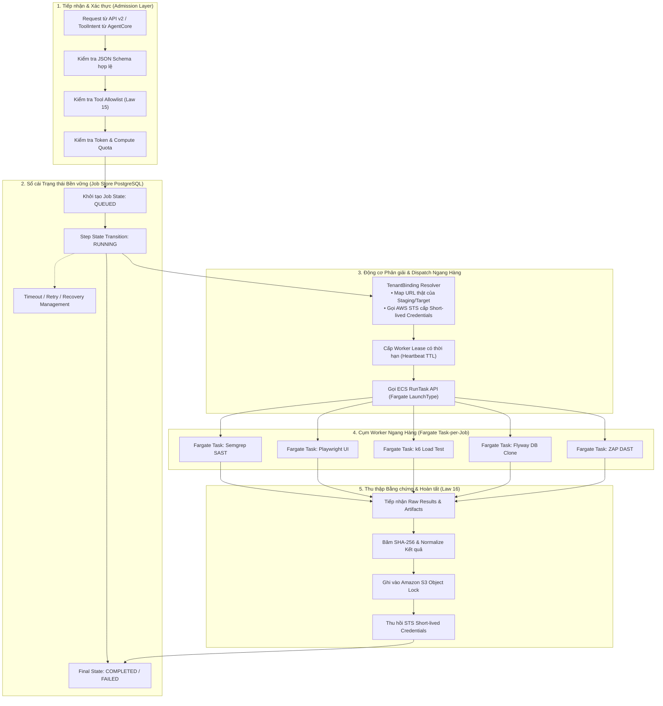
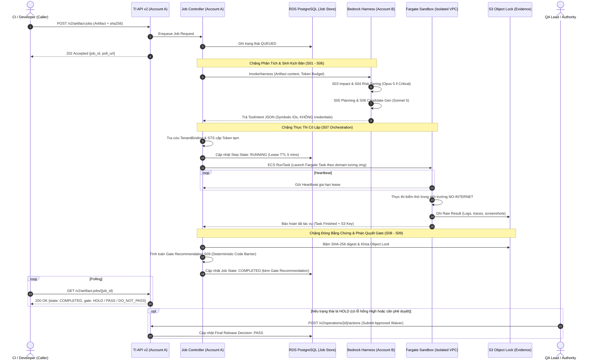

# TÀI LIỆU ĐẶC TẢ KIẾN TRÚC TỔNG THỂ HỆ THỐNG TESTING INTELLIGENCE (TI)
## BẢN THIẾT KẾ HỢP NHẤT HẠ TẦNG CLOUD, CƠ CHẾ PHÂN TẦNG AI VÀ KHUNG ĐIỀU PHỐI KIỂM THỬ ĐA MIỀN
### Master Architecture Blueprint — Version 1.0 (Sign-off Ready)

---

| Thuộc tính | Chi tiết |
| :--- | :--- |
| **Hệ thống** | Testing Intelligence (TI) Platform — Enterprise Test Execution & Evaluation Spine |
| **Ngày hoàn thiện** | 25 tháng 9 năm 2026 |
| **Các bên đóng góp** | • **Hà Tây Nguyên** (DevOps): Triết lý Ports & Adapters, Plugin & Interface Abstraction.<br>• **Hoàng** (Task 2 — Architecture) & **Trang** (Task 1 — Tooling): Hạ tầng AWS 2 Accounts, Fargate Sandbox, VPC Endpoints & FinOps.<br>• **Nghĩa** (Task 3 — AI Model) & **Hùng** (Task 4 — QA Strategy): Chuỗi S01–S10, Model Tiering, ToolIntent Handshake, Tiêu chuẩn ISTQB CT-AI/GenAI. |
| **Phê duyệt bởi** | Tan.Thai (Product Architect) · Anh Quang (Project Lead / Delivery) |
| **Trạng thái tài liệu** | 🟢 **APPROVED / MASTER BLUEPRINT** (Sẵn sàng triển khai Spike P4 & Wave 1) |

---

## MỤC LỤC

1. [TỔNG QUAN CHIẾN LƯỢC & NGUYÊN TẮC HỢP NHẤT](#1-tổng-quan-chiến-lược--nguyên-tắc-hợp-nhất)
2. [TAM HỢP KIẾN TRÚC: HỒN — XÁC — NÃO CỦA HỆ THỐNG TI](#2-tam-hợp-kiến-trúc-hồn--xác--não-của-hệ-thống-ti)
   - [2.1. Phần Hồn: Triết lý Ports & Adapters và Interface IsolatedRunner (Law 23)](#21-phần-hồn-triết-lý-ports--adapters-và-interface-isolatedrunner-law-23)
   - [2.2. Phần Xác: Hạ tầng AWS 2 Accounts, Fargate Sandbox & Tối ưu Mạng D9](#22-phần-xác-hạ-tầng-aws-2-accounts-fargate-sandbox--tối-ưu-mạng-d9)
   - [2.3. Phần Não: Chuỗi S01–S10, Bedrock Model Tiering & ToolIntent Handshake](#23-phần-não-chuỗi-s01s10-bedrock-model-tiering--toolintent-handshake)
3. [SƠ ĐỒ KIẾN TRÚC TỔNG THỂ (C4 MODEL DIAGRAMS)](#3-sơ-đồ-kiến-trúc-tổng-thể-c4-model-diagrams)
   - [3.1. Sơ đồ C4 Level 2: Container & Deployment Topology (Toàn cảnh 3 vùng)](#31-sơ-đồ-c4-level-2-container--deployment-topology-toàn-cảnh-3-vùng)
   - [3.2. Sơ đồ C4 Level 3: Zoom sâu bên trong Job Controller (Workflow Authority)](#32-sơ-đồ-c4-level-3-zoom-sâu-bên-trong-job-controller-workflow-authority)
   - [3.3. Sơ đồ Sequence: Vòng đời xử lý một Job từ Tiếp nhận đến Gate S09](#33-sơ-đồ-sequence-vòng-đời-xử-lý-một-job-từ-tiếp-nhận-đến-gate-s09)
4. [CHI TIẾT CÁC MIỀN THIẾT KẾ KỸ THUẬT (DOMAIN SPECIFICATIONS)](#4-chi-tiết-các-miền-thiết-kế-kỹ-thuật-domain-specifications)
   - [4.1. Domain D2: Fargate Sandbox Task-per-Job](#41-domain-d2-fargate-sandbox-task-per-job)
   - [4.2. Domain D2.b: Database Testing với Aurora Serverless v2 Clone](#42-domain-d2b-database-testing-với-aurora-serverless-v2-clone)
   - [4.3. Domain D5a & D5b: Chiến lược An ninh Đa tầng (Hybrid Defense)](#43-domain-d5a--d5b-chiến-lược-an-ninh-đa-tầng-hybrid-defense)
   - [4.4. Domain D9: Tối ưu Hóa Chi phí Mạng Egress Sandbox](#44-domain-d9-tối-ưu-hóa-chi-phí-mạng-egress-sandbox)
5. [HỢP ĐỒNG GIAO DIỆN DỮ LIỆU (CONTRACT SPECIFICATIONS)](#5-hợp-đồng-giao-diện-dữ-liệu-contract-specifications)
   - [5.1. Cấu trúc ToolIntent JSON (AgentCore $\rightarrow$ Job Controller)](#51-cấu-trúc-toolintent-json-agentcore--job-controller)
   - [5.2. Cấu trúc TenantBinding Server-Side (Job Controller $\rightarrow$ Runner)](#52-cấu-trúc-tenantbinding-server-side-job-controller--runner)
6. [BÀI TOÁN KINH TẾ HẠ TẦNG (FINOPS & TCO ESTIMATION)](#6-bài-toán-kinh-tế-hạ-tầng-finops--tco-estimation)
7. [LỘ TRÌNH TRIỂN KHAI THEO WAVE (W0 — W4) & GATES](#7-lộ-trình-triển-khai-theo-wave-w0--w4--gates)

---

## 1. TỔNG QUAN CHIẾN LƯỢC & NGUYÊN TẮC HỢP NHẤT

Testing Intelligence (TI) Platform được thiết kế nhằm giải quyết bài toán lớn: **Chuyển đổi từ một hệ thống đánh giá thụ động (Evaluation-only) sang Nền tảng Tự động hóa Thực thi và Đánh giá Kiểm thử Đa miền Toàn diện (Active Test Execution & Evaluation)**.

Hệ thống tuân thủ nghiêm ngặt **24 Architecture Laws** của TI, trong đó tập trung vào các nguyên lý cốt lõi:
1. **Law 4.3 (Workflow Authority)**: `Job Controller` là cơ quan giữ sổ cái trạng thái và điều phối workflow duy nhất; AI Model / AgentCore chỉ là đơn vị tư vấn suy luận, không phải system of record.
2. **Law 5 & 7 (Deterministic Measurement & Zero AI Self-Declaration)**: Mọi kết quả pass/fail đều phải đo bằng công cụ định lượng thật; AI Model tuyệt đối không được tự phán `PASS` cho chính mình.
3. **Law 10.1 & 13 (Server-Owned Binding & Untrusted Artifact)**: `ToolIntent` từ AI không bao giờ được chứa credential, URL thật hoặc câu lệnh shell/SQL tùy ý; mọi đích đến vật lý đều do server tra cứu tại `TenantBinding`.
4. **Law 16 (Immutable Evidence Digest)**: Bằng chứng thô phải được chuẩn hóa, băm SHA-256 và lưu trữ bất biến trên S3 Object Lock.
5. **Law 18 (`completed ≠ PASS`)**: Job chạy xong trạng thái completed chỉ có nghĩa là hoàn thành kỹ thuật, quyết định Gate đạt chuẩn hay không thuộc về luật đánh giá và người có thẩm quyền.
6. **Law 23 (Provider Port & Replacement Contract)**: Mọi module thực thi đều gắn qua Interface chuẩn; thay đổi công nghệ bên dưới không được làm đục lõi điều phối.

---

## 2. TAM HỢP KIẾN TRÚC: HỒN — XÁC — NÃO CỦA HỆ THỐNG TI

Bản thiết kế này dung hòa hoàn hảo đóng góp từ cả 4 nhóm chuyên trách:

```
                  ┌────────────────────────────────────────┐
                  │          PHẦN NÃO (Task 3 & 4)         │
                  │   Bedrock Claude Model Tiering 3 cấp   │
                  │   Chuỗi S01-S10 & ToolIntent Handshake │
                  │   ISTQB CT-AI / CT-GenAI Ground Truth  │
                  └───────────────────┬────────────────────┘
                                      │ (ToolIntent JSON - Law 10.1)
                                      ▼
┌─────────────────────────────────────┴─────────────────────────────────────┐
│                            PHẦN HỒN (DevOps / Nguyên)                     │
│               Triết lý Ports & Adapters (Hexagonal Architecture)           │
│                    Cơ chế Plugin & Interface IsolatedRunner               │
│                  Tách biệt Control Plane vs Execution Engine              │
└─────────────────────────────────────┬─────────────────────────────────────┘
                                      │ (Dispatch có Lease - Law 23)
                                      ▼
                  ┌────────────────────────────────────────┐
                  │         PHẦN XÁC (Task 1 & 2)          │
                  │      Hạ tầng AWS 2 Accounts Riêng Biệt │
                  │    ECS Fargate Task-per-Job (Sandbox)  │
                  │    Mạng D9 No-Internet & VPC Endpoints │
                  │     Aurora Serverless v2 Clone (<60s)  │
                  └────────────────────────────────────────┘
```

### 2.1. Phần Hồn: Triết lý Ports & Adapters và Interface IsolatedRunner (Law 23)
- **Đóng góp từ Hà Tây Nguyên (DevOps)**:
  - Áp dụng mẫu kiến trúc **Hexagonal (Ports and Adapters)** kết hợp **Plugin Architecture**.
  - **Tách bạch Control Plane và Execution Engine**: Control Plane (`Job Controller`) nắm giữ logic nghiệp vụ, quản lý vòng đời tác vụ, nhưng hoàn toàn mù (agnostic) đối với công nghệ kiểm thử cụ thể.
  - **Interface `IsolatedRunner` (Cổng giao tiếp chuẩn)**:
    ```typescript
    interface IsolatedRunner {
      executeJob(input: {
        jobId: string;
        imageDigest: string;           // Image container đã scan bảo mật
        command: string[];             // Lệnh thực thi được whitelist
        tenantBindingRef: string;      // ID cấu hình bí mật (server-resolved)
        resourceLimits: {              // Giới hạn CPU / RAM / Timeout
          cpu: number;
          memoryGiB: number;
          timeoutSeconds: number;
        };
      }): Promise<{
        exitCode: number;
        rawResultPath: string;         // Đường dẫn kết quả thô trên S3
        executionLogsPath: string;     // Log thực thi chi tiết
        sha256Digest: string;          // Mã băm bằng chứng
      }>;
    }
    ```
  - **Lợi ích**: Khi cần thay thế Playwright bằng framework khác hoặc nâng cấp hạ tầng từ ECS Fargate sang EKS+Karpenter (khi throughput tăng cao), phần lõi Job Controller không bị thay đổi bất kỳ dòng code nào.

### 2.2. Phần Xác: Hạ tầng AWS 2 Accounts, Fargate Sandbox & Tối ưu Mạng D9
- **Đóng góp từ Hoàng (Task 2) & Trang (Task 1)**:
  - **Phân tách 2 AWS Accounts độc lập**:
    - **Account A (`ap-southeast-1` - Singapore)**: Backend TI, tiếp nhận API, quản trị danh tính và lưu trữ trạng thái có thẩm quyền.
    - **Account B (`us-east-1` - N. Virginia)**: Cụm AgentCore Runtime và Bedrock Models nơi đặt các cụm mô hình AI tiên tiến nhất của AWS.
  - **Vùng Sandbox Task-per-Job (Domain D2)**:
    - Bác bỏ mô hình chạy trực tiếp trên EC2 hay Testcontainers.
    - Mỗi job kiểm thử chạy trong một **ECS Fargate task riêng biệt** (cô lập mức VM, tự hủy sau khi xong, trả tiền theo giây).
  - **Đột phá Tối ưu Chi phí Mạng D9 (Feedback v0.2)**:
    - Bỏ AWS Network Firewall (~$280/tháng/AZ) $\rightarrow$ Chuyển sang: **Private Subnet không route Internet + Security Group Deny All + VPC Endpoints (S3, ECR, CloudWatch Logs)**. Chi phí giảm từ ~$320/tháng xuống còn **~$22/tháng**.

### 2.3. Phần Não: Chuỗi S01–S10, Bedrock Model Tiering & ToolIntent Handshake
- **Đóng góp từ Nghĩa (Task 3) & Hùng (Task 4)**:
  - **Xương sống 10 chặng xử lý (S01–S10)**: Phân định rõ ràng chặng nào dùng Mã cứng Deterministic (S01, S02, S08, S09 hard barrier), chặng nào dùng AI suy luận (S03 semantic, S04 threat modeling, S05 planning, S06 generation), và chặng nào do Tool đo lường (S07 execution).
  - **Chiến lược Model Tiering 3 cấp (Tiết kiệm 65–75% chi phí token)**:
    - `Claude Haiku 4.5`: Xử lý template, trích xuất JSON thô, tác vụ lặp lại.
    - `Claude Sonnet 5`: Lập kế hoạch kiểm thử (S05) và sinh kịch bản candidate chi tiết (S06).
    - `Claude Opus 5`: Chỉ kích hoạt khi `Risk Tier == CRITICAL` tại S04 để phân tích Threat Modeling và lỗ hổng logic nghiệp vụ tinh vi.
  - **Giao thức ToolIntent Handshake an toàn (Law 10.1 & 13)**:
    - Model chỉ phát `ToolIntent JSON` với các tham số biểu tượng (Symbolic Params).
    - Job Controller chặn lại, kiểm tra Allowlist, tra cứu `TenantBinding` bí mật, cấp STS token ngắn hạn rồi mới dispatch trực tiếp sang Sandbox.

---

## 3. SƠ ĐỒ KIẾN TRÚC TỔNG THỂ (C4 MODEL DIAGRAMS)

### 3.1. Sơ đồ C4 Level 2: Container & Deployment Topology (Toàn cảnh 3 vùng)

```mermaid
flowchart TB
    %% ========================================================
    %% CALLERS & EXTERNAL
    %% ========================================================
    subgraph EXT["BÊN GỌI NGOÀI (EXTERNAL CONSUMERS)"]
        CI["CI/CD Pipeline\n(GitHub Actions / GitLab CI)"]
        PRT["Developer / QA Web Portal\n(Next.js Dashboard)"]
        CLI["TI CLI Client\n(scripts/verify-artifact-api.py)"]
    end

    %% ========================================================
    %% ACCOUNT A: BACKEND & WORKFLOW AUTHORITY (ap-southeast-1)
    %% ========================================================
    subgraph ACC_A["ACCOUNT A — BACKEND & WORKFLOW AUTHORITY (ap-southeast-1) [OBSERVED]"]
        CF["AWS CloudFront CDN\n(/v1/*, /v2/* Routes)"]
        API["TI API v2 (FastAPI Engine)\n• Xác thực Entra ID / GitHub OIDC\n• Validate Schema & SHA-256 Digest\n• Trả mã 202 Accepted + job_id"]
        
        subgraph JC["JOB CONTROLLER — Account A (Law 4.3 Giữ Sổ Cái & Thẩm Quyền)"]
            direction TB
            ADM["Admission Gate & Rate Limiter"]
            STATE["State Machine (PostgreSQL)\n• Quản lý Trạng thái Job & Step"]
            LEASE["Lease & Heartbeat Coordinator\n• Cấp lease, gia hạn, recovery"]
            RESOLVER["TenantBinding Resolver (Law 13)\n• Tra cứu endpoint thật & STS grant"]
        end

        DB_PG[("Amazon RDS PostgreSQL\n(Job Store Bền Vững - NFR §23)\n• Sổ cái State, Leases, Quotas")]
        S3_EVI[("Amazon S3 + Object Lock\n(Evidence Store Bất Biến - Law 16)\n• Raw Logs, Traces, Screenshots\n• Băm SHA-256 đối soát")]
    end

    %% ========================================================
    %% ACCOUNT B: AGENTCORE AI RUNTIME (us-east-1)
    %% ========================================================
    subgraph ACC_B["ACCOUNT B — AGENTCORE RUNTIME & AI REASONING (us-east-1) [OBSERVED]"]
        direction TB
        HAR["TI Harness / TIJobRunner\n• Vòng lặp suy luận có giới hạn token\n• KHÔNG phải system of record"]
        
        subgraph TIER["Bedrock Model Tiering Engine (Task 3)"]
            M_HAIKU["Claude Haiku 4.5\n(Template & Parse JSON)"]
            M_SONNET["Claude Sonnet 5\n(Planning S05 & Candidate S06)"]
            M_OPUS["Claude Opus 5\n(Threat Modeling when Risk == CRITICAL)"]
        end

        GATEWAY["AgentCore Gateway (MCP / IAM)\n• Chặn xuất ToolIntent không hợp lệ"]
        POLICY["Policy Engine\n• Giám sát ENFORCE rào chắn an ninh"]
        MEM[("AgentCore Knowledge Memory\n(Chỉ lưu tri thức đã qua duyệt GOLDEN)")]
    end

    %% ========================================================
    %% EXTENSION ZONE: ISOLATED RUNNER SANDBOX (Task 2 & DevOps)
    %% ========================================================
    subgraph SANDBOX_VPC["VÙNG MỞ RỘNG — SANDBOX VPC THỰC THI KIỂM THỬ (CANDIDATE)"]
        direction TB

        subgraph NET_D9["Hạ Tầng Mạng An Ninh D9 (~$22/tháng)"]
            SG_DENY["Security Group: DENY ALL EGRESS\nPrivate Subnet (Không NAT, Không IGW)"]
            VPCE["VPC Endpoints (AWS PrivateLink)\n• S3 Endpoint • ECR Endpoint • CloudWatch Logs"]
        end

        subgraph RUNNERS["Cụm Task Fargate Riêng Biệt (Interface: IsolatedRunner - Law 23)"]
            T_SAST["D5a SAST Task (W1)\n(Semgrep OSS + Trivy + Gitleaks)\nQuét PR Diff & Secret"]
            T_UI["D3 Web UI Task (W2)\n(Playwright Headless + axe-core)\nChạy E2E & Đo Accessibility"]
            T_PERF["D4 Performance Task (W2)\n(AWS DLT + k6 Engine)\nBơm tải phân tán & Đo SLA p95"]
            T_DB["D2.b Database Task (W1/W2)\n(Flyway + SQLAlchemy read-only)\nChạy trên Aurora Clone"]
            T_DAST["D5b DAST Task (W3)\n(OWASP ZAP / nuclei)\nQuét web Staging sống"]
        end

        AURORA_CLONE[("Amazon Aurora Serverless v2 Clone\n• Tạo snapshot clone sạch < 60s\n• Tự hủy sau khi test xong")]
    end

    %% ========================================================
    %% KẾT NỐI LUỒNG DỮ LIỆU
    %% ========================================================
    CI & PRT & CLI -->|"1. POST /v2/artifact-jobs\n(Artifact + Digest SHA-256)"| CF
    CF --> API
    API -->|"2. Enqueue Job"| ADM
    ADM --> STATE
    STATE <--> DB_PG

    %% Handshake giữa Job Controller và AI Harness
    ADM -->|"3. Gửi Task Context (Law 10.1)"| HAR
    HAR --> TIER
    HAR --> POLICY
    HAR -->|"4. Phát ToolIntent JSON (Không credential)"| GATEWAY
    GATEWAY -->|"5. Trả ToolIntent"| JC

    %% Job Controller tra cứu binding và dispatch ngang hàng
    LEASE --> RESOLVER
    RESOLVER -->|"6. Direct Dispatch có lease\n(Kèm short-lived STS credentials)"| T_SAST
    RESOLVER -->|"6. Direct Dispatch có lease"| T_UI
    RESOLVER -->|"6. Direct Dispatch có lease"| T_PERF
    RESOLVER -->|"6. Direct Dispatch có lease"| T_DB
    RESOLVER -->|"6. Direct Dispatch có lease"| T_DAST

    %% Kết nối DB Clone
    T_DB -.->|"Kiểm tra schema & migration"| AURORA_CLONE

    %% Rào chắn mạng
    RUNNERS -.-> SG_DENY
    RUNNERS -.-> VPCE

    %% Ghi bằng chứng thô và cập nhật trạng thái
    T_SAST & T_UI & T_PERF & T_DB & T_DAST -->|"7. Normalized Raw Evidence\n(Logs, traces, HAR, screenshots)"| S3_EVI
    S3_EVI -.->|"8. Báo cáo hoàn tất + SHA-256 Hash"| STATE

    %% Cập nhật tri thức
    S3_EVI -.->|"9. Review GOLDEN (S10)"| MEM

    %% Polling kết quả
    CI & PRT & CLI -.->|"10. Poll GET /v2/artifact-jobs/{id}\n(completed != PASS - Law 18)"| CF
```



---

### 3.2. Sơ đồ C4 Level 3: Zoom sâu bên trong Job Controller (Workflow Authority)

Sơ đồ thể hiện rõ cách Job Controller thực hiện phân giải và dispatch ngang hàng, **loại bỏ hoàn toàn hiểu lầm kiến trúc Fargate lồng Fargate**:



---

### 3.3. Sơ đồ Sequence: Vòng đời xử lý một Job từ Tiếp nhận đến Gate S09



---

## 4. CHI TIẾT CÁC MIỀN THIẾT KẾ KỸ THUẬT (DOMAIN SPECIFICATIONS)

### 4.1. Domain D2: Fargate Sandbox Task-per-Job
- **Cơ chế hoạt động**: Mỗi bài kiểm thử được khởi tạo thành một Fargate Task độc lập với CPU và RAM được cấp phát riêng biệt.
- **Ranh giới cô lập**: Mức máy ảo (MicroVM do AWS Nitro hypervisor quản lý). Loại bỏ hoàn toàn nguy cơ rò rỉ bộ nhớ hoặc dữ liệu chéo giữa các tenant.
- **Vòng đời tác vụ**: Khởi tạo $\rightarrow$ Kéo image từ ECR nội bộ $\rightarrow$ Thực thi script test $\rightarrow$ Đẩy bằng chứng thô về S3 $\rightarrow$ Task tự hủy hoàn toàn.

### 4.2. Domain D2.b: Database Testing với Aurora Serverless v2 Clone
- **Vấn đề đã giải quyết**: Bác bỏ phương án Testcontainers trên máy chủ EC2 backend (vốn gây tốn RAM/CPU, làm tăng chi phí EC2 thêm $30–80/tháng và khó nạp DB lớn).
- **Giải pháp chuẩn hóa**:
  1. Khi nhận bài test database, Job Controller gọi AWS RDS API tạo một **Aurora Clone** từ database staging của tenant. Cơ chế Copy-on-Write cho phép tạo bản clone đầy đủ dữ liệu trong **< 60 giây** mà không tốn chi phí lưu trữ ban đầu.
  2. Fargate Task chạy **Flyway** để test migration kịch bản mới trên bản clone.
  3. Fargate Task chạy script **SQLAlchemy** (read-only) kiểm tra cấu trúc schema và ràng buộc toàn vẹn.
  4. Sau khi test xong, hủy bản Aurora Clone lập tức $\rightarrow$ Không ảnh hưởng đến dữ liệu production, chi phí chỉ tính trong vài phút tồn tại của clone.

### 4.3. Domain D5a & D5b: Chiến lược An ninh Đa tầng (Hybrid Defense)
Khắc phục sự lệch pha giữa SAST (quét code) và DAST (quét web sống):
- **Tầng 1 — D5a SAST / SCA / Secret Scanner (Wave 1 — PR-time)**:
  - Công cụ: **Semgrep OSS** (quét SAST), **Trivy** (quét lỗ hổng thư viện phụ thuộc), **Gitleaks** (quét lộ mật khẩu/API key).
  - Vị trí: Chạy ngay khi lập trình viên mở PR (không cần ứng dụng phải deploy).
- **Tầng 2 — AWS Native Inspection (Wave 1 & W2)**:
  - **Amazon CodeGuru Security**: Phân tích AST diff của PR bằng Machine Learning.
  - **Amazon Inspector**: Tự động rà quét ECR container image trước khi chạy.
- **Tầng 3 — D5b DAST Runner (Wave 3 — Runtime Scanning)**:
  - Công cụ: **OWASP ZAP** / **nuclei** chạy trong Fargate sandbox.
  - Điều kiện kích hoạt: **Chỉ chạy khi có Staging URL sống** do tenant cung cấp.
- **Tầng 4 — AI Threat Modeling (Chỉ kích hoạt khi Cần thiết)**:
  - Khi Tầng 1 hoặc Tầng 2 phát hiện lỗ hổng `CRITICAL`, hệ thống tự động gán `Risk Tier: CRITICAL`.
  - Lúc này, **Claude Opus 5** được huy động để phân tích logic nghiệp vụ sâu (IDOR, race conditions, phân quyền bypass). Nếu không có lỗ hổng Critical, Opus 5 sẽ không được gọi $\rightarrow$ Tiết kiệm ngân sách token tối đa.

### 4.4. Domain D9: Tối ưu Hóa Chi phí Mạng Egress Sandbox
- **Nguyên tắc**: Tuyệt đối không cho phép container đang chạy test kết nối ra Internet để phòng chống rò rỉ mã nguồn và dữ liệu tenant.
- **Cấu hình hạ tầng**:
  - Task chạy trong Private Subnet không gắn Internet Gateway (IGW) và không có NAT Gateway.
  - Security Group: Thiết lập Outbound Rule là `DENY ALL` (0.0.0.0/0).
  - Giao tiếp với dịch vụ AWS qua **AWS VPC Endpoints (PrivateLink)**:
    - *com.amazonaws.ap-southeast-1.s3* (Gateway Endpoint — Miễn phí).
    - *com.amazonaws.ap-southeast-1.ecr.api* & *ecr.dkr* (Interface Endpoints).
    - *com.amazonaws.ap-southeast-1.logs* (CloudWatch Logs Interface Endpoint).
- **Hiệu quả kinh tế**: Giảm chi phí mạng từ **$288/tháng** (AWS Network Firewall) xuống còn **~$22/tháng** (3 VPC interface endpoints $\times$ $7.3/tháng).

---

## 5. HỢP ĐỒNG GIAO DIỆN DỮ LIỆU (CONTRACT SPECIFICATIONS)

### 5.1. Cấu trúc ToolIntent JSON (AgentCore $\rightarrow$ Job Controller)
Tuân thủ nghiêm ngặt **Architecture Law 10.1**: Không bao giờ chứa thông tin đăng nhập, URL hoặc câu SQL tùy ý.

```json
{
  "$schema": "https://ti.internal/schemas/tool-intent-v2.json",
  "intent_id": "intent_7f8a9b0c-1234-5678-abcd-ef0123456789",
  "job_id": "job_3a4b5c6d-9876-5432-dcba-fe9876543210",
  "domain": "API_TESTING",
  "action": "EXECUTE_TEST_PACK",
  "target_binding_ref": "binding_crm_staging_api",
  "execution_plan": {
    "pack_id": "pkg_api_schemathesis_v1",
    "test_suite_ref": "candidate_ts_882910",
    "allowed_methods": ["GET", "POST"],
    "rate_limit_rps": 10,
    "timeout_seconds": 180
  },
  "constraints": {
    "egress_mode": "RESTRICTED_SANDBOX",
    "risk_tier": "MEDIUM",
    "budget_ceiling_usd": 0.50
  }
}
```

### 5.2. Cấu trúc TenantBinding Server-Side (Job Controller $\rightarrow$ Runner)
Được tra cứu hoàn toàn tại server phía TI (Account A), dữ liệu bảo mật được inject trực tiếp qua biến môi trường ngắn hạn:

```json
{
  "binding_id": "binding_crm_staging_api",
  "tenant_id": "tenant_enterprise_xora",
  "resolved_endpoint": "https://staging-api.crm.internal.xora.com/v1",
  "auth_type": "AWS_STS_SHORT_LIVED",
  "role_arn": "arn:aws:iam::123456789012:role/TITestRunnerAssumeRole",
  "allowed_ip_range": "10.100.20.0/24",
  "credential_secret_ref": "arn:aws:secretsmanager:ap-southeast-1:123456789012:secret:tenant_xora_key-9a8b"
}
```

---

## 6. BÀI TOÁN KINH TẾ HẠ TẦNG (FINOPS & TCO ESTIMATION)

Bảng phân tích chi phí dựa trên đơn giá chính thức của AWS (với giả định khối lượng thử nghiệm: **500 jobs/tháng**, thời gian trung bình 5 phút/job):

| Hạng mục Hạ tầng | Phương án Cũ / Lý thuyết | Đề xuất Master Blueprint | Chi phí Ước tính / Tháng | Nhãn Sự Thật |
| :--- | :--- | :--- | :--- | :--- |
| **Compute Sandbox** | Chạy EC2 liên tục ($80/tháng) | **ECS Fargate task-per-job** (2 vCPU, 4GB RAM) | ~$5.00 – $15.00 | `INFERRED` (Đơn giá chính thức AWS Fargate) |
| **Bảo mật Mạng Egress** | AWS Network Firewall | **Private Subnet + SG Deny All + VPC Endpoints** | ~$22.00 | `CANDIDATE` (7.3$/endpoint/AZ) |
| **Job Store Database** | SQLite DEV | **Amazon RDS PostgreSQL (db.t4g.micro)** | ~$15.00 – $25.00 | `OBSERVED` |
| **Lưu trữ Bằng chứng** | S3 Standard không khóa | **S3 Standard + Object Lock (Compliance Mode)** | ~$3.00 – $5.00 | `OBSERVED` |
| **Database Testing** | Testcontainers trên EC2 (tăng cấu hình) | **Aurora Serverless v2 Clone** (chỉ tính theo phút) | ~$10.00 – $20.00 | `CANDIDATE` |
| **Chi phí AI Token** | Toàn bộ bằng Claude Opus 5 ($15/1M token) | **Claude Model Tiering (Haiku/Sonnet/Opus)** | Giảm từ $120 $\rightarrow$ ~$35.00 | `INFERRED` (Tối ưu 65–75% chi phí token) |
| **TỔNG CỘNG HẠ TẦNG** | **~$450 – $600 / tháng** | **TIẾT KIỆM TỐI ĐA** | **~$90.00 – $122.00 / tháng** | Tiết kiệm ~75% ngân sách |

---

## 7. LỘ TRÌNH TRIỂN KHAI THEO WAVE (W0 — W4) & GATES

| Lộ trình | Miền Kiểm Thử Bao Phủ | Mục Tiêu & Công Cụ Chính | Gate Kiểm Soát | Claim Cho Phép |
| :---: | :--- | :--- | :---: | :--- |
| **Wave W0** | **L0**: Static / Artifact / Contract | Củng cố TI API v2, kiểm tra artifact digest & PinnedContext | **Gate G3** | Artifact evaluation running `OBSERVED` |
| **Wave W1** | **L1**: Unit Testing<br>**L2**: API Testing<br>**L6 (SAST)**: Security PR-time | • Fargate Sandbox D2 đầu tiên.<br>• Dual-mode API (Schemathesis + Playwright API).<br>• Semgrep OSS + Trivy + Gitleaks trong sandbox. | **Gate G4** | API execution + SAST PR-time qualified trên dữ liệu mẫu |
| **Wave W2** | **L3**: Web UI E2E<br>**L8**: Accessibility (a11y)<br>**L5**: Performance & Load | • Playwright headless browser farm trên Fargate.<br>• axe-core quét chuẩn tiếp cận WCAG.<br>• DLT trên AWS với k6 engine. | **Gate G4–G5** | Browser & Load execution qualified |
| **Wave W3** | **L4**: Mobile Testing<br>**L6 (DAST)**: Dynamic Security<br>**L11**: Infra Testing | • Tích hợp AWS Device Farm cho Mobile.<br>• OWASP ZAP / nuclei quét Staging URL sống.<br>• Checkov / OPA quét IaC Terraform. | **Gate G5** | Managed device + DAST qualified |
| **Wave W4** | **L7**: Chaos & Resilience<br>**L9**: Data Quality | • Chaos Engineering (Fault Injection Simulator).<br>• Great Expectations / dbt tests kiểm tra Data. | **Gate G6** | Sẵn sàng Cutover Production |

---

## 8. KẾT LUẬN & HƯỚNG DẪN BẢO TRÌ KIẾN TRÚC

1. **Tính hoàn chỉnh của Bản thiết kế**: Tài liệu này đã khóa chặt ranh giới kỹ thuật giữa **Hạ tầng DevOps**, **Động cơ AI** và **Chiến lược Kiểm thử Chất lượng**, triệt tiêu mọi mâu thuẫn trước đây giữa Task 1, 2, 3 và 4.
2. **Quy tắc bảo trì**: Bất kỳ sự thay đổi nào đối với công cụ chạy test trong tương lai phải được thực hiện thông qua việc viết thêm một Adapter mới tuân thủ interface `IsolatedRunner` (Law 23), tuyệt đối không sửa đổi mã nguồn điều phối của `Job Controller`.
3. **Bước kế tiếp**: Kích hoạt **Spike P4** (ngân sách < $200) để đo kiểm độ trễ Fargate Cold Start và kiểm chứng thực tế interface `IsolatedRunner` trên môi trường AWS trước khi bước vào Wave 1.
